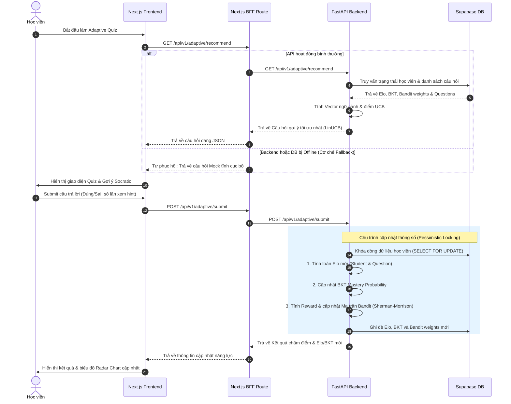
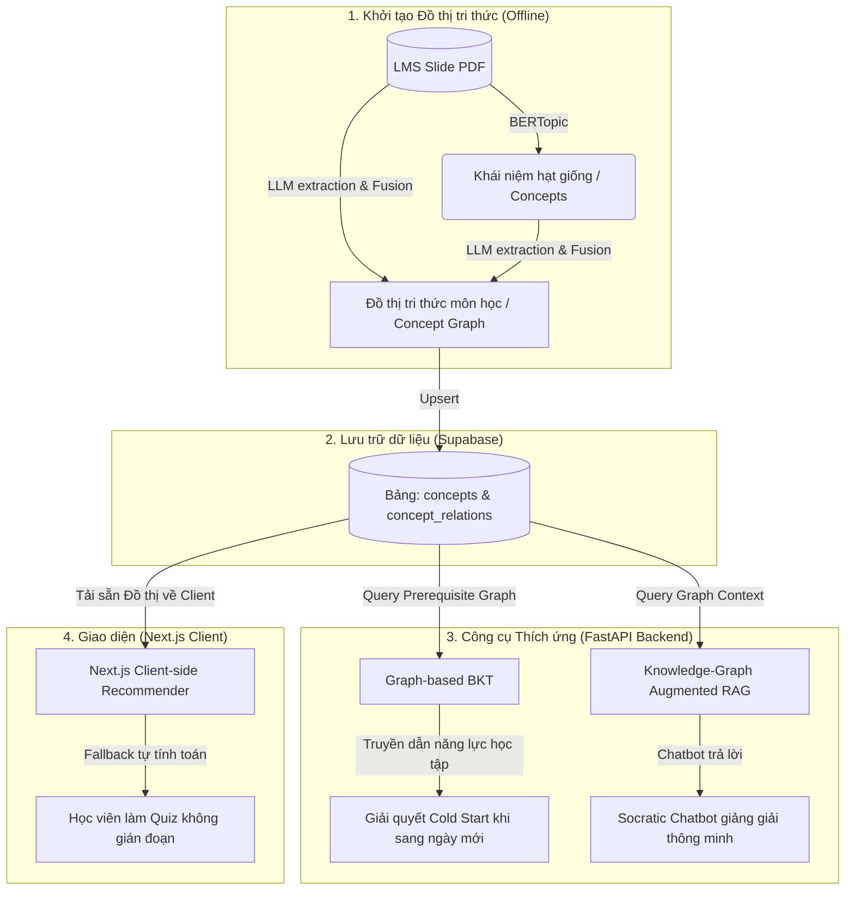

# EduGap Project Context & Knowledge Base (Single Source of Truth for AI Agents)

> 📌 **Tài liệu hướng dẫn Context dự án (SSoT):** File này chứa toàn bộ thông tin về ý tưởng cốt lõi, kiến trúc hệ thống, chi tiết thuật toán (kèm công thức toán học), tóm tắt nghiên cứu khoa học, danh mục tài liệu phân mảnh và các quyết định thiết kế (ADR). Phục vụ cho việc đưa trực tiếp vào Web AI (ChatGPT/Claude.ai) hoặc các Agent CLI (Claude Code/Antigravity) nhằm mục đích viết tài liệu kiến trúc (doc architect) và hiểu sâu về dự án.

---

## 1. Ý TƯỞNG CỐT LÕI & ĐỊNH HƯỚNG SẢN PHẨM (CORE IDEA & PRODUCT)

### 1.1. Giới thiệu EduGap
**EduGap (AI20K-C2-HE-01)** là một hệ thống **Adaptive-first AI Tutor** (Gia sư AI thích ứng) dành cho môi trường giáo dục đại học quy mô lớn. 
* **Vấn đề giải quyết:** Giảng viên quá tải khi hỗ trợ hàng trăm sinh viên ngoài giờ lên lớp; bài tập đại trà không bắt kịp năng lực của từng học sinh (quá dễ gây chán, quá khó gây nản); học sinh lạm dụng AI để làm hộ bài tập (cheating) làm mất khả năng tự lập tư duy.
* **Giải pháp:** Cung cấp gia sư AI hoạt động 24/7 dựa hoàn toàn trên tài liệu chính thống của khóa học (Course Materials) dưới dạng hội thoại Socratic (không đưa lời giải trực tiếp, chỉ gợi ý từng bước) và kiểm thử thích ứng liên tục theo **Vùng Phát triển Gần nhất (ZPD - Zone of Proximal Development)** với mục tiêu tỉ lệ làm đúng đạt **70%-75%**.

### 1.2. Persona & Vai trò người dùng
1. **Student (Học viên):** Làm Quiz thích ứng, tương tác Socratic Chatbot với 5 chế độ học tập (Explain, Step-by-step hint, Debug code, Practice, Review submission), theo dõi tiến độ năng lực thông qua Radar Chart (Mastery) và Heatmap.
2. **Mentor (Người hướng dẫn):** Upload tài liệu khóa học, chạy thử nghiệm kiểm định RAG (Test Panel), xem bảng phân tích lỗ hổng kiến thức của lớp (Class Insights) để giao các Kế hoạch Học tập (Learning Plans) can thiệp thủ công.
3. **BTC / Admin:** Quản trị người dùng, duyệt/xuất bản (Publish/Draft) tài liệu, cấu hình hệ thống và kiểm toán logs.

### 1.3. Hệ thống Thiết kế Sapia (Sapia Design System) & Tone Giọng
* **Visual Identity:** Sử dụng gam màu Cozy Avocado làm nền chủ đạo (`#f4fce8`), kết hợp màu xanh lá Sapia Green (`#58cc02`), vàng Tertiary Yellow (`#ffc800`) và cam Accent Orange (`#ff9600`).
* **Purple Ban (Cấm màu tím):** Không sử dụng màu tím, tím violet, chàm (indigo) hoặc cánh sen (magenta) để tránh rập khuôn thẩm mỹ AI đại trà.
* **Tactile 3D Click:** Các nút bấm, lựa chọn có thiết kế nổi 3D với viền bóng 5px (depth border), thụt lún theo Y-axis khi kích hoạt `:active` tạo cảm giác vật lý.
* **Linh vật Cáo Sofi (Sofi the Fox):** Biểu tượng cáo đeo kính học giả đại diện cho sự thông thái, xuất hiện xuyên suốt để đưa ra các chỉ dẫn Socratic.
* **Socratic Tone:** Agent không bao giờ cung cấp trực tiếp mã nguồn hoặc đáp án bài tập. Thay vào đó, Agent đặt câu hỏi gợi mở, ẩn dụ sư phạm, và chia nhỏ vấn đề thành các bước (Scaffolding).

---

## 2. KIẾN TRÚC HỆ THỐNG & MÔ HÌNH DỮ LIỆU (SYSTEM ARCHITECTURE)

Hệ thống hoạt động theo mô hình tích hợp gồm: **Next.js Frontend (UI & BFF Proxy)**, **FastAPI Backend (Adaptive & Core Services)** và **Supabase (PostgreSQL 17 + pgvector)**.

### 2.1. Sơ đồ Luồng Hoạt động (AS-IS Workflow)



### 2.2. Mô hình Thực thể Database (Core Schema)

Toàn bộ thông tin quan hệ và vector nhúng được lưu trữ hợp nhất trên một thực thể Supabase PostgreSQL:

| Tên Bảng (Entity) | Vai trò & Dữ liệu lưu trữ |
| :--- | :--- |
| `users` | Thông tin định danh học viên/giảng viên, phân quyền (Role: Student, Mentor, Admin), MSSV. |
| `courses` | Thông tin khóa học và giảng viên phụ trách. |
| `course_materials` | File slide/pdf tài liệu học tập, thẻ tag khái niệm, trạng thái xuất bản (`draft`/`published`). |
| `concepts` | Danh mục khái niệm lõi cần nắm vững (ví dụ: *Variables*, *Loops*, *Recursion*). |
| `concept_relations`| Lưu đồ thị khái niệm tiên quyết (Prerequisite Graph) giữa các concepts, chứa trọng số quan hệ. |
| `student_mastery` | Lưu trữ điểm số Elo học sinh, xác suất nắm vững BKT ($P(L)$), cờ đánh dấu yếu (`weak_flag`) cho từng concept của từng học sinh. |
| `quizzes` | Ngân hàng câu hỏi trắc nghiệm/tự luận, ánh xạ tới concept, đáp án đúng và 3 bậc gợi ý Socratic. |
| `quiz_attempts` | Nhật ký làm quiz thích ứng: mã học sinh, đáp án chọn, kết quả chấm điểm, số lần lấy hint, cờ dùng AI trợ giúp, Elo delta. |
| `chat_sessions` | Quản lý các phiên hội thoại học thuật của sinh viên. |
| `messages` | Lịch sử tin nhắn trao đổi trong chat, chế độ học tập (mode), độ tự tin RAG (confidence score). |
| `citations` | Trích dẫn tài liệu cụ thể (slide, trang, nội dung trích xuất) đi kèm theo từng tin nhắn của AI. |

---

## 3. THUẬT TOÁN ĐÁNH GIÁ THÍCH ỨNG & TOÁN HỌC (ALGORITHM SPECS)

EduGap sử dụng bộ 4 thuật toán lõi được tích hợp chặt chẽ tại FastAPI Backend (`src/services/adaptive/`):

### 3.1. Educational Elo Algorithm (Độ khó câu hỏi & Năng lực học viên)
* **Vị trí file:** [elo.py](file:///d:/CODE/AITHUCCHIEN/PROJECT/C2-App-125/src/services/adaptive/elo.py)
* **Mục tiêu:** Ước lượng độ khó câu hỏi ($d$) và năng lực học sinh ($\theta$) trên cùng một thang đo thời gian thực.
* **Xác suất học sinh làm đúng kỳ vọng (Expected Success Probability):**
  $$P(\text{correct}) = \frac{1}{1 + 10^{\frac{d - \theta}{400}}}$$
* **Cập nhật Elo kép (Dual Elo Update):**
  $$\theta_{\text{new}} = \theta_{\text{old}} + K_{\text{student}} \times (\text{Score}_{\text{actual}} - P(\text{correct})) \times \text{Discount}_{\text{hint}}$$
  $$d_{\text{new}} = d_{\text{old}} + K_{\text{question}} \times (P(\text{correct}) - \text{Score}_{\text{actual}}) \times \text{Discount}_{\text{hint}}$$
* **Quy tắc khấu trừ Hint (Hint Discount Factor):**
  Nếu học sinh trả lời đúng nhưng có xem gợi ý, Elo nhận được bị giảm trừ:
  $$\text{Discount}_{\text{hint}} = \max(0.1, 1.0 - 0.3 \times \text{hint\_count})$$
* **Quy tắc đóng băng gian lận (AI Help Protection):**
  Nếu học sinh dùng AI giải hộ, hệ thống đặt $K_{\text{student}} = 0$ (không tăng Elo của sinh viên) nhưng vẫn cập nhật độ khó câu hỏi $d$ để tự hiệu chuẩn ngân hàng câu hỏi.

### 3.2. Bayesian Knowledge Tracing - BKT (Xác suất Làm chủ Kiến thức)
* **Vị trí file:** [bkt.py](file:///d:/CODE/AITHUCCHIEN/PROJECT/C2-App-125/src/services/adaptive/bkt.py)
* **Mục tiêu:** Ước lượng xác suất làm chủ khái niệm tiềm ẩn $P(L_t)$ của học sinh tại thời điểm $t$ qua mô hình Hidden Markov Model.
* **Các tham số thiết lập:**
  * $P(L_0)$: Xác suất làm chủ ban đầu (Prior - Mặc định $0.25$).
  * $P(T)$: Xác suất học sinh chuyển trạng thái từ chưa làm chủ sang làm chủ sau khi được huấn luyện (Transition - Mặc định $0.10$).
  * $P(G)$: Xác suất đoán mò đúng khi chưa làm chủ (Guess - Mặc định $0.20$).
  * $P(S)$: Xác suất làm sai do bất cẩn dù đã làm chủ (Slip - Mặc định $0.10$).
* **Xác suất hậu nghiệm sau khi biết kết quả thực tế (Posterior Probability Update):**
  * *Nếu học sinh làm ĐÚNG:*
    $$P(L_t | \text{Correct}) = \frac{P(L_{t-1}) \times (1 - P(S))}{P(L_{t-1}) \times (1 - P(S)) + (1 - P(L_{t-1})) \times P(G)}$$
  * *Nếu học sinh làm SAI:*
    $$P(L_t | \text{Incorrect}) = \frac{P(L_{t-1}) \times P(S)}{P(L_{t-1}) \times P(S) + (1 - P(L_{t-1})) \times (1 - P(G))$$
* **Nội suy điểm một phần (Partial Credit Interpolation):**
  Đối với bài tự luận chấm điểm theo thang $[0, 1]$, xác suất hậu nghiệm được nội suy tuyến tính:
  $$P(L_{\text{posterior}}) = \text{Score} \times P(L_t | \text{Correct}) + (1 - \text{Score}) \times P(L_t | \text{Incorrect})$$
* **Cập nhật dự báo trạng thái tiếp theo (Transition Step):**
  $$P(L_{t+1}) = P(L_{\text{posterior}}) + (1 - P(L_{\text{posterior}})) \times P(T)$$
* **Bẫy hấp thụ (Absorption State Protection):** Chặn giá trị $P(L)$ trong khoảng $[0.0001, 0.9999]$ để học sinh không bị kẹt vĩnh viễn ở trạng thái làm chủ hoặc mất gốc.
* **Ánh xạ mức độ hiểu (Mastery Mapping):**
  * $P(L) < 0.30 \rightarrow$ `weak` (Yếu)
  * $0.30 \le P(L) < 0.85 \rightarrow$ `learning` (Đang học)
  * $P(L) \ge 0.85 \rightarrow$ `mastered` (Làm chủ)

### 3.3. Contextual Bandit - LinUCB (Khuyến nghị Câu hỏi)
* **Vị trí file:** [bandit.py](file:///d:/CODE/AITHUCCHIEN/PROJECT/C2-App-125/src/services/adaptive/bandit.py)
* **Mục tiêu:** Cân bằng giữa Khai thác (Exploitation - chọn câu hỏi vừa sức nhất) và Thăm dò (Exploration - thử thách câu hỏi mới để tìm biên giới ZPD) để đưa ra câu hỏi thích hợp nhất.
* **Vector ngữ cảnh (Context Vector) $x$ (3 chiều):**
  $$x = [1.0 \text{ (Bias)}, P(L)_{\text{BKT}}, \text{Normalized\_Elo}_{\text{Sigmoid}}]$$
* **Điểm số UCB chọn lựa (Upper Confidence Bound Score):**
  Với mỗi câu hỏi $a$ trong ngân hàng đề:
  $$\text{UCB}_a = \theta_a^T x + \alpha \sqrt{x^T A_a^{-1} x}$$
  Hệ thống chọn câu hỏi $a^*$ có $\text{UCB}_a$ cao nhất.
* **Công thức Sherman-Morrison (Cập nhật ma trận nghịch đảo tức thời):**
  Thay vì đảo ma trận tốn kém $O(d^3)$, backend cập nhật trực tiếp ma trận nghịch đảo $A^{-1}$ khi học sinh nộp bài với độ phức tạp $O(d^2)$:
  $$A_{\text{new}}^{-1} = A_{\text{old}}^{-1} - \frac{A_{\text{old}}^{-1} x x^T A_{\text{old}}^{-1}}{1 + x^T A_{\text{old}}^{-1} x}$$
* **Hàm điểm thưởng ZPD (ZPD Reward Signal):** Phạt các câu hỏi có độ khó nằm xa vùng ZPD (xác suất làm đúng mục tiêu là 75%):
  $$\text{Reward} = \text{Score} \times (1.0 - 2.0 \times |P(\text{correct}) - 0.75|)$$

### 3.4. Tích hợp Graphusion (Đồ thị tri thức & Lan truyền năng lực)
Khung nghiên cứu **Graphusion** được áp dụng để giải quyết hai vấn đề lớn: **Vượt qua khởi đầu lạnh (Cold Start)** khi học viên sang ngày mới và **Cải thiện độ chính xác RAG của Chatbot (GraphRAG)**.



#### A. Lan truyền tri thức đồ thị 1-bước (Local 1-Step Propagation):
Để tránh độ trễ tính toán khi học viên đang làm bài trực tuyến (yêu cầu phản hồi $< 10\text{ms}$), hệ thống thực hiện lan truyền cục bộ độ sâu $1$ thay vì chạy các mạng GNN phức tạp:
* **Lan truyền ngược (Backward Propagation - Phạt):** Nếu một khái niệm nâng cao $s_i$ bị giảm điểm mạnh (học viên làm sai), hệ thống tự động phạt nhẹ các khái niệm cha tiên quyết trực tiếp $p \in \text{Parents}(s_i)$ vì có thể học sinh bị hổng kiến thức nền tảng:
  $$M(p)_{\text{new}} = M(p)_{\text{old}} - \gamma \cdot \Delta M(s_i) \cdot w_{p \rightarrow s_i}$$
  *(Với $\gamma \approx 0.25$ là hệ số suy giảm, $w$ là trọng số quan hệ).*
* **Lan truyền xuôi (Forward Propagation - Thưởng/Cold Start):** Khi học sinh làm tốt ở các concept cha, xác suất tiên nghiệm ban đầu $P(L_0)_c$ của các node con trực tiếp $c \in \text{Children}(s_i)$ sẽ được tăng lên tương ứng. Điều này giúp loại bỏ hiện tượng Cold Start khi học viên học sang chương mới (hệ thống biết ngay họ có năng lực nền tảng tốt hay kém để gợi ý câu hỏi ZPD phù hợp ngay lập tức).

#### B. Giải quyết bài toán Cold Start từng ngày bằng lan truyền tri thức (Graph BKT)
* **Vấn đề:** Khi sang ngày học mới, hệ thống chưa có dữ liệu của học sinh về kỹ năng mới nên phải đoán mò từ đầu (Cold Start).
* **Giải pháp:** Graphusion tự động phân tích slide để tìm quan hệ `Prerequisite_of` (Ví dụ: *Elo algorithm* ở Ngày 6 $\rightarrow$ *Bandit integration* ở Ngày 7).
* Khi học sinh sang Ngày 7, BKT sẽ lấy kết quả làm bài của Ngày 6 làm điểm khởi đầu (Prior probability). Nếu Ngày 6 làm cực tốt, hệ thống tự động nhận diện năng lực cơ sở ở Ngày 7 đạt mức khá và Bandit sẽ gợi ý ngay bài toán nâng cao, vượt qua Cold Start lập tức.

#### C. Tối ưu hóa Socratic Chatbot RAG (GraphRAG)
* **Vấn đề:** RAG thô tìm kiếm đoạn văn tương đồng dễ bị rời rạc, thiếu ngữ cảnh liên kết sư phạm.
* **Giải pháp:** Chatbot sẽ kết hợp Vector Search với thông tin liên kết khái niệm từ Đồ thị tri thức (Graphusion). Chatbot sẽ giảng giải có lớp lang: giải thích các kiến thức nền tảng (prerequisite) trước khi giải thích các khái niệm phức tạp.

#### D. Next.js Client-side Fallback thông minh
* Tải sẵn Đồ thị tri thức dạng tĩnh về Next.js Frontend. Khi kết nối API backend bị lỗi, thay vì hiển thị câu hỏi ngẫu nhiên, Next.js Frontend tự chạy thuật toán duyệt đồ thị tri thức cục bộ để tìm câu hỏi dễ hơn thuộc các concept tiên quyết (`Prerequisite_of`) giúp học sinh tự học tiếp ngay tại client.

### 3.5. Database Interface & Locking (Tính nhất quán dữ liệu)
* **Vị trí file Interface:** [database_interface.py](file:///d:/CODE/AITHUCCHIEN/PROJECT/C2-App-125/src/services/adaptive/database_interface.py)
* **Vị trí file Implementation:** [supabase_database.py](file:///d:/CODE/AITHUCCHIEN/PROJECT/C2-App-125/src/services/adaptive/supabase_database.py)
* **Mô tả:** Triển khai **Pessimistic Locking (SELECT FOR UPDATE)** tại PostgreSQL Database để tránh race condition khi học sinh click submit bài thi liên tục hoặc làm đồng thời trên nhiều thiết bị.

---

## 4. TỔNG HỢP CÁC NGHIÊN CỨU KHOA HỌC (RESEARCH SYNTHESIS)

Dưới đây là tóm tắt các cơ sở khoa học của dự án từ các tài liệu lưu trữ trong thư mục `docs/research/`:

### 4.1. Bayesian Knowledge Tracing (BKT)
* **Nguồn:** `bayesian-knowledge-tracing.md`
* **Nội dung:** Sử dụng mô hình Hidden Markov Model (HMM) với 2 trạng thái ẩn (Làm chủ / Chưa làm chủ) và 2 trạng thái quan sát (Làm đúng / Làm sai). BKT cho phép ước lượng liên tục xác suất học sinh nắm được một khái niệm cụ thể qua từng lượt tương tác. Tài liệu nghiên cứu cách tính toán cập nhật các tham số Bayes và chống bẫy hấp thụ (absorption trap).

### 4.2. Contextual Bandit (LinUCB)
* **Nguồn:** `contextual-bandit.md`
* **Nội dung:** Thay vì dùng chính sách gợi ý tĩnh, thuật toán áp dụng Multi-Armed Bandit dạng ngữ cảnh (Contextual). Vũ khí (arms) là các câu hỏi. Ngữ cảnh (context) là hồ sơ năng lực của học viên (Elo và BKT). Thuật toán tối ưu hóa bằng cách cân bằng giữa khai thác thông tin hiện tại và thăm dò năng lực mới của sinh viên, đảm bảo luôn chọn câu hỏi rơi trúng vùng ZPD.

### 4.3. Thuyết Ứng Đáp Câu Hỏi (Item Response Theory - IRT)
* **Nguồn:** `item-response-theory.md`
* **Nội dung:** Nghiên cứu mô hình 1PL (Rasch), 2PL (bổ sung độ phân biệt $a$) và 3PL (bổ sung tham số đoán mò $c$). Phân tích phương pháp hiệu chuẩn tham số ngoại tuyến (Parameter Calibration) bằng ước lượng Marginal Maximum Likelihood thông qua thuật toán Expectation-Maximization (EM). Đề xuất kiến trúc lai (Hybrid): chạy Elo thời gian thực ở Online Backend, chạy EM-IRT hiệu chuẩn lại định kỳ ở offline batch.

### 4.4. Khung Mooclet (Mooclet Framework)
* **Nguồn:** `mooclet-framework.md`
* **Nội dung:** Khung kiến trúc module hóa việc thiết kế các thử nghiệm sư phạm. Một "Mooclet" đại diện cho một điểm quyết định (ví dụ: cách hiển thị gợi ý, chọn bài tập). Mooclet tách biệt tài nguyên học tập, chính sách phân phối (Policy) và các biến số ngữ cảnh (Context) để giảng viên có thể thay đổi thuật toán gợi ý hoặc cấu trúc bài giảng mà không cần viết lại mã nguồn.

### 4.5. Nghiên cứu Phát triển Thiết kế (Design-Based Research - DBR)
* **Nguồn:** `design-based-research.md`
* **Nội dung:** Phương pháp nghiên cứu thực nghiệm lặp (iterative) trong môi trường giáo dục thực tế. Nghiên cứu nhấn mạnh việc thử nghiệm hệ thống trực tiếp trên một cohort sinh viên đại học thực tế, thu thập phản hồi vòng lặp để liên tục cải tiến giao diện (UI) và tính sư phạm của chatbot RAG.

### 4.6. Giải quyết Khởi đầu lạnh (Cold Start)
* **Nguồn:** `adaptive-learning-and-cold-start.md`
* **Nội dung:** Nghiên cứu kiến trúc cấu trúc ba bên (Tripartite Structure: Student, Concept, Item). Giải quyết bài toán thiếu dữ liệu ban đầu bằng 3 giải pháp tích hợp: gán Elo mặc định theo phân phối chuẩn của lớp, sử dụng bảng khảo sát nhanh (Diagnostic Quiz) ở đầu khóa học, và lan truyền năng lực thông qua đồ thị tiên quyết môn học.

### 4.7. Lan truyền Đồ thị và Phân bổ Lỗi sai (Multi-Skill & Graph Propagation)
* **Nguồn:** `multi-skill-knowledge-tracing-propagation.md`
* **Nội dung:** Giải quyết bài toán Credit/Blame Assignment khi một câu hỏi đòi hỏi nhiều kỹ năng cùng lúc (mô hình DINA). Trình bày thuật toán Heuristic Blame Assignment (phạt nặng hơn kỹ năng yếu nhất) và thuật toán Message Passing 1-bước cục bộ (Local 1-Step) để đồng bộ hóa điểm số trên đồ thị khái niệm tiên quyết mà không gây trễ giao diện ($< 5\text{ms}$).

### 4.8. Khung Graphusion (WWW '25)
* **Nguồn:** `graphusion-research.md`
* **Nội dung:** Ứng dụng kỹ thuật RAG kết hợp LLM để tự động xây dựng Đồ thị Tri thức toàn cục (Global KG) từ tài liệu slide bài giảng. Quy trình gồm sinh Seed Entity bằng BERTopic, trích xuất Candidate Triplets qua LLM CoT, và Hợp nhất toàn cục (Global Graph Fusion) để dọn dẹp synonyms, giải quyết xung đột quan hệ và suy luận các quan hệ gián tiếp.

---

## 5. DANH MỤC THƯ MỤC TÀI LIỆU DỰ ÁN (DOCUMENTATION CATALOG INDEX)

Để giúp Agent CLI tìm kiếm nhanh các tài liệu chi tiết khi cần hỗ trợ viết bài, dưới đây là bản đồ chỉ mục toàn bộ các file trong thư mục `docs/`:

```text
docs/
├── README.md                           # Giới thiệu sơ lược cấu trúc thư mục tài liệu dự án.
├── algorithm-changelog.md              # Lịch sử chỉnh sửa và tối ưu hóa toán học các thuật toán.
├── notion-address-registry.md          # Đăng ký thông tin ID các database và workspace trên Notion.
│
├── domain-knowledge/                   # Kiến thức nghiệp vụ sư phạm & dữ liệu kiểm định
│   ├── adaptive-learning.md            # Nguyên lý học thích ứng, so sánh Elo với IRT, các product rules.
│   ├── ai-tutor-brain-spec.md          # Thiết kế LangGraph Agent cho Chatbot, Prompt Guardrail.
│   ├── spaced-repetition.md            # Thiết kế ôn tập lặp lại ngắt quãng (SM-2), AI Grading.
│   └── golden-test-cases.json          # File JSON chứa 10+ kịch bản mẫu phục vụ đánh giá RAG.
│
├── product/                            # Tài liệu mô tả sản phẩm và định hướng thiết kế
│   ├── project-overview-pdr.md         # Định nghĩa sản phẩm MVP, mục tiêu thành công, nhóm người dùng.
│   ├── project-roadmap.md              # Lịch trình triển khai 4 giai đoạn từ nền tảng đến sản phẩm.
│   └── design-guidelines.md            # Hướng dẫn phong cách thiết kế Sapia & Bản tả chi tiết các khung nhìn màn hình (wireframes) của hệ thống.
│
├── engineering/                        # Tài liệu hướng dẫn lập trình & vận hành hệ thống
│   ├── system-architecture.md          # Sơ đồ khối kiến trúc, mô hình dữ liệu quan hệ trong Supabase.
│   ├── code-standards.md               # Quy chuẩn viết code (KISS/DRY), Git, viết test, chuẩn RAG.
│   ├── codebase-summary.md             # Tóm tắt cấu trúc thư mục code và kế hoạch phát triển.
│   └── deployment-guide.md             # Hướng dẫn cấu hình CI/CD và triển khai thực tế lên Render.
│
└── research/                           # Tài liệu nghiên cứu khoa học & thuật toán chi tiết
    ├── bayesian-knowledge-tracing.md   # Nghiên cứu lý thuyết BKT.
    ├── contextual-bandit.md            # Nghiên cứu lý thuyết Multi-Armed Bandit & LinUCB.
    ├── item-response-theory.md         # Nghiên cứu thuyết IRT & CAT.
    ├── mooclet-framework.md            # Nghiên cứu Mooclet Framework.
    ├── design-based-research.md        # Nghiên cứu phương pháp DBR.
    ├── graphusion-research.md          # Ứng dụng Graphusion xây dựng KG môn học.
    ├── adaptive-learning-and-cold-start.md # Các giải pháp giải quyết Cold Start.
    ├── multi-skill-knowledge-tracing-propagation.md # Thuật toán lan truyền đồ thị & gán lỗi sai.
    ├── excel_summary.md                # Bảng tóm tắt căn chỉnh các quy tắc hệ thống.
    ├── excel-updates-guide.md          # Hướng dẫn cập nhật dữ liệu Excel đồng bộ với hệ thống.
    └── adaptive-learning-engine-paper.md # Bản thảo bài báo khoa học về công cụ học tập thích ứng.
```

---

## 6. TÓM TẮT QUYẾT ĐỊNH KIẾN TRÚC LỚN (ADR SUMMARY)

Dự án đã ghi nhận 18 quyết định kiến trúc lớn lưu trong thư mục `ADR/`:

* **ADR-002 (Mastery Algorithm):** Lựa chọn Elo làm giải pháp tính toán năng lực trực tuyến thời gian thực do hiệu năng cao, closed-form update đơn giản; kết hợp hiệu chuẩn IRT ngoại tuyến (offline batch).
* **ADR-003 (Contextual Bandit):** Lựa chọn thuật toán LinUCB để cá nhân hóa gợi ý câu hỏi vì khả năng xử lý vector ngữ cảnh (Elo, BKT) tốt và giải quyết cân bằng Exploration/Exploitation.
* **ADR-003 (PDF Converter Fallback):** Cấu hình OpenRouter API làm giải pháp dự phòng khi dịch vụ parser slide chính bị lỗi kết nối hoặc quá tải.
* **ADR-003 (Tutor Brain Spec):** Sử dụng kiến trúc LangGraph để xây dựng chatbot Agent có trạng thái (Stateful), kiểm soát nghiêm ngặt các rào chắn Socratic bằng Prompt Guardrails.
* **ADR-004 (Practice Session Data):** Thiết kế lưu trữ trạng thái phiên luyện tập dưới dạng transaction tạm thời để tính toán Elo/BKT trước khi ghi nhận chính thức vào lịch sử Quiz attempts.
* **ADR-004 (Question Elo Concurrency Locking):** Sử dụng **Pessimistic Locking (`SELECT FOR UPDATE`)** tại PostgreSQL database khi thực hiện giao dịch chấm điểm quiz để loại bỏ lỗi race condition khi học sinh submit liên tiếp.
* **ADR-004 (RAG Supabase pgvector):** Hợp nhất lưu trữ vector nhúng tài liệu trực tiếp trên cơ sở dữ liệu Supabase thông qua extension `pgvector` thay vì sử dụng cơ sở dữ liệu vector độc lập để giảm chi phí vận hành và tối ưu hóa truy vấn JOIN.
* **ADR-005 (Chatbot Personalization):** Cho phép chatbot RAG thay đổi giọng điệu giảng giải tùy thuộc vào Elo của học sinh (Học sinh Elo thấp dùng ví dụ trực quan đơn giản; học sinh Elo cao giải thích học thuật chuyên sâu).
* **ADR-006 (Chatbot Agent & Quiz Generation):** Sử dụng LLM tự động sinh 5-10 câu hỏi kiểm tra kèm 3 mức gợi ý Socratic ngay tại thời điểm upload tài liệu học tập PDF nhằm tạo ngân hàng câu hỏi thích ứng tự động.
* **ADR-007 (Hybrid Smart Cache & Tool Calling):** Sử dụng Redis/In-memory cache để lưu trữ nhanh thông số Elo/BKT của sinh viên tại API Gateway. Agent LangGraph có công cụ tự động gọi `refresh_student_profile` nếu phát hiện cache bị lệch.
* **ADR-008 (Guardrails Logging Fallback):** Triển khai rào chắn kiểm duyệt đầu vào (Prompt Guardrail) chặn mã nguồn gian lận hoặc câu hỏi ngoài phạm vi môn học; tự động ghi nhận nhật ký lỗi và hiển thị fallback giải thích lịch sự.
* **ADR-009 (Course Knowledge Graph Construction):** Tích hợp thuật toán Graphusion sử dụng BERTopic và LLM để tự động sinh bản đồ khái niệm khóa học từ slide bài giảng.
* **ADR-009 (Ingest PDF Slide Images):** Lưu trữ các ảnh chụp slide tài liệu học tập trực tiếp lên Supabase Storage và ánh xạ url ảnh vào Citation Card để hiển thị minh họa trực quan cho sinh viên khi chat.
* **ADR-010 (Personalized Semantic Cache):** Lưu trữ lịch sử câu hỏi tương tự của cùng một học sinh tại tầng BFF cache để trả về câu trả lời RAG nhanh chóng dưới 50ms cho các câu hỏi trùng lặp.
* **ADR-011 (Catch-all BFF Proxy Routing):** Triển khai một catch-all API Proxy tại Next.js BFF để tự động chuyển hướng các API thích ứng sang backend FastAPI một cách bảo mật và xử lý fallback cục bộ nếu backend offline.
* **ADR-011 (Multi-skill Forgetting Curve):** Áp dụng hàm suy giảm trí nhớ thời gian (Forgetting Curve) điều chỉnh giảm nhẹ điểm làm chủ BKT của sinh viên nếu họ không truy cập luyện tập một concept quá 7 ngày.
* **ADR-012 (MSSV-based Authentication):** Sử dụng mã số sinh viên (MSSV) kết hợp mật khẩu làm phương thức định danh chính cho sinh viên để đồng bộ nhanh danh sách lớp từ hệ thống LMS của trường đại học.
* **ADR-013 (Gated CI/CD Pipeline):** Thiết kế pipeline kiểm soát chất lượng nghiêm ngặt trước khi deploy: tự động chạy kiểm định an toàn bảo mật, quét rò rỉ secret key, thực thi toàn bộ unit tests và chỉ cho phép auto-deploy khi đạt 100% tỉ lệ pass.

---

## 7. HƯỚNG DẪN AI AGENT VIẾT TÀI LIỆU DỰ ÁN (AI WRITING GUIDELINES)

Khi bạn (AI Agent) được yêu cầu viết hoặc cập nhật các tài liệu kiến trúc, tài liệu sản phẩm cho dự án EduGap, bạn **bắt buộc** phải tuân thủ các quy tắc sau:

1. **Tuân thủ Socratic Pedagogy:** Khi mô tả các tính năng tương tác của Chatbot, luôn định hình hành vi phản hồi của AI dưới dạng gợi ý định hướng tư duy (scaffolded prompts) chứ không bao giờ được viết theo hướng cung cấp câu trả lời trực tiếp.
2. **Công thức toán học chính xác:** Sử dụng đúng định dạng ký hiệu toán học LaTeX đặt trong dấu song-đô-la `$$` cho các khối công thức lớn và dấu đơn-đô-la `$` cho công thức trên cùng dòng (in-line). Tuyệt đối giữ nguyên các biến số chuẩn ($P(L)$, $\theta$, $d$, $A^{-1}$, $x$).
3. **Màu sắc và Giao diện:** Luôn tuân thủ nguyên tắc thiết kế Sapia (Cozy Avocado `#f4fce8`, Sapia Green `#58cc02`, cấm tuyệt đối màu tím `Purple Ban`). Khi viết tài liệu thiết kế màn hình, mô tả rõ hiệu ứng 3D Tactile Click.
4. **Tính nguyên tử của dữ liệu:** Khi viết về luồng lưu trữ, luôn nhấn mạnh việc sử dụng PostgreSQL RPC nguyên tử và khoá concurrency `SELECT FOR UPDATE` để bảo vệ tính toàn vẹn của thuật toán Elo.
5. **Cập nhật Chỉ mục và Changelog:** Bất cứ khi nào thực hiện chỉnh sửa cấu trúc hoặc thay đổi thuật toán, hãy tự động ghi nhận lịch sử vào `docs/algorithm-changelog.md` và cập nhật lại bản đồ chỉ mục tại file `PROJECT-CONTEXT.md` này.
