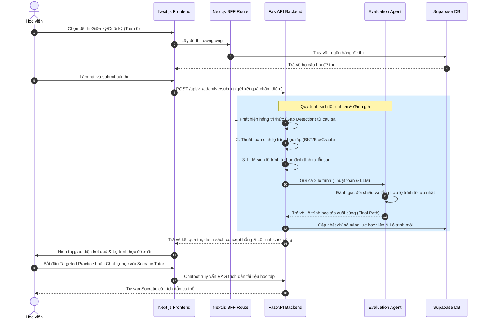

# Mentora Project Context & Knowledge Base (Single Source of Truth for AI Agents)

> 📌 **Tài liệu hướng dẫn Context dự án (SSoT):** File này chứa toàn bộ thông tin về ý tưởng cốt lõi, kiến trúc hệ thống, chi tiết thuật toán (kèm công thức toán học), vai trò người dùng, các công việc đang dở dang cần kiểm thử/sửa lỗi, và các quyết định thiết kế (ADR). Tài liệu này đóng vai trò là nguồn tri thức duy nhất giúp các AI Agent sau này hiểu rõ bối cảnh và định hướng phát triển của Mentora.

---

## 1. Ý TƯỞNG CỐT LÕI & ĐỊNH HƯỚNG SẢN PHẨM MỚI (CORE IDEA & PRODUCT)

### 1.1. Giới thiệu Mentora & Trọng tâm Toán lớp 6
**Mentora (AI20K-C2-HE-01)** định hướng là một hệ thống **Adaptive-first AI Tutor** (Gia sư AI thích ứng) hỗ trợ tối ưu học tập cá nhân hóa. Dự án đã chuyển dịch trọng tâm môn học sang **Chương trình Toán học lớp 6**.
* **Mục tiêu chính:** Hỗ trợ học viên chuẩn bị và tối ưu hóa kết quả thi thông qua các bài **thi giữa kỳ** và **thi cuối kỳ**.
* **Cách thức hoạt động:** Hệ thống cung cấp nhiều bộ đề thi giữa kỳ và cuối kỳ khác nhau để học sinh lựa chọn làm bài. Dựa trên kết quả làm bài và phân tích các câu trả lời sai, hệ thống sẽ thực hiện **phát hiện khoảng trống kiến thức (Gap Detection)** để xác định các khái niệm (Concepts) mà học sinh đang bị hổng.
* **Cơ chế đề xuất lộ trình lai (Hybrid Path Generation & Multi-Agent Evaluation):**
  1. **Lộ trình Thuật toán:** Dịch vụ Adaptive Engine dựa trên các mô hình toán học (BKT, Elo, Concept Graph) đề xuất lộ trình luyện tập kỹ năng.
  2. **Lộ trình LLM:** LLM phân tích định tính các lỗi sai của học sinh để sinh lộ trình tự học (học cái gì, học ở đâu, học như thế nào).
  3. **Evaluation Agent (Agent Đánh giá):** Một Agent độc lập sẽ nhận cả 2 lộ trình trên, thực hiện phân tích đối chiếu, đánh giá điểm mạnh/yếu của mỗi bên và tổng hợp lại thành **Lộ trình học tập cuối cùng** tối ưu nhất cho học sinh.
* **Gia sư tư vấn Socratic:** Chatbot AI có thể tư vấn trực tiếp cho học sinh, hướng dẫn khắc phục lỗ hổng bằng cách trích dẫn chính xác các phần tài liệu học tập (materials) để học sinh tự ôn tập.
* **Luyện tập mục tiêu (Targeted Practice):** Hệ thống tự động đề xuất các bộ đề ôn luyện tập trung vào đúng các concept bị hổng để học sinh cải thiện dần năng lực.

### 1.2. Persona & Vai trò người dùng trong hệ thống mới
1. **Student (Học viên):** 
   * Chọn và làm các bộ đề thi giữa kỳ/cuối kỳ.
   * Xem kết quả phân tích khoảng trống kiến thức của bản thân.
   * Nhận lộ trình học tập tối ưu hóa được tổng hợp từ Evaluation Agent.
   * Tương tác với Socratic Chatbot để giải đáp thắc mắc kèm trích dẫn tài liệu tự học.
   * Làm các bộ đề cải thiện tập trung (Targeted Practice) cho các concept bị hổng.
2. **Mentor (Giảng viên / Người hướng dẫn):**
   * Theo dõi tình hình học tập chung của lớp học thông qua Dashboard (Class Insights) và hồ sơ chi tiết của từng học sinh.
   * Cho phép giảng viên có kinh nghiệm tự thiết kế và đẩy (inject) quy trình/lộ trình học tập tùy chỉnh cho học sinh.
   * Tải tài liệu khóa học (dạng PDF), chạy quy trình chunking/embedding tự động vào vector database.
   * Sử dụng chức năng sinh câu hỏi tự động từ tài liệu học tập cho các concept.
   * Quản lý, duyệt và xuất bản các câu hỏi nháp (`draft` -> `published`) để đưa vào ngân hàng đề thi thích ứng.

### 1.3. Hệ thống Thiết kế Sapia (Sapia Design System) & Tone Giọng
* **Visual Identity:** Sử dụng gam màu Cozy Avocado làm nền chủ đạo (`#f4fce8`), kết hợp màu xanh lá Sapia Green (`#58cc02`), vàng Tertiary Yellow (`#ffc800`) và cam Accent Orange (`#ff9600`).
* **Purple Ban (Cấm màu tím):** Không sử dụng màu tím, tím violet, chàm (indigo) hoặc cánh sen (magenta) để tránh rập khuôn thẩm mỹ AI đại trà.
* **Tactile 3D Click:** Các nút bấm, lựa chọn có thiết kế nổi 3D với viền bóng 5px (depth border), thụt lún theo Y-axis khi kích hoạt `:active`.
* **Linh vật Cáo Sofi (Sofi the Fox):** Biểu tượng cáo đeo kính học giả đại diện cho sự thông thái, xuất hiện xuyên suốt để đưa ra các chỉ dẫn Socratic.
* **Socratic Tone:** Agent không cung cấp trực tiếp đáp án hay cách giải bài toán. Thay vào đó, Agent đặt câu hỏi gợi mở, ẩn dụ sư phạm và chia nhỏ bài toán thành các bước (Scaffolding).

---

## 2. KIẾN TRÚC HỆ THỐNG & LUỒNG HOẠT ĐỘNG MỚI (SYSTEM ARCHITECTURE)

Hệ thống hoạt động theo mô hình tích hợp gồm: **Next.js Frontend (UI & BFF Proxy)**, **FastAPI Backend (Adaptive & Core Services)** và **Supabase (PostgreSQL 17 + pgvector)**.

### 2.1. Sơ đồ Luồng Hoạt động Mới (To-Be Workflow)

---

## 3. THUẬT TOÁN ĐÁNH GIÁ THÍCH ỨNG & TOÁN HỌC (ALGORITHM SPECS)

Mentora sử dụng bộ các thuật toán thích ứng cốt lõi tích hợp tại Backend (`src/services/adaptive/`):

### 3.1. Educational Elo Algorithm (Độ khó câu hỏi & Năng lực học viên)
* **Xác suất học sinh làm đúng kỳ vọng (Expected Success Probability):**
  $$P(\text{correct}) = \frac{1}{1 + 10^{\frac{d - \theta}{400}}}$$
  *(Trong đó $d$ là độ khó Elo của câu hỏi Toán 6, $\theta$ là điểm năng lực Elo hiện tại của học sinh).*
* **Cập nhật Elo kép (Dual Elo Update):**
  $$\theta_{\text{new}} = \theta_{\text{old}} + K_{\text{student}} \times (\text{Score}_{\text{actual}} - P(\text{correct})) \times \text{Discount}_{\text{hint}}$$
  $$d_{\text{new}} = d_{\text{old}} + K_{\text{question}} \times (P(\text{correct}) - \text{Score}_{\text{actual}}) \times \text{Discount}_{\text{hint}}$$
* **Hint Discount & AI Help Protection:** 
  * Chiết khấu điểm Elo nhận được khi có dùng gợi ý làm bài: $\text{Discount}_{\text{hint}} = \max(0.1, 1.0 - 0.3 \times \text{hint\_count})$.
  * Đóng băng Elo của học sinh ($K_{\text{student}} = 0$) nếu phát hiện dùng AI giải hộ bài thi, nhưng vẫn hiệu chuẩn Elo độ khó của câu hỏi ($K_{\text{question}}$ vẫn chạy).

### 3.2. Bayesian Knowledge Tracing - BKT (Xác suất Làm chủ Kiến thức)
* **Mục tiêu:** Ước lượng xác suất làm chủ khái niệm ẩn $P(L_t)$ của học sinh đối với từng concept Toán 6 (ví dụ: *Phép cộng phân số*, *Ước chung lớn nhất*,...).
* **Cập nhật xác suất hậu nghiệm (Posterior Update):**
  * *Nếu làm Đúng (Score >= 0.75):*
    $$P(L_t | \text{Correct}) = \frac{P(L_{t-1}) \times (1 - P(S))}{P(L_{t-1}) \times (1 - P(S)) + (1 - P(L_{t-1})) \times P(G)}$$
  * *Nếu làm Sai (Score < 0.75):*
    $$P(L_t | \text{Incorrect}) = \frac{P(L_{t-1}) \times P(S)}{P(L_{t-1}) \times P(S) + (1 - P(L_{t-1})) \times (1 - P(G))$$
  *(Mặc định: đoán mò $P(G)=0.20$, làm sai ngớ ngẩn $P(S)=0.10$, học thêm $P(T)=0.06$).*
* **Cập nhật trạng thái chuyển tiếp (Transition Step):**
  $$P(L_{t+1}) = P(L_{\text{posterior}}) + (1 - P(L_{\text{posterior}})) \times P(T)$$
* **Giới hạn cận (Boundary Clamp):** Giới hạn $P(L)$ trong khoảng $[0.0001, 0.9999]$.
* **Ánh xạ mức độ hiểu (Mastery Mapping):** `< 0.30` $\rightarrow$ `weak` (Yếu), `0.30 - 0.85` $\rightarrow$ `learning` (Đang học), `\ge 0.85` $\rightarrow$ `mastered` (Làm chủ).

### 3.3. Contextual Bandit - LinUCB (Khuyến nghị Câu hỏi)
* **Vector ngữ cảnh (Context Vector) $x$ (3 chiều):**
  $$x = [1.0 \text{ (Bias)}, P(L)_{\text{BKT}}, \text{Normalized\_Elo}_{\text{Sigmoid}}]$$
* **Điểm số UCB (Upper Confidence Bound Score):**
  $$\text{UCB}_a = \theta_a^T x + \alpha \sqrt{x^T A_a^{-1} x}$$
* **Cập nhật ma trận nghịch đảo tức thời (Sherman-Morrison):**
  $$A_{\text{new}}^{-1} = A_{\text{old}}^{-1} - \frac{A_{\text{old}}^{-1} x x^T A_{\text{old}}^{-1}}{1 + x^T A_{\text{old}}^{-1} x}$$
* **Hàm điểm thưởng ZPD (ZPD Reward Signal):** Phạt các câu hỏi có độ khó nằm xa mục tiêu làm đúng 75%:
  $$\text{Reward} = \text{Score} \times (1.0 - 2.0 \times |P(\text{correct}) - 0.75|)$$

### 3.4. Lan truyền Độ thông thạo trên Đồ thị khái niệm (Graph Propagation)
* **Lan truyền ngược (Backward Propagation):** Khi một khái niệm toán học nâng cao bị giảm điểm BKT (do học viên làm sai bài tập nâng cao), hệ thống tự động giảm nhẹ điểm BKT của các khái niệm tiên quyết liên quan trực tiếp để cảnh báo khả năng hổng gốc:
  $$M(p)_{\text{new}} = M(p)_{\text{old}} - \gamma \cdot |\Delta M(s_i)| \cdot w_{p \rightarrow s_i}$$
* **Lan truyền xuôi (Forward Propagation):** Khi học sinh làm bài tốt ở các concept cha/tiên quyết, điểm khởi phát của các node con trực tiếp sẽ được cộng thêm điểm tương ứng để tránh hiện tượng Cold Start khi chuyển sang chương mới.

---

## 4. CÁC CÔNG VIỆC DỞ DANG & VẤN ĐỀ CẦN GIẢI QUYẾT (BACKLOG & ISSUES)

Dành cho các AI Agent hoặc lập trình viên thực hiện các bước tiếp theo, đây là các phần việc chưa hoàn thiện hoặc đang bị lỗi cần tập trung xử lý:

### 4.1. Kiểm chứng chức năng Mentor xác định học viên yếu và concept yếu
* **Hiện trạng:** Tính năng theo dõi tiến độ lớp học của Mentor đã được dựng giao diện, tuy nhiên logic Backend để phân tích, gom nhóm các học sinh có học lực yếu hoặc xác định các concept yếu của toàn bộ lớp học **chưa được kiểm chứng độ chính xác**.
* **Nguyên nhân:** Thiếu dữ liệu kiểm thử (test data) thực tế và các kịch bản mô phỏng kết quả thi đầu vào để chạy thử nghiệm các truy vấn phân tích.
* **Hành động cần làm:** Viết script seed dữ liệu giả lập cho một lớp học (gồm nhiều học sinh, nhiều kết quả làm bài thi khác nhau có chủ đích tạo ra nhóm học sinh yếu) để kiểm định các API trả về Class Insights.

### 4.2. Kiểm định quy trình tải tài liệu PDF lên database
* **Hiện trạng:** Tính năng upload tài liệu PDF bài giảng của Mentor cần được rà soát và kiểm định lại toàn bộ luồng hoạt động từ Client lên Supabase Storage và lưu thông tin record vào CSDL.
* **Hành động cần làm:** Đảm bảo tính ổn định của luồng upload PDF và xử lý ngoại lệ khi upload lỗi hoặc mạng gián đoạn.

### 4.3. Kiểm định luồng Chunking và Embedding tri thức
* **Hiện trạng:** Sau khi tải PDF lên thành công, hệ thống cần tự động bóc tách nội dung văn bản (chunking) và tính toán vector nhúng (embedding) thông qua mô hình `text-embedding-3-small` của OpenAI, sau đó lưu trữ vào bảng `app.material_chunks` bằng cơ chế pgvector của Supabase.
* **Hành động cần làm:** Chạy tích hợp kiểm thử để đảm bảo các đoạn chunk có độ dài tối ưu, không bị mất ngữ cảnh toán học (nhất là các công thức toán lớp 6) và được embed chính xác phục vụ RAG.

### 4.4. Đẩy quy trình học tập tùy chỉnh (Mentor Learning Injection)
* **Hiện trạng:** Hệ thống cần bổ sung hoặc hoàn thiện cơ chế cho phép các Mentor giàu kinh nghiệm có thể can thiệp thủ công bằng cách đẩy trực tiếp một quy trình ôn tập hoặc lộ trình học tập tùy biến (Custom Learning Path) xuống hồ sơ học sinh, ghi đè hoặc bổ trợ cho lộ trình do AI đề xuất.

### 4.5. Hoàn thiện chức năng sinh câu hỏi cho các concept
* **Hiện trạng:** Dịch vụ backend tự động tạo câu hỏi trắc nghiệm kèm gợi ý Socratic bám sát tài liệu học tập (`quiz_generator.py`) cần được tối ưu hóa để sinh câu hỏi chất lượng cao cho các chủ đề toán lớp 6 (ví dụ: tạo đề bài toán có lời văn, phép toán phân số phù hợp học sinh lớp 6).

### 4.6. Sửa lỗi Quản lý & Duyệt câu hỏi (Lỗi giới hạn 1000 bản ghi của Supabase)
* **Lỗi hiện tại:** Chức năng duyệt câu hỏi (Question Approval/Review) dành cho Mentor bị lỗi hoặc không thể hiển thị đầy đủ ngân hàng câu hỏi khi số lượng bản ghi vượt quá 1000.
* **Nguyên nhân:** Lớp cấu hình mặc định (select limit) của Supabase giới hạn tối đa trả về 1000 hàng trong một truy vấn để bảo vệ tài nguyên hệ thống. Khi số câu hỏi trong ngân hàng đề lớn, hệ thống không thực hiện phân trang (Pagination) mà cố lấy hết dẫn tới lỗi hoặc bị cắt cụt dữ liệu.
* **Hành động cần làm:** Cập nhật lại các truy vấn API lấy danh sách câu hỏi tại backend/frontend để hỗ trợ phân trang chuẩn chỉ (`limit` và `offset` hoặc con trỏ trang).

---

## 5. TÓM TẮT QUYẾT ĐỊNH KIẾN TRÚC LỚN (ADR SUMMARY)

* **ADR-002 (Mastery Algorithm):** Lựa chọn Elo làm giải pháp tính toán năng lực trực tuyến thời gian thực; kết hợp hiệu chuẩn IRT ngoại tuyến (offline batch).
* **ADR-003 (Contextual Bandit):** Lựa chọn thuật toán LinUCB để cá nhân hóa gợi ý câu hỏi và giải quyết cân bằng Exploration/Exploitation.
* **ADR-003 (Tutor Brain Spec):** Sử dụng kiến trúc LangGraph để xây dựng chatbot Agent có trạng thái (Stateful), kiểm soát nghiêm ngặt các rào chắn Socratic bằng Prompt Guardrails.
* **ADR-004 (Question Elo Concurrency Locking):** Sử dụng **Pessimistic Locking (`SELECT FOR UPDATE`)** tại PostgreSQL database khi thực hiện giao dịch chấm điểm quiz để loại bỏ lỗi race condition.
* **ADR-004 (RAG Supabase pgvector):** Hợp nhất lưu trữ vector nhúng tài liệu trực tiếp trên cơ sở dữ liệu Supabase thông qua extension `pgvector`.
* **ADR-009 (Course Knowledge Graph Construction):** Tích hợp thuật toán Graphusion sử dụng BERTopic và LLM để tự động sinh bản đồ khái niệm khóa học từ slide bài giảng.
* **ADR-011 (Catch-all BFF Proxy Routing):** Triển khai một catch-all API Proxy tại Next.js BFF để tự động chuyển hướng các API thích ứng sang backend FastAPI một cách bảo mật.
* **ADR-014 (Multi-Agent Evaluation Plan - [NEW]):** Lựa chọn thiết kế hệ thống Multi-Agent với Evaluation Agent chuyên biệt để chấm điểm, đối chiếu và tổng hợp lộ trình học tập hỗn hợp (kết hợp tối ưu giữa thuật toán định lượng và suy luận định tính của LLM).

---

## 6. HƯỚNG DẪN AI AGENT VIẾT TÀI LIỆU DỰ ÁN (AI WRITING GUIDELINES)

Khi bạn (AI Agent) được yêu cầu viết hoặc cập nhật các tài liệu kiến trúc, tài liệu sản phẩm cho dự án Mentora, bạn **bắt buộc** phải tuân thủ các quy tắc sau:

1. **Tuân thủ Socratic Pedagogy:** Khi mô tả các tính năng tương tác của Chatbot, luôn định hình hành vi phản hồi của AI dưới dạng gợi ý định hướng tư duy (scaffolded prompts) chứ không bao giờ được viết theo hướng cung cấp câu trả lời trực tiếp.
2. **Công thức toán học chính xác:** Sử dụng đúng định dạng ký hiệu toán học LaTeX đặt trong dấu song-đô-la `$$` cho các khối công thức lớn và dấu đơn-đô-la `$` cho công thức trên cùng dòng (in-line). Tuyệt đối giữ nguyên các biến số chuẩn ($P(L)$, $\theta$, $d$, $A^{-1}$, $x$).
3. **Màu sắc và Giao diện:** Luôn tuân thủ nguyên tắc thiết kế Sapia (Cozy Avocado `#f4fce8`, Sapia Green `#58cc02`, cấm tuyệt đối màu tím `Purple Ban`). Khi viết tài liệu thiết kế màn hình, mô tả rõ hiệu ứng 3D Tactile Click.
4. **Tính nguyên tử của dữ liệu:** Khi viết về luồng lưu trữ, luôn nhấn mạnh việc sử dụng PostgreSQL RPC nguyên tử và khoá concurrency `SELECT FOR UPDATE` để bảo vệ tính toàn vẹn của thuật toán Elo.
