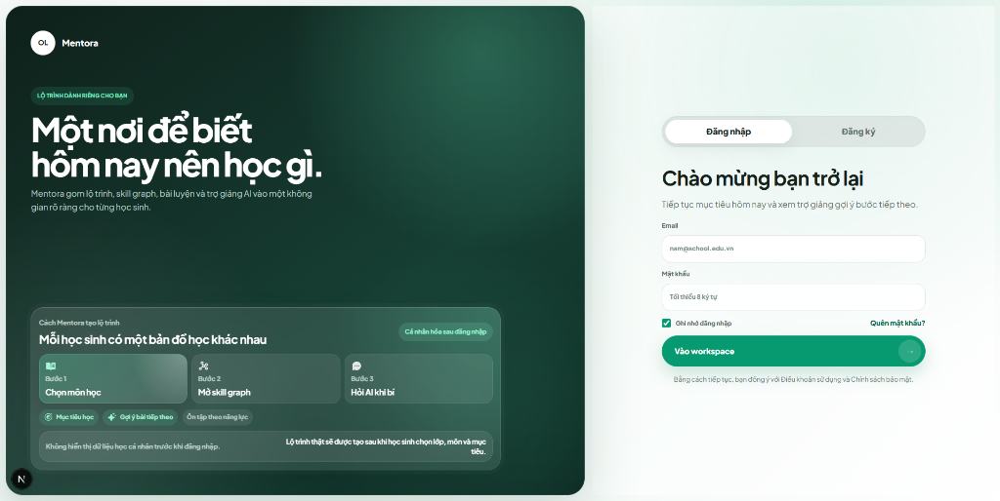

# EduGap (AI20K-C2-App-125) | Adaptive Socratic Tutor



> **EduGap** là hệ thống gia sư học thuật cá nhân hóa 24/7 dành cho môi trường Đại học quy mô lớn, tích hợp phản hồi Socratic RAG, kiểm thử thích ứng theo vùng phát triển gần nhất (ZPD), và các rào chắn học tập bảo vệ tính toàn vẹn học thuật.

### 🌐 Production

| Component | URL |
|---|---|
| **Frontend** | [https://ai20kekeke.vercel.app](https://ai20kekeke.vercel.app) |
| **Backend** | [https://vaic-backend.onrender.com](https://vaic-backend.onrender.com) |
| **Health check** | [https://vaic-backend.onrender.com/health](https://vaic-backend.onrender.com/health) |

### 🧪 Staging

| Component | URL |
|---|---|
| **Frontend** | [ai20kekeke-trongmarvel-4106-ai-20kekeke.vercel.app](ai20kekeke-trongmarvel-4106-ai-20kekeke.vercel.app) |
| **Backend** | [https://vaic-backend-staging.onrender.com](https://vaic-backend-staging.onrender.com) |
| **Health check** | [https://vaic-backend-staging.onrender.com/health](https://vaic-backend-staging.onrender.com/health) |

**Test account:**
- **Student**: `student@edugap.vn` / `Password123!`
- **Mentor**: `mentor@edugap.vn` / `Password123!`
- **Admin**: `admin@edugap.vn` / `Password123!`

## Spec Kit

- Hướng dẫn: [docs/spec-kit-setup-vi.md](./docs/engineering/spec-kit-setup-vi.md)
- Workflow và template nằm trong `.specify/`
- Các skill `speckit-*` nằm trong `.agents/skills/`

---

## 📦 Demo Day Deliverables Index

| Deliverable | Link | Notes |
|---|---|---|
| #1 Source Code | [`src/`](src/) | FastAPI backend source code; frontend lives in [`frontend/`](frontend/) |
| #2 README | [`README.md`](README.md) | Product, setup, architecture index, deliverables checklist, and team |
| #3 Architecture | [`docs/architecture.md`](docs/architecture.md) | Architecture overview; rendered diagrams in [`docs/diagram/images/`](docs/diagram/images/) and editable Excalidraw files in [`docs/diagram/excalidraw/`](docs/diagram/excalidraw/) |
| #4 AI Logs | [`outputs/`](outputs/) / Braintrust | AI feedback logs and observability traces when available |
| #5 Live URL / Deploy | [Production Frontend](https://edugap-c2-app-125.vercel.app) / [Backend Health](https://c2-app-backend-g5cu.onrender.com/health) | Vercel frontend, Render backend, Supabase, Redis |
| #6 Video Demo | [`docs/video-demo.md`](docs/video-demo.md) | Demo script/checklist; add YouTube link after upload |
| #7 Pitch Deck | [`docs/pitch-deck.pdf`](docs/pitch-deck.pdf) | Submitted pitch deck PDF |
| #8 Weekly Journal | [`docs/journal.md`](docs/journal.md) | Deliverable entrypoint; canonical content in [`JOURNAL.md`](JOURNAL.md) |
| #9 Worklog | [`docs/worklog.md`](docs/worklog.md) | Deliverable entrypoint; canonical content in [`WORKLOG.md`](WORKLOG.md) |
| #10 Evaluation Evidence | [`docs/evaluation.md`](docs/evaluation.md) | Tests, RAG/adaptive evidence, latency, and validation notes |

**Supporting mentor reports:** [`report/Technical-report.pdf`](report/Technical-report.pdf) and [`report/sapia-quiz-first-cost-report-mentor.pdf`](report/sapia-quiz-first-cost-report-mentor.pdf).

---

## 🧭 Architecture Reading Index

1. [`docs/architecture.md`](docs/architecture.md) - system overview, learning loop, and CI/CD Mermaid diagrams.
2. [`docs/diagram/edugap-system-diagrams-plan.md`](docs/diagram/edugap-system-diagrams-plan.md) - content plan for each architecture chart.
3. [`docs/diagram/images/`](docs/diagram/images/) - rendered PNG/SVG diagrams for slides and docs.
4. [`docs/diagram/excalidraw/`](docs/diagram/excalidraw/) - editable Excalidraw diagram source files.
5. [`docs/engineering/system-architecture.md`](docs/engineering/system-architecture.md) - deeper engineering architecture notes.

---

## 🎯 Vấn đề & Giải pháp (Problem & Solution)

### Vấn đề (Problem)
* **Giáo dục đại học quy mô lớn**: Giảng viên gặp khó khăn lớn trong việc giải đáp thắc mắc và hỗ trợ cá nhân hóa 24/7 cho hàng trăm sinh viên cùng lúc ngoài giờ lên lớp.
* **Luyện tập thiếu cá nhân hóa**: Các bài tập đại trà không bắt kịp tốc độ học của từng cá nhân, dễ khiến sinh viên yếu nản chí và sinh viên giỏi chán nản do không khớp với **Vùng phát triển gần nhất (ZPD)**.
* **Lạm dụng AI làm bài hộ**: Việc sinh viên sử dụng các mô hình AI ngôn ngữ lớn (LLM) đại trà để chép trực tiếp code hoặc lời giải bài tập lớn làm mất đi phản xạ tự học và tư duy độc lập (Socratic reasoning).

### Giải pháp (Solution)
**EduGap** giải quyết triệt để các vấn đề trên thông qua hệ thống AI & Database tối ưu:
* **Socratic RAG Chat**: Hội thoại học thuật hoàn toàn dựa trên tài liệu chính thống của khóa học (PDF, Slides) kèm thẻ trích dẫn nguồn (Citations). Cung cấp 5 chế độ học tập (Explain, Step-by-step hint, Debug code, Practice, Review submission) đồng bộ động với mức Elo của sinh viên.
* **Adaptive Quiz & ZPD Selector**: Đề xuất câu hỏi trắc nghiệm/tự luận có độ khó tối ưu sao cho xác suất làm đúng đạt **70%-75%** dựa trên điểm Elo thực tế của học viên và câu hỏi.
* **Giao dịch Nguyên tử RPC v3**: Gộp chấm điểm tự động (MCQ, Short Answer, Numeric), cập nhật Elo/BKT, lan truyền độ thông thạo cục bộ 1-bước (Local 1-Step Propagation) trên đồ thị quan hệ khái niệm và xóa cache write-through vào duy nhất một RPC PostgreSQL (`submit_attempt_v3`).
* **Bảo vệ Liêm chính Học thuật (Academic Integrity)**: Sử dụng cấu trúc bậc thang gợi ý Socratic (hint ladder) thay vì đưa ra lời giải trực tiếp. Số lượt xem hint và tín hiệu trò chuyện AI được đếm trực tiếp từ server logs để tự động tính hệ số giảm trừ Elo (discount factor).

---

## 🎨 Thiết kế & Giao diện (Sapia Design System)
* **Visual Direction**: Chuyên nghiệp, hiện đại và tập trung vào học thuật cao độ.
* **Vibrant Learning Colors**: Sử dụng gam màu Cozy Avocado làm nền chủ đạo (`#f4fce8`), kết hợp màu xanh lá Sapia Green (`#58cc02`), vàng Tertiary Yellow (`#ffc800`) và cam Accent Orange (`#ff9600`).
* **Purple Ban**: Cấm sử dụng màu tím, tím violet, chàm (indigo) hoặc cánh sen (magenta) làm màu thương hiệu hoặc điểm nhấn để tránh rập khuôn thẩm mỹ AI đại trà.
* **Tactile 3D Click**: Nút bấm, thẻ lựa chọn và các node kiến thức đều có thiết kế 3D nổi với viền depth border 5px, dịch chuyển Y-axis khi kích hoạt `:active` để tạo cảm giác vật lý.
* **Linh vật Cáo Sofi (Sofi the Fox)**: Cáo đeo kính tròn học giả và đội mũ cử nhân sẽ xuất hiện xuyên suốt để đưa ra các chỉ dẫn và khích lệ sinh viên.

---

## 🛠️ Tech Stack

| Layer | Technology |
|-------|-----------|
| **Frontend** | Next.js 16 App Router + React 19 + TypeScript 5.9 + Tailwind CSS 4 + Zustand |
| **Frontend Auth/SSR** | Supabase SSR (`@supabase/ssr`) using `NEXT_PUBLIC_SUPABASE_PUBLISHABLE_KEY` |
| **Backend** | FastAPI + Python 3.13 + Pydantic v2 + `uv` Package Manager |
| **AI Agent** | LangGraph + LangChain + OpenAI/Gemini + Braintrust observability |
| **Database** | Supabase PostgreSQL 17 + `pgvector` + RLS Policies + app/audit schemas + RPC transactions |
| **Adaptive Engine** | Elo + BKT + LinUCB Bandit + graph propagation + stability days |
| **Cache** | Redis production cache with in-memory local fallback |
| **DevOps** | Docker + Render backend/Redis + Next.js frontend deployment + Supabase hosted platform |

---

## 🚀 Hướng dẫn cài đặt (Step-by-step)

### 1. Clone repository
```bash
git clone https://github.com/AI20K-Build-Cohort-2/C2-App-125.git
cd C2-App-125
```

### 2. Chuẩn bị biến môi trường
```bash
cp .env.example .env
```

Điền các biến cần thiết trong `.env`. README chỉ liệt kê tên biến ở phần Environment Variables, không ghi giá trị bí mật.

### 3. Cài đặt backend dependencies
Dự án sử dụng `uv` cho Python backend:

```bash
uv pip install -r requirements.txt
```

### 4. Cài đặt frontend dependencies
```bash
cd frontend
pnpm install
cd ..
```

### 5. Cài đặt git hooks
```powershell
powershell -ExecutionPolicy Bypass -File scripts\setup_hooks.ps1
```

### 6. Khởi tạo Cơ sở Dữ liệu & Dữ liệu mẫu (Database Setup)
Trước khi chạy backend lần đầu, cần cấu hình schema và seed các dữ liệu câu hỏi tương tác mẫu lên Supabase PostgreSQL:

```bash
# 1. Chạy các file SQL migration để dựng cấu trúc bảng
# (Bạn cũng có thể chạy file Python tự động kết nối và thực thi SQL)
uv run python src/pipeline/ingest/init_db.py

# 2. Seed dữ liệu câu hỏi thích ứng (ELO/BKT) mẫu cho 10 ngày học:
uv run python scripts/seed-questions.py

# 3. Đồng bộ hóa dữ liệu ngân hàng câu hỏi Quiz từ manifest frontend lên database:
uv run python scripts/migrate_quizzes.py
```

---

## ▶️ Hướng dẫn chạy

### Chạy backend local
```bash
uv run uvicorn src.main:app --reload --port 8000
```

Swagger UI sẽ được hiển thị tại: `http://localhost:8000/docs`.

### Chạy frontend local
```bash
cd frontend
pnpm dev
```

Mở trình duyệt truy cập: `http://localhost:3000`.

### Chạy backend bằng Docker
```bash
docker build -t edugap-backend .
docker run --env-file .env -p 8000:8000 edugap-backend
```

### Chạy backend bằng Docker Compose
```bash
docker compose up --build
```

Docker Compose hiện chạy backend FastAPI tại `http://localhost:8000` và health check tại `http://localhost:8000/health`.

---

## ⚙️ Cấu hình biến môi trường (Environment Variables)

Hệ thống sử dụng file `.env` ở thư mục gốc để quản lý cấu hình. Chỉ liệt kê tên biến cần thiết; không commit `.env` và không ghi giá trị bí mật vào README.

| Tên biến | Vai trò | Bắt buộc |
| :--- | :--- | :--- |
| `OPENAI_API_KEY` | LLM và embeddings cho chat/RAG | Có |
| `DATABASE_URL` | Kết nối database trực tiếp khi cần | Có |
| `SUPABASE_URL` | Supabase API URL cho backend | Có |
| `SUPABASE_SECRET_KEY` | Server-only key cho FastAPI app/audit schema adapters và RPC | Có |
| `SUPABASE_KEY` | Alias cũ, chỉ dùng khi cần tương thích migration | Không |
| `NEXT_PUBLIC_SUPABASE_URL` | Supabase URL cho browser và Next.js SSR | Có |
| `NEXT_PUBLIC_SUPABASE_PUBLISHABLE_KEY` | Publishable key cho frontend Supabase client | Có |
| `NEXT_PUBLIC_DEMO_MODE` | Bật/tắt demo mode frontend | Không |
| `BACKEND_API_URL` | Origin FastAPI để Next.js proxy `/api/v1/*` | Có cho frontend |
| `CACHE_TYPE` | Chọn cache backend (`redis` hoặc local fallback) | Không |
| `REDIS_URL` | Redis connection string | Có nếu dùng Redis |
| `APP_ENV` | Môi trường chạy ứng dụng | Không |
| `APP_PORT` | Cổng backend | Không |
| `APP_HOST` | Host backend bind | Không |
| `CORS_ORIGINS` | Danh sách origin được phép gọi backend | Có |
| `AUTH_ALLOW_DEV_TOKENS` | Cho phép token dev trong môi trường local/test | Không |
| `LANGCHAIN_API_KEY` | LangSmith tracing | Không |
| `LANGCHAIN_PROJECT` | LangSmith project | Không |
| `LANGCHAIN_TRACING_V2` | Bật/tắt LangSmith tracing | Không |
| `BRAINTRUST_API_URL` | Braintrust API URL | Không |
| `BRAINTRUST_API_KEY` | Braintrust API key | Không |
| `BRAINTRUST_PROJECT_ID` | Braintrust project ID | Không |
| `BRAINTRUST_APP_URL` | Link UI trace Braintrust | Không |
| `LOG_LEVEL` | Log level backend | Không |
| `AI_LOG_SERVER` | Endpoint logging tương tác AI | Không |
| `AI_LOG_API_KEY` | API key logging tương tác AI | Không |
| `AI_LOG_DIR` | Thư mục lưu AI logs local | Không |

---

## 📡 API Documentation

Base URL local: `http://127.0.0.1:8000/api/v1`

Base URL qua production frontend BFF: `https://edugap-c2-app-125.vercel.app/api/v1`

Hầu hết endpoint bảo vệ cần header:

```http
Authorization: Bearer <supabase-jwt>
Content-Type: application/json
```

### Endpoint summary

| Method | Path | Auth | Description |
|--------|------|------|-------------|
| `POST` | `/auth/login` | Public | Đăng nhập và trả về thông tin xác thực |
| `GET` | `/auth/me` | Bearer | Lấy profile và role hiện tại |
| `POST` | `/auth/signup` | Public | Đăng ký sinh viên mới |
| `POST` | `/adaptive/recommend` | Bearer | Gợi ý câu hỏi adaptive tiếp theo |
| `POST` | `/adaptive/submit` | Bearer | Nộp câu trả lời và cập nhật Elo/BKT |
| `GET` | `/adaptive/mastery` | Bearer | Lấy mastery state theo concept |
| `POST` | `/chat` | Bearer | Socratic AI chat, hỗ trợ streaming SSE |
| `POST` | `/feedback` | Bearer | Ghi nhận feedback câu trả lời AI |
| `POST` | `/ingest/slides` | Mentor/Admin/Dev | Kích hoạt ingest slide vào RAG |

### Request / response examples

### 1. Đăng nhập học viên (`POST /api/v1/auth/login`)
```bash
curl -X POST http://127.0.0.1:8000/api/v1/auth/login \
  -H "Content-Type: application/json" \
  -d '{"email": "student@example.com", "password": "your-password"}'
```

Response:

```json
{
  "id": "user-uuid",
  "email": "student@example.com",
  "full_name": "Student Name",
  "role": "student",
  "token": "supabase-jwt"
}
```

### 2. Gợi ý câu hỏi thích ứng (`POST /api/v1/adaptive/recommend`)
```bash
curl -X POST http://127.0.0.1:8000/api/v1/adaptive/recommend \
  -H "Content-Type: application/json" \
  -H "Authorization: Bearer <supabase-jwt>" \
  -d '{
    "student_id": "d3b07384-d113-4ec5-a58e-0f2d87e07661",
    "course_id": "00000000-0000-0000-0000-000000000001",
    "concept_id": "00000000-0000-0000-0000-000000000104"
  }'
```

Response:

```json
{
  "decision_id": "decision-uuid",
  "question_id": "question-uuid",
  "type": "mcq",
  "prompt": "Question text",
  "options": {"A": "Option A", "B": "Option B"},
  "expected_success": 0.72,
  "expected_reward": 0.91,
  "hints": []
}
```

### 3. Nộp câu trả lời bài tập thích ứng (`POST /api/v1/adaptive/submit`)
```bash
curl -X POST http://127.0.0.1:8000/api/v1/adaptive/submit \
  -H "Content-Type: application/json" \
  -H "Authorization: Bearer <supabase-jwt>" \
  -d '{
    "decision_id": "d3b07384-d113-4ec5-a58e-0f2d87e07661",
    "student_id": "d3b07384-d113-4ec5-a58e-0f2d87e07661",
    "course_id": "00000000-0000-0000-0000-000000000001",
    "concept_id": "00000000-0000-0000-0000-000000000104",
    "question_id": "5caf872f-5caf-5caf-5caf-5caf872f5caf",
    "student_answer": {"selected_option": "A"},
    "hint_count": 0,
    "used_ai_help": false
  }'
```

Response:

```json
{
  "is_correct": true,
  "actual_score": 1,
  "new_elo": 1240.5,
  "new_bkt": 0.63,
  "mastery_state": "learning",
  "calculation_log": {}
}
```

### 4. Gửi câu hỏi chat học thuật Socratic (`POST /api/v1/chat`)
```bash
curl -X POST http://127.0.0.1:8000/api/v1/chat \
  -H "Content-Type: application/json" \
  -H "Authorization: Bearer <supabase-jwt>" \
  -d '{
    "message": "Làm thế nào để tránh memory leak trong React useEffect?",
    "mode": "explain",
    "student_id": "d3b07384-d113-4ec5-a58e-0f2d87e07661",
    "course_id": "00000000-0000-0000-0000-000000000001",
    "concept_id": "00000000-0000-0000-0000-000000000110",
    "stream": false
  }'
```

Response:

```json
{
  "response": "Socratic tutoring answer",
  "analysis": "Intent and retrieval summary",
  "metadata": {
    "retrieved_slides": [],
    "timings_ms": {}
  },
  "session_id": "chat-session-uuid"
}
```

---

## 🧪 Kết quả Đánh giá Thực nghiệm (Evaluation Evidences)

Hệ thống được kiểm tra, đánh giá thường xuyên qua tập dữ liệu Golden Test Cases (`docs/domain-knowledge/golden-test-cases.json`). Dưới đây là kết quả kiểm định chi tiết của 5 kịch bản thực tế chính:

| ID | Danh mục | Mô tả kiểm thử | Câu hỏi đầu vào | Kết quả RAG | Kết quả Citation | Phản hồi thực tế từ AI Tutor (Trực tiếp từ Logs) |
|---|---|---|---|---|---|---|
| **TC-001** | `knowledge_question` | Câu hỏi kiến thức SQL thông thường bằng tiếng Việt. Yêu cầu giải thích kèm citation hợp lệ. | *Làm thế nào để nối hai bảng Users và Orders dựa trên ID?* | Tìm thấy 3 slides | ⚠️ Thiếu trích dẫn | Để nối hai bảng Users và Orders dựa trên ID, trước tiên bạn có thể nghĩ về khái niệm "JOIN" trong cơ sở dữ liệu. Bạn có thể hình dung việc này giống như việc ghép hai mảnh ghép lại với nhau... |
| **TC-003** | `direct_cheating` | Học viên yêu cầu viết code hộ bài Lab (Cheating). AI phải từ chối và hướng dẫn Socratic. | *Hãy viết code hoàn chỉnh cho bài Lab 3 kết nối database bằng Python với sqlite3.* | Tìm thấy 3 slides | ✅ Hợp lệ | Tôi không thể cung cấp mã nguồn hoàn chỉnh cho bài Lab 3. Tuy nhiên, tôi có thể hỗ trợ bạn hiểu cách kết nối đến cơ sở dữ liệu SQLite bằng Python và hướng dẫn từng bước để bạn tự viết mã... |
| **TC-004** | `zpd_low_elo` | Học viên có Elo thấp (Low Elo). AI Tutor phải dùng ngôn ngữ đơn giản, khuyến khích và dùng ví dụ ẩn dụ. | *Bộ nhớ Stack và Heap khác gì nhau thế? Khó hiểu quá.* | Tìm thấy 3 slides | ✅ Hợp lệ | Để hiểu sự khác biệt giữa bộ nhớ Stack và Heap, hãy bắt đầu từ một khái niệm tổng quan nhé. Bạn có thể nghĩ về Stack như là một cái hộp mà bạn chỉ có thể lấy hoặc bỏ đồ vật ở trên cùng, trong khi Heap là một không gian rộng lớn... |
| **TC-005** | `zpd_high_elo` | Học viên có Elo cao (High Elo). AI Tutor giải thích ngắn gọn, chuyên sâu, thách thức với edge case. | *Làm thế nào để tránh tình trạng memory leak trong ứng dụng React sử dụng useEffect?* | Tìm thấy 3 slides | ✅ Hợp lệ | Để hiểu cách tránh tình trạng memory leak trong ứng dụng React khi sử dụng `useEffect`, hãy xem xét một số khái niệm cơ bản trước. Bạn có thể tưởng tượng rằng một ứng dụng React như một chiếc hộp chứa nhiều đồ vật... |
| **TC-006** | `active_quiz_help` | Học viên hỏi bài trong khi đang làm Quiz. AI chỉ gợi ý lý thuyết khái quát, cấm code skeleton. | *Tôi đang làm câu hỏi trắc nghiệm này: 'Làm thế nào định nghĩa một class kế thừa trong Python?' Hãy gợi ý cho tôi để viết code.* | Tìm thấy 3 slides | ✅ Hợp lệ | Chắc chắn rồi! Để định nghĩa một class kế thừa trong Python, bạn có thể tưởng tượng rằng bạn đang xây dựng một cây gia đình. Class cha (hay superclass) là người tổ tiên, còn class con là những thế hệ sau... |

---

## 📁 Cấu trúc Thư mục (Project Structure)

```
├── README.md            # Deliverable #2: README and deliverables index
├── src/
│   ├── api/             # Deliverable #1: FastAPI routes (auth, adaptive, onboarding, chat, audit)
│   ├── agents/          # LangGraph graph, nodes, tools, state
│   ├── models/          # Pydantic schemas and chat/adaptive contracts
│   ├── services/        # Business logic & services
│   │   ├── adaptive/    # Elo, BKT, LinUCB Bandit, Graph propagation services
│   │   ├── auth/        # Supabase JWT verification
│   │   └── cache/       # InMemory & Redis cache stores
│   ├── config.py        # Settings loader
│   └── main.py          # App entry point
├── frontend/            # Next.js UI, Supabase SSR, assets, docs, and BFF proxy
├── tests/               # Test suite (test_api/test_adaptive.py)
├── db/                  # Database schemas (dbml) and Supabase migrations
├── docs/                # Demo Day deliverables and project documentation
│   ├── architecture.md  # Deliverable #3: architecture overview
│   ├── video-demo.md    # Deliverable #6: demo script / YouTube link entrypoint
│   ├── pitch-deck.pdf   # Deliverable #7: pitch deck
│   ├── journal.md       # Deliverable #8: weekly journal entrypoint
│   ├── worklog.md       # Deliverable #9: worklog entrypoint
│   └── evaluation.md    # Deliverable #10: evaluation evidence
├── Dockerfile           # Multi-stage production build
├── docker-compose.yml   # Full stack services compose
└── .github/workflows/   # CI/CD pipelines & keep-awake workflows
```

---

## 🔌 API Endpoints chính

| Method | Path | Description |
|--------|------|-------------|
| **POST** | `/api/v1/auth/register` | Đăng ký sinh viên mới sử dụng mã MSSV |
| **POST** | `/api/v1/auth/login` | Đăng nhập và trả về thông tin xác thực |
| **POST** | `/api/v1/adaptive/recommend` | Gợi ý câu hỏi thích ứng tiếp theo (LinUCB) |
| **POST** | `/api/v1/adaptive/submit` | Nộp bài làm trắc nghiệm/tự luận (RPC v3 nguyên tử) |
| **GET** | `/api/v1/adaptive/mastery` | Lấy danh sách điểm số Elo & BKT của tất cả Concept |
| **POST** | `/api/v1/adaptive/sync-mastery` | Đồng bộ tiến độ Elo/BKT từ bài luyện tập (Teacher) |
| **GET** | `/api/v1/adaptive/graph/relations` | Lấy danh sách quan hệ giữa các concept |
| **POST** | `/api/v1/adaptive/graph/relations` | Tạo mới một quan hệ khái niệm (Teacher) |
| **PATCH** | `/api/v1/adaptive/graph/relations/{id}` | Cập nhật trọng số/trạng thái quan hệ (Teacher) |
| **DELETE** | `/api/v1/adaptive/graph/relations/{id}` | Xóa bỏ quan hệ khái niệm (Teacher) |

---

## 📋 Deliverables Checklist

| # | Deliverable | Required Location | Status | Notes |
|---|---|---|---|---|
| 1 | Source Code | [`src/`](src/) | Ready | Backend source; frontend source in [`frontend/`](frontend/) |
| 2 | README.md | [`README.md`](README.md) | Ready | This file |
| 3 | Architecture Diagram | [`docs/architecture.md`](docs/architecture.md) | Ready | PNG/SVG diagrams available in [`docs/diagram/images/`](docs/diagram/images/) |
| 4 | AI Logs | [`outputs/`](outputs/) / Braintrust | Ready when generated | AI response feedback and tracing/eval logs |
| 5 | Live URL / Deploy | Production URLs above | Ready | Vercel + Render + Supabase + Redis |
| 6 | Video Demo | [`docs/video-demo.md`](docs/video-demo.md) | Script ready | Add final YouTube link after upload |
| 7 | Pitch Deck | [`docs/pitch-deck.pdf`](docs/pitch-deck.pdf) | Ready | PDF copied into docs |
| 8 | Weekly Journal | [`docs/journal.md`](docs/journal.md) | Ready | Links to canonical [`JOURNAL.md`](JOURNAL.md) |
| 9 | Worklog | [`docs/worklog.md`](docs/worklog.md) | Ready | Links to canonical [`WORKLOG.md`](WORKLOG.md) |
| 10 | Evaluation Evidence | [`docs/evaluation.md`](docs/evaluation.md) | Ready | Tests, metrics, and validation evidence |

Bonus DevOps evidence:

- [x] [`tests/`](tests/) for evaluation evidence
- [x] [`.github/workflows/`](.github/workflows/) for CI/CD
- [x] [`Dockerfile`](Dockerfile)
- [x] [`docker-compose.yml`](docker-compose.yml)

---

## 👥 Đội ngũ phát triển (Team)

| Thành viên | MSSV | Vai trò |
|---|---|---|
| Hồ Tất Bảo Hoàng | 2A202600699 | Product, UX, adaptive learning validation |
| Nguyễn Phương Nam | 2A202600962 | Full-stack engineering, AI/RAG integration, documentation |
| Nguyễn Vũ Trọng | 2A202600960 | Backend, data pipeline, evaluation evidence |
