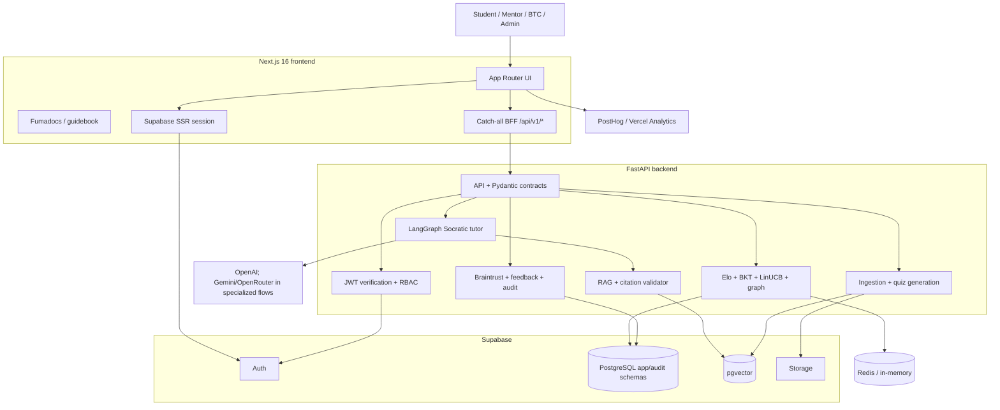
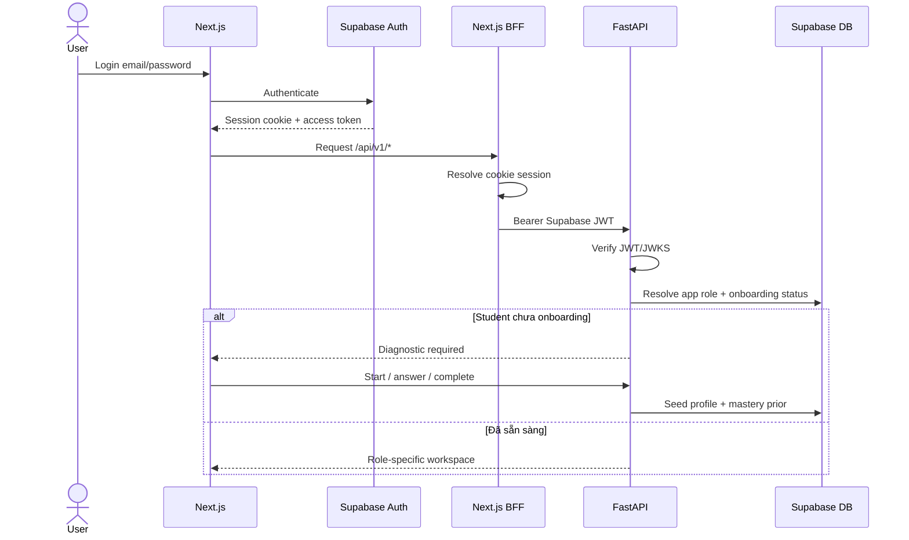
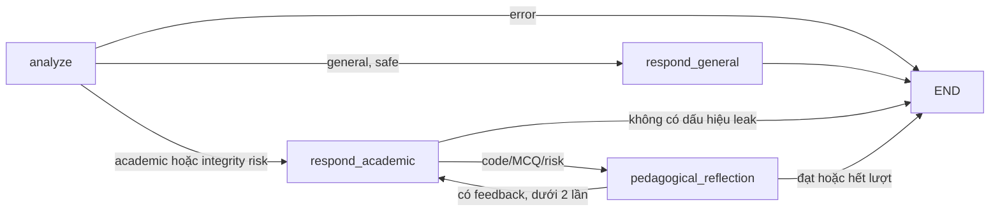

# EduGap — AI Project Context & Implementation Specification

> **Loại tài liệu:** AI bootstrap context / living specification / codebase analysis
> **Ngày đối chiếu:** 2026-07-17
> **Nhánh và commit:** `dev` @ `a7d5eda`
> **Phạm vi:** mã nguồn, cấu hình mẫu, migration, ADR, tài liệu sản phẩm/kỹ thuật/nghiên cứu và evidence đã lưu trong repository
> **Nguyên tắc:** code và migration mới nhất là nguồn sự thật khi tài liệu mâu thuẫn; không đọc hoặc sao chép giá trị bí mật từ `.env`

## 0. AI bootstrap — đọc phần này trước khi làm việc

Phần này là contract dành cho AI agent. Nếu chỉ có thời gian đọc một phần của tài liệu, hãy đọc toàn bộ mục 0, sau đó đi đến domain liên quan trong các mục còn lại.

### 0.1 Project identity trong một câu

**EduGap là adaptive-first Socratic AI Tutor: dùng học liệu chính thức để hướng dẫn có citation, dùng quiz để đo mastery, rồi dùng Elo + BKT + LinUCB + knowledge graph để chọn bước học tiếp theo mà không làm bài hộ học viên.**

Không được thu gọn EduGap thành một trong các mô tả sai sau:

- “Chatbot hỏi đáp tài liệu”: thiếu adaptive loop, mastery, quiz và mentor workflow.
- “Ứng dụng quiz”: thiếu RAG tutor, Socratic guardrail và content lifecycle.
- “Dashboard gamification”: XP/streak/seed/soil chỉ là lớp biểu diễn; Elo/BKT/audit mới là state học tập.
- “LLM tự quyết định mọi thứ”: grading, authorization, replay protection và transaction phải do code/database kiểm soát.

### 0.2 Machine-readable project capsule

```yaml
project:
  name: EduGap
  repository: AI20K-C2-App-125
  stage: production-oriented MVP / Demo Day
  primary_language:
    product_copy: Vietnamese
    code_identifiers: English
  users: [student, mentor, teacher, btc, admin, dev]
  architecture: modular-monolith-with-two-runtimes
  runtimes:
    frontend: Next.js 16 + React 19 + TypeScript + Tailwind 4
    backend: FastAPI + Python 3.13 + Pydantic 2
  data_platform:
    identity: Supabase Auth
    relational: Supabase PostgreSQL
    vector: pgvector in Supabase
    authorization: JWT + backend RBAC + RLS
    transactions: PostgreSQL RPC
    cache: Redis with in-memory local fallback
  ai:
    orchestration: LangGraph
    primary_path: OpenAI/OpenRouter-compatible LLM service
    specialized_pipeline: Gemini/OpenRouter PDF conversion
    behavior: Socratic + course-grounded + citation-validated
  adaptive_core:
    ability_and_difficulty: Educational Elo
    concept_mastery: Bayesian Knowledge Tracing
    recommendation: LinUCB contextual bandit
    retention: lazy forgetting decay + stability
    relations: concept graph + multi-skill propagation
    target_success_probability: 0.75
  source_of_truth_order:
    - current runtime code and latest SQL migrations
    - tests and typed contracts
    - current architecture/product documents
    - ADRs
    - plans, journals, research and historical reports
```

### 0.3 Outcome mà AI phải bảo toàn

Mọi thay đổi phải phục vụ ít nhất một phần của vòng lặp sau mà không phá các phần còn lại:

```text
Official course content
  → grounded Socratic guidance
  → learner attempts a task
  → server observes and grades
  → atomic mastery update + audit
  → adaptive next-best action
  → learner/mentor sees an explainable result
```

Một implementation được xem là “giống EduGap” khi có đủ năm thuộc tính:

1. **Grounded:** câu trả lời học thuật có nguồn course/slide hoặc báo rõ không đủ nguồn.
2. **Adaptive:** nội dung tiếp theo phụ thuộc learner state, không chỉ random hoặc static sequence.
3. **Auditable:** ghi được vì sao chọn câu hỏi, kết quả và mastery thay đổi thế nào.
4. **Socratic:** hỗ trợ suy luận, không đưa lời giải hoàn chỉnh cho bài đang đánh giá.
5. **Human-governed:** mentor có thể review nội dung, lỗi, citation và tín hiệu chất lượng.

### 0.4 Invariant không được phá

Đây là các quy tắc cứng. Nếu yêu cầu mới xung đột, AI phải nêu xung đột trước khi thay đổi.

#### Identity và authorization

- Supabase Auth JWT là identity credential production duy nhất.
- Backend phải suy ra authority từ token; `student_id`, role hoặc persona do client gửi chỉ là context để cross-check.
- Student chỉ được thao tác state của chính mình; mentor/BTC/admin cần role check tại backend.
- Frontend dùng publishable key; backend app/audit adapter dùng `SUPABASE_SECRET_KEY`.
- Không đưa raw UUID, fake JWT hoặc dev-token fallback vào live mode.
- Lỗi đọc role/auth store phải fail closed, không tự hạ role về student rồi tiếp tục.

#### Adaptive correctness

- Recommend phải tạo `decision_id`; submit phải dùng đúng decision đó.
- Submit phải đối chiếu student/course/concept/question và từ chối decision đã `consumed_at`.
- Correctness được chấm server-side; không tin `is_correct` hoặc score do client cung cấp.
- Hint count phải lấy từ server log khi dùng live database.
- Submit state-changing phải đi qua atomic RPC hiện hành (`app.submit_attempt_v3`) hoặc migration thay thế được version rõ ràng.
- Empty RPC/write result là dependency failure, không phải success.
- Elo/BKT/bandit/audit/cache phải cùng phản ánh một attempt; không cập nhật từng phần âm thầm.

#### RAG và AI tutor

- Retrieval dùng học liệu official và giữ course/concept scope.
- Khi retrieval được dùng, citation phải ánh xạ tới source đã retrieve.
- Provider/RPC/config failure khác với “không tìm thấy tài liệu”; không biến lỗi dependency thành empty success.
- Missing provider key ngoài test/local explicit mock phải fail closed.
- Prompt/guardrail/mode/scaffolding phải nằm trong YAML hoặc rule file được version hóa, không hardcode rải rác.
- Reflection/validation có giới hạn vòng lặp để tránh latency vô hạn.

#### UX và fallback

- Demo/mock/static fallback phải được bật rõ và gắn nhãn; không được giả làm dữ liệu production.
- Mọi surface gọi AI/backend phải có loading, empty, unauthorized, unavailable và retry state thích hợp.
- Citation, guardrail reason và quiz primary action không được bị che bởi animation hoặc trang trí.
- Giữ design language Sapia: cozy background, green/yellow/orange/blue/red learning states, tactile controls, Sofi mascot; không tự tạo palette mới.

#### Data, config và secrets

- Không đọc, in, commit hoặc sao chép giá trị từ `.env` vào docs/log/code.
- Không hardcode secret, project credential, role ID, course UUID mới hoặc endpoint private.
- Thay đổi schema phải bằng migration mới; không sửa lịch sử migration đã chạy production trừ khi có chỉ định đặc biệt.
- RLS và backend RBAC là hai lớp bổ sung, không thay thế nhau.
- Redis là cache, không phải nguồn dữ liệu chuẩn.

#### Engineering workflow

- Đọc `CLAUDE.md` và instruction gần nhất trước khi làm.
- Nhánh mặc định là `dev`; không commit trực tiếp lên `dev` hoặc `main`.
- Dùng `uv` cho Python và `pnpm` cho frontend; đọc package-manager guide trước khi cài hoặc chạy test.
- Giữ KISS, DRY, YAGNI; sửa implementation hiện có thay vì tạo file “enhanced/v2/final” song song.
- Không hoàn thành task chỉ bằng cách làm test pass nếu hành vi production bị sai.

### 0.5 Source-of-truth decision tree

Khi gặp mâu thuẫn, xử lý theo cây quyết định sau:

```text
Câu hỏi về hành vi đang chạy?
  ├─ Có code + test hiện tại → dùng code/test
  ├─ Có liên quan DB/RPC/RLS → dùng migration mới nhất + adapter
  ├─ Chỉ có docs hiện tại → dùng docs nhưng đánh dấu chưa xác minh runtime
  └─ Chỉ có plan/research/journal → coi là ý định hoặc lịch sử, không coi là implemented
```

Không lấy các nguồn sau làm chuẩn độc lập:

- `ARCHITECTURE.md` root vì còn là template cũ.
- `eval/results/report.md` vì còn là template.
- `db/README.md` cho số bảng/RPC mới nhất vì đã chậm hơn migrations.
- Mock data hoặc demo manifest để suy luận production schema.
- Timestamp file để kết luận feature mới hơn; ưu tiên Git history và nội dung code.

### 0.6 Task routing map cho AI

| Nếu task liên quan | Đọc trước | Implementation chính | Test/evidence gần nhất |
| --- | --- | --- | --- |
| Product scope/persona | `SPECIFY.md`, product PDR | `frontend/lib/dashboard-tabs.ts` và route/page liên quan | frontend contract tests, user-flow docs |
| Frontend shell/navigation | design guidelines, dashboard tabs/routes | `frontend/app/components/quiz-app-shell.tsx`, `frontend/components/` | `tests/test_frontend_contracts.py`, lint/build |
| Auth/session/RBAC | security invariants, BFF ADR | BFF route, `frontend/lib/auth*`, `src/services/auth/`, `src/api/auth_routes.py` | RBAC, auth verification, Supabase config tests |
| Socratic chat | chat contract, agent graph, prompt YAML | `src/api/routes.py`, `src/agents/`, `src/services/rag.py`, frontend stream/hooks | chat stream, contracts, intent, RAG, tools tests |
| Adaptive quiz | algorithm section, adaptive schemas | `src/api/adaptive_routes.py`, `src/services/adaptive/`, frontend adaptive client | adaptive, equivalence, SQL contract, bitemporal tests |
| Database/RLS/RPC | latest migrations + DB adapter | new file in `db/supabase/migrations/`, `supabase_database.py` | SQL contract and Supabase adapter tests |
| Onboarding | onboarding ADR and current API | onboarding routes, contracts, frontend onboarding libs/components | onboarding API tests |
| Ingestion/quiz generation | material lifecycle and prompt YAML | material routes, pipeline, quiz generator, mentor components | material/quiz review/error tests |
| Mentor/BTC dashboards | role matrix and demo-state rules | dashboard mentor/admin components + corresponding API service | admin Braintrust, review/error API tests |
| Observability/performance | timing evidence and SLO risks | timing, Braintrust services, BFF diagnostics, scripts | latency harness and admin tests |
| Documentation only | canonical docs map | update existing canonical file | link, secret, drift and Markdown validation |

### 0.7 Standard working protocol cho AI

Thực hiện task theo thứ tự này:

1. **Classify:** xác định persona, domain và behavior cần thay đổi.
2. **Discover:** đọc instruction file, source, typed contract, migration và test gần nhất; kiểm tra working tree để tránh ghi đè thay đổi của người dùng.
3. **State invariants:** ghi ngắn các invariant bị ảnh hưởng, đặc biệt auth, atomicity, citation và demo boundary.
4. **Trace end-to-end:** đi từ UI → BFF → API → service/RPC → response/audit; không sửa một lớp khi contract xuyên nhiều lớp.
5. **Implement smallest vertical slice:** ưu tiên thay đổi tối thiểu có behavior hoàn chỉnh.
6. **Handle failures:** thêm loading/error/unauthorized/unavailable, rollback hoặc explicit failure tương ứng.
7. **Verify:** chạy focused test trước, sau đó lint/type/build hoặc suite rộng theo phạm vi.
8. **Document:** cập nhật docs/ADR khi contract, architecture, algorithm hoặc operation thay đổi.
9. **Handoff:** nêu file đã đổi, behavior, evidence và phần chưa verify; không tuyên bố pass nếu chưa chạy.

Khi chỉ phân tích/diagnose, không tự ý implement. Khi được yêu cầu build/fix, phải triển khai và verify trong phạm vi được giao.

### 0.8 Contract tối thiểu phải biết

Các ví dụ dưới đây là contract rút gọn để định hướng. Khi code, luôn mở model TypeScript/Pydantic hiện tại thay vì copy mù từ tài liệu.

#### Chat request đang dùng tại `/api/v1/chat`

```json
{
  "schemaVersion": "agent-chat.v1",
  "message": "Giải thích vì sao attention cần scaling.",
  "student_id": "<uuid>",
  "course_id": "<uuid>",
  "concept_id": "<uuid-or-null>",
  "mode": "Explain",
  "stream": true,
  "session_id": "<uuid-or-null>"
}
```

- Header v1: `X-Agent-Chat-Protocol: v1`.
- Message dài 1–5.000 ký tự.
- Mode chuẩn: Explain, Step-by-step hint, Debug code, Practice, Review submission.
- SSE v1 event có `v`, `seq`, `event`; event order có thể gồm `status`, `tool_call`, `tool_result`, `source_delta`, `text_delta`, `validation`, `artifact`, `done` hoặc `error`.
- `done.response` chứa message, sources, validation và timing metadata.
- Giữ compatibility legacy cho đến khi có migration contract rõ; `AgentChatRequestV1` nested model tồn tại nhưng request runtime hiện vẫn dùng `ChatRequest` phẳng.

#### Adaptive recommend

```json
{
  "student_id": "<uuid>",
  "course_id": "<uuid>",
  "concept_id": "<uuid>",
  "excluded_question_ids": ["<uuid>"],
  "set_id": "<optional-set-code>"
}
```

Response tối thiểu gồm `decision_id`, `question_id`, `type`, `prompt`, `expected_success`, `expected_reward`; diagnostic Elo/BKT/candidate/timing chỉ dành cho role phù hợp.

#### Adaptive submit

```json
{
  "student_id": "<uuid>",
  "course_id": "<uuid>",
  "concept_id": "<uuid>",
  "question_id": "<uuid>",
  "decision_id": "<uuid-from-recommend>",
  "student_answer": {"selected_option": "B"},
  "hint_count": 0,
  "used_ai_help": false,
  "response_time_ms": 12500
}
```

Response tối thiểu gồm correctness/score, old/new Elo, old/new BKT, mastery state, weakness flag, bandit reward và optional calculation log.

Lưu ý triển khai hiện tại: `used_ai_help` có trong contract và RPC hỗ trợ discount/freeze, nhưng submit route đang cố ý không tin client và hiện gán signal server-side là `False`; chưa có server detector hoàn chỉnh. AI không được mô tả AI-help freeze là fully operational cho đến khi bổ sung nguồn signal đáng tin và test end-to-end.

### 0.9 Error semantics cần giữ

| Status | Ý nghĩa dự kiến |
| --- | --- |
| `400` / `422` | Request, field hoặc business input không hợp lệ |
| `401` | Thiếu/hết hạn/sai identity credential |
| `403` | Đã xác thực nhưng không có quyền hoặc student ID không khớp |
| `404` | Resource hợp lệ nhưng không tồn tại |
| `409` | Replay, state conflict hoặc decision đã consumed |
| `503` | Supabase, RAG, cache bắt buộc hoặc persistence không sẵn sàng |

Public response phải sanitized; log server có thể giữ diagnostic context nhưng không được log secret hoặc raw sensitive input.

### 0.10 Blueprint để xây một hệ thống tương tự

Nếu nhiệm vụ là tái tạo EduGap ở codebase khác, triển khai theo thứ tự phụ thuộc này:

1. **Domain foundation:** user/role/course/concept/question/mastery/attempt schema, Auth và RLS.
2. **Deterministic learning core:** server-side grading, Elo/BKT update và atomic submit transaction.
3. **Decision layer:** recommendation trace, ZPD candidate filtering, LinUCB state/reward và replay protection.
4. **Frontend learning loop:** auth gate, onboarding, quiz state machine, feedback và mastery visualization.
5. **Grounded tutor:** ingestion, chunk/embedding, scoped retrieval, citation contract và Socratic prompt modes.
6. **Agent safety:** intent/risk routing, fast path, pedagogical reflection và bounded validation.
7. **Human governance:** material/quiz review, error cases, RAG audit và mentor class insights.
8. **Operations:** cache, tracing, readiness, evaluation harness, CI/CD và explicit demo boundary.

Không bắt đầu bằng dashboard đẹp hoặc agent graph phức tạp khi chưa có identity, data contract và atomic learning loop. MVP tương đương tối thiểu phải chứng minh được chuỗi:

```text
login → diagnostic/mastery seed → recommend → attempt → atomic update
      → next recommendation changes → Socratic explanation has valid source
      → mentor can inspect the result
```

### 0.11 First-15-minutes checklist cho AI mới

- [ ] Đã đọc mục 0 và phần domain liên quan trong file này.
- [ ] Đã đọc `CLAUDE.md` và instruction gần file sẽ sửa.
- [ ] Đã kiểm tra `git status` và không ghi đè file người dùng đang đổi.
- [ ] Đã xác định code/migration/test nào là nguồn chuẩn.
- [ ] Đã trace UI → API → DB cho behavior cần đổi.
- [ ] Đã liệt kê invariant và failure mode.
- [ ] Nếu cần cài/chạy test, đã đọc package-manager guide.
- [ ] Không mở hoặc in `.env`; chỉ dùng `.env.example` để biết tên biến.

### 0.12 Cách handoff file này cho AI khác

Có thể đính kèm riêng `SPECIFY.md` và dùng prompt ngắn sau:

```text
Đọc toàn bộ SPECIFY.md như project context và operating contract.
Trước khi hành động, hãy xác nhận ngắn:
1) core learning loop;
2) source of truth;
3) invariant liên quan task;
4) các file/contract cần kiểm tra.
Sau đó thực hiện yêu cầu theo Standard working protocol trong mục 0.7.
Không suy đoán feature là implemented chỉ vì xuất hiện trong plan/docs.
```

Comprehension gate: sau khi nạp file, AI phải trả lời được các câu sau trước khi thực hiện thay đổi có rủi ro:

1. Vì sao EduGap không chỉ là chatbot hoặc ứng dụng quiz?
2. Request đi qua những lớp nào từ Next.js đến Supabase?
3. Vì sao `decision_id` và `consumed_at` bắt buộc trong adaptive submit?
4. State nào dùng Elo, state nào dùng BKT và LinUCB quyết định gì?
5. Khi RAG provider lỗi, tại sao không được trả empty success?
6. Khác biệt giữa publishable key và backend secret key là gì?
7. Mock/demo fallback được phép xuất hiện trong điều kiện nào?
8. File/migration/test nào là nguồn chuẩn cho task đang làm?

Nếu chưa trả lời được, AI phải đọc lại mục 0 và các phần kiến trúc, thuật toán, bảo mật, source-of-truth tương ứng trước khi code.

## 1. Tóm tắt điều hành

EduGap là nền tảng gia sư AI cá nhân hóa dành cho giáo dục đại học hoặc cohort học tập quy mô lớn. Sản phẩm không chỉ trả lời câu hỏi như một chatbot, mà vận hành một vòng lặp học tập có trạng thái:

```text
Học viên tương tác
        ↓
Quan sát câu trả lời, hint, AI help và hành vi
        ↓
Cập nhật Elo, BKT, stability và graph mastery
        ↓
Chọn câu hỏi/hoạt động tiếp theo gần ZPD
        ↓
Giải thích, luyện tập và can thiệp của mentor
```

Ba năng lực cốt lõi của hệ thống:

1. **Socratic tutor có căn cứ:** phản hồi dựa trên học liệu chính thức, có citation và ưu tiên gợi mở thay vì làm hộ.
2. **Adaptive practice:** chọn câu hỏi theo năng lực từng học viên, nhắm xác suất trả lời đúng khoảng 70–75%.
3. **Mastery có thể giải thích:** kết hợp Elo, Bayesian Knowledge Tracing (BKT), LinUCB, forgetting curve, knowledge graph và audit log.

Về mặt kỹ thuật, hệ thống là một **modular monolith gồm hai runtime chính**:

- Next.js đảm nhiệm giao diện, route, Supabase session cookie và BFF proxy.
- FastAPI đảm nhiệm xác thực/RBAC, AI agent, RAG, adaptive engine, ingestion, review và observability.
- Supabase là nền tảng dữ liệu trung tâm: Auth, PostgreSQL, pgvector, RLS, RPC và Storage.
- Redis là lớp cache tối ưu; PostgreSQL mới là nguồn dữ liệu chuẩn.

Mức độ hoàn thiện hiện tại phù hợp với một MVP/Demo Day đã có nhiều đường chạy production. Tuy nhiên, một số màn hình vẫn có mock/static fallback, cấu hình và tài liệu còn drift, coverage toàn backend chưa cao và latency chat học thuật còn là rủi ro chính.

## 2. Snapshot codebase

Các số liệu dưới đây được đo trực tiếp bằng `rg` trên working tree tại ngày đối chiếu, loại trừ dependency/build output:

| Chỉ số | Giá trị |
| --- | ---: |
| File được nhận diện | 1.502 |
| Python | 151 file / khoảng 28.482 dòng |
| TypeScript | 81 file / khoảng 11.130 dòng |
| TSX | 132 file / khoảng 32.032 dòng |
| SQL migration | 32 file / khoảng 5.988 dòng |
| Markdown toàn repo | 592 file / khoảng 58.369 dòng |
| Markdown trong `docs/` | 109 file |
| FastAPI endpoint decorator | 61, gồm `/health` và `/ready` |
| Next.js page route | 24 |
| Python test definition | 254 |

Đây là repository thiên về cả **sản phẩm lẫn nghiên cứu**: ngoài runtime code còn có ADR, paper, evaluation scripts, plans, journal, worklog, diagram và evidence.

## 3. Bài toán, tầm nhìn và giá trị

### 3.1 Bài toán

- Giảng viên khó cung cấp hỗ trợ cá nhân hóa 24/7 cho lớp học đông.
- Bài tập đại trà không khớp năng lực, khiến người học yếu bị quá tải và người học giỏi thiếu thử thách.
- Chatbot phổ thông có thể đưa đáp án trực tiếp, làm giảm tư duy độc lập và vi phạm liêm chính học thuật.
- Dữ liệu học tập thường bị phân mảnh, khó giải thích vì sao một nội dung được đề xuất.

### 3.2 Tầm nhìn

Cung cấp một gia sư học thuật cá nhân 24/7, dạy từ tài liệu chính thức, khuyến khích tư duy độc lập và liên tục điều chỉnh bài luyện theo năng lực hiện tại của từng học viên.

### 3.3 Giá trị khác biệt

- Quyết định học tập có state, transaction, audit và khả năng replay/trace.
- RAG gắn nguồn với course/slide thay vì trả lời tri thức chung không kiểm soát.
- Academic integrity nằm trong prompt, agent graph, scoring và UX hint ladder.
- Mentor tham gia vòng đời nội dung qua review, chỉnh sửa, publish/reject và xử lý báo lỗi.
- Các mô hình Elo/BKT/bandit/graph được kiểm thử và đánh giá độc lập trong `eval/`.

## 4. Người dùng và phân quyền

| Role | Persona mặc định | Mục tiêu chính | Bề mặt chính |
| --- | --- | --- | --- |
| `student` | Student | Học, hỏi, luyện tập và theo dõi mastery | Learning path, quiz, AI chat, skill graph, profile |
| `mentor` / `teacher` | Mentor | Theo dõi lớp, quản lý học liệu và chất lượng quiz/RAG | Insights, ingestion, quiz editor, mentor review |
| `btc` | BTC | Theo dõi chất lượng hệ thống và cohort | Braintrust observability, heatmap |
| `admin` / `dev` | BTC, Mentor hoặc Student | Quản trị, debug và kiểm tra toàn hệ thống | Có thể chuyển giữa ba persona |

Quy tắc frontend hiện tại:

- Student được truy cập các tab `learn`, `skills`, `skill-graph`, `chat`, `profile`.
- Mentor/teacher được truy cập `insights`, `ingestion`, `quiz-editor`, `rag-audit`, `chat`, `profile`.
- BTC được truy cập `braintrust-observability`, `btc-heatmap`, `chat`, `profile`.
- Admin/dev có tập hợp quyền của cả ba persona.

Backend vẫn là ranh giới quyền cuối cùng; việc ẩn tab ở frontend không thay thế RBAC tại API.

## 5. Phạm vi chức năng

### 5.1 Chức năng cho học viên

| Nhóm | Đặc tả hiện tại |
| --- | --- |
| Landing và auth | Landing công khai, login/signup Supabase, session cookie và auth gate |
| Onboarding | Khảo sát ban đầu, diagnostic từ question bank, tạo prior Elo/BKT và profile |
| Learning workspace | Lộ trình 28 ngày, phase/day/concept, mission, guidebook và practice entry |
| Adaptive quiz | Recommend theo ZPD, MCQ/short answer/numeric, submit chấm server-side, feedback và next question |
| Socratic hint | Hint ladder nhiều tầng; log hint để điều chỉnh điểm thưởng |
| AI tutor | 5 mode: Explain, Step-by-step hint, Debug code, Practice, Review submission |
| RAG/citation | Trả lời từ học liệu, citation card, slide viewer và knowledge graph |
| Mastery/progress | Elo, BKT, history, skill garden, mastery seed/soil, streak và XP |
| Feedback | Helpful/unhelpful, báo sai quiz/citation, survey trước/sau quiz |

### 5.2 Chức năng cho mentor/giảng viên

| Nhóm | Đặc tả hiện tại |
| --- | --- |
| Class insights | Phân bố mastery, concept yếu, học viên cần can thiệp và attempt log |
| Material ingestion | Upload tài liệu, xem chunk, đồng bộ Storage/vector và theo dõi tiến trình |
| Knowledge graph | Xem/chỉnh concept relation và graph học liệu |
| Quiz generation | Sinh câu hỏi và Socratic hint từ slide/tài liệu |
| Quiz editor/HITL | Xem, sửa, publish/reject câu hỏi và quản lý trạng thái review |
| Error-case workflow | Gom báo lỗi học viên thành case, cập nhật câu hỏi và trạng thái xử lý |
| RAG/AI review | Test retrieval, xem citation/chunk, lọc feedback và tạo eval dataset |

### 5.3 Chức năng cho BTC/admin/dev

- Braintrust dashboard: summary, overview, agents, scores, errors, usage và review queue.
- Cohort/BTC heatmap.
- Audit adaptive decisions và rewards.
- Kiểm tra/chỉnh concept rules, slide embeddings và evaluation dataset.
- Persona switching cho admin/dev.
- Health, readiness, timing, request ID và diagnostic log phục vụ vận hành.

### 5.4 Chức năng ingestion và nghiên cứu

- Tải/chuyển PDF hoặc slide sang text/Markdown.
- Tạo embedding, upsert slide/chunk và phục vụ vector retrieval.
- Trích concept/triplet, hợp nhất graph và seed concept DAG bằng Graphusion pipeline.
- Sinh quiz bằng LLM và đưa qua vòng review của mentor.
- Mô phỏng/đánh giá Elo, BKT, bandit, forgetting, graph propagation, concurrency và OPE trên dữ liệu ASSISTments/EdNet.

## 6. Trạng thái triển khai thực tế

### 6.1 Có đường chạy thật trong code

- Supabase Auth/JWT, role resolution và Next.js BFF.
- Onboarding diagnostic và mastery seed.
- Adaptive recommend/submit, server-side grading và RPC `submit_attempt_v3`.
- Streaming Socratic chat, RAG, citation validation và feedback.
- Material upload, quiz generation, quiz review và quiz error workflow.
- Braintrust proxy, audit endpoint, health/readiness và Redis/in-memory abstraction.
- RLS migration cho phần lớn bảng nghiệp vụ và audit.

### 6.2 Có demo hoặc fallback

- Practice có thể rơi về quiz manifest tĩnh và đánh dấu `static-demo` khi adaptive API thiếu dữ liệu hoặc lỗi.
- Mentor insights có mock fallback trong frontend.
- Ingestion, quiz editor, error cases và BTC heatmap có dataset demo khi `NEXT_PUBLIC_DEMO_MODE=true`.
- Knowledge graph có thể dùng quan hệ fallback từ manifest.
- Một phần chart/profile recommendation được suy diễn phía client, chưa hoàn toàn từ telemetry thật.
- Backend adaptive database có stub mode phục vụ test/local.

### 6.3 Mới là định hướng hoặc chưa chứng minh end-to-end

- Loại bỏ hoàn toàn silent mock fallback ở các dashboard production.
- Coverage toàn hệ thống đạt mục tiêu cao hơn; evidence hiện tại chủ yếu tập trung chatbot.
- Latency chat học thuật ổn định dưới 3 giây.
- Dữ liệu thật đầy đủ cho mọi dashboard mentor/BTC.
- Dark mode và một số cải thiện UX từ feedback người dùng.
- Hạ tầng scale lớn và SLO production chính thức chưa được đặc tả đầy đủ.

## 7. Kiến trúc tổng thể



### 7.1 Trách nhiệm theo component

| Component | Trách nhiệm |
| --- | --- |
| Next.js UI | Render landing/app/docs; route theo persona; state quiz/chat/profile; responsive UX |
| Supabase SSR | Duy trì phiên bằng cookie và lấy access token server-side |
| Next.js BFF | Chuyển cookie thành Bearer token, forward method/body/header, giữ SSE stream và trace ID |
| FastAPI | Contract, validation, RBAC, orchestration nghiệp vụ, health/readiness |
| LangGraph | Phân loại intent/risk, nhánh general/academic, reflection và giới hạn rewrite |
| RAG service | Embedding, vector RPC, filter metadata, fallback, neighbor expansion, cache và citation context |
| Adaptive engine | Recommend, grading, Elo/BKT, bandit reward, forgetting, graph propagation và cache invalidation |
| Supabase PostgreSQL | State chuẩn, transaction RPC, bitemporal history, RLS và audit trail |
| Redis | Cache mastery/profile/retrieval; có in-memory fallback cho local/test |
| Ingestion | PDF/slide extraction, Storage, chunk/embedding, graph và quiz generation |
| Observability | Braintrust trace/dashboard, timing metadata, feedback, PostHog và audit endpoint |

## 8. Tech stack

| Lớp | Công nghệ đang khai báo | Ghi chú |
| --- | --- | --- |
| Frontend framework | Next.js `16.2.7`, React `19.2.x` | App Router, standalone output |
| Ngôn ngữ frontend | TypeScript `5.9.3` | `ignoreBuildErrors=false` |
| Styling | Tailwind CSS `4.1.11`, PostCSS, CVA, `tailwind-merge` | Sapia tactile design system |
| Frontend state/forms | Zustand `5`; `@hookform/resolvers` được khai báo | Kết hợp React state/localStorage ở một số flow; chưa thấy React Hook Form/Zod được dùng trực tiếp trong source hiện tại |
| UI/data visualization | Lucide, Motion, Chart.js, Recharts, React Flow, Dagre | Graph, dashboard và animation |
| Docs frontend | Fumadocs, MDX, KaTeX | Có thể tắt compile docs bằng `DISABLE_DOCS` |
| Frontend telemetry | PostHog, Vercel Analytics, OpenTelemetry packages | PostHog được proxy qua `/ingest/*` |
| Backend framework | FastAPI `>=0.115`, Uvicorn `>=0.34` | Python `>=3.13`, Pydantic v2 |
| AI orchestration | LangGraph, LangChain, LangChain OpenAI | Custom state graph và tools |
| LLM/embedding | OpenAI là đường backend chính; Gemini/OpenRouter dùng trong một số frontend/pipeline fallback | Model mặc định `gpt-4o-mini` |
| Data platform | Supabase Python/JS, PostgreSQL, pgvector | app/audit schema, RPC, RLS |
| Adaptive math | NumPy, pandas, scikit-learn | Elo, BKT, LinUCB, simulation/evaluation |
| Cache | Redis `>=8` theo `pyproject`, in-memory fallback | Version constraint khác `requirements.txt` |
| Testing/lint | pytest, pytest-asyncio, Ruff, ESLint 9 | Chưa có test runner frontend chuyên dụng trong `package.json` |
| Package manager | `uv` cho Python, `pnpm` cho frontend | Lockfiles: `uv.lock`, `frontend/pnpm-lock.yaml` |
| Deployment | Docker, Render backend/Redis, Vercel-style Next.js, Supabase hosted | `render.yaml` đặt `autoDeploy: false` |

## 9. Luồng nghiệp vụ chính

### 9.1 Auth và onboarding



Đặc tính bảo mật:

- Live mode không chấp nhận UUID thô hoặc fake demo token như credential.
- Backend ưu tiên verify JWT cục bộ bằng Supabase JWKS, có đường fallback phù hợp.
- Role lấy từ database; client role/persona không phải authority.
- Public login/signup là ngoại lệ của BFF cookie lookup; endpoint khác nhận Bearer token.

### 9.2 Socratic RAG chat

LangGraph hiện tại:



State chính gồm query, context, analysis, response, error, metadata, timing, student profile, mode, history, long-term facts, session, reflection feedback và interactive widget.

Chat flow:

1. Frontend gửi query, mode, course/concept context và history.
2. API nạp mastery/profile từ cache hoặc Supabase.
3. Fast path xử lý câu chào hoặc định nghĩa ngắn khi đủ an toàn.
4. Analyze node phân loại `general`, `academic` và `academic_integrity_risk`.
5. Nhánh học thuật truy xuất slide/chunk bằng pgvector và tạo context có nguồn.
6. Prompt được điều chỉnh theo Elo/BKT, weakness và một trong 5 mode.
7. API stream SSE status/tool/token/done qua BFF.
8. Citation validator loại citation không nằm trong nguồn đã retrieve.
9. Reflection node kiểm tra nguy cơ đưa code/đáp án trực tiếp và có thể yêu cầu viết lại tối đa hai vòng.

### 9.3 Adaptive quiz

#### Recommend

1. Xác định student từ JWT và tải mastery theo course/concept.
2. Lấy câu hỏi published, loại câu đã làm hoặc bị exclude.
3. Ước lượng xác suất thành công bằng Elo và ưu tiên vùng gần 0,75.
4. Tạo context LinUCB `[1.0, BKT, normalized Elo]`.
5. Tính UCB từng question arm, chọn arm và ghi `audit.adaptive_decisions`.
6. Trả câu hỏi cùng `decision_id`; diagnostics chi tiết bị giới hạn theo role.

#### Submit

1. Đối chiếu `decision_id`, student, course và question; từ chối replay hoặc giả mạo.
2. Chấm MCQ, short answer hoặc numeric ở server; không tin `is_correct` từ client.
3. Đối chiếu hint bằng log server; không tin AI-help flag từ client. AI-help server signal hiện chưa có detector hoàn chỉnh nên route truyền `False`.
4. Gọi `app.submit_attempt_v3` để cập nhật nguyên tử attempt, Elo, BKT, mastery và audit.
5. Ghi reward cho LinUCB và cập nhật arm state.
6. Đẩy hiệu chuẩn ra `calibration_outbox`, lan truyền graph nền và invalidate/update cache.
7. Trả feedback, delta và trạng thái mastery cho frontend.

### 9.4 Ingestion và content lifecycle

```text
Upload PDF/tài liệu
  → Supabase Storage
  → tách slide/text/chunk
  → embedding + pgvector
  → trích concept/quan hệ Graphusion (tùy pipeline)
  → sinh quiz + 3 tầng hint
  → draft/review
  → mentor sửa và publish/reject
  → dùng cho RAG và adaptive quiz
```

Pipeline LMS riêng hỗ trợ Gemini OCR, OpenRouter fallback và local text extraction fallback. Đây là pipeline công cụ, không phải toàn bộ đường upload runtime của web app.

## 10. Đặc tả thuật toán adaptive

### 10.1 Educational Elo

Xác suất trả lời đúng:

```text
P(correct) = 1 / (1 + 10 ^ ((question_elo - student_elo) / 400))
```

Cập nhật kép:

```text
student_new  = student_old  + K_student  × (actual - expected)
question_new = question_old + K_question × (expected - actual)
```

Quy tắc hiện tại:

- `K_student` và `K_question` mặc định là 32.
- Nếu trả lời đúng có dùng hint, phần delta dương giảm theo `max(0.1, 1 - 0.3 × hint_count)`.
- RPC hỗ trợ đóng băng tăng trưởng Elo khi `used_ai_help=true`, nhưng route hiện chưa kích hoạt vì chưa có server-side detector đáng tin; question calibration behavior đã có trong SQL cho khi signal này được hoàn thiện.
- Số mũ được clamp để tránh overflow.

### 10.2 Bayesian Knowledge Tracing

Tham số mặc định trong code:

| Tham số | Mặc định |
| --- | ---: |
| Prior learned | 0,25 |
| Transition learn | 0,06 |
| Guess | 0,20 |
| Slip | 0,10 |

Kết quả có `actual_score >= 0.75` được coi là đúng cho BKT binary update. Mastery state:

- `< 0,30`: `weak`
- `0,30` đến `< 0,85`: `learning`
- `>= 0,85`: `mastered`

### 10.3 LinUCB contextual bandit

- Mỗi câu hỏi là một arm.
- Context ba chiều: bias, BKT mastery và Elo sigmoid-normalized quanh 1600.
- Điểm chọn: predicted reward + exploration term `alpha × standard deviation`.
- Arm update dùng Sherman–Morrison, độ phức tạp O(d²), không nghịch đảo ma trận lại mỗi lần.
- Reward ZPD:

```text
reward = actual_score × (1 - 2 × |expected_success - 0.75|)
```

### 10.4 Forgetting và stability

Code hiện tại tính lazy decay khi đọc:

```text
p_effective = p_stored × exp(-0.1386 × delta_days)
```

`stability_days` được giữ trong signature vì tương thích nhưng chưa tham gia công thức decay hiện tại. Stability được tăng gấp đôi khi `actual_score >= 0.8`, giảm một nửa nhưng không dưới 1 ngày khi `< 0.5`.

### 10.5 Knowledge graph và bitemporal mastery

- `question_concepts` cho phép một câu hỏi tác động nhiều concept.
- `concept_relations` lưu prerequisite/related edges.
- Graph propagation lan tín hiệu sang concept liên quan sau transaction chính.
- `student_mastery_bitemporal` lưu valid time và system time để xem/sửa trạng thái lịch sử.
- `calibration_outbox` tách công việc hiệu chuẩn khỏi đường submit nóng.

## 11. API surface

Tất cả endpoint nghiệp vụ nằm dưới `/api/v1`; OpenAPI/Swagger do FastAPI cung cấp khi runtime cho phép.

| Domain | Endpoint chính | Trách nhiệm |
| --- | --- | --- |
| Health | `GET /health`, `GET /ready` | Liveness và dependency readiness |
| Auth | `GET /auth/me`, `POST /auth/login`, `POST /auth/signup` | Identity/profile và auth compatibility API |
| Chat | `POST /chat` | JSON hoặc SSE Socratic tutor |
| Adaptive | `/adaptive/recommend`, `/hints/log`, `/submit`, `/mastery`, `/sync-mastery` | Selection, scoring và mastery |
| Graph/insights | `/adaptive/graph/relations`, `/class-stats`, `/class-insights` | Knowledge graph và class analytics |
| Onboarding | `/onboarding/status`, `/diagnostic/start`, `/diagnostic/answer`, `/complete` | Diagnostic state machine |
| Materials | `/materials`, `/materials/{name}/chunks`, `/upload`, `/generate-quizzes` | Học liệu và quiz generation |
| Quiz review | `/quiz/review*` | HITL question review |
| Quiz error | `/quiz/error-cases*` | Mentor xử lý báo sai |
| Student telemetry | `/student/activity`, `/recent_sessions`, `/mastery/history` | Activity và history |
| Feedback/survey | `/feedback*`, `/surveys*`, `/quiz/report` | Feedback, survey và issue report |
| Audit | `/audit/decisions`, `/rewards`, `/rag-test`, `/concept-rules`, `/eval-dataset` | Kiểm tra quyết định và chất lượng |
| Braintrust admin | `/admin/braintrust/{summary,overview,agents,scores,errors,usage,review-queue}` | Observability dashboard proxy |
| Ingestion/system | `/ingest/slides`, `/concepts`, `/benchmark-caching`, `/status` | Job và diagnostic utilities |

Tổng cộng có 59 endpoint dưới `/api/v1` và 2 endpoint root health/readiness tại snapshot này.

## 12. Frontend route map

### 12.1 Public và shared

- `/`: landing.
- `/login`: đăng nhập.
- `/onboarding`: diagnostic/onboarding.
- `/docs/[[...slug]]`: tài liệu Fumadocs.
- `/guidebook/[slug]`: guidebook theo bài.
- `/supabase-test`: route kiểm tra tích hợp, không phải bề mặt sản phẩm chính.

### 12.2 Student app

- `/app` và `/app/learn`: learning workspace.
- `/app/skills`: practice garden.
- `/app/skill-graph`: knowledge/skill graph.
- `/app/chat`: Socratic tutor.
- `/app/profile`: tiến độ và mastery.

### 12.3 Mentor/BTC/Admin

- `/app/insights`, `/app/ingestion`, `/app/quiz-editor`, `/app/rag-audit`.
- `/app/observability`, `/app/btc-heatmap`.
- Các alias cũ `/mentor/*` và `/admin/*` vẫn tồn tại cho một số màn hình.

### 12.4 Internal API route

- `/api/v1/[...path]`: catch-all BFF tới FastAPI.
- `/api/questions*`: quiz manifest/source.
- `/api/guidebook/[slug]`, `/api/knowledge-graph`, `/api/search`: content helper routes.

## 13. Mô hình dữ liệu

### 13.1 Schema `app`

Migrations tạo/quản lý các nhóm bảng:

| Nhóm | Bảng chính |
| --- | --- |
| Identity/RBAC | `users`, `roles`, `user_roles`, `course_members` |
| Course/content | `courses`, `concepts`, `concept_relations`, `course_materials`, `material_chunks` |
| Quiz | `questions`, `question_concepts`, `question_hints`, `quiz_attempts`, `hint_logs` |
| Mastery | `student_concept_mastery`, `student_mastery_bitemporal`, `calibration_outbox` |
| Chat/memory | `chat_sessions`, `chat_messages`, `message_citations`, `student_memories` |
| Feedback/signals | `feedback_events`, `learning_signals` |
| Onboarding | `onboarding_profiles`, `onboarding_diagnostic_sessions` |
| Quiz quality | `quiz_error_cases`, `quiz_error_reports` |

### 13.2 Schema `audit`

- `adaptive_policies`
- `bandit_arms`
- `adaptive_decisions`
- `adaptive_rewards`
- `bkt_parameters`
- `mastery_events`
- `question_elo_events`

### 13.3 Public/auxiliary

Migrations/RLS còn tham chiếu `public.slide_embeddings` và `public.surveys`. Vector retrieval chính được định hướng về Supabase pgvector; một số cấu trúc public là dấu vết tương thích hoặc integration cũ.

### 13.4 RPC quan trọng

- `app.submit_attempt_v3`: transaction submit hiện đại nhất.
- `app.complete_onboarding_diagnostic`: hoàn tất diagnostic và seed state.
- `app.count_hints_for_decision`: đếm hint phía server.
- `app.patch_student_mastery_retroactive`: sửa mastery quá khứ.
- Các version `submit_attempt_txn` và `submit_attempt_v2` còn tồn tại vì lịch sử migration/tương thích.
- `public.match_slides`: vector similarity search.

## 14. Bảo mật và liêm chính học thuật

### 14.1 Authentication/authorization

- Supabase Auth là identity provider production.
- Next.js dùng publishable key và cookie-compatible SSR client.
- FastAPI dùng server-only Supabase secret cho truy cập đặc quyền.
- JWT được kiểm header/algorithm và verify qua JWKS; role được resolve từ database.
- RLS được bật trên phần lớn bảng app/audit/public liên quan.
- Route mentor/BTC/admin phải kiểm role backend, không dựa vào frontend tab.

### 14.2 Secret boundary

- Không đưa OpenAI/Gemini/Braintrust/Supabase secret/Redis credential xuống browser.
- Browser chỉ được dùng biến `NEXT_PUBLIC_*` được thiết kế cho public client.
- BFF loại cookie gốc khi forward và tự gắn Bearer token server-side.
- Tài liệu này chỉ liệt kê tên biến, không chứa giá trị từ `.env`.

### 14.3 Academic integrity

- Prompt thay đổi theo mode và mức mastery.
- Hint ladder ưu tiên câu hỏi gợi mở thay vì lời giải hoàn chỉnh.
- Analyze node phát hiện integrity risk bằng heuristic kết hợp LLM path.
- Reflection node kiểm tra code block hoặc dấu hiệu lộ đáp án MCQ.
- Hint được ghi nhận server-side để giảm tín hiệu tăng mastery; AI-help freeze đã có contract/RPC nhưng chưa fully operational ở route vì thiếu detector server-side đáng tin.
- Citation validator chỉ giữ nguồn khớp context đã retrieve.

### 14.4 Rủi ro cấu hình cần lưu ý

- `AUTH_ALLOW_DEV_TOKENS` và `NEXT_PUBLIC_DEMO_MODE` không được bật với production data.
- `CORS_ORIGINS` trong Render blueprint đang là localhost placeholder và phải override khi deploy.
- `SUPABASE_KEY` là alias cũ; backend production nên dùng `SUPABASE_SECRET_KEY`.
- `render.yaml` khai báo secret bằng `sync: false`; operator phải thiết lập thủ công.

## 15. Cấu hình

### 15.1 Nhóm biến backend

- App: `APP_ENV`, `APP_PORT`, `APP_HOST`, `LOG_LEVEL`, `CORS_ORIGINS`.
- AI: `OPENAI_API_KEY`, `MODEL_NAME`, các biến tracing/Braintrust.
- Supabase/data: `DATABASE_URL`, `SUPABASE_URL`, `SUPABASE_SECRET_KEY`.
- Cache: `CACHE_TYPE`, `REDIS_URL`, `REDIS_TOKEN` nếu môi trường dùng.
- Auth/dev: `AUTH_ALLOW_DEV_TOKENS`.

### 15.2 Nhóm biến frontend

- `BACKEND_API_URL` cho catch-all BFF.
- `NEXT_PUBLIC_SUPABASE_URL` và `NEXT_PUBLIC_SUPABASE_PUBLISHABLE_KEY`.
- `NEXT_PUBLIC_DEMO_MODE`.
- `APP_URL`; code `frontend/lib/gemini.ts` hiện đọc `GOOGLE_AI_API_KEY` cho Gemini server-side helper.

### 15.3 Nhóm biến pipeline

- `URL`, `GEMINI_API_KEY`, `OPENROUTER_API_KEY`.

### 15.4 YAML decoupling

- `config/settings.yaml`: app/cache/LLM default.
- `config/prompts.yaml`: system prompt, quiz generation, hint generation và Evol-Instruct.
- `config/algorithm.yaml`: scaffolding theo Elo và 5 mode học tập.
- `src/config.py` dùng Pydantic để validate schema và placeholder của prompt khi startup.

## 16. Deployment và vận hành

### 16.1 Topology được khai báo

- Frontend: Next.js standalone, repository mô tả deploy trên Vercel.
- Backend: Render Docker web service, region Singapore.
- Cache: Render Redis.
- Database/Auth/Storage: Supabase hosted.
- AI/observability: OpenAI và Braintrust; Gemini/OpenRouter ở flow chuyên biệt.

Các URL production/staging có trong [README](README.md), nhưng tài liệu này không thực hiện live verification.

### 16.2 Docker

- `Dockerfile` đóng gói FastAPI backend.
- `docker-compose.yml` hiện chỉ chạy backend và mount `./data`; không dựng frontend, Redis hoặc Supabase local.
- Healthcheck gọi `/health` mỗi 30 giây.

### 16.3 CI/CD

Repository có workflow cho backend CI, frontend CI, branch protection, format validation, keep-awake và manual backend verification. Quy tắc dự án yêu cầu:

- Nhánh mặc định `dev`; không commit trực tiếp vào `dev`/`main`.
- Backend: pytest, Ruff format/check.
- Frontend: lint và build/type validation theo workflow.
- Render blueprint tắt auto-deploy; deployment cần đi qua quy trình được kiểm soát.

### 16.4 Observability

- `x-request-id` được tạo/forward qua BFF và backend.
- FastAPI development middleware log method, path, status và elapsed time.
- Chat có timing breakdown và SSE lifecycle event.
- Braintrust lưu trace/score/error/usage/review queue.
- Frontend có PostHog và Vercel Analytics.
- `/ready` kiểm database và cache; trả 503 nếu dependency chính lỗi.

## 17. Kiểm thử và bằng chứng chất lượng

### 17.1 Test inventory hiện tại

254 test definition Python phủ các nhóm:

- Adaptive math, graph, bitemporal, SQL/RPC contract và concurrency behavior.
- Auth/JWT/RBAC, Supabase config và performance verify token.
- Chat contract, SSE stream, intent router, tools, reflection và memory.
- RAG, citation, materials, onboarding, quiz review/error và frontend contract.
- Cache, forgetting, timing, scripts và live smoke contract.

`package.json` chưa có Jest/Vitest/Playwright test script; frontend chủ yếu được bảo vệ bằng ESLint, TypeScript/Next build và Python contract tests đọc source/manifest.

### 17.2 Evidence đã lưu, không phải lần chạy mới của tài liệu này

Theo [docs/evaluation.md](docs/evaluation.md):

| Evidence | Kết quả đã lưu |
| --- | ---: |
| Chatbot-focused pytest suite | 79 passed, 2 warnings, 15,64 giây |
| Coverage `src` trong suite trên | 42,6%, làm tròn 43% |
| Faithfulness | 5,00/5 |
| Answer relevance | 5,00/5 |
| Socratic scaffolding | 4,30/5 |
| Golden cases đạt cả ba metric >= 4/5 | 7/10 |

Latency đã lưu:

| Scenario | Client p50 | Client p95 |
| --- | ---: | ---: |
| General | 3,06s | 3,09s |
| Academic cached | 6,09s | 6,13s |
| Academic cold | 7,72s | 7,98s |
| Long history | 10,11s | 10,33s |

Kết luận: retrieval RPC không phải bottleneck lớn; generation/orchestration học thuật và history dài mới là phần chậm chính.

### 17.3 Tiêu chí chất lượng nên dùng cho thay đổi mới

- Không làm hỏng contract API/SSE/BFF.
- Không tin identifier, role, answer correctness hoặc AI-help flag không được server kiểm chứng.
- Adaptive submit phải atomic, chống replay và để lại audit trail.
- RAG response học thuật phải có nguồn hợp lệ hoặc trả low-confidence/fallback rõ ràng.
- Không để mock data xuất hiện âm thầm trong production.
- Chạy backend tests/Ruff và frontend lint/build theo hướng dẫn package manager trước khi merge.

## 18. Cấu trúc repository

| Đường dẫn | Vai trò |
| --- | --- |
| `frontend/app/` | Route, layout, BFF và API route handler |
| `frontend/components/` | UI theo learning, quiz, chat, mentor/admin, mascot và design primitive |
| `frontend/lib/` | Auth, adaptive client, chat contract, quiz/onboarding data và analytics |
| `frontend/content/docs/` | Nội dung docs render bằng Fumadocs/MDX |
| `src/main.py` | FastAPI bootstrap, middleware, health/readiness |
| `src/api/` | Router theo domain |
| `src/agents/` | LangGraph state, graph, node và tool |
| `src/services/adaptive/` | Elo, BKT, LinUCB, forgetting, graph và DB adapter |
| `src/services/rag.py` | Retrieval/caching/fallback |
| `src/pipeline/` | LMS/PDF ingestion và Graphusion |
| `config/` | YAML settings, prompts và algorithm |
| `db/supabase/migrations/` | Schema, RLS, RPC và data evolution |
| `tests/` | Unit/integration/contract/security tests |
| `eval/` | Simulation và algorithm evaluation |
| `ADR/` | Architecture Decision Records |
| `docs/` | Product, engineering, research, guide, diagrams và evidence |
| `plans/` | Kế hoạch và report theo từng initiative |
| `scripts/` | Seed, migration, eval, smoke, logging và validation utilities |

## 19. Nguồn sự thật và bản đồ tài liệu

### 19.1 Thứ tự ưu tiên khi có mâu thuẫn

1. Migration SQL mới nhất và code runtime hiện tại.
2. Test/contract đang đi cùng code.
3. [docs/architecture.md](docs/architecture.md) và [docs/engineering/system-architecture.md](docs/engineering/system-architecture.md).
4. [docs/product/project-overview-pdr.md](docs/product/project-overview-pdr.md) và [PROJECT-CONTEXT.md](PROJECT-CONTEXT.md).
5. ADR liên quan.
6. Plans, journal, worklog và research document.

### 19.2 Tài liệu nên đọc theo nhu cầu

| Nhu cầu | Tài liệu |
| --- | --- |
| Tổng quan sản phẩm | [Project Overview PDR](docs/product/project-overview-pdr.md) |
| Kiến trúc hiện tại | [Architecture deliverable](docs/architecture.md), [System Architecture](docs/engineering/system-architecture.md) |
| Context tổng hợp | [PROJECT-CONTEXT.md](PROJECT-CONTEXT.md) |
| Adaptive algorithms | [AI Tutor Brain Spec](docs/domain-knowledge/ai-tutor-brain-spec.md), `docs/research/` |
| Data/schema | [db/README.md](db/README.md), `db/schema/`, migrations |
| Evidence | [docs/evaluation.md](docs/evaluation.md), `eval/results/`, `outputs/` |
| Quyết định kiến trúc | `ADR/` |
| Setup | [Package Managers](docs/guide/setup/package-managers.md), [Quick Start](docs/guide/setup/quick-start.md) |

### 19.3 Documentation drift đã phát hiện

- `ARCHITECTURE.md` ở root vẫn là template có placeholder, mô tả Alembic/DB/vector store chung chung; không nên coi là kiến trúc hiện tại.
- `eval/results/report.md` vẫn là template, trong khi evidence thực nằm ở `docs/evaluation.md` và `eval/results/chatbot_evidence/`.
- `db/README.md` mô tả snapshot schema/RPC cũ hơn; migrations sau đó đã thêm bitemporal, multi-skill, onboarding và error cases.
- Một số frontend docs còn mô tả “current vs MVP direction” từ giai đoạn trước, trong khi nhiều màn MVP đã được triển khai.
- Nhiều ADR trùng số (`ADR-003`, `ADR-004`, `ADR-009`, `ADR-011`), gây khó tham chiếu duy nhất.
- Một số link cũ trong docs dùng đường dẫn tuyệt đối trên máy tác giả.
- `docs/README.md` chỉ liệt kê nhóm tài liệu cốt lõi, chưa phản ánh toàn bộ guide/diagram/journal/evidence mới.

## 20. Điểm mạnh kỹ thuật

1. Adaptive engine có selection, grading, state update, audit và evaluation thật.
2. Atomic RPC, replay protection, outbox và cache invalidation thể hiện quan tâm đến correctness/concurrency.
3. RAG dùng cùng PostgreSQL/pgvector, giảm thêm một data platform riêng.
4. Academic integrity được triển khai xuyên prompt, graph, scoring và UI.
5. HITL cho quiz/RAG giúp giảm rủi ro nội dung AI tự xuất bản.
6. Bitemporal mastery và audit decision/reward tăng khả năng giải thích và nghiên cứu.
7. BFF giữ credential boundary và hỗ trợ SSE cùng-origin.
8. UX có ngôn ngữ riêng: Sapia tactile, Sofi mascot, seed/soil/skill garden và ELO animation.
9. Repo có lượng research/evaluation/ADR lớn, phù hợp cho chuyển giao kiến thức.

## 21. Khoảng trống, rủi ro và technical debt

### 21.1 Ưu tiên cao

- **Silent fallback:** mock/static data có thể che lỗi integration và làm người dùng hiểu nhầm dữ liệu thật.
- **Latency AI:** academic cold và long-history đang vượt xa mục tiêu 3 giây trong evidence.
- **Coverage:** 43% là coverage của chatbot-focused suite, không phải bảo chứng toàn hệ thống.
- **Config drift:** `settings.yaml` mặc định SQLite/Chroma trong khi runtime chính dùng Supabase/pgvector.
- **Packaging drift:** `pyproject.toml` và `requirements.txt` không hoàn toàn đồng nhất; description của project vẫn là placeholder.
- **Frontend automated testing:** chưa có test runner/E2E script riêng trong package manifest.

### 21.2 Ưu tiên trung bình

- `src/api/routes.py` và `adaptive_routes.py` rất lớn, tăng chi phí đọc và thay đổi.
- Dual auth surface (frontend Supabase trực tiếp và backend auth compatibility endpoints) cần ranh giới rõ.
- Biến môi trường mẫu bị phân tán; `frontend/.env.example` chưa thể hiện đầy đủ BFF/Supabase contract.
- Có drift tên biến Gemini: `frontend/.env.example` ghi `GEMINI_API_KEY`, nhưng helper hiện đọc `GOOGLE_AI_API_KEY`.
- Docker Compose không mô phỏng đầy đủ production topology.
- Mypy được cấu hình `ignore_errors=true`, nên chưa tạo bảo chứng type cho backend.
- Các version RPC cũ còn tồn tại; cần quy ước deprecation và migration cleanup.
- Alias route `/mentor/*`, `/admin/*` và `/app/*` cùng tồn tại, tăng surface bảo trì.

### 21.3 Product/research risk

- Chưa có SLO chính thức cho latency, availability, cost và freshness.
- Chưa có calibration policy/monitoring rõ cho model drift theo course/cohort.
- Reward bandit dựa trên điểm và ZPD có thể cần bổ sung long-term learning outcome.
- Graph propagation có nguy cơ truyền sai tín hiệu nếu concept relation hoặc weight kém chất lượng.
- AI-help/hint detection phải được server quan sát đủ tin cậy để tránh thao túng mastery.
- Evidence người dùng ban đầu tích cực nhưng chưa thay thế controlled educational study.

## 22. Yêu cầu phi chức năng đề xuất

Những mục này là baseline nên được chính thức hóa, không phải tất cả đều đã đạt:

| Nhóm | Yêu cầu |
| --- | --- |
| Security | Fail-closed auth/RBAC; secret server-only; RLS; không tin client authority |
| Correctness | Submit atomic, idempotent/replay-safe, server-side grading và audit đầy đủ |
| Reliability | `/ready` phản ánh dependency; fallback phải visible; retry có giới hạn |
| Performance | General chat p95 < 3s; academic first-token p95 có SLO riêng; recommend/submit có latency budget |
| Observability | Trace ID xuyên BFF/backend; span cho RAG/LLM/DB/cache; error có actionable context |
| Accessibility | Keyboard navigation, readable font/token, responsive mobile/desktop và reduced motion |
| Maintainability | YAML schema validated; một nguồn config; route/service chia theo domain; ADR ID duy nhất |
| Testability | Unit + integration + contract + E2E; mock được bật rõ và không lẫn production |
| Data governance | Course scoping, retention, audit access, PII minimization và deletion policy |
| AI quality | Citation faithfulness, Socratic compliance, low-confidence behavior và regression golden set |

## 23. Definition of Done cho một vertical slice

Một chức năng mới nên chỉ được xem là hoàn tất khi:

1. Có user story, role và acceptance criteria rõ.
2. Contract request/response được định nghĩa và validate.
3. Backend kiểm JWT/RBAC và không tin dữ liệu authority từ client.
4. Migration/RLS/RPC được bổ sung nếu có state mới.
5. Frontend có loading, empty, error và demo state tách biệt.
6. Có test phù hợp: unit, API/contract và E2E hoặc smoke tùy mức rủi ro.
7. Có trace/log/metric cho đường chạy quan trọng.
8. Không để fallback âm thầm trên production.
9. Docs và ADR liên quan được cập nhật.
10. Ruff/pytest, ESLint/TypeScript/Next build và validation phù hợp đều pass.

## 24. Thứ tự đọc code cho người mới

1. [README.md](README.md) và [Project Overview PDR](docs/product/project-overview-pdr.md).
2. `frontend/app/components/quiz-app-shell.tsx` để hiểu app/auth/persona gate.
3. `frontend/lib/dashboard-tabs.ts` và `frontend/lib/dashboard-routes.ts` để hiểu navigation/RBAC UI.
4. `frontend/app/api/v1/[...path]/route.ts` để hiểu BFF và auth token boundary.
5. `src/main.py`, sau đó `src/api/routes.py` để xem bootstrap/API surface.
6. `src/api/adaptive_routes.py` cho recommend/submit/mastery/insights.
7. `src/agents/graph.py`, `src/agents/state.py` và `src/agents/nodes/` cho tutor flow.
8. `src/services/rag.py` và `src/services/citation_validator.py` cho retrieval.
9. `src/services/adaptive/` cho Elo/BKT/LinUCB/forgetting/graph.
10. Migration initial, RLS và `submit_attempt_v3` trong `db/supabase/migrations/`.
11. [docs/evaluation.md](docs/evaluation.md) để hiểu bằng chứng và giới hạn.

## 25. Hướng chạy local ngắn gọn

Trước khi cài/chạy, phải đọc [Package Managers & Setup Guide](docs/guide/setup/package-managers.md).

```powershell
# Backend
uv run uvicorn src.main:app --reload --port 8000

# Frontend, ở terminal khác
Set-Location frontend
pnpm dev
```

- Backend: `http://localhost:8000`, Swagger: `/docs`, health: `/health`.
- Frontend: `http://localhost:3000`.
- Dùng `.env.example` làm danh sách contract, không commit `.env`.
- Database thực cần Supabase schema/migrations và seed phù hợp; Docker Compose không tự dựng Supabase local.

## 26. Đề xuất ưu tiên tiếp theo

1. Loại bỏ silent mock fallback; hiển thị rõ `demo`, `empty` hoặc `backend unavailable`.
2. Hợp nhất config/package contract và hoàn thiện các file `.env.example`.
3. Tách router/service lớn theo domain, giữ backward-compatible API.
4. Thêm Vitest/Testing Library và Playwright cho auth → onboarding → quiz → mastery.
5. Tối ưu academic chat bằng profiling generation/history, response budget và caching có kiểm soát.
6. Chuẩn hóa ADR ID/status, thay root `ARCHITECTURE.md` template bằng link tới tài liệu canonical.
7. Đặt SLO/SLA/SLI cho chat, adaptive submit, availability, cost và data freshness.
8. Mở rộng controlled evaluation cho learning gain, retention và fairness giữa các nhóm học viên.

## 27. Kết luận

EduGap đã vượt qua mức “chatbot demo”: hệ thống có identity, dữ liệu học tập, transaction, adaptive decision, audit, content lifecycle và mentor-in-the-loop. Kiến trúc hiện tại đủ hợp lý cho MVP/SaaS giai đoạn đầu vì giữ phần lớn nghiệp vụ trong một FastAPI modular monolith, dùng Next.js làm UI/BFF và gom dữ liệu vào Supabase.

Lợi thế lớn nhất là vòng lặp học tập có thể giải thích và kiểm soát. Rủi ro lớn nhất không nằm ở thiếu tính năng, mà ở việc nhiều lớp phát triển nhanh tạo ra config/docs/fallback drift, latency AI và khoảng trống test end-to-end. Giai đoạn tiếp theo nên ưu tiên độ tin cậy, dữ liệu thật và đo lường learning outcome trước khi mở rộng thêm bề mặt sản phẩm.

---

## Phụ lục A — Tài liệu/code đã dùng để đối chiếu

- `CLAUDE.md`, `README.md`, `PROJECT-CONTEXT.md`, `pyproject.toml`, `requirements.txt`.
- `frontend/package.json`, route/page/component/lib inventory và BFF handler.
- `src/main.py`, toàn bộ API route inventory, agent graph/state, adaptive modules, RAG/auth/config services.
- 32 migration trong `db/supabase/migrations/`, `db/README.md` và DBML.
- `docs/product/`, `docs/engineering/`, `docs/domain-knowledge/`, `docs/research/`, `docs/evaluation.md`.
- ADR inventory trong `ADR/`.
- Test/eval inventory trong `tests/`, `eval/`, `outputs/` và evidence đã lưu.

## Phụ lục B — Thuật ngữ

| Thuật ngữ | Ý nghĩa |
| --- | --- |
| ZPD | Zone of Proximal Development — vùng thử thách vừa sức |
| Elo | Rating năng lực học viên và độ khó câu hỏi |
| BKT | Bayesian Knowledge Tracing — xác suất làm chủ concept |
| LinUCB | Contextual bandit cân bằng explore/exploit |
| RAG | Retrieval-Augmented Generation |
| HITL | Human-in-the-loop, mentor duyệt nội dung AI |
| BFF | Backend for Frontend, lớp proxy Next.js |
| RLS | Row Level Security của PostgreSQL/Supabase |
| RPC | PostgreSQL function được gọi qua Supabase API |
| Bitemporal | Lưu cả thời gian hiệu lực và thời gian hệ thống |
| SSE | Server-Sent Events dùng để stream chat |
