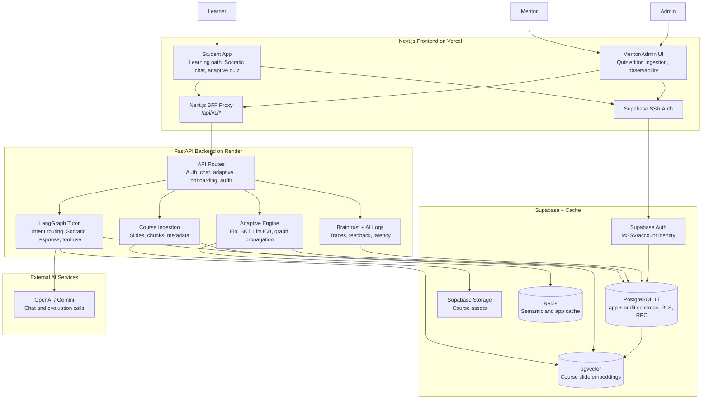
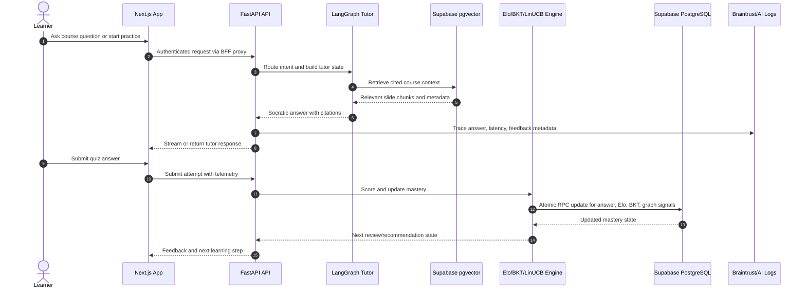
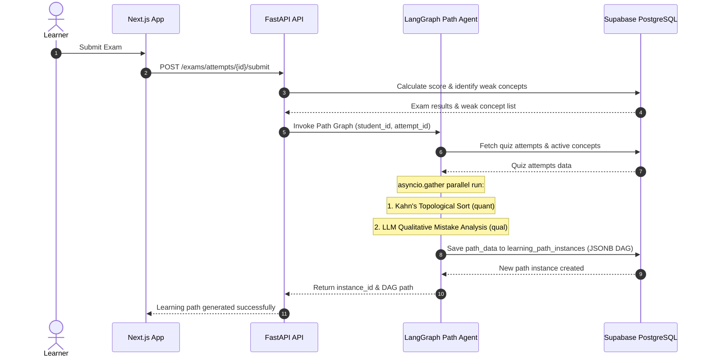
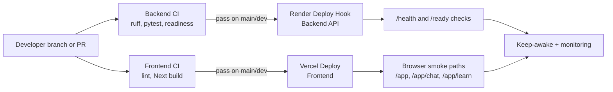

# Mentora Architecture

This document is the Demo Day architecture deliverable. The Mermaid diagrams below are the current text-first version; the polished visual diagram will be drawn from the plan in `plans/20260708-demo-day-architecture-diagram/plan.md`.

## System Overview

## Learning Loop

## Adaptive Learning Path Loop

## CI/CD and Runtime Operations

## Components

| Component | Current implementation | Role |
|---|---|---|
| Frontend | Next.js 16, React 19, Tailwind CSS 4, Zustand | Student, mentor, and admin product surfaces |
| Backend | FastAPI, Python 3.13, Pydantic v2 | API, chat, adaptive learning, auth, ingestion |
| AI tutor / Agents | LangGraph + LangChain + OpenAI/Gemini | Socratic tutoring & Socratic hints (Tutor Graph); mistake-analysis & path DAG generation (Path Graph) |
| Database | Supabase PostgreSQL 17 with RLS, app/audit schemas, RPC | User, quiz, mastery, learning path instances, audit, and learning telemetry state |
| Retrieval | Supabase `pgvector` | Course slide retrieval for cited tutor responses |
| Cache | Redis with in-memory fallback | Semantic cache and production app caching |
| Observability | Braintrust, AI logs, pytest/RAGAS evidence | Traces, feedback, latency, and evaluation evidence |

## Visual Diagram Plan

The final drawn diagram should keep the same system boundaries as the Mermaid version:

- Vercel frontend boundary: Student app, mentor/admin UI, BFF proxy, Supabase SSR auth.
- Render backend boundary: FastAPI routes, LangGraph tutor, adaptive engine, ingestion, observability.
- Supabase boundary: Auth, PostgreSQL schemas/RPC, pgvector, storage.
- External services: OpenAI/Gemini and Braintrust/AI logs.
- Three callout flows: Socratic chat with citations, adaptive quiz mastery update, CI/CD deploy path.
