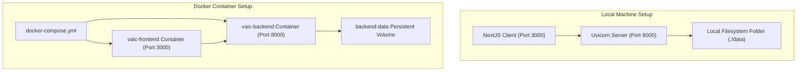

# Architecture — Deployment Guide

This document describes local, docker-compose, and sandbox deployment options.

## Setup Guidelines
- Local runs default to `./data/` directories.
- Docker builds configure health checks between containers to ensure FastAPI is fully online before Next.js routes API calls.
