# Architecture — Pluggable Module System

This document outlines how optional capability modules are scanned, validated, and loaded.

```mermaid
sequenceDiagram
    participant Main as main.py (App startup)
    participant Registry as ModuleRegistry
    participant File as modules_config.json
    participant Mod as Module Folder

    Main->>Registry: discover_modules()
    Registry->>Mod: Scan directories for module.json
    Mod-->>Registry: Returns ModuleManifests list
    Main->>Registry: is_enabled(module_id)
    Registry->>File: Read config
    File-->>Registry: Returns active flag
    
    rect rgb(20, 20, 40)
        Note over Main, Registry: If module is enabled
        Main->>Registry: load_capability(manifest)
        Registry->>Registry: validate_module(manifest)
        Note over Registry: Check Python dependencies<br/>Check environment variables
        Registry-->>Main: Returns BaseCapability Instance
    end
```

## Module Manifest Details
Each module declares its metadata in `module.json`. If requirements (e.g. `langgraph` or environment variables) are missing, the validation fails and blocks loading of that specific module, keeping the core system unaffected.
