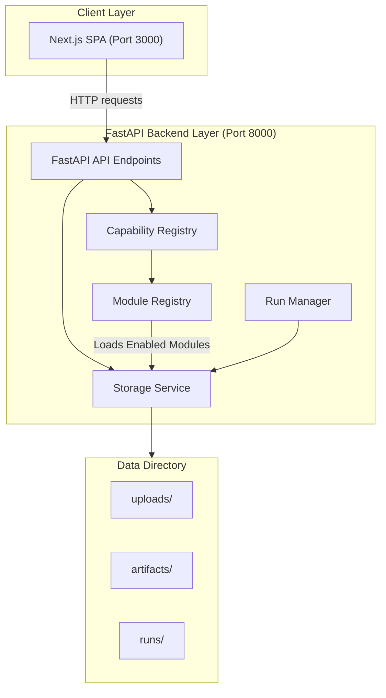

# Architecture — System Overview

This document describes the high-level architecture of the VAIC Universal Starter.

## Description
- **Client Layer**: SPA frontend in Next.js. Provides a uniform workspace dashboard without hardcoded target assumptions.
- **FastAPI Backend Layer**: Provides dynamic routers mapping enabled modular capability registry schemas.
- **Data Directory**: Simple JSON metadata local filesystem store for uploads, run histories, and output artifacts.
