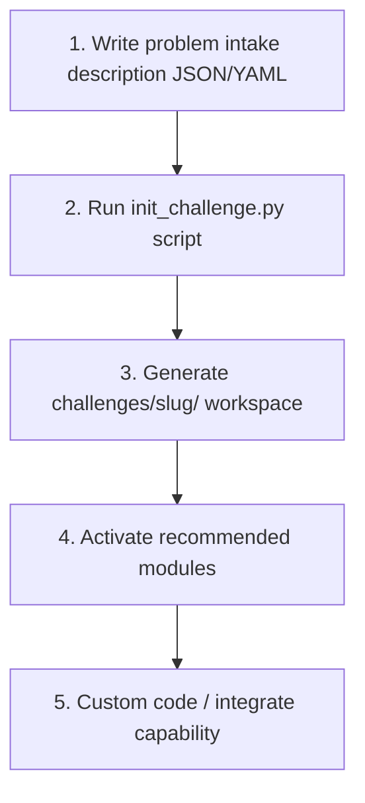

# Challenge Adaptation Guide

This guide details how to ingest competition problems and initialize standalone challenge workspaces.



## How to Initialize Workspace
Prepare your challenge intake data:
```json
{
  "title": "Predictive Sales model",
  "description": "Model monthly sales volumes forecast. Uses pandas analysis.",
  "rubrics": { "r2_score": 100 },
  "data_sources": ["sales.csv"]
}
```
Trigger generator:
```bash
python scripts/init_challenge.py "Sales Forecast" problem.json
```
This generates configuration files under `challenges/sales-forecast/` ready for custom integration.
