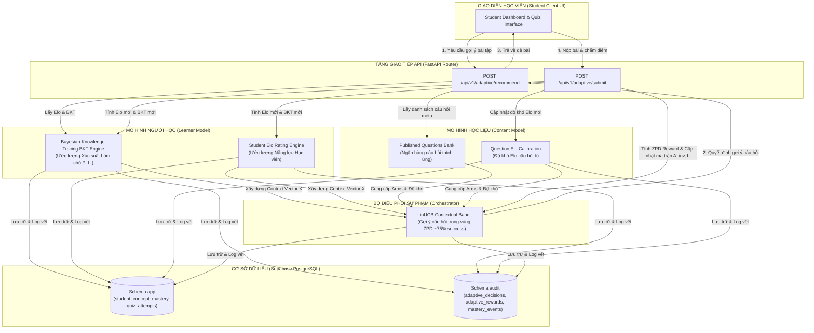
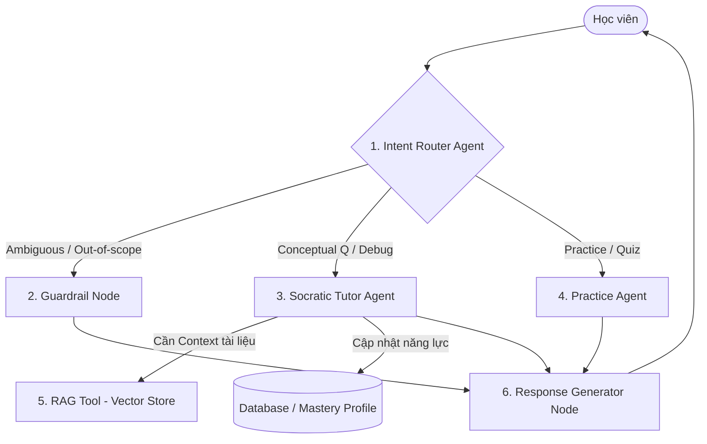
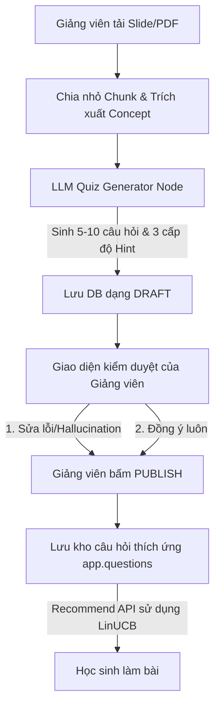

# Thiết kế Cấp cao (High-Level Design) - Hệ thống Học tập Thích ứng

Tài liệu này chứa các sơ đồ thiết kế cấp cao mô tả kiến trúc tổng quan, luồng chatbot cá nhân hóa và quy trình tự động sinh câu hỏi thích ứng lúc tải tài liệu lên hệ thống.

---

## 1. Kiến trúc Hệ thống Tổng quan (High-Level Architecture)

Sơ đồ mô tả sự tương tác giữa Client UI, API Router, các mô hình/công cụ tính toán thích ứng (Elo, BKT, LinUCB) và cơ sở dữ liệu Supabase.

---

## 2. Luồng Chatbot Thích ứng Cá nhân hóa (Chatbot Agent Flow)

Kiến trúc tương tác một Agent (Single Agent) với Dynamic System Prompt chứa Elo/BKT và bộ lọc từ khóa tích hợp (Regex + Prompt Guardrails).

---

## 3. Luồng Sinh Câu hỏi và Hints Tự động (Ingestion-Time Quiz Generation)

Quy trình xử lý bất đồng bộ khi Giảng viên upload Slide/PDF, tự động sinh trước câu hỏi dạng Draft để kiểm duyệt chất lượng và bảo toàn thuật toán Elo.

