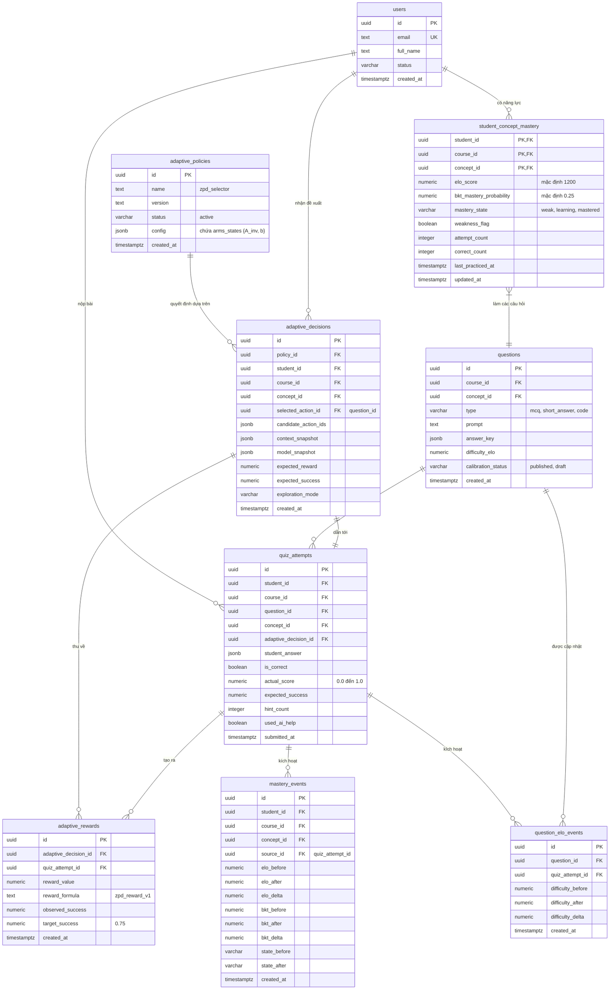

# Thiết kế Cơ sở Dữ liệu (Database Schema ERD)

Tài liệu này chứa sơ đồ thực thể liên kết (ERD) đặc tả cấu trúc của 2 Schema: `app` (chứa các bảng phục vụ runtime) và `audit` (chứa các bảng lưu trữ nhật ký mô hình phục vụ huấn luyện máy và kiểm toán).

---

## Sơ đồ Thực thể Liên kết (Entity Relationship Diagram - ERD)

