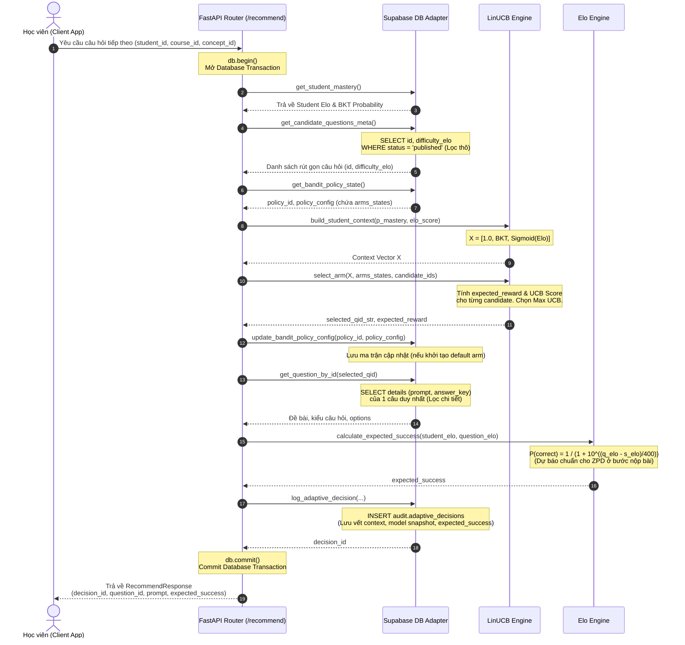
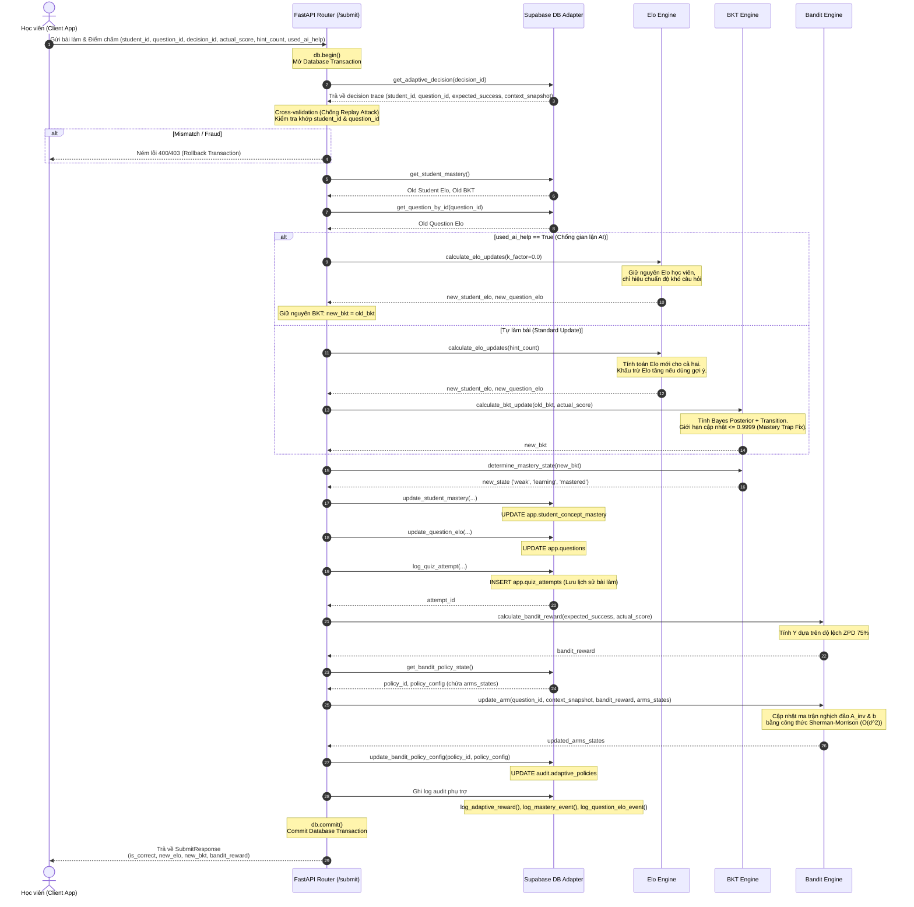

# Luồng Hoạt động Chi tiết (Detailed Sequence Flows)

Tài liệu này chứa các sơ đồ tuần tự (Sequence Diagrams) mô tả chi tiết thứ tự gọi hàm, tương tác database và logic thuật toán của 2 API chính: `/recommend` và `/submit`.

---

## 1. Luồng Gợi ý Câu hỏi thích ứng (`POST /adaptive/recommend`)

Sơ đồ mô tả quy trình LinUCB tính điểm UCB và chọn câu hỏi nằm trong vùng ZPD dựa theo context vector của học sinh.

---

## 2. Luồng Nộp bài & Hiệu chuẩn Hệ thống (`POST /adaptive/submit`)

Sơ đồ tuần tự chi tiết luồng xử lý nộp bài: Kiểm toán chéo chống Replay Attack, rẽ nhánh đóng băng Elo khi học sinh dùng AI help, cập nhật BKT và Elo câu hỏi, và cập nhật ma trận Bandit bằng công thức Sherman-Morrison.

