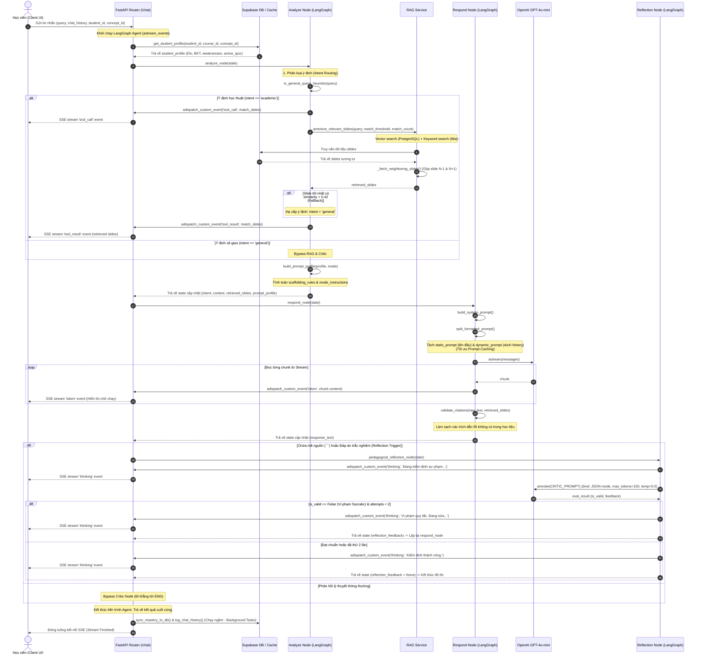

# Luồng Xử lý AI Chatbot Chi tiết (Detailed AI Chatbot Flows)

Tài liệu này mô tả chi tiết thứ tự gọi hàm, luồng dữ liệu Server-Sent Events (SSE), tối ưu hóa Prompt Caching, và logic kiểm định sư phạm Socratic của API Chatbot `/api/v1/chat`.

---

## 1. Sơ đồ tuần tự truyền phát chatbot Socratic (`POST /api/v1/chat`)

Sơ đồ mô tả luồng hoạt động truyền phát thời gian thực (real-time streaming) giữa Client UI, API Router, các node trong LangGraph Agent, OpenAI API, và Supabase DB/Cache.



---

## 2. Giải thích chi tiết các bước xử lý

### A. Phân loại ý định & Tìm kiếm RAG (Analyze Node)
1. **Lọc Heuristics**: Kiểm tra nhanh chuỗi tin nhắn của người dùng bằng Regex để phát hiện các câu chào hỏi, xã giao hoặc hỏi thông tin chatbot. Nếu khớp, bypass RAG hoàn toàn.
2. **LLM Classifier**: Dùng LLM phân loại ngữ cảnh dựa vào tin nhắn mới và lịch sử 5 lượt chat gần nhất để phát hiện hành vi chuyển đổi chủ đề (Topic Switching).
3. **Hybrid Search**: Chạy truy vấn Vector tương đồng song song với từ khóa SQL `ilike` trên Supabase Database.
4. **Context Expansion**: Tự động mở rộng học liệu lấy thêm slide kề trước ($N-1$) và kề sau ($N+1$) của top 2 slides khớp nhất để giúp học sinh có cái nhìn toàn cảnh trên giao diện.
5. **Fallback Downgrade**: Nếu slide tốt nhất có độ tương đồng `< 0.42`, hệ thống tự động hạ cấp ý định về `general` để AI tự trả lời bằng kiến thức mở rộng của nó mà không bị ép trích dẫn học liệu sai thực tế.

### B. Prompt Caching & Streaming (Respond Node)
1. **Split Prompt**: Cắt đôi System Prompt thành `static_prompt` (các luật Socratic cố định) và `dynamic_prompt` (slide RAG động và thông tin Elo của lượt chat).
2. **Prefix Matching**: Đặt `static_prompt` ở đầu và `dynamic_prompt` ở cuối danh sách tin nhắn gửi lên OpenAI API. Nhờ đó, OpenAI tự động khớp Cache cho phần tĩnh, giúp giảm thời gian phản hồi (TTFT) từ ~1.4s xuống ~250ms (nhanh gấp 6 lần).
3. **Citation Validator**: Dọn dẹp câu trả lời thô của LLM bằng cách lọc bỏ các thẻ trích dẫn bị ảo giác (không khớp với slides RAG được cung cấp).

### C. Pedagogical Reflection (Reflection Node)
1. **Critic Trigger**: Chỉ kích hoạt bộ lọc kiểm định Critic khi câu trả lời thô có chứa khối mã nguồn (` ``` `) hoặc định dạng đáp án trắc nghiệm.
2. **Critic Model**: Gọi LLM với cấu hình tối giản (JSON mode, Temperature = 0.0, Max tokens = 150) để kiểm tra xem câu trả lời có vi phạm luật Socratic (như rò rỉ mã nguồn code giải hoàn chỉnh hoặc đáp án bài tập trực tiếp) hay không.
3. **Vòng lặp sửa đổi**: Nếu vi phạm (`is_valid == false`), Node phản hồi sẽ chạy lại để sinh câu trả lời mới dựa trên nhận xét (feedback) sửa đổi của Critic (tối đa 2 lần để tránh gây trễ vô hạn).
