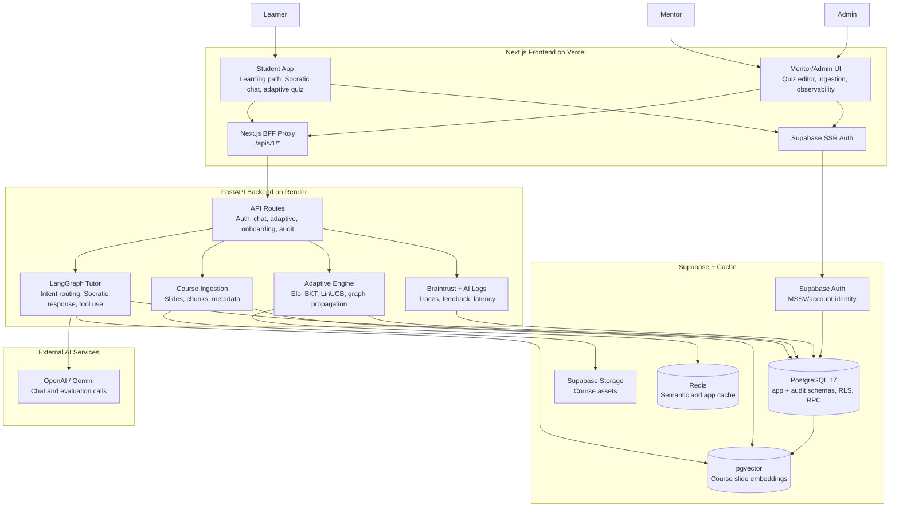
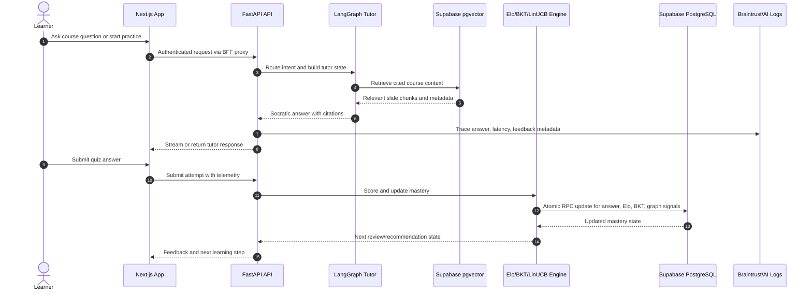
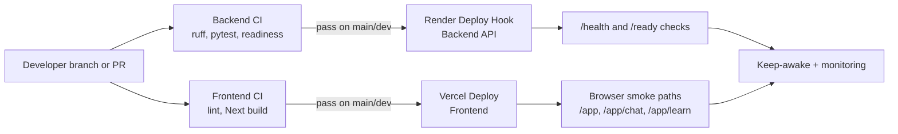

# Architecture Diagram

This file mirrors the Demo Day architecture entry point at `docs/architecture.md`. Keep both paths available because older docs and links may point here.

## System Overview

## Learning Loop

## CI/CD and Runtime Operations

