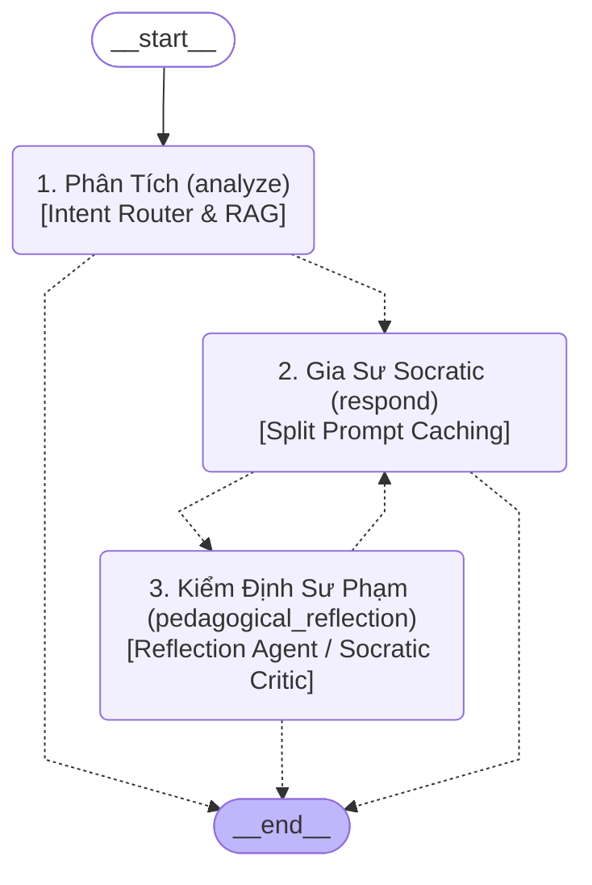

# Sơ đồ Đồ thị LangGraph Agent

Dưới đây là sơ đồ Mermaid hiển thị các Node và các Edge điều kiện của Agent.

```mermaid
---
config:
  flowchart:
    curve: linear
---
graph TD;
	__start__([<p>__start__</p>]):::first
	analyze("1. Phân Tích (analyze)<br/>[Intent Router & RAG]")
	respond("2. Gia Sư Socratic (respond)<br/>[Split Prompt Caching]")
	pedagogical_reflection("3. Kiểm Định Sư Phạm (pedagogical_reflection)<br/>[Reflection Agent / Socratic Critic]")
	__end__([<p>__end__</p>]):::last
	__start__ --> analyze;
	analyze -.-> __end__;
	analyze -.-> respond;
	pedagogical_reflection -.-> __end__;
	pedagogical_reflection -.-> respond;
	respond -.-> __end__;
	respond -.-> pedagogical_reflection;
	classDef default fill:#f2f0ff,line-height:1.2
	classDef first fill-opacity:0
	classDef last fill:#bfb6fc

```
