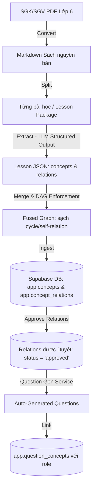

# Hướng dẫn Luồng PDF-to-Knowledge-Graph & Chuẩn bị dữ liệu sinh câu hỏi

Tài liệu này hướng dẫn chi tiết luồng xử lý dữ liệu từ file PDF sách giáo khoa/sách giáo viên sang Đồ thị tri thức (Knowledge Graph) và cách tổ chức dữ liệu trong cơ sở dữ liệu Supabase để đồng đội sử dụng làm đầu vào sinh câu hỏi trắc nghiệm/tự luận thích ứng.

---

## 1. Sơ đồ luồng hoạt động (End-to-End Pipeline)



---

## 2. Chi tiết logic từng bước xử lý

### Bước 1: Chuyển đổi PDF sang Markdown (`convert`)
*   **Mã nguồn:** [doc_converter.py](file:///c:/Users/81908/OneDrive/Máy%20tính/AI20kekeke/src/pipeline/transform/doc_converter.py) & [kg_convert_pdf_to_md.py](file:///c:/Users/81908/OneDrive/Máy%20tính/AI20kekeke/scripts/kg_convert_pdf_to_md.py)
*   **Logic:**
    *   Với file có text layer tốt (>50% trang chứa văn bản máy tính): Trích xuất trực tiếp bằng PyMuPDF (`fitz` / `pypdf`) để tiết kiệm chi phí.
    *   Với file scan (phần lớn SGK/SGV): Sử dụng OpenAI Vision API (GPT-4o-mini) render từng ảnh trang để chuyển thành Markdown trung thực.
    *   **Điểm Neo Nguồn Gốc (Provenance Anchor):** Mỗi trang được chèn thẻ `<!-- page: N -->`. Thẻ này cực kỳ quan trọng để liên kết concept/relation về đúng trang sách gốc.

### Bước 2: Tách nhỏ bài học (`split`)
*   **Mã nguồn:** [kg_split_lessons.py](file:///c:/Users/81908/OneDrive/Máy%20tính/AI20kekeke/scripts/kg_split_lessons.py)
*   **Logic:** Cắt Markdown của cả cuốn sách thành các file nhỏ hơn theo từng bài học bằng Regex nhận diện heading dạng `# Bài N`, `## Bài N` hoặc `### Bài N`. Việc chia nhỏ giúp LLM ở bước sau xử lý tốt hơn, tránh quá tải context và tăng độ chính xác của quan hệ.

### Bước 3: Trích xuất Concept & Relation bằng LLM (`extract`)
*   **Mã nguồn:** [extract_math_knowledge.py](file:///c:/Users/81908/OneDrive/Máy%20tính/AI20kekeke/src/pipeline/graphusion/extract_math_knowledge.py) (cho môn Toán) và [extract_history_geo_knowledge.py](file:///c:/Users/81908/OneDrive/Máy%20tính/AI20kekeke/src/pipeline/graphusion/extract_history_geo_knowledge.py) (cho Sử-Địa)
*   **Logic:** 
    *   Sử dụng LLM (GPT-4o hoặc Groq Llama3) đọc nội dung từng bài học, trả về cấu trúc JSON nghiêm ngặt qua Structured Outputs (hoặc JSON Mode).
    *   Trích xuất đồng thời:
        *   `concepts`: gồm mã concept `code` (kebab-case), tên `name`, mô tả `description`, lớp giới thiệu `grade` và trang nguồn `source_page`.
        *   `relations`: gồm `source` concept, `relation` (1 trong 7 loại quan hệ được hỗ trợ), `target` concept, `evidence` trích nguyên văn từ sách làm bằng chứng và `source_page`.
    *   Các loại quan hệ được hỗ trợ: `Prerequisite_of` (Tiên quyết/nhân-quả), `Used_for` (Ứng dụng), `Compare` (So sánh), `Conjunction` (Đồng thời), `Hyponym_of` (Loại-thể), `Evaluate_for` (Đánh giá), `Part_of` (Thành phần).

### Bước 4: Hợp nhất & Nạp Database (`ingest` & `DAG Enforcement`)
*   **Mã nguồn:** [ingest_math_graph_to_db.py](file:///c:/Users/81908/OneDrive/Máy%20tính/AI20kekeke/src/pipeline/graphusion/ingest_math_graph_to_db.py), [ingest_history_geo_graph_to_db.py](file:///c:/Users/81908/OneDrive/Máy%20tính/AI20kekeke/src/pipeline/graphusion/ingest_history_geo_graph_to_db.py) và [fuse_graphs.py](file:///c:/Users/81908/OneDrive/Máy%20tính/AI20kekeke/src/pipeline/graphusion/fuse_graphs.py)
*   **Logic:**
    *   Hợp nhất tất cả các file JSON của các bài học lại.
    *   **Enforce DAG:** Chạy thuật toán lọc quan hệ của [fuse_graphs.py](file:///c:/Users/81908/OneDrive/Máy%20tính/AI20kekeke/src/pipeline/graphusion/fuse_graphs.py) để loại bỏ toàn bộ các quan hệ tự liên kết (self-relation) và các quan hệ tạo nên chu kỳ lặp (cycle) để đảm bảo đồ thị là một Đồ thị có hướng không chu trình (DAG).
    *   Ghi dữ liệu vào Supabase:
        *   Upsert thông tin khóa học vào bảng `app.courses`.
        *   Ghi các concept vào bảng `app.concepts` (trạng thái mặc định: `active`).
        *   Ghi các mối quan hệ vào bảng `app.concept_relations` (trạng thái mặc định: `draft` để giáo viên/mentor duyệt).

---

## 3. Cấu trúc Schema & Cách đồng đội sử dụng để sinh câu hỏi

Để đồng đội xây dựng luồng đọc đồ thị tri thức nhằm tự động sinh câu hỏi, họ cần truy vấn và ghi nhận kết quả theo đúng các bảng sau trong schema `app`:

### A. Đọc Danh sách Concept làm Đề mục sinh câu hỏi (`app.concepts`)
Bảng này lưu trữ toàn bộ các concept/kỹ năng chi tiết của khóa học.
*   **Các cột chính cần truy vấn:**
    *   `id` (UUID): Khóa chính của concept.
    *   `course_id` (UUID): ID khóa học (Toán hoặc Sử-Địa).
    *   `code` (text): Kebab-case duy nhất của concept (ví dụ: `phep-cong-phan-so`).
    *   `name` (text): Tên tiếng Việt của concept (dùng để hiển thị hoặc đưa vào prompt cho LLM sinh câu hỏi).
    *   `description` (text): Mô tả chi tiết định nghĩa khái niệm/kỹ năng (đưa vào prompt làm ngữ cảnh lý thuyết cho LLM).
*   **Cách lấy dữ liệu:**
    ```sql
    -- Lấy tất cả các khái niệm của khóa học Toán lớp 6 (math-k1-9)
    SELECT id, code, name, description 
    FROM app.concepts 
    WHERE course_id = (SELECT id FROM app.courses WHERE code = 'math-k1-9');
    ```

### B. Đọc Cấu trúc Tiên quyết của Concept (`app.concept_relations`)
Để sinh câu hỏi theo lộ trình từ dễ đến khó (hoặc chuẩn bị bài kiểm tra lỗ hổng kiến thức), đồng đội cần biết concept nào là tiền đề của concept nào.
*   **Các cột chính cần truy vấn:**
    *   `source_concept_id` (UUID): Khái niệm tiên quyết (phải học trước).
    *   `target_concept_id` (UUID): Khái niệm nâng cao (học sau).
    *   `relation_type` (enum): Loại quan hệ. Để xây dựng DAG bài học, chỉ lọc loại `'Prerequisite_of'`.
    *   `status` (enum): Trạng thái kiểm duyệt. **Bắt buộc** lọc `status = 'approved'` để tránh lấy các quan hệ nháp do LLM sinh ra chưa được duyệt.
*   **Cách lấy dữ liệu:**
    ```sql
    -- Lấy các quan hệ tiên quyết đã được phê duyệt
    SELECT source_concept_id, target_concept_id 
    FROM app.concept_relations 
    WHERE course_id = (SELECT id FROM app.courses WHERE code = 'math-k1-9')
      AND relation_type = 'Prerequisite_of'
      AND status = 'approved';
    ```

### C. Ghi nhận Ánh xạ Câu hỏi với Concept (`app.question_concepts`)
Sau khi hệ thống sinh xong câu hỏi và lưu vào bảng `app.questions` (hoặc `app.quizzes`), đồng đội **phải** tạo bản ghi liên kết câu hỏi đó với các concept tương ứng trong bảng `app.question_concepts`. Việc này phục vụ cho thuật toán thích ứng (Elo, BKT, Bandit) cập nhật năng lực học sinh.
*   **Cấu trúc bảng `app.question_concepts`:**
    *   `question_id` (UUID): ID của câu hỏi vừa được sinh.
    *   `concept_id` (UUID): ID của concept liên quan.
    *   `role` (enum): Vai trò của concept đối với câu hỏi này. Giá trị bao gồm:
        *   `'target'`: Concept mục tiêu chính mà câu hỏi này dùng để kiểm tra (mặc định).
        *   `'prerequisite'`: Concept nền tảng cần có để giải câu hỏi này.
        *   `'supporting'`: Concept hỗ trợ giải thích.
        *   `'confounder'`: Concept gây nhiễu dễ gây nhầm lẫn cho học sinh.
*   **Cách ghi dữ liệu (Ví dụ liên kết câu hỏi với concept mục tiêu):**
    ```sql
    INSERT INTO app.question_concepts (question_id, concept_id, role)
    VALUES ('<QUESTION_UUID>', '<CONCEPT_UUID>', 'target');
    ```

---

## 4. Hướng dẫn Lệnh chạy Pipeline lớp 6

Để chuẩn bị lại hoặc cập nhật dữ liệu lớp 6 mới nhất, chạy lần lượt các bước sau từ terminal:

### Bước 1: Trích xuất và phân tích toàn bộ sách lớp 6 sang JSON
Chạy CLI pipeline chính cho Toán và Sử-Địa lớp 6 (chỉ quét các file PDF lớp 6 đang có trong thư mục `data`):
```bash
# Chạy cho môn Toán lớp 6
python scripts/kg_run_pipeline.py --subject math

# Chạy cho môn Sử-Địa lớp 6
python scripts/kg_run_pipeline.py --subject history_geo
```

### Bước 2: Nạp dữ liệu vào database Supabase (Status mặc định là draft)
Chạy script nạp các file bài học đã phân tích vào Supabase:
```bash
# Nạp dữ liệu Toán lớp 6
python src/pipeline/graphusion/ingest_math_graph_to_db.py outputs/kg_lesson_json/math/*.json

# Nạp dữ liệu Sử-Địa lớp 6
python src/pipeline/graphusion/ingest_history_geo_graph_to_db.py outputs/kg_lesson_json/history_geo/*.json
```

### Bước 3: Duyệt hàng loạt quan hệ phục vụ thử nghiệm MVP (Bulk-Approve)
Để đồng đội có ngay các quan hệ `'approved'` chạy thử nghiệm thuật toán sinh câu hỏi (không cần duyệt thủ công từng dòng trên database):
```bash
# Phê duyệt toàn bộ quan hệ đang ở trạng thái draft cho khóa học toán và sử-địa lớp 6
python scripts/kg_approve_relations.py math-k1-9 hist-geo-k6-9
```
