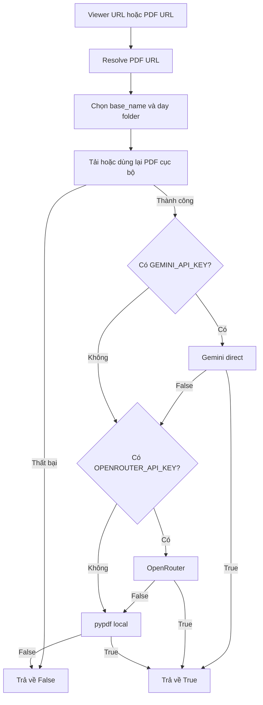

# Đặc tả tái triển khai pipeline PDF → Markdown

> **Mục đích:** Đây là tài liệu bàn giao cho AI hoặc lập trình viên khác để có thể tái triển khai logic chuyển PDF sang Markdown với hành vi tương đương code hiện tại.
>
> **Loại tài liệu:** Behavioral specification / AI implementation handoff.
>
> **Ngày đối chiếu:** 2026-07-17.
>
> **Phiên bản nguồn:** commit `a7d5eda`.

## 1. Mục tiêu

Hệ thống nhận một tài liệu PDF và tạo một file Markdown UTF-8. Việc chuyển đổi phải thử tuần tự ba backend:

1. Google Gemini trực tiếp, model `gemini-2.5-flash`.
2. OpenRouter, model `google/gemini-2.5-flash`.
3. `pypdf` chạy cục bộ để trích xuất text thô.

Backend sau chỉ được gọi khi backend trước không có API key hoặc trả về `False`.

Pipeline đầy đủ còn có thể nhận URL LMS/viewer, tìm URL PDF thật, tải PDF về máy, chọn thư mục đầu ra và sau đó mới chạy ba bước chuyển đổi trên.

## 2. Nguồn sự thật

Khi tài liệu này mâu thuẫn với code, ưu tiên code theo thứ tự:

1. `src/pipeline/transform/doc_converter.py`: ba hàm chuyển đổi.
2. `src/pipeline/lms_slide_pipeline.py`: điều phối fallback và đường dẫn đầu ra.
3. `src/pipeline/ingest/lms_fetcher.py`: tải PDF.
4. `src/pipeline/config.py`: nạp biến môi trường.

Fingerprint của nguồn tại thời điểm viết tài liệu:

| File | SHA-256 |
| --- | --- |
| `src/pipeline/transform/doc_converter.py` | `fa305c307fd276bc2e168ca7152c46e8809f1d35fba1b33279e47bfe47ab808c` |
| `src/pipeline/lms_slide_pipeline.py` | `ae0a2005571dc1754e1ed02024fdbb066d2da93dc3d8ae7b5156552cafb39ba0` |
| `src/pipeline/ingest/lms_fetcher.py` | `f89a7feb17ad59a24b6138bbd229e68bdfdaecec8d3f3a69fe6606314ca91612` |
| `src/pipeline/config.py` | `995bc7713061701e5b8ad5a878f25ec1b7c735574f4e3fe945aea339fa7086ef` |

## 3. Phạm vi

### 3.1 Bắt buộc để tái tạo logic chuyển đổi

- Nhận đường dẫn PDF cục bộ và đường dẫn Markdown đầu ra.
- Giữ nguyên prompt chuyển đổi.
- Giữ nguyên model, payload, timeout và thứ tự fallback.
- Ghi file Markdown bằng UTF-8.
- Mỗi hàm trả về `True` khi được xem là thành công và `False` khi thất bại.
- Không ném lỗi của provider ra ngoài; lỗi được log và chuyển thành `False`.

### 3.2 Tùy chọn nếu cần tái tạo toàn bộ LMS pipeline

- Nhận URL viewer hoặc URL PDF trực tiếp.
- Tải PDF với Firefox-like headers.
- Tự đặt tên file và thư mục `day-xx`.
- Đọc API key từ `src/pipeline/.env` hoặc environment hiện tại.

### 3.3 Không thuộc logic này

- Không chunk Markdown.
- Không tạo embedding.
- Không nạp dữ liệu vào Supabase/vector database.
- Không validate chất lượng Markdown.
- Không kiểm tra file tải xuống có MIME/type hoặc magic bytes của PDF.
- Không có retry provider ngoài vòng chờ trạng thái Gemini File API.

## 4. Sơ đồ xử lý



## 5. Runtime và dependency

Python mục tiêu của repository là `>=3.13`. Các dependency trực tiếp của pipeline:

| Package | Vai trò | Bắt buộc khi nào |
| --- | --- | --- |
| `google-genai` | Gemini SDK và PDF Part | Khi dùng Gemini trực tiếp |
| `requests` | OpenRouter HTTP và tải PDF | Khi dùng OpenRouter hoặc LMS downloader |
| `pypdf` | Fallback trích xuất text local | Fallback cuối |
| `python-dotenv` | Nạp `.env` | Không tuyệt đối bắt buộc vì config có parser thủ công |

Lệnh tương đương tài liệu hiện tại:

```powershell
uv run --with requests --with pypdf --with google-genai --with python-dotenv python src/pipeline/lms_slide_pipeline.py "PDF_OR_VIEWER_URL" "OPTIONAL_NAME"
```

Biến môi trường:

```dotenv
URL=
GEMINI_API_KEY=
OPENROUTER_API_KEY=
```

Không được ghi API key trực tiếp vào code hoặc commit file `.env`.

## 6. Prompt chuẩn — phải giữ nguyên nếu cần kết quả tương đương

Cả Gemini trực tiếp và OpenRouter sử dụng chính xác prompt sau:

```text
Convert this document to clean, well-formatted Markdown.
Requirements:
- Preserve all content, structure, and formatting
- Convert tables to markdown table format
- Maintain heading hierarchy (# ## ### etc)
- Preserve lists, code blocks, and quotes
- Extract text from images/slides if present
- Keep formatting consistent and readable. Maintain the original language of the slides.
Output only the markdown content without any preamble or explanation.
```

Không thêm system prompt, preamble, schema hay Markdown fence bao quanh kết quả.

## 7. Hợp đồng hàm chuyển đổi

### 7.1 Gemini trực tiếp

Chữ ký logic:

```python
convert_pdf_to_markdown_gemini(pdf_path, md_path, api_key) -> bool
```

#### Input

| Tham số | Kiểu kỳ vọng | Ý nghĩa |
| --- | --- | --- |
| `pdf_path` | path-like/string | PDF cục bộ cần gửi tới Gemini |
| `md_path` | path-like/string | File Markdown sẽ bị tạo mới hoặc ghi đè |
| `api_key` | string | Gemini API key |

#### Thuật toán chính xác

1. Import lazy `genai` từ `google` và `types` từ `google.genai`.
2. Nếu import thất bại, in thông báo và trả `False`.
3. Tạo client bằng `genai.Client(api_key=api_key)`.
4. Lấy kích thước PDF bằng `os.path.getsize(pdf_path)`.
5. Đặt `use_file_api = file_size > 20 * 1024 * 1024`.
   - Đúng 20 MiB không dùng File API.
   - Chỉ file lớn hơn 20 MiB mới dùng File API.
6. Dùng prompt chuẩn ở mục 6.
7. Nếu file lớn hơn 20 MiB:
   1. Upload bằng `client.files.upload(file=pdf_path)`.
   2. Đặt `max_wait = 300`, `elapsed = 0`.
   3. Khi state là `PROCESSING` và `elapsed < 300`:
      - ngủ 2 giây;
      - gọi lại `client.files.get(name=myfile.name)`;
      - tăng `elapsed` thêm 2.
   4. Nếu state là `FAILED`, phát sinh lỗi để đi vào nhánh `False`.
   5. Tạo `content = [prompt, myfile]`.
8. Nếu file không lớn hơn 20 MiB:
   1. Đọc toàn bộ PDF bằng binary mode.
   2. Tạo PDF part bằng `types.Part.from_bytes(data=file_bytes, mime_type="application/pdf")`.
   3. Tạo `content = [prompt, pdf_part]`.
9. Gọi:

   ```python
   client.models.generate_content(
       model="gemini-2.5-flash",
       contents=content,
   )
   ```

10. Nếu response có attribute `text`, lấy `response.text`; nếu không, dùng chuỗi rỗng.
11. Mở `md_path` với mode `"w"`, encoding `"utf-8"`, rồi ghi trực tiếp `markdown_text`.
12. Trả `True`.
13. Mọi exception từ bước tạo client trở đi đều được bắt bằng `except Exception`, log lỗi và trả `False`.

#### Hành vi cần lưu ý để làm y hệt

- Hàm không tự tạo thư mục cha của `md_path`.
- Hàm không kiểm tra `pdf_path` tồn tại trước `getsize`; lỗi được catch và trả `False`.
- Response không có `.text` vẫn tạo file rỗng và trả `True`.
- Sau 300 giây, nếu file vẫn ở state `PROCESSING` nhưng không phải `FAILED`, code hiện tại vẫn tiếp tục gọi generate.
- File đã upload lên Gemini File API không được xóa sau khi dùng.
- Không có timeout explicit cho `generate_content`.

### 7.2 OpenRouter fallback

Chữ ký logic:

```python
convert_pdf_to_markdown_openrouter(pdf_path, md_path, api_key) -> bool
```

#### Thuật toán chính xác

1. Import `base64` và `requests` bên trong hàm nhưng trước khối `try` xử lý request.
   Vì vậy, nếu thiếu package `requests`, `ImportError` sẽ thoát ra ngoài thay vì được đổi thành `False`.
2. Nếu `pdf_path` không tồn tại, log và trả `False`.
3. Đọc toàn bộ PDF ở binary mode.
4. Base64 encode toàn bộ bytes và decode thành chuỗi UTF-8.
5. Tạo data URL:

   ```text
   data:application/pdf;base64,<BASE64_DATA>
   ```

6. Gửi `POST` tới:

   ```text
   https://openrouter.ai/api/v1/chat/completions
   ```

7. Headers phải có:

   ```json
   {
     "Authorization": "Bearer <OPENROUTER_API_KEY>",
     "Content-Type": "application/json",
     "HTTP-Referer": "https://github.com/VinUni-AI-Cohort-2",
     "X-Title": "LMS Slide Pipeline"
   }
   ```

8. Payload có cấu trúc:

   ```json
   {
     "model": "google/gemini-2.5-flash",
     "messages": [
       {
         "role": "user",
         "content": [
           {
             "type": "text",
             "text": "<PROMPT_CHUẨN_Ở_MỤC_6>"
           },
           {
             "type": "file",
             "file": {
               "filename": "<BASENAME_CỦA_PDF_PATH>",
               "file_data": "data:application/pdf;base64,<BASE64_DATA>"
             }
           }
         ]
       }
     ]
   }
   ```

9. Gọi `requests.post(url, headers=headers, json=payload, timeout=120)`.
10. Nếu HTTP status khác `200`, log status và toàn bộ response text, sau đó trả `False`.
11. Parse JSON bằng `response.json()`.
12. Nếu top-level JSON có key `error`, log và trả `False`.
13. Response chỉ hợp lệ khi:
    - có key `choices`;
    - `choices` có ít nhất một phần tử.
14. Lấy:

    ```python
    message = choices[0].get("message", {})
    markdown_text = message.get("content", "")
    ```

15. Nếu `markdown_text` falsy/rỗng, log response và trả `False`.
16. Nếu có nội dung, ghi trực tiếp vào `md_path` bằng mode `"w"`, encoding `"utf-8"`.
17. Trả `True`.
18. Mọi exception sau khi đã import thành công, trong quá trình đọc/gọi/parse/ghi file, đều bị catch, log và chuyển thành `False`.

#### Hành vi cần lưu ý để làm y hệt

- Toàn bộ PDF được giữ trong RAM, sau đó tăng kích thước khi base64 encode.
- Không chia file, không upload riêng và không retry.
- Chỉ status `200` được coi là thành công.
- Không strip Markdown fence nếu provider trả về fence.
- Không tự tạo thư mục cha của `md_path`.

### 7.3 `pypdf` local fallback

Chữ ký logic:

```python
convert_pdf_to_markdown_pypdf(pdf_path, md_path) -> bool
```

#### Thuật toán chính xác

1. Import lazy `pypdf`.
2. Nếu import thất bại, log và trả `False`.
3. Nếu PDF không tồn tại, log và trả `False`.
4. Tạo `reader = pypdf.PdfReader(pdf_path)`.
5. Tạo list `markdown_content`.
6. Tạo title bằng:

   ```python
   title = os.path.basename(pdf_path).replace(".pdf", "")
   ```

   Phép `replace` phân biệt hoa thường và xóa mọi occurrence của chuỗi lowercase `.pdf`, không chỉ suffix cuối.

7. Thêm header:

   ```markdown
   # <title>
   ```

8. Thêm timestamp local theo format `%Y-%m-%d %H:%M:%S`:

   ```markdown
   _Tài liệu được trích xuất tự động bằng pypdf vào: <YYYY-MM-DD HH:MM:SS>_

   ---
   ```

9. Duyệt `reader.pages` theo thứ tự, đánh số từ 1.
10. Với mỗi trang, gọi `page.extract_text()`.
11. Thêm heading:

    ```markdown
    ## Page <page_num>
    ```

12. Nếu text tồn tại và `text.strip()` không rỗng, ghi `text.strip()`.
13. Nếu không, ghi chính xác:

    ```markdown
    _[Trang này không có văn bản hoặc chỉ chứa hình ảnh]_
    ```

14. Sau mỗi trang, thêm horizontal rule `---`.
15. Ghép toàn bộ list bằng `"\n".join(markdown_content)`.
16. Ghi vào `md_path` với mode `"w"`, encoding `"utf-8"`.
17. Trả `True`; mọi exception khi đọc/trích xuất/ghi file trả `False`.

#### Đặc tính chất lượng

- Đây không phải OCR.
- Trang chỉ chứa ảnh thường cho kết quả placeholder.
- Bảng, cột, heading và reading order có thể không được giữ chính xác.
- Metadata timestamp khiến output không deterministic giữa hai lần chạy.

## 8. Điều phối fallback

Pseudocode tương đương `run_pipeline` sau khi đã có PDF cục bộ:

```python
if download_pdf(pdf_url, pdf_path):
    if GEMINI_API_KEY is not None and GEMINI_API_KEY.strip() != "":
        if convert_pdf_to_markdown_gemini(pdf_path, md_path, GEMINI_API_KEY):
            return True

    if OPENROUTER_API_KEY is not None and OPENROUTER_API_KEY.strip() != "":
        if convert_pdf_to_markdown_openrouter(pdf_path, md_path, OPENROUTER_API_KEY):
            return True

    return convert_pdf_to_markdown_pypdf(pdf_path, md_path)

return False
```

Bảng quyết định:

| Gemini key | Gemini result | OpenRouter key | OpenRouter result | Backend tạo output |
| --- | --- | --- | --- | --- |
| Có | `True` | Bất kỳ | Không gọi | Gemini |
| Có | `False` | Có | `True` | OpenRouter |
| Có | `False` | Có | `False` | pypdf |
| Có | `False` | Không | — | pypdf |
| Không | — | Có | `True` | OpenRouter |
| Không | — | Có | `False` | pypdf |
| Không | — | Không | — | pypdf |

Một key chỉ chứa whitespace được coi như không có key.

## 9. Logic URL, tên file và thư mục của LMS pipeline

Phần này chỉ cần tái tạo nếu muốn hành vi đầy đủ từ URL tới Markdown.

### 9.1 Resolve URL PDF

1. Parse `viewer_url` bằng `urllib.parse.urlparse`.
2. Parse query bằng `urllib.parse.parse_qs`.
3. Nếu query có key `file`, dùng giá trị đầu tiên `query_params["file"][0]` làm `pdf_url`.
4. Nếu không, coi toàn bộ `viewer_url` là URL PDF trực tiếp.

### 9.2 Chọn `base_name`

Nếu không truyền `custom_filename`:

1. Parse path của `pdf_url`.
2. Split path bằng `/` và lấy segment cuối.
3. URL-decode segment bằng `urllib.parse.unquote`.
4. Nếu tên kết thúc bằng `.pdf` không phân biệt hoa thường, bỏ đúng 4 ký tự cuối.
5. Nếu không kết thúc bằng `.pdf`, dùng `slide_download`.

Nếu có `custom_filename`:

```python
base_name = custom_filename.replace(".pdf", "").replace(".md", "")
```

Hai phép replace trên phân biệt hoa thường và thay mọi occurrence, không chỉ suffix.

### 9.3 Chọn `day_str`

1. Mặc định: `day-` cộng ngày hiện tại của tháng bằng `datetime.now().strftime("%d")`.
2. Lowercase và trim `base_name`.
3. Chỉ thử parse khi chuỗi bắt đầu bằng `day`.
4. Split bằng whitespace.
5. Nếu có token thứ hai, giữ lại tất cả chữ số trong token đó.
6. Nếu có chữ số, chuyển sang integer rồi format 2 chữ số:

   ```python
   day_str = f"day-{int(day_num):02d}"
   ```

Ví dụ:

| `base_name` | Kết quả |
| --- | --- |
| `Day 10 Data Pipeline` | `day-10` |
| `day 7 slides` | `day-07` |
| `Day 07-C401` | `day-07` |
| `Day10 Slides` | Ngày hiện tại, vì không có token thứ hai |
| `Lecture Day 10` | Ngày hiện tại, vì không bắt đầu bằng `day` |

### 9.4 Đường dẫn đầu ra

`script_dir` là thư mục chứa `lms_slide_pipeline.py`. Pipeline tạo:

```text
<script_dir>/data/pdf/<day_str>/<base_name>.pdf
<script_dir>/data/md/<day_str>/<base_name>.md
```

Cả hai thư mục được tạo bằng `os.makedirs(..., exist_ok=True)` trước khi download/convert.

## 10. Logic tải PDF

Chữ ký:

```python
download_pdf(pdf_url, output_path) -> bool
```

### 10.1 Cache local

Nếu `output_path` đã tồn tại và có size lớn hơn 0, bỏ qua network và trả `True` ngay. Không xác minh nội dung cũ có thực sự là PDF.

### 10.2 HTTP request

Method: `GET`; `stream=True`; timeout 30 giây; chunk size 8192 bytes.

Headers chính xác:

```json
{
  "User-Agent": "Mozilla/5.0 (Windows NT 10.0; Win64; x64; rv:120.0) Gecko/20100101 Firefox/120.0",
  "Accept": "text/html,application/xhtml+xml,application/xml;q=0.9,image/avif,image/webp,*/*;q=0.8",
  "Accept-Language": "en-US,en;q=0.5",
  "Accept-Encoding": "gzip, deflate, br",
  "Referer": "https://aithucchien.vinuni.edu.vn/",
  "Connection": "keep-alive"
}
```

### 10.3 Kết quả

- HTTP `200`: ghi từng chunk không rỗng vào `output_path`, trả `True`.
- HTTP `401`: báo token JWT hết hạn, trả `False`.
- Status khác: log status và 300 ký tự đầu của response text, trả `False`.
- Mọi exception: log và trả `False`.

Downloader không gọi `raise_for_status`, không retry và không xóa partial file nếu lỗi xảy ra sau khi bắt đầu ghi.

## 11. Nạp cấu hình

`config.py` tìm `.env` trong chính thư mục chứa `config.py`, không phải `.env` ở repository root.

Nếu file tồn tại:

1. Thử import `load_dotenv` và gọi `load_dotenv(env_path)`.
2. Nếu thiếu `python-dotenv`, đọc từng dòng UTF-8 thủ công.
3. Parser thủ công:
   - trim dòng;
   - bỏ dòng bắt đầu bằng `#`;
   - chỉ nhận dòng có `=`;
   - split đúng một lần tại dấu `=` đầu tiên;
   - trim key/value rồi gán vào `os.environ`;
   - không xử lý quote, escape, `export`, multiline hoặc inline comment;
   - việc gán thủ công có thể ghi đè environment đã tồn tại, trong khi `load_dotenv` mặc định không override.

Cuối cùng đọc ba biến bằng `os.getenv`: `URL`, `GEMINI_API_KEY`, `OPENROUTER_API_KEY`.

## 12. CLI contract hiện tại

Entry point là `src/pipeline/lms_slide_pipeline.py`.

| Đối số | Ý nghĩa |
| --- | --- |
| Không có | Dùng `URL` từ config; nếu thiếu thì prompt qua stdin |
| Đối số 1 | Override URL |
| Đối số 2 | Custom base filename |
| Đối số 3+ | Bị bỏ qua |

Nếu URL vẫn rỗng sau prompt, process thoát code `1`.

Nếu có URL, script gọi `run_pipeline(url, name)` nhưng không chuyển boolean trả về thành process exit code. Vì vậy conversion thất bại sau khi đã có URL vẫn có thể kết thúc process với exit code `0`. Đây là hành vi hiện tại cần biết khi tái tạo y hệt.

## 13. Hợp đồng output

### Gemini/OpenRouter

- Ghi nguyên văn text do model/provider trả về.
- Không thêm title, timestamp hoặc metadata.
- Không strip khoảng trắng.
- Không bỏ code fence.
- Ghi đè file cùng tên.
- Encoding UTF-8.

### pypdf

Output có cấu trúc tổng quát:

```markdown
# <PDF_BASENAME_WITHOUT_LOWERCASE_.pdf>

_Tài liệu được trích xuất tự động bằng pypdf vào: <TIMESTAMP>_

---

## Page 1

<EXTRACTED_TEXT_OR_PLACEHOLDER>

---

## Page 2

<EXTRACTED_TEXT_OR_PLACEHOLDER>

---
```

Do cách tạo list và `"\n".join(...)`, số dòng trống phải được xác nhận bằng golden test nếu cần byte-for-byte equivalence.

## 14. Error và logging contract

- Các hàm dùng `print`, không dùng logging framework.
- Thành công bắt đầu bằng `[+]`.
- Đang xử lý hoặc chuyển fallback bắt đầu bằng `[*]`.
- Lỗi/cảnh báo bắt đầu bằng `[!]`.
- Lỗi provider được nuốt và biểu diễn bằng boolean `False`.
- Không có exception class riêng.
- Không có structured log, metric hoặc trace ID.
- `google-genai` thiếu được Gemini converter bắt và đổi thành `False`.
- `pypdf` thiếu được local converter bắt và đổi thành `False`.
- `requests` thiếu không được OpenRouter converter bắt vì import nằm ngoài khối `try`.
- `requests` trong downloader được import ở module scope; nếu thiếu dependency thì toàn module pipeline không import được.

Để tương đương về chức năng, text log có thể khác nhẹ. Để tương đương tuyệt đối, sao chép nguyên văn log từ source code.

## 15. Các quirk phải giữ nếu yêu cầu là “y chang”

Một AI triển khai lại không được tự ý sửa các điểm sau trong chế độ compatibility:

1. Fallback luôn theo thứ tự Gemini → OpenRouter → pypdf.
2. Ngưỡng File API là `>` 20 MiB, không phải `>=`.
3. Gemini response rỗng/mất `.text` vẫn có thể trả `True` và tạo file rỗng.
4. OpenRouter response rỗng phải trả `False`.
5. OpenRouter chỉ chấp nhận HTTP 200.
6. OpenRouter base64 toàn bộ file trong RAM.
7. `pypdf` thêm timestamp local và heading tiếng Anh `Page`.
8. `pypdf` chỉ bỏ chuỗi lowercase `.pdf` trong basename.
9. Converter không tự tạo parent directory; orchestrator chịu trách nhiệm tạo.
10. Existing PDF size > 0 được tin cậy và download bị bỏ qua.
11. Downloader không validate `Content-Type`.
12. CLI không phản ánh conversion failure qua exit code.
13. Tên `Day10` không được parser nhận dạng như `Day 10`.
14. Không hậu xử lý Markdown từ hai provider AI.
15. Thiếu `requests` có thể làm import/call thất bại bằng exception thay vì fallback sạch.

Nếu muốn sửa các điểm trên, phải gọi đó là phiên bản cải tiến, không phải bản tái tạo y hệt.

## 16. Pseudocode đầy đủ cho AI triển khai

```text
INPUT: viewer_url, optional custom_filename

parse viewer_url
if query has "file":
    pdf_url = first value of query["file"]
else:
    pdf_url = viewer_url

if custom_filename is absent:
    base_name = decoded final path segment of pdf_url
    if base_name endswith .pdf case-insensitively:
        remove final 4 characters
    else:
        base_name = "slide_download"
else:
    base_name = custom_filename.replace(".pdf", "").replace(".md", "")

day_str = "day-" + current local day formatted with 2 digits
if trimmed lowercase base_name begins with "day":
    split by whitespace
    if second token exists:
        collect every digit in second token
        if at least one digit:
            day_str = "day-" + integer formatted with 2 digits

create PDF and MD output directories
pdf_path = PDF directory + base_name + ".pdf"
md_path = MD directory + base_name + ".md"

if download_pdf(pdf_url, pdf_path) is False:
    return False

if trimmed GEMINI_API_KEY is non-empty:
    if Gemini converter returns True:
        return True

if trimmed OPENROUTER_API_KEY is non-empty:
    if OpenRouter converter returns True:
        return True

return pypdf converter result
```

## 17. Acceptance criteria cho bản tái triển khai

AI hoặc lập trình viên chỉ được tuyên bố hoàn tất khi các trường hợp sau được kiểm chứng:

| ID | Trường hợp | Kết quả bắt buộc |
| --- | --- | --- |
| AC-01 | PDF nhỏ hơn hoặc bằng 20 MiB, Gemini thành công | Dùng inline PDF Part, tạo MD, không gọi fallback |
| AC-02 | PDF lớn hơn 20 MiB, Gemini thành công | Dùng Gemini File API và poll mỗi 2 giây |
| AC-03 | Thiếu Gemini key, OpenRouter thành công | Không gọi Gemini; OpenRouter tạo MD |
| AC-04 | Gemini lỗi, OpenRouter thành công | Gọi đúng thứ tự; không gọi pypdf |
| AC-05 | Cả hai AI provider lỗi/không có key | pypdf tạo MD theo từng page |
| AC-06 | Trang PDF không có extracted text | Ghi placeholder tiếng Việt chính xác |
| AC-07 | OpenRouter trả status khác 200 | Trả `False` và cho phép fallback |
| AC-08 | OpenRouter trả `choices=[]` hoặc content rỗng | Trả `False` |
| AC-09 | PDF output đã tồn tại và size > 0 | Không download lại |
| AC-10 | Viewer URL có `?file=` | Download URL ở giá trị `file` đầu tiên |
| AC-11 | Tên `Day 7 Slides.pdf` | Output nằm trong `day-07` |
| AC-12 | Không có URL ở config và stdin | Process exit code 1 |

### 17.1 Test doubles nên dùng

- Mock `genai.Client` để xác nhận inline/File API branch và model name.
- Mock `requests.post` để xác nhận OpenRouter headers, payload và timeout 120.
- Mock `requests.get` để xác nhận downloader headers, stream và timeout 30.
- Tạo PDF fixture có một trang text và một trang rỗng cho pypdf.
- Freeze time khi so sánh golden output của pypdf.
- Spy ba converter để xác nhận fallback short-circuit.

### 17.2 Bằng chứng hoàn tất tối thiểu

- Unit test của từng provider adapter.
- Unit test bảng fallback.
- Golden test output pypdf.
- Integration smoke test với một PDF nhỏ.
- Không log hoặc commit API key.

## 18. Hướng dẫn ngắn dành cho AI nhận bàn giao

Có thể đưa nguyên văn chỉ dẫn sau cho AI khác:

```text
Hãy tái triển khai pipeline PDF → Markdown theo tài liệu này. Không thay đổi model,
prompt, ngưỡng 20 MiB, payload OpenRouter, format pypdf hoặc thứ tự fallback.
Tách ba provider thành ba hàm trả bool và một orchestrator short-circuit theo thứ tự
Gemini → OpenRouter → pypdf. Mọi lỗi provider phải được chuyển thành False để backend
sau có thể chạy. Trước khi kết luận hoàn tất, viết test cho toàn bộ AC-01 đến AC-12.
Nếu muốn sửa quirk, hãy đặt vào chế độ mới; chế độ compatibility phải giữ hành vi cũ.
```

## 19. Checklist bàn giao

- [ ] Có `doc_converter` với đủ ba hàm.
- [ ] Có orchestrator giữ đúng thứ tự fallback.
- [ ] Prompt giống hệt mục 6.
- [ ] Gemini dùng đúng hai nhánh theo ngưỡng 20 MiB.
- [ ] OpenRouter dùng đúng endpoint, headers, payload và timeout.
- [ ] pypdf sinh đúng title/timestamp/page separator/placeholder.
- [ ] Parent output directories được tạo trước khi gọi converter.
- [ ] API keys chỉ đến từ environment hoặc secret manager.
- [ ] Các acceptance criteria đã được test.
- [ ] Đã ghi rõ đây là compatibility implementation hay improved implementation.
