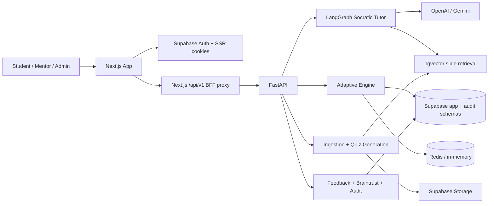
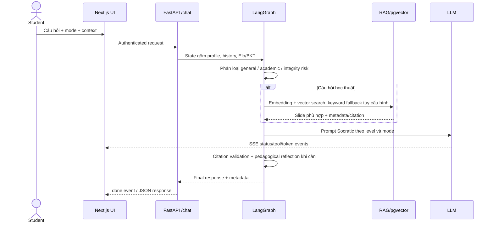

# EduGap — Phân tích và tài liệu tổng quan dự án

> Cập nhật từ codebase ngày 2026-07-12. Tài liệu này mô tả trạng thái thực thi trên nhánh hiện tại, đồng thời phân biệt phần vận hành bằng dữ liệu thật với phần demo/fallback.

## 1. Dự án này là gì?

EduGap là nền tảng gia sư AI cá nhân hóa cho lớp học đại học hoặc cohort học AI quy mô lớn. Sản phẩm kết hợp ba ý tưởng chính:

1. **Gia sư Socratic có căn cứ:** trả lời từ học liệu chính thức, đưa gợi ý thay vì làm hộ và gắn nguồn slide.
2. **Luyện tập thích ứng:** chọn câu hỏi gần “vùng phát triển gần nhất” (ZPD) của từng học viên, với mục tiêu xác suất trả lời đúng khoảng 70–75%.
3. **Theo dõi năng lực theo thời gian:** kết hợp Elo, Bayesian Knowledge Tracing (BKT), quên kiến thức, đồ thị khái niệm và contextual bandit để cập nhật hồ sơ mastery.

Đây không chỉ là chatbot. Codebase đã có frontend cho học viên/mentor/admin, backend API, pipeline nạp tài liệu, ngân hàng câu hỏi, database transaction, RBAC, audit, observability và bộ đánh giá thuật toán.

## 2. Quy mô và công nghệ

Repository có khoảng 1.499 file được `rg` nhận diện, trong đó phần mã thực thi chính gồm 151 file Python, 132 TSX, 81 TypeScript và 32 SQL migration. Kho tài liệu/nghiên cứu chiếm tỷ trọng lớn.

| Lớp | Công nghệ | Vai trò |
| --- | --- | --- |
| Web | Next.js 16, React 19, TypeScript 5.9, Tailwind CSS 4, Zustand | Giao diện học viên, mentor, BTC/admin và BFF |
| API | FastAPI, Python 3.13, Pydantic v2 | Auth, chat, adaptive, onboarding, ingestion, review, audit |
| AI agent | LangGraph, LangChain, OpenAI/Gemini | Phân loại intent, RAG, sinh phản hồi và kiểm định Socratic |
| Dữ liệu | Supabase PostgreSQL 17, pgvector, RLS, RPC | Dữ liệu nghiệp vụ, vector search, transaction và phân quyền |
| Cá nhân hóa | Elo, BKT, LinUCB, forgetting/stability, graph propagation | Chọn bài và cập nhật mastery |
| Cache | Redis, fallback in-memory | Cache mastery, retrieval và embedding |
| Quan sát | Braintrust, timing spans, feedback/audit logs | Latency, lỗi, chất lượng AI và review queue |
| Triển khai | Vercel-style frontend, Render Docker backend/Redis, Supabase | Hạ tầng production/staging |

## 3. Kiến trúc tổng thể

Kiến trúc là một **modular monolith hai runtime**:

- Next.js chịu trách nhiệm UI, session browser/SSR và proxy cùng-origin `/api/v1/*`.
- FastAPI gom các module nghiệp vụ nhưng tách service rõ theo auth, agent, RAG, adaptive, ingestion và observability.
- Supabase là ranh giới dữ liệu trung tâm: Auth, PostgreSQL, RPC, RLS, pgvector và Storage.
- Redis là lớp tối ưu, không phải nguồn dữ liệu chuẩn.

## 4. Cách hệ thống hoạt động

### 4.1 Đăng nhập, phân quyền và onboarding

1. Người dùng đăng nhập qua Supabase email/password.
2. Frontend lưu trạng thái phiên trong Zustand và dùng Supabase SSR/cookie để duy trì session.
3. Request nghiệp vụ đi qua Next.js BFF rồi chuyển Bearer token tới FastAPI.
4. Backend ưu tiên kiểm JWT cục bộ bằng JWKS; nếu không thể thì gọi Supabase Auth `get_user`.
5. Role được đọc từ `app.user_roles`/`app.roles`. Live mode fail-closed: UUID thô, fake token và role store lỗi đều không được âm thầm cho qua.
6. Student chưa hoàn tất onboarding phải làm diagnostic từ ngân hàng câu hỏi. Kết quả tạo baseline Elo/BKT và hồ sơ học tập trước khi mở workspace.

Role/persona hiện có:

- `student`: học, luyện tập, skill graph, AI chat, profile.
- `mentor`/`teacher`: class insights, ingestion, quiz editor/review, RAG review, chat, profile.
- `btc`: Braintrust observability, cohort heatmap, chat, profile.
- `admin`/`dev`: có thể chuyển giữa cả ba persona.

### 4.2 Luồng Socratic RAG chat

Các tối ưu đáng chú ý:

- Câu chào hỏi hoặc trường hợp đơn giản có fast path để bỏ qua RAG/LLM thừa.
- Prompt tách phần tĩnh và động để tăng khả năng prompt caching.
- Retrieval ưu tiên vector RPC; keyword search, global fallback và slide lân cận được điều khiển bằng cấu hình.
- Cache áp dụng cho retrieval, embedding, mã concept và hồ sơ mastery.
- Citation validator loại citation không khớp slide đã lấy.
- Reflection node chỉ kích hoạt mạnh khi có dấu hiệu rò code/đáp án, tối đa hai vòng sửa để giới hạn latency.
- Chat hỗ trợ contract legacy và `agent-chat.v1`, truyền SSE gồm status, thinking, tool call/result, token và done.

### 4.3 Luồng quiz thích ứng

#### Chọn câu hỏi

1. Đọc mastery hiện tại của student theo course/concept: Elo, BKT, trạng thái và stability.
2. Lấy các câu hỏi `published`, loại câu đã làm hoặc được frontend truyền trong `excluded_question_ids`.
3. Sắp ứng viên theo độ gần xác suất đúng 0,75 để xử lý tie khi cold start.
4. Tạo context LinUCB gồm bias, BKT và Elo đã chuẩn hóa.
5. Tính UCB cho từng “arm” (câu hỏi), chọn arm tốt nhất và ghi `audit.adaptive_decisions`.
6. Trả về câu hỏi cùng `decision_id`; diagnostics chi tiết chỉ mở cho admin/dev.

#### Nộp câu trả lời

1. Backend lấy lại `decision_id`, đối chiếu student/question để chống giả mạo và replay.
2. Backend tự chấm MCQ, short answer hoặc numeric; không tin `is_correct` do client gửi.
3. Số hint/AI help được đối chiếu với log server.
4. Gọi PostgreSQL RPC `app.submit_attempt_v3` để cập nhật nguyên tử attempt, Elo, BKT, mastery và audit.
5. Nếu làm đúng có dùng hint, phần Elo tăng bị giảm; dùng AI help có thể đóng băng tăng trưởng mastery theo guardrail.
6. Reward được đưa vào LinUCB; cập nhật ma trận dùng Sherman–Morrison với độ phức tạp O(d²).
7. Hiệu chuẩn câu hỏi được đẩy sang `calibration_outbox`; graph propagation chạy nền và cache mastery được xóa/cập nhật.
8. Frontend cập nhật ELO counter, feedback, lịch sử và tải câu tiếp theo; khi backend adaptive không sẵn sàng có thể rơi về bộ quiz tĩnh được đánh dấu `static-demo`.

### 4.4 Ingestion và vòng đời nội dung

1. Mentor upload PDF/tài liệu kèm metadata.
2. File được lưu ở Supabase Storage; background task tải và tách nội dung theo slide.
3. OpenAI embeddings được tạo và upsert vào kho slide/vector.
4. Graphusion có thể trích concept, quan hệ ứng viên, hợp nhất entity và ép graph thành DAG.
5. LLM tạo MCQ và ba tầng Socratic hint từ slide.
6. Câu hỏi đi qua trạng thái draft/review/published/rejected; mentor có màn HITL để sửa nội dung và duyệt.
7. RAG audit cho phép thử truy vấn, xem chunk/citation và ghi feedback/evaluation dataset.

## 5. Các nhóm chức năng

### Cho học viên

- Landing, login/signup, auth gate và onboarding diagnostic.
- Lộ trình học 28 ngày, điều hướng theo ngày/phase/concept.
- Mastery seed/soil, skill garden, hồ sơ kiểu RPG, ELO/history/streak/XP.
- Quiz thích ứng theo ZPD, MCQ/short answer/numeric, hint ladder, AI coach sidebar.
- Socratic AI chat với 5 mode: Explain, Step-by-step hint, Debug code, Practice, Review submission.
- Citation card, slide viewer, knowledge graph và concept detail.
- Feedback helpful/unhelpful, báo lỗi đáp án/citation, survey trước/sau quiz.
- Practice garden, kỹ năng yếu và gợi ý hành động tiếp theo.

### Cho mentor/giảng viên

- Class insights: phân bố mastery, kỹ năng yếu, học viên cần can thiệp, attempt log.
- Upload học liệu, xem chunks, quản lý concept relation/knowledge graph.
- Sinh quiz từ tài liệu, chỉnh sửa câu hỏi, hint và trạng thái xuất bản.
- HITL quiz review và quy trình xử lý các case học viên báo sai.
- RAG/AI response review: lọc truy vấn chất lượng thấp, feedback và ghi chú xử lý.

### Cho BTC/admin/dev

- Braintrust dashboard: overview, agents, scores, errors, usage và review queue.
- Cohort heatmap.
- Audit adaptive decisions/rewards, concept rules và evaluation datasets.
- RBAC và khả năng chuyển persona dành cho admin/dev.

### Cho vận hành và nghiên cứu

- `/health`, `/ready`, request ID, timing metadata và dependency health.
- Docker/Render config, CI/CD docs và smoke script.
- Mô phỏng/đánh giá Elo, BKT, bandit, forgetting, graph propagation và concurrency.
- Bitemporal mastery để truy vấn/điều chỉnh trạng thái tại một thời điểm lịch sử.
- Braintrust traces, AI logs, feedback store và PostHog/Vercel analytics phía frontend.

## 6. Mô hình dữ liệu chính

Database tách hai schema có chủ đích:

- `app`: dữ liệu vận hành — users/roles, courses, concepts, materials/chunks, questions/hints, attempts, chat, feedback, mastery, memories, onboarding và quiz error cases.
- `audit`: dữ liệu quyết định mô hình — policies, bandit arms, adaptive decisions/rewards, BKT parameters, mastery events và question Elo events.

Các cấu trúc nổi bật:

- `student_concept_mastery`: snapshot mastery hiện tại.
- `student_mastery_bitemporal`: lịch sử valid-time/system-time và sửa retroactive.
- `question_concepts` + `concept_relations`: câu hỏi đa kỹ năng và graph tiên quyết/liên quan.
- `adaptive_decisions` + `adaptive_rewards`: giải thích vì sao hệ thống chọn một câu hỏi và kết quả sau đó.
- `calibration_outbox`: tách cập nhật hiệu chuẩn khỏi transaction nóng.
- `student_memories`: facts dài hạn phục vụ cá nhân hóa chat.
- `quiz_error_cases` + `quiz_error_reports`: gom nhiều báo cáo học viên thành case mentor xử lý.

RLS được bật trên phần lớn bảng; backend dùng secret key server-only, còn frontend/SSR chỉ dùng publishable key.

## 7. Điểm nổi bật

1. **Adaptive thật, không chỉ gắn nhãn AI:** selection, scoring, update và audit đều hiện diện trong code và SQL RPC.
2. **Kết hợp nhiều mô hình có vai trò khác nhau:** Elo đo năng lực/độ khó, BKT đo mastery, LinUCB chọn nội dung, forgetting quản lý suy giảm, graph propagation chia sẻ tín hiệu giữa concept.
3. **Transaction và concurrency được quan tâm:** atomic RPC v3, replay protection, outbox, cache invalidation và benchmark đồng thời.
4. **Academic integrity nằm trong kiến trúc:** prompt rules, hint discount, AI-help signal, heuristic risk detection và reflection loop.
5. **RAG có kiểm soát nguồn:** metadata filter, pgvector, optional hybrid fallback, citation validation và giao diện audit.
6. **Quan sát được quyết định AI:** Braintrust span, latency breakdown, adaptive decision/reward log và review queue.
7. **HITL cho nội dung:** mentor duyệt quiz, sửa câu hỏi và xử lý báo lỗi thay vì để pipeline AI tự xuất bản hoàn toàn.
8. **Thiết kế dữ liệu giàu tính nghiên cứu:** bitemporal mastery, multi-skill question, contextual bandit state và evaluation scripts.
9. **UX có bản sắc:** Sapia tactile design, Sofi mascot, seed/soil/skill garden và ELO animation biến tín hiệu thuật toán thành mô hình dễ hiểu.

## 8. Trạng thái thực tế và giới hạn

### Đã có đường chạy production

- Supabase Auth/JWT/RBAC và Next.js BFF.
- Adaptive recommend/submit với server grading và RPC v3.
- Streaming Socratic chat, RAG, citation và feedback.
- Onboarding diagnostic và mastery seed.
- Material ingestion, quiz generation/review và quiz error workflow.
- Braintrust backend proxy, health/readiness và Redis/in-memory abstraction.

### Còn demo/fallback hoặc đang hoàn thiện

- Practice flow có quiz manifest tĩnh và `static-demo` fallback khi adaptive API thiếu dữ liệu/lỗi.
- Class insights có thể dùng mock fallback khi API lỗi; đây là điểm dễ che khuất sự cố dữ liệu thật.
- Ingestion, quiz editor, quiz error cases và BTC heatmap có dataset demo khi `NEXT_PUBLIC_DEMO_MODE=true`.
- Knowledge graph có quan hệ fallback từ manifest; không phải mọi cạnh đều đến từ Supabase.
- Một số profile chart/gợi ý hoạt động được sinh phía client thay vì hoàn toàn từ telemetry thật.
- Pipeline/config còn dấu vết scaffolding cũ: `settings.yaml` mặc định SQLite/Chroma trong khi runtime chính dùng Supabase/pgvector.
- `pyproject.toml` vẫn có description placeholder; `requirements.txt` và `pyproject.toml` chưa hoàn toàn đồng nhất phiên bản.
- Một số tài liệu cũ mô tả submit flow trước RPC v3; nên coi code và migration mới nhất là nguồn chuẩn.

## 9. Chất lượng và bằng chứng

- Codebase khai báo 253 test case Python, phủ adaptive, auth/RBAC, chat stream, RAG, onboarding, material, quiz review/error, contract và security behavior.
- TypeScript hiện tại vượt qua `pnpm exec tsc --noEmit` trong lần kiểm tra 2026-07-12.
- Pytest không chạy được trong phiên kiểm tra này do lỗi I/O capture giữa môi trường Windows/Anaconda và pytest (`ValueError: I/O operation on closed file`), trước khi test được collect; đây chưa phải bằng chứng test logic thất bại.
- Evidence đã lưu ghi nhận chatbot-focused suite: 79 passed, coverage toàn `src` khoảng 43%; coverage tốt hơn ở contract/timing/fast path/citation/analyze, thấp hơn ở toàn hệ thống.
- Báo cáo thuật toán lưu sẵn ghi nhận: Elo adaptive giảm RMSE so với random, BKT AUC 0,8386, graph propagation nhanh, RPC v3 tăng throughput khoảng 1,6 lần so với v2 và thử nghiệm ASSISTments/EdNet đạt kết quả dương.
- Latency AI lịch sử vẫn là điểm cần cải thiện: academic cold/long-history chậm hơn đáng kể so với general path.

## 10. Bản đồ thư mục

| Đường dẫn | Nội dung |
| --- | --- |
| `frontend/app/` | Route, layout, BFF, auth/onboarding/app shell |
| `frontend/components/` | UI learning, quiz, chat, profile, mentor/admin |
| `frontend/lib/` | API client, auth, adaptive, chat contracts, quiz/onboarding data |
| `src/main.py` | FastAPI bootstrap, middleware, health/readiness |
| `src/api/` | Endpoint theo domain |
| `src/agents/` | LangGraph state, graph và nodes |
| `src/services/adaptive/` | Elo, BKT, LinUCB, forgetting, graph, DB adapter |
| `src/services/rag.py` | Retrieval, hybrid fallback, neighbor expansion, cache |
| `src/pipeline/` | PDF/slide ingestion và Graphusion |
| `config/` | Settings, thuật toán, prompt được tách YAML |
| `db/supabase/migrations/` | Schema, RLS, RPC và thay đổi dữ liệu |
| `tests/` | Unit/integration/contract tests |
| `eval/` | Mô phỏng và báo cáo thuật toán |
| `ADR/` | Quyết định kiến trúc |
| `docs/` | Product, engineering, research, domain knowledge, diagram |

## 11. Điểm vào quan trọng cho người mới

Đọc theo thứ tự sau để hiểu nhanh:

1. `docs/product/project-overview-pdr.md` — mục tiêu và persona.
2. `frontend/app/components/quiz-app-shell.tsx` — app shell và auth/onboarding gate.
3. `frontend/app/hooks/useQuizSession.ts` — state machine quiz phía client.
4. `src/main.py` và `src/api/routes.py` — bootstrap và API surface.
5. `src/api/adaptive_routes.py` — recommend/submit/mastery/graph/insights.
6. `src/agents/graph.py` và `src/agents/nodes/` — luồng AI tutor.
7. `src/services/rag.py` — retrieval và cache.
8. `src/services/adaptive/` — thuật toán cá nhân hóa.
9. `db/supabase/migrations/20260611_initial_schema.sql` và migration RPC v3 mới nhất — dữ liệu/transaction.
10. `docs/evaluation.md` — bằng chứng chất lượng và giới hạn hiện tại.

## 12. Kết luận

EduGap là một adaptive learning platform có chiều sâu kỹ thuật và nghiên cứu, lấy **vòng lặp học → quan sát → cập nhật mastery → chọn hoạt động tiếp theo** làm trung tâm. Điểm khác biệt mạnh nhất so với chatbot giáo dục thông thường là quyết định học tập có trạng thái, có transaction, có audit và có sự tham gia của mentor.

Mức độ hoàn thiện hiện phù hợp với một MVP/Demo Day đã tiến gần production: lõi auth, chat, adaptive và dữ liệu đã có đường chạy thật; phần cần tập trung tiếp là loại bỏ silent mock fallback, thống nhất cấu hình/tài liệu, tăng coverage toàn hệ thống, giảm latency chat và hoàn tất dữ liệu thật end-to-end cho dashboard mentor/BTC.
