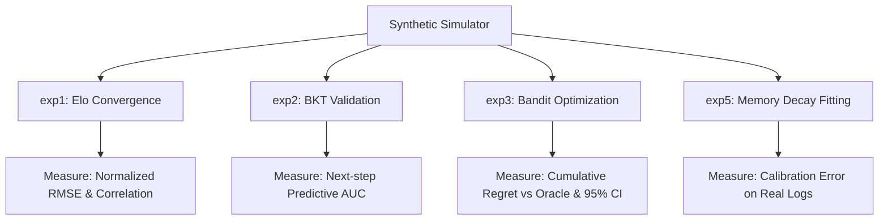

# Phương pháp luận và Quy trình Đánh giá Động cơ Thích ứng (Adaptive Engine Evaluation Methodology)

Tài liệu này đặc tả chi tiết quy trình, thuật toán và các tiêu chuẩn kiểm thử khoa học đối với **Động cơ Thích ứng Mentora (Mentora Adaptive Engine)**. Bộ đánh giá (`eval/` suite) được thiết kế nhằm chứng minh tính chính xác thống kê, tốc độ hội tụ và độ ổn định của các thuật toán trước khi triển khai lên môi trường chạy thực tế (Production).

---

## 1. Kiến trúc Bộ giả lập Học sinh (Synthetic Student Simulator)

Để đánh giá thuật toán mà không phụ thuộc vào dữ liệu người dùng thật ở giai đoạn đầu, hệ thống sử dụng một mô hình giả lập học sinh dựa trên các nghiên cứu của EDM (Educational Data Mining):

### A. Khởi tạo thuộc tính ẩn (Latent Attributes)
*   **Năng lực học sinh ($\theta$)**: Được sinh ngẫu nhiên theo phân phối chuẩn:
    $$\theta \sim \mathcal{N}(\mu=1500, \sigma=200)$$
*   **Độ khó câu hỏi ($d$)**: Được sinh ngẫu nhiên theo phân phối chuẩn:
    $$d \sim \mathcal{N}(\mu=1500, \sigma=200)$$
*   **Tham số BKT thực tế ẩn**: Mỗi học sinh giả lập có một ma trận trạng thái thông thạo thực tế ẩn (True Mastery State) đối với mỗi Concept, được cập nhật theo luật chuyển đổi Markov.

### B. Sinh số ngẫu nhiên chuẩn hóa (Seeded Box-Muller)
Hệ thống sử dụng thuật toán Box-Muller để sinh số ngẫu nhiên theo phân phối chuẩn từ phân phối đều. Nhằm tránh lỗi số học `ValueError: math domain error` khi $u_1 = 0$, ta áp dụng cơ chế bảo vệ:
$$u_1 = \max(\text{random.random()}, 10^{-12})$$

### C. Kỹ thuật Common Random Numbers (CRN)
Để so sánh một cách công bằng giữa các chính sách gợi ý khác nhau (ví dụ: LinUCB vs. Random vs. Greedy):
*   Hệ thống đồng bộ hóa hạt giống ngẫu nhiên (seed) ở cấp độ từng học sinh và từng lượt làm bài.
*   Khi học sinh gặp cùng một câu hỏi ở các nhánh thử nghiệm khác nhau, kết quả làm bài (đúng/sai) sẽ được quyết định bởi cùng một coin-flip ngẫu nhiên. Việc này giúp triệt tiêu phương sai môi trường, cô lập hoàn toàn sự khác biệt giữa các chính sách gợi ý.

---

## 2. Chi tiết các Thí nghiệm Đánh giá (Evaluation Experiments)

### 2.1 Thí nghiệm 1 (exp1): Sự hội tụ Elo (Elo Convergence)
*   **Mục tiêu**: Chứng minh năng lực Elo ước lượng ($\hat{\theta}$) hội tụ về năng lực thực tế ẩn ($\theta$) của học sinh.
*   **Phương pháp đo lường**:
    *   **RMSE chuẩn hóa**: Tính sai số Root Mean Squared Error giữa $\hat{\theta}$ và $\theta$ sau $N$ lượt làm bài. Ngưỡng chấp nhận nghiêm ngặt của hệ thống là:
        $$\text{RMSE} < 100 \text{ (hoặc } < 0.5 \cdot \sigma\text{)}$$
    *   **Độ tương quan (Identifiability)**: Tính hệ số tương quan Pearson giữa độ khó câu hỏi ước lượng bởi hệ thống và độ khó thực tế của câu hỏi giả lập. Yêu cầu tương quan phải đạt $> 0.85$.

### 2.2 Thí nghiệm 2 (exp2): Đánh giá độ chính xác BKT (BKT Accuracy)
*   **Mục tiêu**: Kiểm chứng khả năng bám đuổi độ thông thạo của thuật toán Bayesian Knowledge Tracing.
*   **Phương pháp đo lường khoa học (Next-step Predictive AUC)**:
    *   Hệ thống tránh việc đánh giá vòng lặp (circular evaluation - đo AUC so với trạng thái master ẩn). Thay vào đó, hệ thống đo lường khả năng dự đoán tương lai trên nhãn quan sát thực tế.
    *   **Nhãn thực tế ($y_{\text{true}}$)**: Câu trả lời thực tế của học sinh tại bước tiếp theo $t+1$ ($1$ = Đúng, $0$ = Sai).
    *   **Dự đoán ($y_{\text{pred}}$)**: Xác suất trả lời đúng được tính từ trạng thái BKT hiện tại ở bước $t$:
        $$P(\text{Correct}_{t+1}) = P(L_t) \cdot (1 - S) + (1 - P(L_t)) \cdot G$$
        *(Trong đó $P(L_t)$ là xác suất Master hiện tại, $S$ là Slip rate, $G$ là Guess rate).*
    *   AUC được tính dựa trên tập dữ liệu kiểm thử của các học sinh nằm ngoài tập huấn luyện (held-out student dataset).

### 2.3 Thí nghiệm 3 (exp3): So sánh tối ưu hóa Bandit & Vùng ZPD
*   **Mục tiêu**: Chứng minh chính sách LinUCB gợi ý câu hỏi trúng vùng phát triển gần (ZPD) của học sinh nhanh hơn và hiệu quả hơn các chính sách Random hoặc Greedy.
*   **Phương pháp đo lường (Cumulative Regret vs. Oracle)**:
    *   Hệ thống so sánh LinUCB với một **Oracle Selector** (mô hình lý tưởng biết trước năng lực của học sinh và luôn chọn câu hỏi có xác suất thành công thực tế sát mức mục tiêu $0.75$ nhất).
    *   Regret tại bước $t$ được tính bằng:
        $$\text{Regret}_t = P(\text{success})_{\text{Oracle}} - P(\text{success})_{\text{LinUCB}}$$
    *   Biểu đồ chính là đồ thị **Cumulative Regret** dồn tích $\sum_{i=1}^t \text{Regret}_i$ qua các bước. Thuật toán học tốt khi đường cong Cumulative Regret tiệm cận dạng Logarithmic (đi ngang/bão hòa).
*   **Yêu cầu Thống kê**:
    *   Thí nghiệm phải được chạy qua ít nhất **30 seeds ngẫu nhiên** khác nhau.
    *   Vẽ đồ thị hiển thị giá trị trung bình (Mean) kèm dải bóng mờ sai số đại diện cho **Khoảng tin cậy 95% (95% Confidence Interval)**.
    *   Chạy kiểm định giả thuyết thống kê (t-test) để xác minh độ lệch có ý nghĩa thống kê ($p < 0.05$).

### 2.4 Thí nghiệm 5 (exp5): Hiệu chuẩn thuật toán Quên (Memory Forgetting Calibration)
*   **Mục tiêu**: Hiệu chuẩn các tham số của thuật toán suy giảm trí nhớ dựa trên dữ liệu thực tế.
*   **Phương pháp**:
    *   Trích xuất log ôn tập lịch sử từ bảng dữ liệu `quiz_attempts` (bao gồm khoảng cách thời gian từ lần làm bài trước $\Delta t$ và kết quả đúng/sai).
    *   Áp dụng thuật toán tối ưu hóa (như Levenberg-Marquardt) để khớp dữ liệu thực tế với đường cong suy giảm:
        $$P_{\text{recall}} = 2^{-\Delta t / S}$$
    *   Báo cáo chỉ số **Calibration Error** (Sai số hiệu chuẩn) để đảm bảo mô hình lý thuyết phản ánh đúng tốc độ quên thực tế của học viên.

---

## 3. Rào chắn đồng bộ Production (CI/CD Equivalence Gates)

Nhằm ngăn chặn trôi lệch thuật toán (algorithm drift) giữa cài đặt Python (dùng để nghiên cứu/đánh giá) và SQL RPC (chạy đồng bộ trên Production):

### A. Equivalence Test Case
Trước khi mã nguồn được phép đẩy lên nhánh chính (main/production), một kịch bản kiểm thử tự động [test_adaptive_equivalence.py](file:///d:/CODE/AITHUCCHIEN/PROJECT/C2-App-125/tests/test_api/test_adaptive_equivalence.py) sẽ được kích hoạt:
1. Sinh ngẫu nhiên 100 vector ngữ cảnh học sinh (Elo, BKT, Hint, AI help).
2. Chạy tính toán song song qua module Python (`elo.py`, `bkt.py`) và gọi RPC DB SQL (`submit_attempt_v3`).
3. Xác minh tính đồng nhất tuyệt đối:
   $$\text{Elo}_{\text{Python}} == \text{Elo}_{\text{SQL}} \pm 10^{-5}$$
   $$\text{BKT}_{\text{Python}} == \text{BKT}_{\text{SQL}} \pm 10^{-5}$$

### B. Quy tắc cập nhật khi thay đổi thuật toán
*   **Thuật toán Lan truyền đồ thị & Bandit**: Nằm hoàn toàn trong file Python chuẩn. Nếu thay đổi thuật toán, chỉ cần chỉnh sửa file Python. Background worker ở Production sẽ tự động cập nhật mà không cần sửa DB.
*   **Thuật toán Elo & BKT**: Nằm ở cả Python và SQL. Nếu thay đổi, nhà phát triển bắt buộc phải cập nhật đồng thời cả file Python và file Migration SQL. Lệnh build CI/CD sẽ bị chặn (Block) nếu phát hiện bất kỳ sự sai lệch kết quả nào giữa hai bên.
