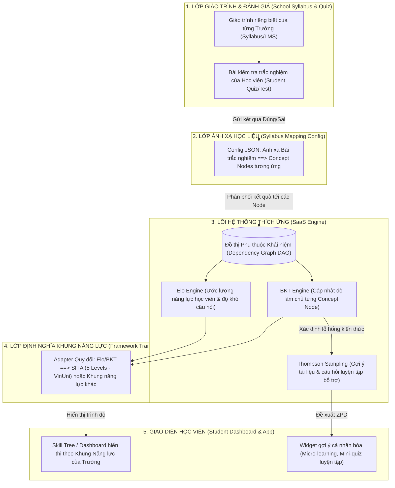
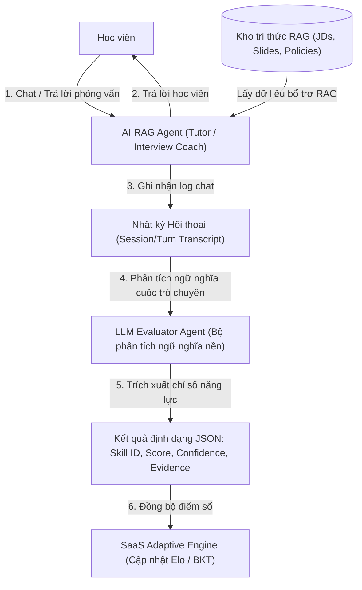
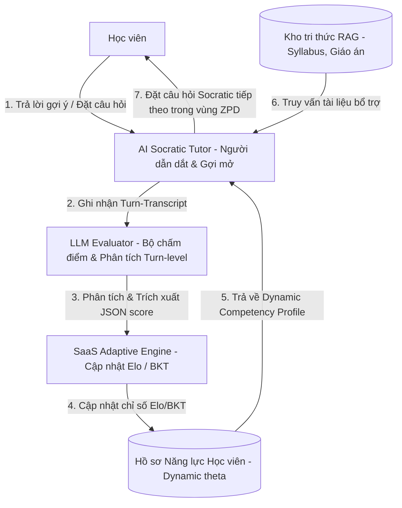

# Nghiên cứu Kiến trúc Adaptive Learning và Các chiến lược giải quyết Cold Start trong EdTech

Tài liệu này tổng hợp các nghiên cứu thực tế về cách các nền tảng EdTech lớn trên thế giới triển khai hệ thống học tập thích ứng (Adaptive Learning) và cách giải quyết bài toán khởi đầu lạnh (Cold Start).

---

## 1. Các hệ thống EdTech hiện tại triển khai Adaptive Learning như thế nào?

Kiến trúc cốt lõi của một hệ thống Adaptive Learning hiện đại dựa trên mô hình cấu trúc 3 phần (Tripartite Structure):

### Content Model (Sơ đồ tri thức)

Hệ thống không quản lý bài học theo kiểu tuần tự (Bài 1, Bài 2) mà phân rã toàn bộ giáo trình thành một mạng lưới đồ thị tri thức (Knowledge Graph) với các điểm nút là các vi kiến thức (Knowledge Components / Prerequisite Skills) chi tiết.

* *Ví dụ:* Để giải được bài toán "Phương trình bậc hai", đồ thị sẽ định nghĩa các kỹ năng tiên quyết (Prerequisites) là "Phép khai căn", "Phân tích đa thức thành nhân tử".

### Learner Model (Mô hình người học)

Hệ thống liên tục thu thập dữ liệu nhật ký học tập (Log data) của học sinh như: đáp án đúng hoặc sai, thời gian hoàn thành câu hỏi, số lần nhấn nút gợi ý (Hint), khoảng thời gian do dự (Hesitation interval). Dữ liệu này được sử dụng để phân tích:

* **IRT (Item Response Theory):** Để chấm điểm độ khó của câu hỏi và năng lực hiện tại (Latent trait) của học sinh ngay lập tức.
* **DKT (Deep Knowledge Tracing) và GNN:** Sử dụng mạng thần kinh tuần hoàn để dự đoán xác suất học sinh làm đúng câu tiếp theo dựa trên hành vi của các học sinh khác.

### Instructional Model (Bộ điều phối sư phạm)

Đây là bộ phận đưa ra quyết định nội dung tiếp theo học sinh cần thực hiện:

* Nếu học viên gặp hiện tượng nỗ lực hiệu quả (Productive Struggle), đang cố gắng giải một câu hơi quá sức nhưng có tiến bộ, hệ thống sẽ kích hoạt AI Tutor (ví dụ: GPT-4) để đóng vai trò người hướng dẫn. AI Tutor chỉ gợi ý định hướng (Scaffolding), đặt câu hỏi mở chứ không đưa ra sẵn đáp án.

---

## 2. Cách các hệ thống EdTech xử lý bài toán Cold Start

Bài toán khởi đầu lạnh (Cold Start) xảy ra khi có học viên mới (hệ thống chưa biết năng lực ở mức nào) hoặc câu hỏi mới, khóa học mới (chưa có dữ liệu tương tác để biết câu hỏi đó khó hay dễ). Các nền tảng EdTech giải quyết việc này qua 4 chiến lược thực tế:

### Chiến lược 1: Bài kiểm tra chẩn đoán động (Dynamic Diagnostic Test)

Các nền tảng (như iPrep PAL hay Knewton) bắt đầu bằng một bài kiểm tra đầu vào ngắn (từ 5 đến 10 câu).

* **Ứng dụng kiểm thử thích ứng (CAT - Computerized Adaptive Testing):** Bài kiểm tra áp dụng thuật toán IRT. Câu số 1 ở mức trung bình. Nếu học viên làm đúng, câu số 2 sẽ tự động nâng lên mức khó hơn. Nếu làm sai, câu số 2 giảm xuống mức dễ hơn.
* Thuật toán sẽ dừng lại ngay khi đạt được khoảng tin cậy thống kê (Confidence interval) về trình độ của học viên, giúp định vị năng lực người học chỉ trong vài phút thay vì bắt học viên làm bài thi dài.

### Chiến lược 2: Gom cụm dữ liệu người dùng (User Profiling / Heuristics)

Khi chưa có lịch sử làm bài nào, hệ thống sử dụng các bộ lọc dựa trên thông tin tĩnh (Meta-information):

* Thu thập thông tin qua khảo sát nhập môn (Onboarding): Độ tuổi, lớp học, mục tiêu học tập, hoặc mức độ tự tin tự đánh giá.
* Hệ thống áp dụng lọc cộng tác (Collaborative Filtering) ở mức cơ bản để tạm thời xếp học sinh mới vào một nhóm học sinh tương đồng (Persona) đã có sẵn dữ liệu và sử dụng lộ trình khuyến nghị của nhóm đó.

### Chiến lược 3: Ứng dụng học tương phản (Contrastive Learning) cho câu hỏi mới

Khi một giáo viên tạo ra một bộ câu hỏi mới (Item Cold Start), hệ thống chưa thể biết độ khó thực tế của nó thông qua IRT vì chưa có tương tác.

* **Giải pháp:** Hệ thống sử dụng các mô hình ngôn ngữ lớn để vector hóa nội dung câu hỏi mới (Embedding), sau đó dùng thuật toán học tương phản (Contrastive Learning) để so sánh và tìm câu hỏi tương đồng trong ngân hàng câu hỏi cũ. Nếu câu hỏi mới có cấu trúc và ngữ nghĩa giống 90% một câu hỏi cũ đã được xếp hạng khó, hệ thống sẽ tạm thời gán mức độ khó tương đương để đem đi thử nghiệm.

### Chiến lược 4: Chuyển đổi từ luật (Heuristics) sang học máy (Machine Learning)

Trong giai đoạn đầu của một tính năng hoặc một người dùng mới, hệ thống chạy dựa trên các luật cố định (Rule-based) được thiết kế từ kinh nghiệm sư phạm của chuyên gia (Ví dụ: Sai 3 câu liên tiếp cùng một dạng thì tự động mở video lý thuyết nền).

Khi dữ liệu tương tác dày lên (thường là sau khoảng 20 đến 50 tương tác), hệ thống sẽ chuyển quyền quyết định sang các thuật toán tối ưu như Contextual Bandit hoặc DKT để cá nhân hóa sâu hơn.

---

## 3. Case Study thực tế: MobiFone Ôn Luyện và Bài học thiết kế cho Hệ thống

Qua phân tích thực tế sản phẩm "MobiFone Ôn Luyện" tại thị trường Việt Nam, chúng ta rút ra các bài học thiết kế quan trọng phục vụ cho cả Frontend (UI/UX) và Backend (Engine) của hệ thống học tập thích ứng này:

### Trực quan hóa Năng lực Đa chiều (Radar Chart)
* **Thực tế:** Sử dụng biểu đồ Radar (mạng nhện) để ánh xạ đồng thời nhiều đơn vị kiến thức (Concepts) trong một môn học, giúp học sinh nhận diện ngay lập tức điểm mạnh (phình to) và điểm yếu (lõm xuống) trong đồ thị tri thức.
* **Bài học áp dụng:**
  * **Backend:** Cung cấp API `GET /api/v1/analytics/radar-chart` trả về điểm Elo năng lực ($\theta$) hoặc xác suất làm chủ $P(L_t)$ của học sinh theo từng Concept ID.
  * **Frontend:** Tích hợp thư viện đồ thị (như Recharts/Chart.js) để trực quan hóa dữ liệu này trên trang Dashboard cá nhân.

### Nhật ký Học tập Dạng Bản đồ Nhiệt (Learning Heatmap)
* **Thực tế:** Sử dụng sơ đồ lưới dạng GitHub Contribution Graph để hiển thị mức độ chuyên cần và số lượng tương tác hàng ngày của học sinh.
* **Bài học áp dụng:**
  * **Backend:** Log đầy đủ thời gian tương tác `created_at` trong bảng kết quả làm bài của học sinh và tổng hợp số lượng câu hỏi đã hoàn thành theo từng ngày.
  * **Frontend:** Hiển thị bản đồ nhiệt để thúc đẩy động lực học tập (streak gamification).

### Ma trận Mức độ Thành thạo (Mastery Matrix)
* **Thực tế:** Phân chia rõ ràng mức độ hiểu bài của học sinh đối với từng kỹ năng cụ thể thành các cấp bậc trực quan (ví dụ: Mức 1 đến Mức 4) đi kèm thanh trạng thái hiển thị tỷ lệ % thành thạo tương ứng.
* **Bài học áp dụng:**
  * Ánh xạ xác suất nắm vững kiến thức $P(L_t)$ từ thuật toán BKT thành 4 mức độ:
    * **Mức 1 (Chưa đạt):** $P(L_t) < 0.30$
    * **Mức 2 (Đang phát triển):** $0.30 \le P(L_t) < 0.60$
    * **Mức 3 (Khá - Tiệm cận):** $0.60 \le P(L_t) < 0.85$
    * **Mức 4 (Thành thạo - Master):** $P(L_t) \ge 0.85$

### Gợi ý Bài học Cá nhân hóa (ZPD Recommendation)
* **Thực tế:** Đưa ra widget gợi ý các bài luyện tập cụ thể dựa trên việc nhận diện phần kiến thức yếu nhất trên biểu đồ năng lực.
* **Bài học áp dụng:**
  * Đầu ra của Contextual Bandit (LinUCB) sẽ được đẩy trực tiếp lên Dashboard thông qua API gợi ý bài học, ưu tiên các Concept ở Mức 2 và Mức 3 (Vùng phát triển gần nhất - ZPD) để tối ưu hóa hiệu quả học tập mà không gây nản chí.



---

## 4. Tích hợp Đánh giá Hội thoại qua AI & RAG (Conversational Assessment Pipeline)

Khi học sinh tương tác với AI Tutor hoặc AI Interview Coach (sử dụng RAG), hệ thống không chỉ trả lời câu hỏi mà còn chạy một tác vụ phân tích nền (background process) để trích xuất tín hiệu năng lực từ nội dung hội thoại của học sinh (Conversational Assessment).

### Sơ đồ Luồng Đánh giá Hội thoại (Conversational Assessment Flow)



### Cách thức hoạt động:
1. **Semantic Signal Extraction (Trích xuất tín hiệu ngữ nghĩa):** LLM Evaluator phân tích cách học viên đặt câu hỏi hoặc trả lời. Ví dụ: Nếu học viên hỏi *"Làm sao gọi được API OpenAI bằng Python?"* trong khi đang thực hành bài RAG (Ngày 8), hệ thống đánh giá học viên bị hổng kiến thức căn bản ở Ngày 1 (AI Foundation).
2. **Qualitative-to-Quantitative Mapping:** LLM Evaluator xuất ra file JSON có cấu trúc định lượng:
   ```json
   {
     "concept_id": "api_calling",
     "cognitive_score": 0.3,
     "confidence": 0.85,
     "evidence": "Học sinh không biết cách import thư viện và khai báo API Key trong chat."
   }
   ```
3. **Engine Update:** Kết quả này được đưa vào SaaS Engine để tự động cập nhật giảm xác suất BKT $P(L)$ của node `api_calling`, kích hoạt cơ chế lùi bước sư phạm (backtracking) để hỗ trợ học viên.

---

## 5. Mô hình Hội thoại Socratic Hợp nhất & Phản hồi Thích ứng Thời gian thực (Unified Socratic Adaptive Loop)

Điểm đột phá của ý tưởng này là học viên không học thụ động qua quiz hay nhận câu trả lời ăn sẵn từ AI. Thay vào đó, hệ thống thiết lập một **Vòng lặp Phản hồi Hợp nhất (Unified Closed-Loop)**, nơi AI đóng vai trò người dẫn dắt Socratic, đặt câu hỏi gợi mở từng bước (scaffolding) và liên tục hiệu chuẩn năng lực học viên ngay trong từng lượt hội thoại.

### Sơ đồ Vòng lặp Hợp nhất Socratic & Thích ứng (Unified Socratic Adaptive Loop)



### Cơ chế Hoạt động của Vòng lặp Hợp nhất (Unified Loop):

1.  **Socratic Interaction (Gợi mở từng bước):** Khi học viên hỏi một câu hỏi khó (ví dụ: *"Làm sao viết được file docker-compose?"*), thay vì viết code hộ, **AI Socratic Tutor** sẽ đặt câu hỏi gợi ý bước đầu tiên: *"Trước hết, em có biết docker-compose dùng để quản lý một hay nhiều container không?"*.
2.  **Turn-level Evaluation (Đánh giá tức thì):** Học viên phản hồi. **LLM Evaluator** sẽ lập tức phân tích câu trả lời của lượt chat đó để đánh giá mức độ hiểu biết (Ví dụ: Học viên trả lời đúng $\rightarrow$ Đạt 1.0 điểm cho concept `docker_basics`).
3.  **Real-time Elo/BKT Update (Cập nhật năng lực thời gian thực):** Điểm số được gửi đến **Adaptive Engine** để cập nhật ngay lập tức vector Elo ($\mathbf{\Theta}_{student}$) và xác suất BKT $P(L)$ của học viên, lưu vào **Competency Profile**.
4.  **Adaptive Scaffolding (Động lực học thích ứng):** Ở lượt chat tiếp theo, **AI Socratic Tutor** đọc Hồ sơ năng lực vừa được cập nhật để quyết định câu hỏi Socratic tiếp theo:
    *   *Nếu năng lực học viên tăng:* Nâng độ khó của câu hỏi dẫn dắt (Fading Scaffolding - bớt gợi ý đi để học viên tự làm).
    *   *Nếu năng lực học viên giảm:* Hạ độ khó hoặc đưa ra một gợi ý (Hint) chi tiết hơn để kéo học sinh lên.
5.  **Mastery Certification (Chứng nhận thành thạo):** Khi cuộc hội thoại Socratic kết thúc và xác suất BKT của các concept liên quan đạt $\ge 0.85$, học viên được hệ thống chứng nhận vượt qua bài học đó một cách tự nhiên mà không cần làm bài thi trắc nghiệm truyền thống.