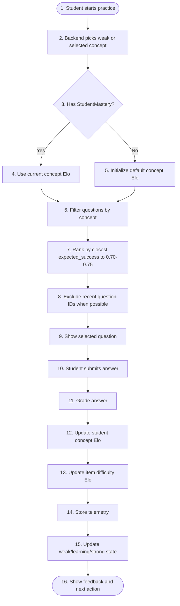
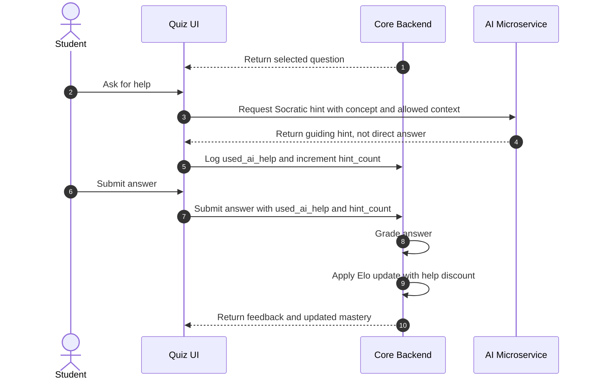
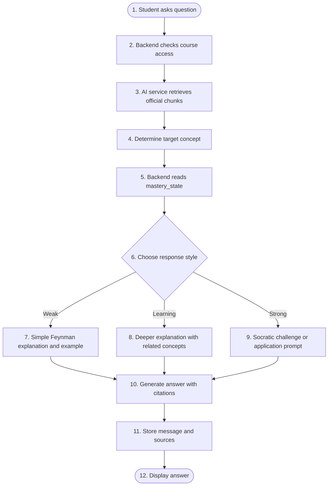
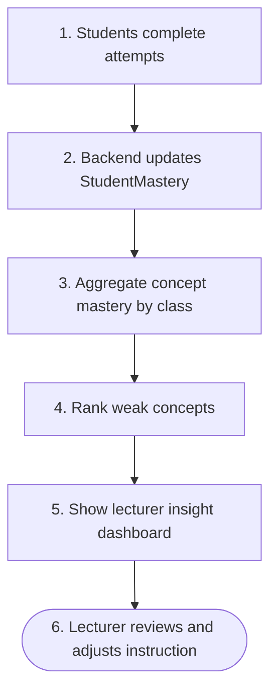

# Adaptive User Stories Flow — MVP Only

Tài liệu này mô tả bản MVP tối giản cho adaptive learning. Bản này loại bỏ Bandit, BKT runtime, Transfer Learning, SFIA, và per-turn LLM evaluator để giữ hệ thống dễ build, dễ test, dễ giải thích.

## MVP Principles

- Track mastery by Elo-style score per student and concept.
- Select practice by deterministic ZPD target success, around 0.70-0.75.
- Store attempt telemetry for future BKT/Bandit research.
- Discount mastery gains when students use AI help.
- Adapt RAG explanation style from simple mastery states: weak, learning, strong.
- Keep all grading bounded before updating mastery.

---

## 1. Adaptive Quiz MVP Flow

### User Story

As a student, I want quiz questions matched to my current concept mastery so practice is neither too easy nor too hard.

### Flow

### Required Data

| Field | Purpose |
| --- | --- |
| student_id | Identify learner |
| course_id | Scope content |
| concept_id | Track mastery |
| question_id | Track item difficulty |
| expected_success | ZPD and Elo update |
| actual_score | Bounded grade: 0-1 |
| mastery_before | Audit progress |
| mastery_after | Update profile |
| item_elo_before | Audit calibration |
| item_elo_after | Update item difficulty |
| selected_reason | Explain recommendation |

### MVP Acceptance Criteria

- New student can start with default mastery.
- System chooses a same-concept question near target success.
- Correct answer increases student mastery.
- Wrong answer decreases student mastery.
- Recent questions are avoided when alternatives exist.
- Attempt telemetry is stored.

---

## 2. Socratic Quiz Help MVP Flow

### User Story

As a student, I can ask for help during a quiz, but the AI guides me Socratically instead of giving the final answer.

### Flow

### Discount Rule

| Condition | Update rule |
| --- | --- |
| Correct, no AI help | Full positive Elo update |
| Correct, AI help used | Reduced positive Elo update |
| Correct, many hints | Stronger reduction |
| Incorrect | Negative update, optionally reduced if many hints indicate learning attempt |

### MVP Acceptance Criteria

- AI response never gives direct final answer.
- System records `used_ai_help` and `hint_count`.
- Assisted correct answer increases mastery less than independent correct answer.
- Quiz feedback explains that hints reduce mastery gain.

---

## 3. Adaptive RAG MVP Flow

### User Story

As a student, I want explanations from course material that match my current understanding of the concept.

### Flow

### Mastery State Mapping

| State | Suggested condition | Response style |
| --- | --- | --- |
| weak | Low Elo or weakness flag | Simple explanation, analogy, basic example |
| learning | Near baseline or mixed results | Deeper explanation and concept links |
| strong | High mastery and stable success | Socratic challenge or applied question |

### MVP Acceptance Criteria

- Every RAG answer uses official course source citations.
- Same question can receive different explanation depth by mastery state.
- Weak students receive simpler explanations, not harder challenges.
- Strong students can receive application-oriented Socratic prompts.

---

## 4. Lecturer Insight MVP Flow

### User Story

As a lecturer, I want to see class-level weak concepts so I can adjust teaching.

### Flow

### MVP Metrics

| Metric | Purpose |
| --- | --- |
| weak_student_count per concept | Identify class gaps |
| average_mastery per concept | Show class understanding |
| recent_attempt_count | Avoid overreacting to sparse data |
| improvement_delta | Show progress over time |

### MVP Acceptance Criteria

- Lecturer can see weak concepts by class/course.
- Dashboard does not expose unnecessary private student details by default.
- Sparse data is labeled as low confidence.

---

## MVP Build Order

1. StudentMastery Elo update.
2. Question item difficulty Elo.
3. Deterministic ZPD selector.
4. Quiz attempt telemetry.
5. AI-help discount rule.
6. Adaptive RAG response style by mastery state.
7. Lecturer weak-concept aggregation.

## Out of MVP

- Bandit, Thompson Sampling, LinUCB.
- BKT as runtime decision source.
- IRT/Rasch production calibration.
- Transfer learning matrix across concepts.
- SFIA competency framework dependency.
- Per-turn LLM evaluator for Socratic dialogue.
- Embedding-based item difficulty calibration.

**MVP fit:** Yes.  
**USP served:** Adaptive Learning / Socratic RAG / Guardrails / Lecturer Insight.  
**Scope label:** MVP.
