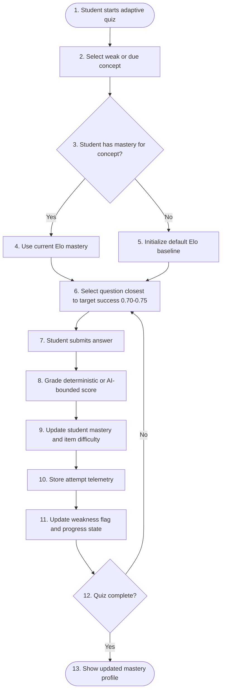
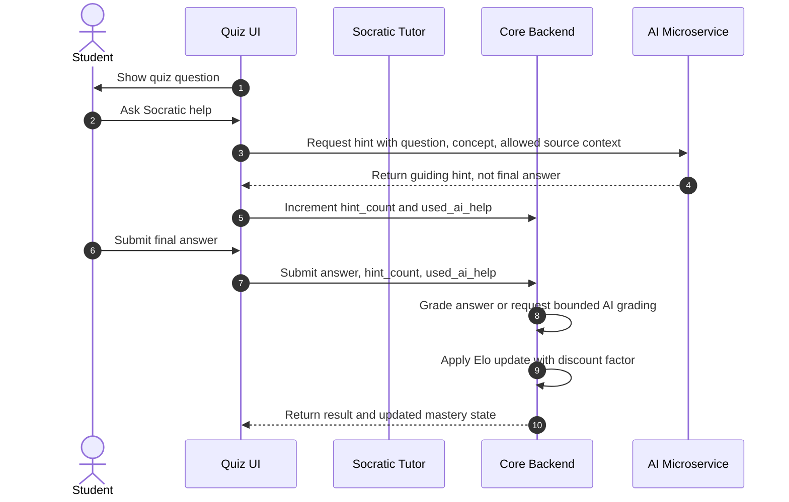
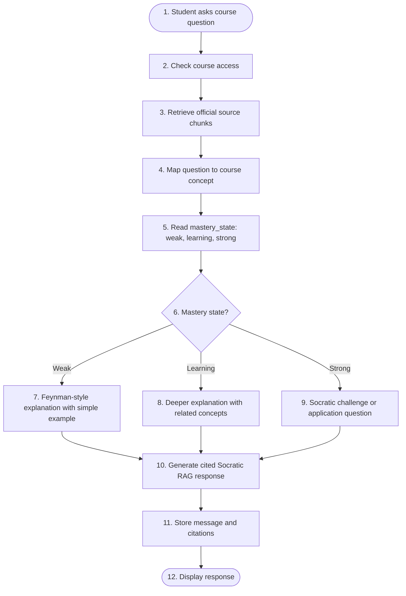
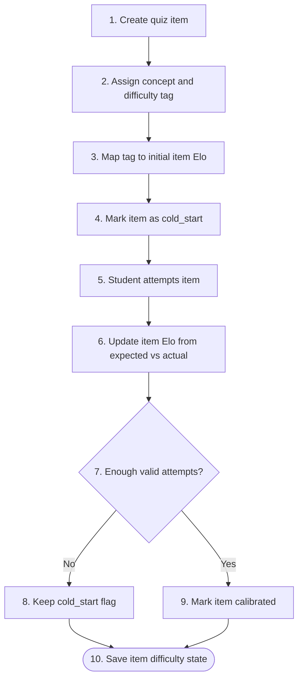
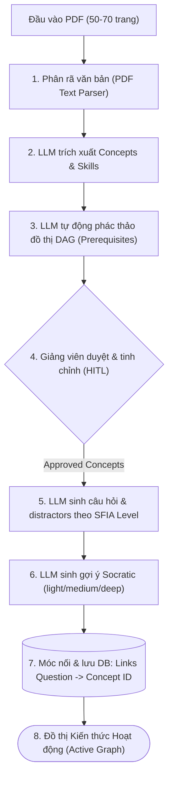

# Adaptive User Stories Flow — Overall System

Tài liệu này mô tả luồng tổng thể cho adaptive learning theo 3 tầng: MVP, Post-MVP, Research. Mục tiêu là giữ hệ thống đúng hướng Adaptive-first AI Tutor nhưng không kéo thuật toán chưa đủ dữ liệu vào MVP.

## Scope Map

| Capability | MVP | Post-MVP | Research |
| --- | --- | --- | --- |
| Mastery tracking | Elo-style score per student-concept | BKT confidence overlay | IRT/Rasch calibration |
| Question selection | Deterministic ZPD selection | Prerequisite/cold-start priors | Bandit/Thompson/LinUCB |
| AI help in quiz | Socratic hints + discount factor | Hint-depth weighting | Per-turn LLM evaluator |
| Adaptive RAG | Response style by mastery state | Concept-link personalization | SFIA/competency mapping |
| Item cold start | Default Elo + teacher difficulty tag | Similar-item prior + dynamic K | Embedding/contrastive calibration |

---

## 1. Adaptive Quiz and Mastery Update

### MVP Flow

MVP uses Elo-style mastery and deterministic ZPD. It should not depend on Bandit, BKT, or transfer learning.

### Post-MVP Enhancements

- BKT overlay for confidence labels: weak, learning, likely mastered.
- Prerequisite-based starting Elo when student enters a related new concept.
- Dynamic K-factor for early item calibration.
- Spaced repetition scheduling from mastery and due dates.

### Research Options

- Contextual Bandit or Thompson Sampling for question selection after real telemetry exists.
- IRT/Rasch batch calibration for item difficulty.
- Transfer learning matrix between concepts, validated offline before runtime use.

### System Notes

Core Backend owns selection, scoring, mastery updates, and telemetry. AI Microservice only grades semantic answers when deterministic grading is insufficient.

---

## 2. Socratic Assistant During Quiz and Weighted Assessment

### MVP Flow

MVP tracks whether the student used AI help and discounts mastery updates. It does not require a per-turn evaluator.

### MVP Discount Rule

| Attempt type | Mastery update |
| --- | --- |
| Correct without AI help | Full K-factor |
| Correct with AI help | Reduced K-factor based on hint_count |
| Incorrect without AI help | Standard negative update |
| Incorrect with AI help | Standard or slightly reduced negative update, depending policy |

### Post-MVP Enhancements

- Hint-depth levels: light, medium, strong.
- Better weighting based on scaffold count and response quality.
- BKT overlay to represent uncertainty from assisted success.

### Research Options

- Per-turn LLM evaluator for whether the student discovered the answer independently.
- Socratic dialogue quality scoring.
- Personalized hint policy learned from outcomes.

### Guardrail Notes

The tutor must not reveal direct answers for graded/homework-like requests. It should redirect to concepts, steps, or guiding questions.

---

## 3. Adaptive RAG by Mastery State

### MVP Flow

MVP adapts explanation style from Elo-derived mastery state, not BKT-only `P_L` or SFIA dependency.

### Post-MVP Enhancements

- Use concept graph to link prerequisites and already-mastered concepts.
- Let students choose explanation depth.
- Use BKT confidence as an additional signal when enough attempts exist.

### Research Options

- SFIA-style competency labels for professional skills courses.
- Adaptive prompt policy optimization from learning outcomes.
- Multi-modal explanations based on learner profile.

### System Notes

AI Microservice owns retrieval and generation. Core Backend owns mastery state and access control. Citation metadata must always point to official course sources.

---

## 4. Item Cold Start and Difficulty Calibration

### MVP Flow

MVP starts simple: teacher/system difficulty tag maps to an initial Elo, then real attempts calibrate item difficulty.

### Post-MVP Enhancements

- Dynamic K-factor for early attempts.
- Down-weight attempts from unstable student profiles or suspicious outliers.
- Similar-item prior from existing calibrated items.

### Research Options

- Embedding similarity for item difficulty prior.
- Contrastive calibration from historical question banks.
- Outlier filtering with response-time and behavior models.

---

## Required MVP Data

| Data | Purpose |
| --- | --- |
| student_id | User-specific mastery |
| course_id | Scope access and content |
| concept_id | Mastery and weakness tracking |
| question_id | Item difficulty and attempt history |
| expected_success | ZPD quality and Elo update |
| actual_score | Mastery update input |
| used_ai_help | Discount assisted attempts |
| hint_count | Weight assisted success |
| mastery_before / mastery_after | Progress and lecturer insight |
| item_elo_before / item_elo_after | Calibration audit |
| response_time_ms | Telemetry and future outlier checks |

---

## Failure Modes and Mitigations

| Risk | Mitigation |
| --- | --- |
| AI grading corrupts mastery | Bound score, log grader confidence, prefer deterministic checks where possible |
| Bandit before telemetry creates noisy recommendations | Keep Bandit research-only until offline comparison beats ZPD |
| BKT parameters uncalibrated | Use as overlay only after enough attempts |
| AI help inflates mastery | Apply discount factor and track hint_count |
| RAG response ignores source material | Require citations from approved course chunks |
| Item cold start misleads students | Use default Elo, cold_start flag, and conservative selection |

## Recommended Build Order

1. MVP Elo mastery update.
2. Deterministic ZPD question selection.
3. Attempt telemetry and AI-help discount.
4. Adaptive RAG prompt by mastery state.
5. Lecturer weak-concept aggregation.
6. Post-MVP BKT and cold-start priors.
7. Research Bandit/IRT only after telemetry exists.

**MVP fit:** Yes for Elo/ZPD, telemetry, AI-help discount, adaptive RAG style.  
**USP served:** Adaptive Learning / Socratic RAG / Guardrails / Lecturer Insight.  
**Scope label:** Overall system: MVP + Post-MVP + Research.

---

## 5. Content Ingestion & Question Generation Pipeline (PDF to Active Graph)

### MVP Flow

MVP combines automated LLM parsing and Socratic question generation with Human-in-the-loop (HITL) lecturer validation to ensure pedagogical quality before deploying to students.

### Process Steps:
1. **Document Parsing:** Parse the 50-70 page PDF using a standard library (e.g. `pypdf`).
2. **Concept & DAG Extraction:** LLM extracts core skills and represents the hierarchy as a Directed Acyclic Graph (DAG) indicating prerequisites.
3. **Lecturer Gate (HITL Validation):** The lecturer reviews the generated graph in a simple interface, correcting any missing or incorrect prerequisite links.
4. **Question Generation (Socratic-first):** LLM generates multiple-choice questions for each node. Distractors are accompanied by diagnostic feedback. Socratic prompts (light, medium, deep hints) are pre-generated.
5. **Ingestion & Linking:** Connect question IDs to concept nodes in the DB, setting the initial Elo score based on the target SFIA Level.

### Post-MVP Enhancements
- Automated linking of concepts to specific page ranges in the PDF for precise RAG citation.
- Automated quality check of generated distractors using cross-validation.
- Automated update of parent-child node dependencies based on student attempt correlation.

### Research Options
- Generative adversarial item evaluation to eliminate weak or ambiguous questions.
- Dynamic question generation during the test session (instead of pre-generating).
- LLM-evaluated cognitive level tag alignment with the SFIA framework attributes.

