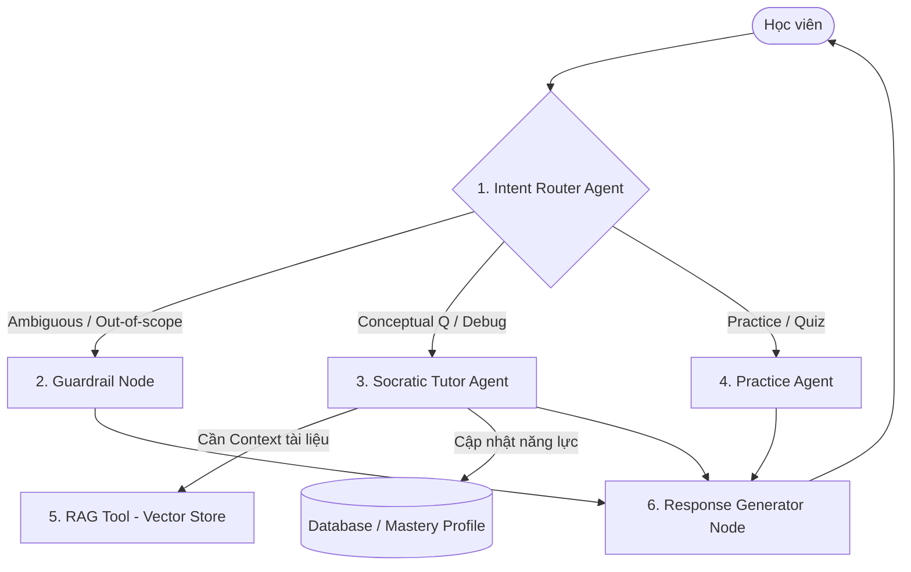
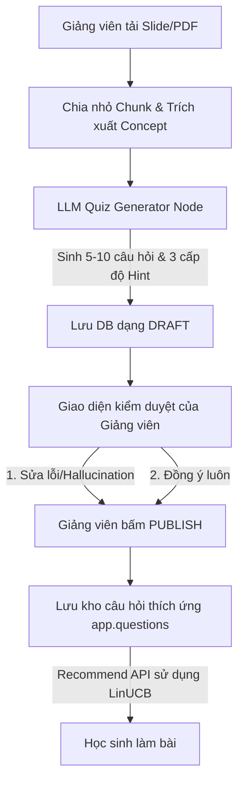

# Hướng dẫn Từng bước Triển khai Adaptive Learning Engine (BKT, Elo, LinUCB)

Tài liệu này cung cấp bản thiết kế chi tiết (Blueprints) cùng các công thức toán học và hướng dẫn từng bước để bạn có thể tự mình code và tích hợp động cơ học tập thích ứng (Adaptive Learning Engine) vào hệ thống một cách có hệ thống.


---

## MỤC LỤC
1. [Thiết kế Database & DDL](#1-thiết-kế-database--ddl)
2. [Bước 1: Kết nối Database & API Schemas](#bước-1-kết-nối-database--api-schemas)
3. [Bước 2: Cốt lõi Toán học (Elo, BKT, LinUCB)](#bước-2-cốt-lõi-toán-học-elo-bkt-linucb)
4. [Bước 3: Tầng Repository (Database I/O)](#bước-3-tầng-repository-database-io)
5. [Bước 4: Thiết lập API Routes & Bảo mật](#bước-4-thiết-lập-api-routes--bảo-mật)
6. [Bước 5: Viết Unit Test & Kiểm thử](#bước-5-viết-unit-test--kiểm-thử)
7. [Bước 6: Thiết kế Concurrency & Cơ chế Locking (Theo ADR-004)](#bước-6-thiết-kế-concurrency--cơ-chế-locking-theo-adr-004)

---

## 1. Thiết kế Database & DDL

Trước khi bắt đầu code Python, bạn cần khởi tạo các bảng sau trong cơ sở dữ liệu PostgreSQL. Các bảng được chia thành 2 Schema: `app` (chứa dữ liệu chạy thực tế - runtime) và `audit` (lưu trữ lịch sử, vết quyết định).

```sql
-- SCHEMA ĐĂNG KÝ HỌC & ĐÁNH GIÁ (app)
CREATE SCHEMA IF NOT EXISTS app;
CREATE SCHEMA IF NOT EXISTS audit;

-- 1. Bảng lưu trữ trạng thái làm chủ Concept của học sinh (Runtime)
CREATE TABLE app.student_concept_mastery (
    student_id UUID NOT NULL,
    course_id UUID NOT NULL,
    concept_id UUID NOT NULL,
    elo_score DECIMAL NOT NULL DEFAULT 1200.0,
    bkt_mastery_probability DECIMAL NOT NULL DEFAULT 0.25,
    mastery_state VARCHAR(20) NOT NULL DEFAULT 'not_started', -- 'not_started', 'weak', 'learning', 'mastered'
    weakness_flag BOOLEAN NOT NULL DEFAULT FALSE,
    attempt_count INTEGER NOT NULL DEFAULT 0,
    correct_count INTEGER NOT NULL DEFAULT 0,
    last_practiced_at TIMESTAMPTZ,
    updated_at TIMESTAMPTZ NOT NULL DEFAULT NOW(),
    PRIMARY KEY (student_id, course_id, concept_id)
);

-- 2. Bảng lưu trữ vết quyết định gợi ý câu hỏi của Bandit
CREATE TABLE audit.adaptive_decisions (
    id UUID PRIMARY KEY DEFAULT gen_random_uuid(),
    policy_id UUID NOT NULL,
    student_id UUID NOT NULL,
    course_id UUID NOT NULL,
    concept_id UUID,
    selected_action_id UUID NOT NULL, -- ID câu hỏi được gợi ý
    candidate_action_ids JSONB NOT NULL, -- Danh sách các câu hỏi ứng viên
    context_snapshot JSONB NOT NULL, -- Vector context [1.0, bkt, normalized_elo]
    model_snapshot JSONB NOT NULL, -- Trạng thái của arm [A, b] tại thời điểm đó
    expected_reward DECIMAL,
    expected_success DECIMAL, -- Tính từ Elo
    exploration_mode VARCHAR(20) NOT NULL DEFAULT 'exploit',
    created_at TIMESTAMPTZ NOT NULL DEFAULT NOW()
);

-- 3. Bảng lưu trữ lịch sử làm bài trắc nghiệm của học sinh
CREATE TABLE app.quiz_attempts (
    id UUID PRIMARY KEY DEFAULT gen_random_uuid(),
    student_id UUID NOT NULL,
    course_id UUID NOT NULL,
    question_id UUID NOT NULL,
    concept_id UUID NOT NULL,
    adaptive_decision_id UUID,
    student_answer JSONB NOT NULL,
    is_correct BOOLEAN NOT NULL,
    actual_score DECIMAL NOT NULL, -- từ 0.0 đến 1.0
    expected_success DECIMAL,
    hint_count INTEGER NOT NULL DEFAULT 0,
    used_ai_help BOOLEAN NOT NULL DEFAULT FALSE,
    submitted_at TIMESTAMPTZ NOT NULL DEFAULT NOW()
);

-- 4. Bảng ghi nhận tín hiệu thưởng (Reward) để cập nhật Bandit
CREATE TABLE audit.adaptive_rewards (
    id UUID PRIMARY KEY DEFAULT gen_random_uuid(),
    adaptive_decision_id UUID NOT NULL,
    quiz_attempt_id UUID,
    reward_value DECIMAL NOT NULL,
    reward_formula VARCHAR(50) NOT NULL,
    observed_success DECIMAL,
    target_success DECIMAL NOT NULL DEFAULT 0.75,
    created_at TIMESTAMPTZ NOT NULL DEFAULT NOW()
);

-- 5. Bảng tham số mặc định cho thuật toán BKT của từng Concept
CREATE TABLE audit.bkt_parameters (
    id UUID PRIMARY KEY DEFAULT gen_random_uuid(),
    concept_id UUID NOT NULL,
    prior_learned DECIMAL NOT NULL DEFAULT 0.25,
    transition_learn DECIMAL NOT NULL DEFAULT 0.10,
    guess DECIMAL NOT NULL DEFAULT 0.20,
    slip DECIMAL NOT NULL DEFAULT 0.10,
    status VARCHAR(20) NOT NULL DEFAULT 'active',
    created_at TIMESTAMPTZ NOT NULL DEFAULT NOW()
);

-- 6. Nhật ký thay đổi năng lực Elo & BKT của học sinh
CREATE TABLE audit.mastery_events (
    id UUID PRIMARY KEY DEFAULT gen_random_uuid(),
    student_id UUID NOT NULL,
    course_id UUID NOT NULL,
    concept_id UUID NOT NULL,
    source_type VARCHAR(30) NOT NULL, -- 'quiz_attempt', 'diagnostic'
    source_id UUID NOT NULL,
    elo_before DECIMAL NOT NULL,
    elo_after DECIMAL NOT NULL,
    elo_delta DECIMAL NOT NULL,
    bkt_before DECIMAL NOT NULL,
    bkt_after DECIMAL NOT NULL,
    bkt_delta DECIMAL NOT NULL,
    state_before VARCHAR(20) NOT NULL,
    state_after VARCHAR(20) NOT NULL,
    created_at TIMESTAMPTZ NOT NULL DEFAULT NOW()
);

-- 7. Nhật ký biến động độ khó Elo của câu hỏi
CREATE TABLE audit.question_elo_events (
    id UUID PRIMARY KEY DEFAULT gen_random_uuid(),
    question_id UUID NOT NULL,
    quiz_attempt_id UUID NOT NULL,
    difficulty_before DECIMAL NOT NULL,
    difficulty_after DECIMAL NOT NULL,
    difficulty_delta DECIMAL NOT NULL,
    created_at TIMESTAMPTZ NOT NULL DEFAULT NOW()
);

-- 8. Bảng lưu trữ cấu hình Bandit Policy
CREATE TABLE audit.adaptive_policies (
    id UUID PRIMARY KEY DEFAULT gen_random_uuid(),
    name VARCHAR(50) NOT NULL,
    version VARCHAR(20) NOT NULL,
    status VARCHAR(20) NOT NULL DEFAULT 'active',
    config JSONB NOT NULL DEFAULT '{}'::jsonb,
    created_at TIMESTAMPTZ NOT NULL DEFAULT NOW()
);
```

---

## Bước 1: Kết nối Database & API Schemas

### 1.1. Khởi tạo DB Session Helper (`src/services/db.py`)
Mục tiêu: Cung cấp connection pool sử dụng SQLAlchemy.

```python
from sqlalchemy import create_engine
from sqlalchemy.orm import sessionmaker, declarative_base
from src.config import get_settings

settings = get_settings()
db_url = settings.database_url
if db_url.startswith("postgres://"):
    db_url = db_url.replace("postgres://", "postgresql://", 1)

engine = create_engine(db_url, pool_pre_ping=True)
SessionLocal = sessionmaker(autocommit=False, autoflush=False, bind=engine)
Base = declarative_base()

def get_db():
    db = SessionLocal()
    try:
        yield db
    finally:
        db.close()
```

### 1.2. Định nghĩa Dữ liệu Đầu vào & Đầu ra API (`src/models/adaptive_schemas.py`)
Sử dụng Pydantic để validate input/output API:

```python
from pydantic import BaseModel, Field
from uuid import UUID
from typing import Dict, Any

class RecommendRequest(BaseModel):
    student_id: UUID = Field(..., description="ID học viên")
    course_id: UUID = Field(..., description="ID khóa học")
    concept_id: UUID = Field(..., description="ID Concept")

class RecommendResponse(BaseModel):
    decision_id: UUID = Field(..., description="ID quyết định gợi ý câu hỏi")
    question_id: UUID = Field(..., description="ID câu hỏi được đề xuất")
    type: str = Field(..., description="Kiểu câu hỏi (mcq, short_answer, v.v.)")
    prompt: str = Field(..., description="Đề bài")
    options: Dict[str, Any] = Field(default={}, description="Các lựa chọn trắc nghiệm")
    expected_success: float = Field(..., description="Xác suất học viên làm đúng câu hỏi này (ZPD)")
    expected_reward: float = Field(..., description="Phần thưởng dự báo của LinUCB")

class SubmitRequest(BaseModel):
    student_id: UUID = Field(..., description="ID học viên")
    course_id: UUID = Field(..., description="ID khóa học")
    concept_id: UUID = Field(..., description="ID Concept")
    question_id: UUID = Field(..., description="ID câu hỏi")
    decision_id: UUID = Field(..., description="ID trace quyết định gợi ý câu hỏi")
    student_answer: Dict[str, Any] = Field(..., description="Câu trả lời của học viên")
    actual_score: float = Field(..., ge=0.0, le=1.0, description="Điểm số chấm thực tế (0.0 đến 1.0)")
    hint_count: int = Field(default=0, ge=0, description="Số lượt dùng gợi ý")
    used_ai_help: bool = Field(default=False, description="Đánh dấu nếu dùng AI để gian lận/hỗ trợ")

class SubmitResponse(BaseModel):
    is_correct: bool = Field(..., description="Đúng hay Sai")
    actual_score: float = Field(..., description="Điểm thực tế")
    old_elo: float = Field(..., description="Elo học viên cũ")
    new_elo: float = Field(..., description="Elo học viên mới")
    old_bkt: float = Field(..., description="Xác suất BKT cũ")
    new_bkt: float = Field(..., description="Xác suất BKT mới")
    mastery_state: str = Field(..., description="Trạng thái làm chủ mới")
    weakness_flag: bool = Field(..., description="Đánh dấu điểm yếu")
    bandit_reward: float = Field(..., description="Phần thưởng của Bandit nhận được")
```

---

## Bước 2: Cốt lõi Toán học (Elo, BKT, LinUCB)

### 2.1. Module Elo Giáo dục (`src/services/adaptive/elo.py`)
Chức năng: Tính xác suất thành công kỳ vọng và cập nhật điểm số (Dual-update).

> **Giải pháp tối ưu:** Sử dụng chuẩn hóa Sigmoid mềm cho Elo thay vì Min-Max để tránh bão hòa năng lực ở biên $[800, 2400]$.

```python
import math

def calculate_expected_success(student_elo: float, question_elo: float) -> float:
    """
    Tính xác suất học viên làm đúng câu hỏi dựa trên Elo.
    P(correct) = 1 / (1 + 10^((question_elo - student_elo) / 400))
    """
    return 1.0 / (1.0 + 10.0 ** ((question_elo - student_elo) / 400.0))


def calculate_elo_updates(
    student_elo: float,
    question_elo: float,
    actual_score: float,
    hint_count: int = 0,
    k_factor: float = 32.0,
) -> tuple[float, float]:
    """
    Cập nhật điểm Elo của học sinh và độ khó Elo của câu hỏi.
    Áp dụng khấu trừ điểm thưởng nếu dùng gợi ý (Hint discount).
    """
    expected = calculate_expected_success(student_elo, question_elo)
    
    student_delta = actual_score - expected
    question_delta = expected - actual_score
    
    # Nếu làm bài đúng và có dùng gợi ý, chiết khấu lượng Elo nhận được
    if student_delta > 0 and hint_count > 0:
        # 1 hint -> còn 70%, 2 hints -> còn 40%, >=3 hints -> còn 10%
        discount = max(0.1, 1.0 - 0.3 * hint_count)
        student_delta *= discount
        question_delta *= discount

    new_student_elo = student_elo + k_factor * student_delta
    new_question_elo = question_elo + k_factor * question_delta
    
    return round(new_student_elo, 2), round(new_question_elo, 2)
```

### 2.2. Module Bayesian Knowledge Tracing (`src/services/adaptive/bkt.py`)
Chức năng: Ước lượng xác suất làm chủ của học viên.

> **Giải pháp tối ưu:** Giới hạn xác suất trong khoảng $[0.0001, 0.9999]$ để khắc phục lỗi **BKT Mastery Trap (1.0)**.

```python
class BKTParameters:
    def __init__(
        self,
        prior_learned: float = 0.25,
        transition_learn: float = 0.10,
        guess: float = 0.20,
        slip: float = 0.10,
    ):
        self.prior_learned = prior_learned
        self.transition_learn = transition_learn
        self.guess = guess
        self.slip = slip


def calculate_bkt_posterior(
    p_mastery: float,
    is_correct: bool,
    params: BKTParameters,
) -> float:
    """
    Tính xác suất Posterior P(L_t | Result) dựa trên định lý Bayes.
    """
    if is_correct:
        numerator = p_mastery * (1.0 - params.slip)
        denominator = numerator + (1.0 - p_mastery) * params.guess
    else:
        numerator = p_mastery * params.slip
        denominator = numerator + (1.0 - p_mastery) * (1.0 - params.guess)
        
    if denominator == 0:
        return p_mastery
    return min(1.0, max(0.0, numerator / denominator))


def calculate_bkt_update(
    p_mastery: float,
    actual_score: float,
    params: BKTParameters,
) -> float:
    """
    Tính xác suất Mastery mới cho học viên (Posterior + Transition).
    Hỗ trợ điểm số một phần (Partial credit) bằng nội suy tuyến tính.
    """
    if actual_score >= 1.0:
        p_posterior = calculate_bkt_posterior(p_mastery, True, params)
    elif actual_score <= 0.0:
        p_posterior = calculate_bkt_posterior(p_mastery, False, params)
    else:
        # Nội suy tuyến tính khi điểm nằm giữa (0.0, 1.0)
        p_post_correct = calculate_bkt_posterior(p_mastery, True, params)
        p_post_incorrect = calculate_bkt_posterior(p_mastery, False, params)
        p_posterior = actual_score * p_post_correct + (1.0 - actual_score) * p_post_incorrect
        
    p_mastery_new = p_posterior + (1.0 - p_posterior) * params.transition_learn
    
    # QUAN TRỌNG: Capping để tránh Mastery Trap ở 1.0000
    return round(min(0.9999, max(0.0001, p_mastery_new)), 4)


def determine_mastery_state(p_mastery: float) -> str:
    """
    Quy đổi xác suất làm chủ thành nhãn trạng thái lưu trữ DB.
    """
    if p_mastery < 0.30:
        return "weak"
    elif p_mastery < 0.85:
        return "learning"
    else:
        return "mastered"
```

### 2.3. Module Contextual Bandit (`src/services/adaptive/bandit.py`)
Chức năng: Gợi ý câu hỏi trong vùng ZPD.

> **Giải pháp tối ưu:** 
> 1. Tránh tính nghịch đảo ma trận $A^{-1}$ lúc recommend bằng cách áp dụng công thức **Sherman-Morrison** để cập nhật nghịch đảo trực tiếp tại thời điểm submit.
> 2. Sử dụng chuẩn hóa **Sigmoid** mềm cho điểm Elo trong Context Vector.

```python
import numpy as np
import math
from typing import Any, Dict, List, Tuple

class LinUCB:
    def __init__(self, context_dim: int = 3, alpha: float = 1.0):
        self.context_dim = context_dim
        self.alpha = alpha

    def get_default_arm_state(self) -> Dict[str, List[float]]:
        """
        Khởi tạo A_inv là ma trận đơn vị Identity (để tránh phải tính inv(A)).
        """
        A_inv = np.eye(self.context_dim).tolist()
        b = np.zeros(self.context_dim).tolist()
        return {"A_inv": A_inv, "b": b}

    def compute_ucb_score(
        self,
        context: np.ndarray,
        arm_state: Dict[str, Any],
    ) -> Tuple[float, float]:
        """
        Tính điểm kỳ vọng (Pred) và cận trên UCB dựa trên A_inv đã có sẵn.
        Độ phức tạp chỉ O(d^2) thay vì O(d^3) nghịch đảo.
        """
        A_inv = np.array(arm_state["A_inv"])
        b = np.array(arm_state["b"]).reshape(-1, 1)
        x = context.reshape(-1, 1)
        
        # theta = A_inv * b
        theta = A_inv.dot(b)
        
        # Điểm kỳ vọng reward
        pred = float(theta.T.dot(x)[0][0])
        
        # Độ bất định (Uncertainty)
        variance = float(x.T.dot(A_inv).dot(x)[0][0])
        std_dev = np.sqrt(max(0.0, variance))
        
        # Cận trên UCB
        ucb = pred + self.alpha * std_dev
        return pred, ucb

    def select_arm(
        self,
        context_vector: List[float],
        arms_states: Dict[str, Dict[str, Any]],
        candidate_arm_ids: List[str],
    ) -> Tuple[str, float]:
        """
        Duyệt danh sách các ứng viên và chọn arm có UCB cao nhất.
        """
        context = np.array(context_vector)
        best_arm_id = None
        best_ucb = -float("inf")
        best_pred = 0.0
        
        if not candidate_arm_ids:
            raise ValueError("Danh sách ứng viên trống")
            
        for arm_id in candidate_arm_ids:
            arm_state = arms_states.get(arm_id)
            if not arm_state:
                arm_state = self.get_default_arm_state()
                arms_states[arm_id] = arm_state
                
            pred, ucb = self.compute_ucb_score(context, arm_state)
            if ucb > best_ucb:
                best_ucb = ucb
                best_pred = pred
                best_arm_id = arm_id
                
        return best_arm_id, best_pred

    def update_arm(
        self,
        arm_id: str,
        context_vector: List[float],
        reward: float,
        arms_states: Dict[str, Dict[str, Any]],
    ) -> Dict[str, Any]:
        """
        Cập nhật ma trận nghịch đảo A_inv trực tiếp bằng công thức Sherman-Morrison:
        (A + x*x^T)^-1 = A^-1 - (A^-1 * x * x^T * A^-1) / (1 + x^T * A^-1 * x)
        """
        x = np.array(context_vector).reshape(-1, 1)
        arm_state = arms_states.get(arm_id)
        if not arm_state:
            arm_state = self.get_default_arm_state()
            
        A_inv = np.array(arm_state["A_inv"])
        b = np.array(arm_state["b"]).reshape(-1, 1)
        
        # 1. Tính mẫu số: 1 + x^T * A_inv * x
        denominator = 1.0 + float(x.T.dot(A_inv).dot(x)[0][0])
        
        # 2. Sherman-Morrison update
        A_inv_new = A_inv - (A_inv.dot(x).dot(x.T).dot(A_inv)) / denominator
        
        # 3. Cập nhật vector b
        b_new = b + reward * x
        
        updated_state = {
            "A_inv": A_inv_new.tolist(),
            "b": b_new.flatten().tolist()
        }
        arms_states[arm_id] = updated_state
        return updated_state


def build_student_context(p_mastery: float, student_elo: float) -> List[float]:
    """
    Xây dựng vector ngữ cảnh 3 chiều: [Bias=1.0, BKT_mastery, Sigmoid_normalized_Elo]
    """
    # Chuẩn hóa mềm bằng Sigmoid
    normalized_elo = 1.0 / (1.0 + math.exp(-(student_elo - 1600.0) / 400.0))
    return [1.0, p_mastery, normalized_elo]


def calculate_bandit_reward(expected_success: float, actual_score: float) -> float:
    """
    Tính tín hiệu thưởng (Reward Y) dựa trên ZPD (độ lệch so với tỷ lệ thành công 75%).
    Chỉ thưởng khi học sinh có kết quả thực tế tương đối tốt.
    """
    zpd_reward = 1.0 - 2.0 * abs(expected_success - 0.75)
    reward = actual_score * zpd_reward
    return round(reward, 4)
```

---

## Bước 3: Tầng Repository (Database I/O)

Các quy tắc thiết kế tầng này (`src/services/adaptive/repository.py`):
1. **Không tự động commit (`db.commit()`)**: Để nhường quyền quản lý transaction (Atomicity) cho API Router.
2. **Lọc thô**: Chỉ lấy dữ liệu minimal cần thiết khi tính toán.

```python
import json
from uuid import UUID
from typing import Any, Dict, List, Optional, Tuple
from sqlalchemy.orm import Session
from sqlalchemy import text
from src.services.adaptive.bkt import BKTParameters

def get_student_mastery(db: Session, student_id: UUID, course_id: UUID, concept_id: UUID) -> Dict[str, Any]:
    """
    Truy vấn trạng thái làm chủ hiện tại của sinh viên. Nếu chưa có, tự động INSERT giá trị default.
    """
    sid, cid, conid = str(student_id), str(course_id), str(concept_id)
    query = text("""
        SELECT elo_score, bkt_mastery_probability, mastery_state, weakness_flag, attempt_count, correct_count
        FROM app.student_concept_mastery
        WHERE student_id = :student_id AND course_id = :course_id AND concept_id = :concept_id
    """)
    result = db.execute(query, {"student_id": sid, "course_id": cid, "concept_id": conid}).fetchone()
    if result:
        return {
            "elo_score": float(result.elo_score),
            "bkt_mastery_probability": float(result.bkt_mastery_probability),
            "mastery_state": result.mastery_state,
            "weakness_flag": result.weakness_flag,
            "attempt_count": result.attempt_count,
            "correct_count": result.correct_count,
        }
        
    # Tạo mặc định
    insert_query = text("""
        INSERT INTO app.student_concept_mastery (student_id, course_id, concept_id, elo_score, bkt_mastery_probability, mastery_state, weakness_flag, attempt_count, correct_count)
        VALUES (:student_id, :course_id, :concept_id, 1200.0, 0.2500, 'not_started', false, 0, 0)
        RETURNING elo_score, bkt_mastery_probability, mastery_state, weakness_flag, attempt_count, correct_count
    """)
    new_row = db.execute(insert_query, {"student_id": sid, "course_id": cid, "concept_id": conid}).fetchone()
    # Chú ý: Không commit ở đây để đảm bảo tính an toàn transaction ngoài router
    return {
        "elo_score": float(new_row.elo_score),
        "bkt_mastery_probability": float(new_row.bkt_mastery_probability),
        "mastery_state": new_row.mastery_state,
        "weakness_flag": new_row.weakness_flag,
        "attempt_count": new_row.attempt_count,
        "correct_count": new_row.correct_count,
    }

def update_student_mastery(db: Session, student_id: UUID, course_id: UUID, concept_id: UUID, elo_score: float, bkt_mastery_probability: float, mastery_state: str, weakness_flag: bool, is_correct: bool) -> None:
    sid, cid, conid = str(student_id), str(course_id), str(concept_id)
    correct_inc = 1 if is_correct else 0
    query = text("""
        UPDATE app.student_concept_mastery
        SET elo_score = :elo_score,
            bkt_mastery_probability = :bkt_mastery_probability,
            mastery_state = :mastery_state,
            weakness_flag = :weakness_flag,
            attempt_count = attempt_count + 1,
            correct_count = correct_count + :correct_inc,
            last_practiced_at = NOW(),
            updated_at = NOW()
        WHERE student_id = :student_id AND course_id = :course_id AND concept_id = :concept_id
    """)
    db.execute(query, {
        "elo_score": elo_score,
        "bkt_mastery_probability": bkt_mastery_probability,
        "mastery_state": mastery_state,
        "weakness_flag": weakness_flag,
        "correct_inc": correct_inc,
        "student_id": sid,
        "course_id": cid,
        "concept_id": conid,
    })

def get_candidate_questions_meta(db: Session, course_id: UUID, concept_id: UUID) -> List[Dict[str, Any]]:
    """
    Tối ưu hóa: Chỉ lấy ID và Elo để LinUCB tính điểm, giảm thiểu I/O mạng kéo Prompt/Đáp án.
    """
    query = text("""
        SELECT id, difficulty_elo
        FROM app.questions
        WHERE course_id = :course_id AND concept_id = :concept_id AND calibration_status = 'published'
    """)
    rows = db.execute(query, {"course_id": str(course_id), "concept_id": str(concept_id)}).fetchall()
    return [{"id": row.id, "difficulty_elo": float(row.difficulty_elo)} for row in rows]

def get_question_by_id(db: Session, question_id: UUID) -> Optional[Dict[str, Any]]:
    query = text("""
        SELECT id, type, prompt, answer_key, difficulty_elo
        FROM app.questions
        WHERE id = :question_id
    """)
    row = db.execute(query, {"question_id": str(question_id)}).fetchone()
    if not row:
        return None
    return {
        "id": row.id,
        "type": row.type,
        "prompt": row.prompt,
        "answer_key": row.answer_key if isinstance(row.answer_key, dict) else json.loads(row.answer_key or "{}"),
        "difficulty_elo": float(row.difficulty_elo),
    }

def get_bandit_policy_state(db: Session, course_id: UUID) -> Tuple[UUID, Dict[str, Any]]:
    query = text("""
        SELECT id, config
        FROM audit.adaptive_policies
        WHERE name = 'zpd_selector' AND status = 'active'
        ORDER BY created_at DESC LIMIT 1
    """)
    row = db.execute(query).fetchone()
    if row:
        config = row.config if isinstance(row.config, dict) else json.loads(row.config or "{}")
        return row.id, config
        
    # Tạo mặc định
    insert_query = text("""
        INSERT INTO audit.adaptive_policies (name, version, status, config)
        VALUES ('zpd_selector', 'v1.0', 'active', '{}'::jsonb)
        RETURNING id, config
    """)
    new_row = db.execute(insert_query).fetchone()
    config = new_row.config if isinstance(new_row.config, dict) else json.loads(new_row.config or "{}")
    return new_row.id, config

def update_bandit_policy_config(db: Session, policy_id: UUID, config: Dict[str, Any]) -> None:
    query = text("""
        UPDATE audit.adaptive_policies
        SET config = :config
        WHERE id = :policy_id
    """)
    db.execute(query, {"config": json.dumps(config), "policy_id": str(policy_id)})

def log_adaptive_decision(db: Session, policy_id: UUID, student_id: UUID, course_id: UUID, concept_id: UUID, selected_action_id: UUID, candidate_action_ids: List[str], context_snapshot: List[float], model_snapshot: Dict[str, Any], expected_reward: float, expected_success: float) -> UUID:
    query = text("""
        INSERT INTO audit.adaptive_decisions (
            policy_id, student_id, course_id, concept_id, selected_action_id,
            candidate_action_ids, context_snapshot, model_snapshot,
            expected_reward, expected_success
        )
        VALUES (
            :policy_id, :student_id, :course_id, :concept_id, :selected_action_id,
            :candidate_action_ids, :context_snapshot, :model_snapshot,
            :expected_reward, :expected_success
        )
        RETURNING id
    """)
    row = db.execute(query, {
        "policy_id": str(policy_id),
        "student_id": str(student_id),
        "course_id": str(course_id),
        "concept_id": str(concept_id),
        "selected_action_id": str(selected_action_id),
        "candidate_action_ids": json.dumps(candidate_action_ids),
        "context_snapshot": json.dumps(context_snapshot),
        "model_snapshot": json.dumps(model_snapshot),
        "expected_reward": expected_reward,
        "expected_success": expected_success,
    }).fetchone()
    return row.id

def get_adaptive_decision(db: Session, decision_id: UUID) -> Optional[Dict[str, Any]]:
    query = text("""
        SELECT policy_id, student_id, course_id, concept_id, selected_action_id, expected_success, context_snapshot, model_snapshot
        FROM audit.adaptive_decisions
        WHERE id = :decision_id
    """)
    row = db.execute(query, {"decision_id": str(decision_id)}).fetchone()
    if not row:
        return None
    return {
        "policy_id": row.policy_id,
        "student_id": row.student_id,
        "course_id": row.course_id,
        "concept_id": row.concept_id,
        "selected_action_id": row.selected_action_id,
        "expected_success": float(row.expected_success) if row.expected_success is not NULL else None,
        "context_snapshot": row.context_snapshot if isinstance(row.context_snapshot, list) else json.loads(row.context_snapshot or "[]"),
        "model_snapshot": row.model_snapshot if isinstance(row.model_snapshot, dict) else json.loads(row.model_snapshot or "{}"),
    }

# Triển khai tương tự cho các hàm ghi Log: log_quiz_attempt, log_adaptive_reward, log_mastery_event, log_question_elo_event.
# NHẮC NHỞ: Tuyệt đối không gọi db.commit() trong bất kỳ hàm nào ở đây.
```

---

## Bước 4: Thiết lập API Routes & Bảo mật

File endpoint (`src/api/adaptive_routes.py`) cần xử lý:
1. **Atomic Transaction**: Đặt toàn bộ code nghiệp vụ trong một khối `try-except`, gọi `db.commit()` một lần duy nhất khi thành công, gọi `db.rollback()` nếu xảy ra lỗi.
2. **Cross-validation**: Kiểm tra tính hợp lệ của gói tin Submit để chặn tấn công Replay.
3. **AI assistance protection**: Triệt tiêu việc tăng năng lực của học sinh nếu dùng AI.
4. **Tránh lộ thông tin nhạy cảm**: Ẩn các lỗi hệ thống chi tiết khỏi phản hồi API Client.

```python
from fastapi import APIRouter, HTTPException, Depends
from sqlalchemy.orm import Session
from uuid import UUID
import logging

from src.services.db import get_db
from src.models.adaptive_schemas import RecommendRequest, RecommendResponse, SubmitRequest, SubmitResponse
from src.services.adaptive import repository as repo
from src.services.adaptive.bkt import calculate_bkt_update, determine_mastery_state, BKTParameters
from src.services.adaptive.elo import calculate_elo_updates, calculate_expected_success
from src.services.adaptive.bandit import LinUCB, build_student_context, calculate_bandit_reward

logger = logging.getLogger(__name__)
router = APIRouter(prefix="/adaptive", tags=["Adaptive Engine"])

@router.post("/recommend", response_model=RecommendResponse)
def recommend_question(request: RecommendRequest, db: Session = Depends(get_db)):
    try:
        # 1. Đọc năng lực học sinh
        mastery = repo.get_student_mastery(db, request.student_id, request.course_id, request.concept_id)
        p_mastery = mastery["bkt_mastery_probability"]
        elo_score = mastery["elo_score"]
        
        # 2. Tối ưu: Chỉ lấy metadata câu hỏi (id, difficulty_elo)
        candidates = repo.get_candidate_questions_meta(db, request.course_id, request.concept_id)
        if not candidates:
            raise HTTPException(status_code=404, detail="Không tìm thấy câu hỏi đã xuất bản cho Concept này.")
            
        # 3. Lấy cấu hình Bandit
        policy_id, policy_config = repo.get_bandit_policy_state(db, request.course_id)
        arms_states = policy_config.setdefault("arms_states", {})
        alpha = policy_config.get("alpha", 1.0)
        
        bandit = LinUCB(context_dim=3, alpha=alpha)
        X = build_student_context(p_mastery, elo_score)
        
        candidate_ids = [str(q["id"]) for q in candidates]
        for qid_str in candidate_ids:
            if qid_str not in arms_states:
                arms_states[qid_str] = bandit.get_default_arm_state()
                
        # 4. Bandit chọn arm dựa trên UCB
        selected_qid_str, expected_reward = bandit.select_arm(
            context_vector=X,
            arms_states=arms_states,
            candidate_arm_ids=candidate_ids
        )
        
        # Lấy thông tin chi tiết câu hỏi được lựa chọn từ DB
        selected_question = repo.get_question_by_id(db, UUID(selected_qid_str))
        
        # ĐĂNG KÝ XÁC SUẤT ĐÚNG THỰC TẾ dựa vào Elo (Giải quyết lỗi Vòng lặp phản hồi của LinUCB)
        true_expected_success = calculate_expected_success(elo_score, selected_question["difficulty_elo"])
        
        # Ghi đè cập nhật policy
        repo.update_bandit_policy_config(db, policy_id, policy_config)
        
        # 5. Ghi nhận trace quyết định
        decision_id = repo.log_adaptive_decision(
            db=db,
            policy_id=policy_id,
            student_id=request.student_id,
            course_id=request.course_id,
            concept_id=request.concept_id,
            selected_action_id=UUID(selected_qid_str),
            candidate_action_ids=candidate_ids,
            context_snapshot=X,
            model_snapshot=arms_states[selected_qid_str],
            expected_reward=expected_reward,
            expected_success=true_expected_success
        )
        
        db.commit() # Commit duy nhất tại cuối tiến trình thành công
        
        return RecommendResponse(
            decision_id=decision_id,
            question_id=UUID(selected_qid_str),
            type=selected_question["type"],
            prompt=selected_question["prompt"],
            options=selected_question["answer_key"].get("options", {}),
            expected_success=true_expected_success,
            expected_reward=expected_reward
        )
    except HTTPException as he:
        db.rollback()
        raise he
    except Exception as e:
        db.rollback()
        logger.error(f"Lỗi khuyến nghị câu hỏi: {str(e)}", exc_info=True)
        raise HTTPException(status_code=500, detail="Lỗi hệ thống trong quá trình xử lý khuyến nghị.")

@router.post("/submit", response_model=SubmitResponse)
def submit_attempt(request: SubmitRequest, db: Session = Depends(get_db)):
    try:
        # 1. Cross-validation chặn Replay Attack
        decision = repo.get_adaptive_decision(db, request.decision_id)
        if not decision:
            raise HTTPException(status_code=404, detail="Không tìm thấy quyết định tương ứng.")
        if str(decision["student_id"]) != str(request.student_id):
            raise HTTPException(status_code=403, detail="Dữ liệu quyết định không thuộc về học sinh này.")
        if str(decision["selected_action_id"]) != str(request.question_id):
            raise HTTPException(status_code=400, detail="Mã câu hỏi nộp bài không khớp với câu hỏi được gợi ý.")
            
        expected_success = decision["expected_success"]
        X_snapshot = decision["context_snapshot"]
        
        # 2. Lấy dữ liệu học sinh & câu hỏi
        mastery = repo.get_student_mastery(db, request.student_id, request.course_id, request.concept_id)
        old_elo = mastery["elo_score"]
        old_bkt = mastery["bkt_mastery_probability"]
        
        question = repo.get_question_by_id(db, request.question_id)
        question_elo = question["difficulty_elo"]
        
        # 3. Tính toán BKT & Elo
        is_correct = request.actual_score >= 0.75
        
        # Chặn gian lận AI (AI help protection)
        if request.used_ai_help:
            # Học sinh không tự làm: Đóng băng Elo & BKT của học sinh (K-factor cho học sinh = 0)
            new_student_elo, new_question_elo = calculate_elo_updates(old_elo, question_elo, request.actual_score, request.hint_count, k_factor=0.0)
            new_bkt = old_bkt
        else:
            new_student_elo, new_question_elo = calculate_elo_updates(old_elo, question_elo, request.actual_score, request.hint_count)
            # Cập nhật BKT
            bkt_params = BKTParameters() # Có thể lấy từ bảng audit.bkt_parameters
            new_bkt = calculate_bkt_update(old_bkt, request.actual_score, bkt_params)
            
        new_state = determine_mastery_state(new_bkt)
        weakness_flag = new_bkt < 0.50
        
        # 4. Ghi DB
        repo.update_student_mastery(db, request.student_id, request.course_id, request.concept_id, new_student_elo, new_bkt, new_state, weakness_flag, is_correct)
        repo.update_question_elo(db, request.question_id, new_question_elo)
        
        # 5. Cập nhật Bandit
        bandit_reward = calculate_bandit_reward(expected_success, request.actual_score)
        policy_id, policy_config = repo.get_bandit_policy_state(db, request.course_id)
        arms_states = policy_config.setdefault("arms_states", {})
        
        bandit = LinUCB(context_dim=3, alpha=policy_config.get("alpha", 1.0))
        bandit.update_arm(
            arm_id=str(request.question_id),
            context_vector=X_snapshot,
            reward=bandit_reward,
            arms_states=arms_states
        )
        repo.update_bandit_policy_config(db, policy_id, policy_config)
        
        # 6. Ghi logs (Gọi repo.log_quiz_attempt, log_adaptive_reward...)
        # ...
        
        db.commit() # Commit một lần duy nhất tại đây
        
        return SubmitResponse(
            is_correct=is_correct,
            actual_score=request.actual_score,
            old_elo=old_elo,
            new_elo=new_student_elo,
            old_bkt=old_bkt,
            new_bkt=new_bkt,
            mastery_state=new_state,
            weakness_flag=weakness_flag,
            bandit_reward=bandit_reward
        )
    except HTTPException as he:
        db.rollback()
        raise he
    except Exception as e:
        db.rollback()
        logger.error(f"Lỗi xử lý nộp bài: {str(e)}", exc_info=True)
        raise HTTPException(status_code=500, detail="Lỗi hệ thống trong quá trình nộp bài.")
```

---

## Bước 5: Viết Unit Test & Kiểm thử

Hãy bao phủ các logic tính toán bằng pytest (`tests/test_api/test_adaptive.py`):

```python
import pytest
from src.services.adaptive.elo import calculate_expected_success, calculate_elo_updates
from src.services.adaptive.bkt import BKTParameters, calculate_bkt_update, determine_mastery_state

def test_elo_behavior():
    # 1. Elo bằng nhau -> Cơ hội 50%
    assert calculate_expected_success(1200.0, 1200.0) == 0.5
    
    # 2. Test hint discount
    new_student_no_hint, _ = calculate_elo_updates(1200.0, 1200.0, 1.0, hint_count=0)
    new_student_with_hint, _ = calculate_elo_updates(1200.0, 1200.0, 1.0, hint_count=1)
    assert new_student_with_hint < new_student_no_hint

def test_bkt_avoid_mastery_trap():
    params = BKTParameters()
    # 1. Kiểm tra giới hạn tiệm cận trên tránh Mastery trap
    p_high = 0.9999
    # Ngay cả khi trả lời đúng tiếp, giá trị trả về tối đa là 0.9999
    p_updated = calculate_bkt_update(p_high, 1.0, params)
    assert p_updated == 0.9999
    
    # 2. Sau khi đã đạt đỉnh, nếu học sinh làm sai, BKT vẫn phải suy giảm được (không bị kẹt ở 1.0)
    p_after_fail = calculate_bkt_update(p_updated, 0.0, params)
    assert p_after_fail < p_updated

---

## Bước 6: Thiết kế Concurrency & Cơ chế Locking (Theo ADR-004)

Trong môi trường nhiều người dùng đồng thời, khi nhiều học sinh nộp bài cho cùng một câu hỏi tại cùng thời điểm, có thể xảy ra tình trạng **Lost Update** trên trường Elo độ khó của câu hỏi (`difficulty_elo` trong bảng `app.questions`). Để khắc phục, hệ thống áp dụng cơ chế điều khiển tranh chấp đồng thời theo tài liệu quyết định kiến trúc [ADR-004](../../ADR/adr-004-question-elo-concurrency-locking.md).

### 6.1. Cơ chế khóa bi quan (Pessimistic Locking)
Tại thời điểm chạy API `/submit`, hệ thống thực hiện các bước sau trong một Database Transaction:
1. Thực hiện truy vấn thông tin câu hỏi hiện tại kèm theo cơ chế khóa dòng:
   ```sql
   SELECT id, difficulty_elo 
   FROM app.questions 
   WHERE id = :question_id 
   FOR UPDATE;
   ```
2. Thực hiện tính toán Elo cập nhật trên API backend.
3. Cập nhật giá trị Elo mới vào cơ sở dữ liệu.
4. Commit transaction để giải phóng khóa dòng an toàn.

Do Client REST mặc định của Supabase (PostgREST) là không trạng thái (stateless) và không hỗ trợ cú pháp `FOR UPDATE`, chúng ta triển khai việc khóa bi quan này qua 2 cách:

#### Giải pháp A: Sử dụng kết nối SQLAlchemy (TCP Direct)
Nếu FastAPI backend kết nối trực tiếp đến PostgreSQL qua SQLAlchemy (sử dụng connection pool TCP), ta thực hiện khóa dòng bằng `.with_for_update()`:
```python
# Ví dụ lấy câu hỏi với khóa FOR UPDATE trong transaction
question = db.query(QuestionModel).filter(QuestionModel.id == question_id).with_for_update().first()
```

#### Giải pháp B: Triển khai Database RPC (PostgreSQL Function)
Nếu sử dụng Supabase HTTP Client, ta viết một Database Function trên PostgreSQL và gọi thông qua API `.rpc()`:
```sql
CREATE OR REPLACE FUNCTION app.submit_and_calibrate_elo(
    p_student_id UUID,
    p_course_id UUID,
    p_concept_id UUID,
    p_question_id UUID,
    p_decision_id UUID,
    p_actual_score DECIMAL,
    p_hint_count INTEGER,
    p_used_ai_help BOOLEAN
) RETURNS JSONB AS $$
DECLARE
    v_old_student_elo DECIMAL;
    v_old_q_elo DECIMAL;
    v_new_student_elo DECIMAL;
    v_new_q_elo DECIMAL;
BEGIN
    -- Mở Transaction và thực hiện khóa dòng trên bảng questions
    SELECT difficulty_elo INTO v_old_q_elo
    FROM app.questions
    WHERE id = p_question_id
    FOR UPDATE;

    -- Lấy thông tin năng lực học sinh
    SELECT elo_score INTO v_old_student_elo
    FROM app.student_concept_mastery
    WHERE student_id = p_student_id AND concept_id = p_concept_id;

    -- Tiến hành tính toán và cập nhật Elo (viết logic tính toán Elo trực tiếp bằng SQL/PLpgSQL)
    -- ...
    
    RETURN jsonb_build_object('new_student_elo', v_new_student_elo, 'new_q_elo', v_new_q_elo);
END;
$$ LANGUAGE plpgsql;
```

### 6.2. Lộ trình mở rộng trong tương lai (Scale-path)
Khi số lượng người dùng đồng thời tăng lên hàng chục ngàn và gây ra hiện tượng nghẽn khóa (Lock Contention) trên các câu hỏi hot, hệ thống sẽ chuyển đổi sang mô hình **bất đồng bộ hướng sự kiện (Event-Driven)**:
- API `/submit` chỉ cập nhật Elo của riêng học sinh và trả về kết quả lập tức cho Client.
- Một tin nhắn sự kiện lượt làm bài (`quiz_attempt_event`) sẽ được đẩy vào hàng đợi Message Queue (như Redis Streams hoặc RabbitMQ).
- Bộ xử lý Worker chạy nền sẽ subscribe hàng đợi, gom nhóm (batching) theo từng `question_id`, và cập nhật tuần tự độ khó Elo của câu hỏi mà không gây nghẽn luồng xử lý runtime.

```
