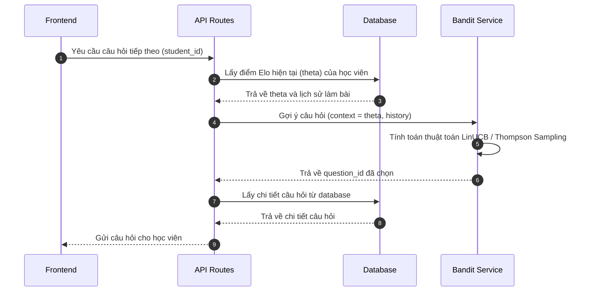
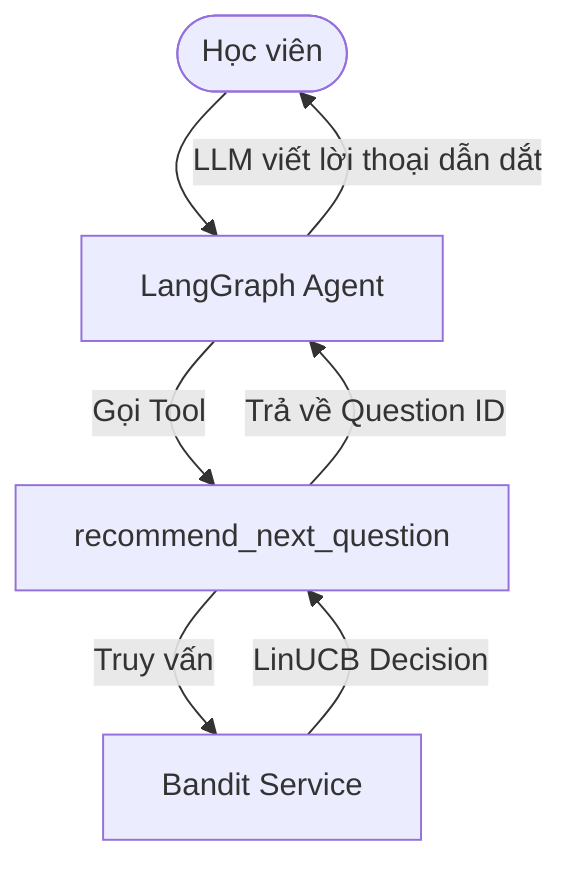

# Nghiên cứu Contextual Bandit trong Bài toán Gợi ý Bài tập Thích ứng

Tài liệu này nghiên cứu cách áp dụng thuật toán Contextual Bandit để gợi ý câu hỏi và bài tập có độ khó phù hợp với từng học viên trong hệ thống EdTech.

---

## 1. Khái niệm và Lý thuyết Nền tảng

### Multi-Armed Bandit (MAB) so với Contextual Bandit (CB) và Reinforcement Learning (RL)

* **Multi-Armed Bandit (MAB):** Dựa trên phản hồi lịch sử chung của tất cả học viên để tìm ra câu hỏi tốt nhất, sau đó gợi ý câu hỏi đó cho mọi người. MAB không có khả năng cá nhân hóa vì nó bỏ qua đặc điểm riêng của từng học viên.
* **Contextual Bandit (CB):** Gợi ý quyết định dựa trên thông tin ngữ cảnh (Context) đặc trưng của từng học viên tại thời điểm yêu cầu. Đây là kiểu đưa ra quyết định một bước (one-step decision / stateless transition). Mô hình học cách ánh xạ từ ngữ cảnh người học sang câu hỏi phù hợp nhất.
* **Reinforcement Learning (RL) đầy đủ:** Xem xét ảnh hưởng dài hạn của chuỗi gợi ý đến sự thay đổi trạng thái năng lực của học viên. RL đòi hỏi học mô hình chuyển trạng thái phức tạp, cần nguồn dữ liệu cực kỳ lớn để hội tụ và rất khó triển khai ổn định trong giai đoạn đầu.

Contextual Bandit là sự lựa chọn thực tế nhất để vừa cá nhân hóa được nội dung học tập, vừa đảm bảo tốc độ hội tụ nhanh và chi phí tính toán thấp.

### Cơ chế Hoạt động của Contextual Bandit trong EdTech

Mô hình Contextual Bandit hoạt động theo chu kỳ khép kín gồm ba thành phần:

1. **Ngữ cảnh (Context - $X$):**
   * Điểm năng lực hiện tại của học viên ($\theta$), được cập nhật theo thời gian thực bằng hệ thống điểm Elo.
   * Lịch sử làm bài gần đây, ví dụ như số câu trả lời đúng hoặc sai liên tiếp.
   * Khái niệm kiến thức (Concept) mục tiêu mà học viên đang tập trung.
   * Thống kê về thời gian làm bài trung bình của học viên.

2. **Hành động (Action - $A$):**
   * Chọn một câu hỏi cụ thể trong ngân hàng câu hỏi thuộc Concept mục tiêu.
   * Hoặc chọn một mức độ khó tương đối (ví dụ như chênh lệch giữa độ khó câu hỏi $b$ và năng lực học viên $\theta$).

3. **Phần thưởng (Reward - $R$):**
   * Mục tiêu là gợi ý câu hỏi nằm trong Vùng phát triển gần nhất (Zone of Proximal Development). Câu hỏi không được quá dễ (gây nhàm chán) và không được quá khó (gây nản lòng).
   * Nếu muốn duy trì xác suất làm đúng ở mục tiêu $75\%$, hàm phần thưởng có thể thiết kế như sau:
     $$R = 1 - 2 \cdot |P(\text{correct}) - 0.75|$$
     Trong đó xác suất làm đúng $P(\text{correct})$ được tính từ mô hình Elo:
     $$P(\text{correct}) = \frac{1}{1 + 10^{(b - \theta)/400}}$$
   * Khi có kết quả thực tế từ học viên (ví dụ: Làm đúng = 1, Làm sai = 0), giá trị phần thưởng thực tế được tính để cập nhật mô hình Bandit.

### Cân bằng giữa Exploration (Thử nghiệm) và Exploitation (Khai thác)

* **Exploitation:** Hệ thống chọn câu hỏi mà mô hình đánh giá là phù hợp nhất với học viên dựa trên các dữ liệu đã biết.
* **Exploration:** Hệ thống chọn các câu hỏi khác để thu thập dữ liệu mới, giúp xác định chính xác hơn độ khó của câu hỏi mới hoặc năng lực thực tế của học viên.
* **Các thuật toán tiêu biểu:**
  * **$\epsilon$-Greedy:** Sử dụng tỷ lệ $(1 - \epsilon)$ để khai thác và tỷ lệ $\epsilon$ để thử nghiệm ngẫu nhiên. Thuật toán này dễ triển khai nhưng không tối ưu khi không gian ngữ cảnh lớn.
  * **LinUCB (Linear Upper Confidence Bound):** Giả định phần thưởng là một hàm tuyến tính của ngữ cảnh và hành động. Thuật toán lựa chọn hành động dựa trên giới hạn trên của khoảng tin cậy để vừa khai thác vừa thử nghiệm.
  * **Thompson Sampling (Bayesian):** Lấy mẫu tham số mô hình từ phân phối xác suất hiện tại để đưa ra quyết định. Đây là cách tiếp cận mạnh mẽ để xử lý tính bất định của dữ liệu.

---

## 2. Phân tích tích hợp vào Kiến trúc Hiện tại

Kiến trúc hệ thống hiện tại gồm FastAPI backend hỗ trợ định tuyến API và một AI Agent được xây dựng bằng LangGraph.

Có hai phương án để tích hợp Contextual Bandit vào kiến trúc này:

### Phương án 1: Tích hợp trực tiếp tại API Layer (Khuyến nghị)

Contextual Bandit được viết thành một module dịch vụ độc lập trong `src/services/bandit.py`.

* **Ưu điểm:** Tốc độ phản hồi nhanh, chi phí vận hành thấp, không phụ thuộc vào LLM cho việc ra quyết định logic.
* **Nhược điểm:** Logic chọn câu hỏi bị tách rời khỏi luồng hội thoại của AI Agent nếu hệ thống cần sự dẫn dắt tự nhiên.

### Phương án 2: Tích hợp làm Agent Tool trong LangGraph

LangGraph Agent sử dụng một công cụ (Tool) để gợi ý câu hỏi.

* **Ưu điểm:** Giúp Agent chủ động điều phối luồng học tập, LLM có thể tạo ra các câu nói tiếp cận phù hợp với tâm lý người học trước khi hiển thị câu hỏi.
* **Nhược điểm:** Phải chịu thêm trễ về thời gian phản hồi (latency) và chi phí sử dụng API của LLM cho mỗi câu hỏi được gợi ý.

---

## 3. Lộ trình Triển khai đề xuất

Để triển khai tính năng này vào hệ thống adaptive, cần thực hiện các bước sau:

1. **Bước 1: Viết tài liệu quyết định kiến trúc (ADR)**
   * Tạo `ADR/adr-003-contextual-bandit-selection.md` để thống nhất phương pháp triển khai LinUCB so với Thompson Sampling và cách thức lưu trữ trọng số mô hình.
2. **Bước 2: Triển khai Bandit Service tại `src/services/bandit.py`**
   * Viết thuật toán LinUCB bằng thư viện `numpy`.
   * Thiết kế cơ sở dữ liệu để lưu trữ ma trận hiệp biến sai $A$ và vector $b$ của mô hình LinUCB cho từng nhóm câu hỏi.
3. **Bước 3: Đồng bộ cập nhật Elo và Bandit Reward**
   * Khi nhận kết quả làm bài từ Frontend, cập nhật đồng thời điểm Elo năng lực và tính toán Reward để cập nhật mô hình Bandit.
4. **Bước 4: Ghi log và giám sát (Telemetry)**
   * Theo dõi tỷ lệ làm đúng thực tế của học viên so với mục tiêu $75\%$ để điều chỉnh tham số khám phá $\alpha$ của LinUCB.
