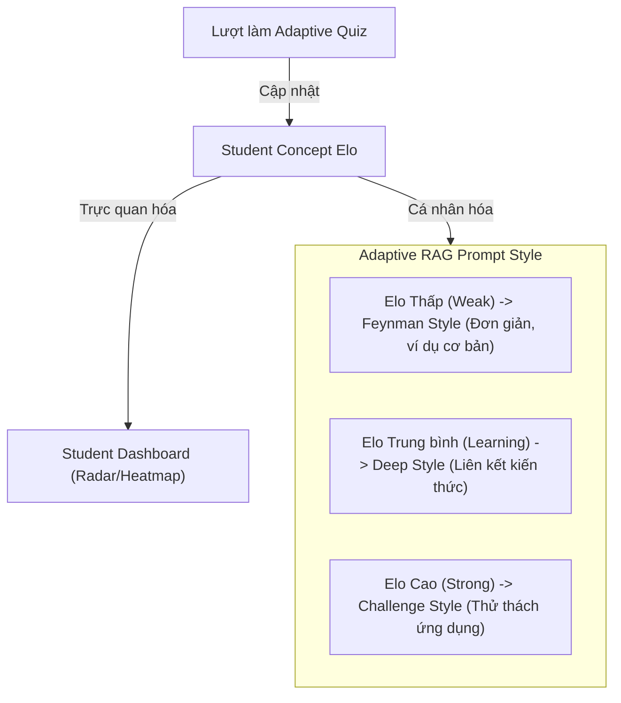

# Báo cáo Đối chiếu, Phân tích & Đề xuất Cải tiến User Story

Tài liệu này thực hiện đối chiếu chi tiết giữa **User Story trong file quản lý tiến độ Excel** và **các tài liệu/use cases hiện có trong Docs**. Đồng thời, tài liệu đề xuất giải pháp cải tiến để **tích hợp ngược** Hệ thống trắc nghiệm thích ứng (Adaptive Quizzes), tính điểm Elo cho Concept/Câu hỏi và Dashboard Radar/Heatmap vào phạm vi MVP của dự án.

---

## 1. Phân tích & So sánh Danh sách User Story

### A. Danh sách User Story hiện tại trong Excel (US-001 đến US-018)
Tập trung vào phần **Socratic Chat RAG & Ingestion**:
* **Học viên**: Hỏi khái niệm (US-001), Xem citation card (US-002), Làm rõ câu hỏi mơ hồ (US-003), Off-scope guardrail (US-004), Socratic hint khi hỏi bài lab (US-005), Chọn 5 chế độ chat (US-006), Đánh giá feedback (US-007), Ghi learning signals (US-008), Xem learning plan được giao (US-014), Nhận fallback khi low-confidence (US-017).
* **Mentor/Admin**: Nhập tài liệu (US-009), Test nhanh RAG (US-010), Quản lý draft/publish (US-011), Xem log câu hỏi lỗi (US-012), Giao bài luyện (US-013), RBAC (US-015), Chạy golden test (US-016), Xuất evidence demo (US-018).

### B. Danh sách User Story bổ sung từ tài liệu Docs (Hệ thống Adaptive Quiz & Dashboard)
Để đưa Adaptive Quiz, Elo scoring và Dashboard hiển thị năng lực học viên vào MVP, ta tích hợp thêm các User Story sau:
* **US-019 (Làm trắc nghiệm thích ứng - ZPD)**: Với vai trò *Học viên*, tôi muốn *hệ thống tự động chọn câu hỏi trắc nghiệm có độ khó vừa sức (vùng ZPD: dự kiến tỷ lệ đúng 70%-75% dựa trên điểm Elo hiện tại)* để *tối ưu hóa tốc độ tiếp thu kiến thức*.
* **US-020 (Tính điểm Elo cho học viên)**: Với vai trò *Học viên*, tôi muốn *điểm Elo năng lực của tôi tự động cập nhật sau mỗi lượt trả lời quiz (tăng khi làm đúng, giảm khi làm sai)* để *theo dõi chính xác mức độ tiến bộ của bản thân*.
* **US-021 (Hiệu chỉnh Elo câu hỏi)**: Với vai trò *Hệ thống/Giảng viên*, tôi muốn *độ khó (Elo) của câu hỏi tự động hiệu chỉnh sau mỗi lượt trả lời của sinh viên* để *ngân hàng đề thi ngày càng chính xác*.
* **US-022 (Socratic Hint trong Quiz & Phạt Elo)**: Với vai trò *Học viên*, tôi muốn *được AI gợi ý từng bước (Socratic hints) khi gặp câu hỏi khó trong quiz* để *tự suy luận ra đáp án, đồng thời chấp nhận bị trừ bớt số điểm Elo nhận được khi làm đúng*.
* **US-023 (Dashboard Radar & Heatmap)**: Với vai trò *Học viên*, tôi muốn *xem biểu đồ Radar năng lực (Elo từng concept) và Heatmap chuyên cần* để *biết rõ mình mạnh/yếu ở đâu và duy trì thói quen tự học*.
* **US-024 (Class Insight Dashboard cho Mentor)**: Với vai trò *Mentor*, tôi muốn *xem biểu đồ tổng quan về điểm Elo trung bình của lớp và các concept có nhiều học viên yếu nhất* để *điều chỉnh nội dung giảng dạy kịp thời*.

---

## 2. Đề xuất cải tiến & Móc nối giữa RAG Chat và Adaptive Quiz

Sự cải tiến đột phá nằm ở việc **kết nối hai phân hệ** (Chat RAG và Adaptive Quiz) thông qua chỉ số **Concept Elo**:

### Đề xuất 1: Cá nhân hóa câu trả lời RAG dựa trên điểm Elo làm Quiz
* **Cải tiến US-001 / US-006**: Thay vì học sinh tự chọn mode giải thích, hệ thống sẽ tự động đọc điểm Elo hiện tại của học sinh đối với concept được hỏi.
  * Nếu **Elo < 800 (Weak)**: AI Tutor tự động giải thích theo kiểu Feynman (đơn giản, dễ hiểu, dùng ẩn dụ).
  * Nếu **Elo từ 800 - 1200 (Learning)**: AI Tutor giải thích sâu, liên kết với các slide bài học và concept liên quan.
  * Nếu **Elo > 1200 (Strong)**: AI Tutor không giải thích trực tiếp mà đưa ra câu hỏi gợi mở, thử thách (Socratic Challenge) để học sinh tự ứng dụng.

### Đề xuất 2: Quy tắc phạt Elo khi sử dụng trợ lý Socratic trong Quiz
* **Cải tiến US-022**: Tích hợp chặt chẽ Socratic Chat vào trong Sidebar của Quiz. Thiết lập công thức Elo Discount:
  * Không dùng Hint: Nhận 100% Elo thưởng khi làm đúng.
  * Dùng 1 Hint: Nhận 70% Elo thưởng.
  * Dùng 2 Hint trở lên: Nhận 40% Elo thưởng.
  * Làm sai: Bị trừ Elo tiêu chuẩn (để tránh học sinh spam hint mà không chịu suy nghĩ).

### Đề xuất 3: Ingestion Pipeline kết hợp Question Generation tự động
* **Cải tiến US-009**: Khi giảng viên upload tài liệu, hệ thống RAG không chỉ chunk/embed tài liệu đó mà AI Microservice sẽ tự động sinh ngân hàng câu hỏi quiz tương ứng với các concept trong tài liệu đó, kèm theo 3 mức gợi ý Socratic (light, medium, deep). Giảng viên chỉ cần duyệt (HITL) trước khi đưa vào ngân hàng trắc nghiệm thích ứng.

---

## 3. Danh sách User Story hợp nhất cho MVP

1. **US-001 (Concept Chat)**: Hỏi kiến thức và nhận giải thích cá nhân hóa theo mức Elo hiện có.
2. **US-002 (Citations)**: Hiển thị slide, trang và excerpt nguồn trong câu trả lời.
3. **US-003 (Clarifying)**: AI hỏi lại khi câu hỏi thiếu ngữ cảnh.
4. **US-004 (Off-scope)**: Từ chối lịch sự câu hỏi ngoài chương trình học.
5. **US-005 (Cheat Prevention)**: Không giải hộ bài tập lab/gate, dùng hint ladder.
6. **US-006 (Chat Modes)**: Lựa chọn 5 chế độ chat (Giải thích, Gợi ý, Debug, Luyện tập, Review).
7. **US-007 (Feedback)**: Student gửi feedback 👍/👎/⚠️ báo lỗi trích dẫn.
8. **US-008 (Learning Signal)**: Ghi log chi tiết phiên học tập.
9. **US-009 (Ingestion & QGen)**: Upload PDF/PPTX, tự động sinh concept và câu hỏi trắc nghiệm đi kèm.
10. **US-010 (RAG Preview)**: Test nhanh RAG trước khi publish.
11. **US-011 (Publish Workflow)**: Quản lý trạng thái draft/published của tài liệu và câu hỏi.
12. **US-012 (Audit Log)**: Mentor review các ca low-confidence và feedback kém.
13. **US-013 (Learning Plan Assign)**: Mentor giao bài tập cải thiện cho sinh viên yếu (Post-MVP).
14. **US-014 (Learning Plan View)**: Student xem nhiệm vụ học tập được giao (Post-MVP).
15. **US-015 (RBAC)**: Phân quyền Student, Mentor, BTC/Admin.
16. **US-016 (Golden Tests)**: Bộ test suite tĩnh 15-50 cases đánh giá chất lượng RAG và Guardrail.
17. **US-017 (Low Confidence Fallback)**: Fallback an toàn khi thiếu nguồn thông tin đáng tin cậy.
18. **US-018 (Demo Evidence)**: Xuất báo cáo kết quả và log để chứng minh hệ thống hoạt động.
19. **US-019 (Adaptive Quiz)**: Làm trắc nghiệm thích ứng dựa trên thuật toán ZPD (tỷ lệ thành công 70%-75%).
20. **US-020 (Student Elo Update)**: Tự động cập nhật điểm năng lực Elo của sinh viên sau mỗi attempt.
21. **US-021 (Item Elo Update)**: Tự động hiệu chỉnh độ khó câu hỏi dựa trên tỉ lệ trả lời đúng/sai của tập sinh viên.
22. **US-022 (Socratic Quiz Hint)**: Sử dụng trợ lý Socratic trong Quiz và áp dụng Elo Discount factor.
23. **US-023 (Student Dashboard)**: Hiển thị biểu đồ Radar năng lực và Heatmap chuyên cần.
24. **US-024 (Class Insight Dashboard)**: Mentor xem thống kê Elo trung bình của lớp và danh sách học viên cần can thiệp.
