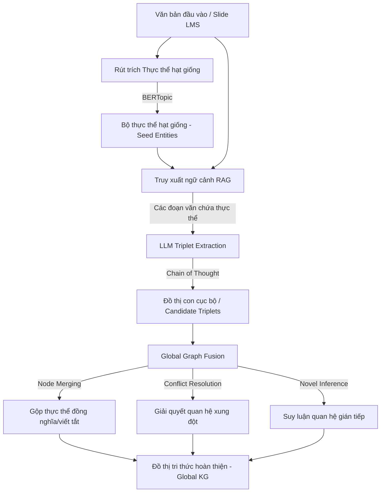
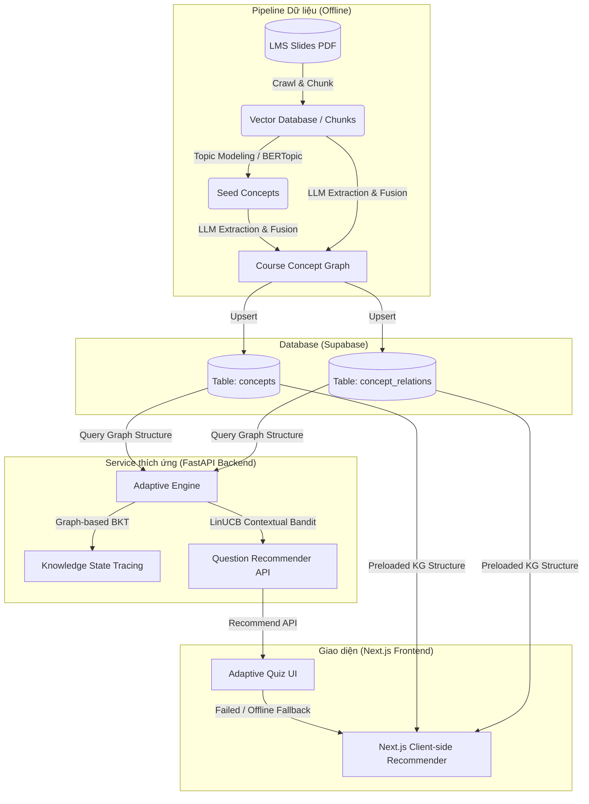

# Nghiên cứu: Graphusion — Xây dựng Đồ thị tri thức Khoa học bằng Khung RAG

Tài liệu này tóm tắt kết quả nghiên cứu bài báo *"Graphusion: A RAG Framework for Scientific Knowledge Graph Construction with a Global Perspective"* (WWW '25) và đề xuất phương án ứng dụng thuật toán này vào dự án **ai20kekeke** để tự động hóa xây dựng sơ đồ khái niệm bài học, tối ưu hóa công cụ gợi ý thích ứng (BKT/Bandit) và Chatbot Socratic.

---

## 1. Tổng quan nghiên cứu
* **Tên bài báo:** *Graphusion: A RAG Framework for Scientific Knowledge Graph Construction with a Global Perspective*
* **Link lưu trữ:** [arXiv:2410.17600v1](https://arxiv.org/abs/2410.17600v1)
* **Mục tiêu:** Khắc phục hạn chế của các phương pháp xây dựng đồ thị tri thức (KGC) cục bộ bằng cách triển khai quy trình hợp nhất toàn cục (Global Fusion), giải quyết các thực thể viết tắt/đồng nghĩa, xung đột quan hệ và suy luận các liên kết tiềm ẩn.

---

## 2. Quy trình hoạt động của Graphusion (Workflow)

### Các bước triển khai chính:
1. **Seed Entity Generation:** Áp dụng mô hình hóa chủ đề (BERTopic) lên toàn bộ kho văn bản đầu vào để lọc ra các khái niệm lõi, đóng vai trò là các node hạt giống.
2. **Candidate Triplet Extraction:** Với mỗi thực thể hạt giống, truy xuất các đoạn văn bản chứa nó từ kho tài liệu. Sử dụng LLM và kỹ thuật Chain-of-Thought (CoT) để trích xuất các bộ ba quan hệ. Hướng quan hệ tập trung vào 7 loại quan hệ học thuật:
   * `Prerequisite_of` (Điều kiện tiên quyết)
   * `Used_for` (Ứng dụng cho)
   * `Compare` (So sánh)
   * `Conjunction` (Liên kết đồng hành)
   * `Hyponym_of` (Quan hệ bao hàm)
   * `Evaluate_for` (Đánh giá)
   * `Part_of` (Thành phần cấu thành)
3. **Graph Fusion:** Gom các đồ thị con cục bộ lại và chạy quy trình hợp nhất toàn cục sử dụng LLM để dọn dẹp các nút trùng lặp, giải quyết mâu thuẫn quan hệ và suy luận thêm các cạnh mới.

---

## 3. Đề xuất Kiến trúc Tích hợp cho Dự án ai20kekeke

Dưới đây là sơ đồ tích hợp Graphusion vào hệ thống FastAPI + Next.js + Supabase hiện tại của dự án:

### Chi tiết cách áp dụng:

### A. Tự động hóa bản đồ bài học (Course Concept Map)
Thay vì các lập trình viên/chuyên gia phải tự gán thủ công quan hệ tiên quyết giữa các bài học, pipeline Graphusion sẽ tự động phân tích slide bài giảng thu được từ crawler (`DATA-CRAWL-SLIDES-TO-PDF-DAILY`) để sinh ra đồ thị tri thức môn học.

### B. Tối ưu hóa thuật toán Elo/BKT & LinUCB
* **BKT có cấu trúc đồ thị:** Hiện tại, BKT coi các kỹ năng là độc lập. Với đồ thị quan hệ `Prerequisite_of` được lưu trữ, nếu học viên trả lời sai khái niệm cơ sở (ví dụ: *Variables*), hệ thống BKT sẽ tự động cập nhật giảm mức độ nắm vững (knowledge state) ở các khái niệm nâng cao phụ thuộc (ví dụ: *Functions*).
* **Khuyến nghị câu hỏi:** LinUCB có thể sử dụng vị trí khoảng cách đồ thị (graph distance) của câu hỏi hiện tại tới vùng ZPD của học viên làm đặc trưng đầu vào (context features) để đưa ra đề xuất bài tập chính xác hơn.
* **Next.js Client-side Fallback:** Khi API gợi ý gặp sự cố, Next.js Frontend có thể sử dụng Đồ thị tri thức đã tải sẵn từ trước để tính toán và tìm các câu hỏi tiên quyết có độ khó thấp hơn ngay trên client.

### C. Nâng cấp Chatbot Socratic (GraphRAG)
Thay vì chỉ dùng Vector DB tìm kiếm tương đồng trên text thô, Chatbot RAG của bạn sẽ truy vấn Supabase để lấy thông tin đồ thị tri thức quanh chủ đề học viên đang hỏi, giúp chatbot trả lời có tính hệ thống sư phạm cao hơn (ví dụ: giới thiệu các khái niệm tiên quyết trước khi giải thích thuật toán phức tạp).
