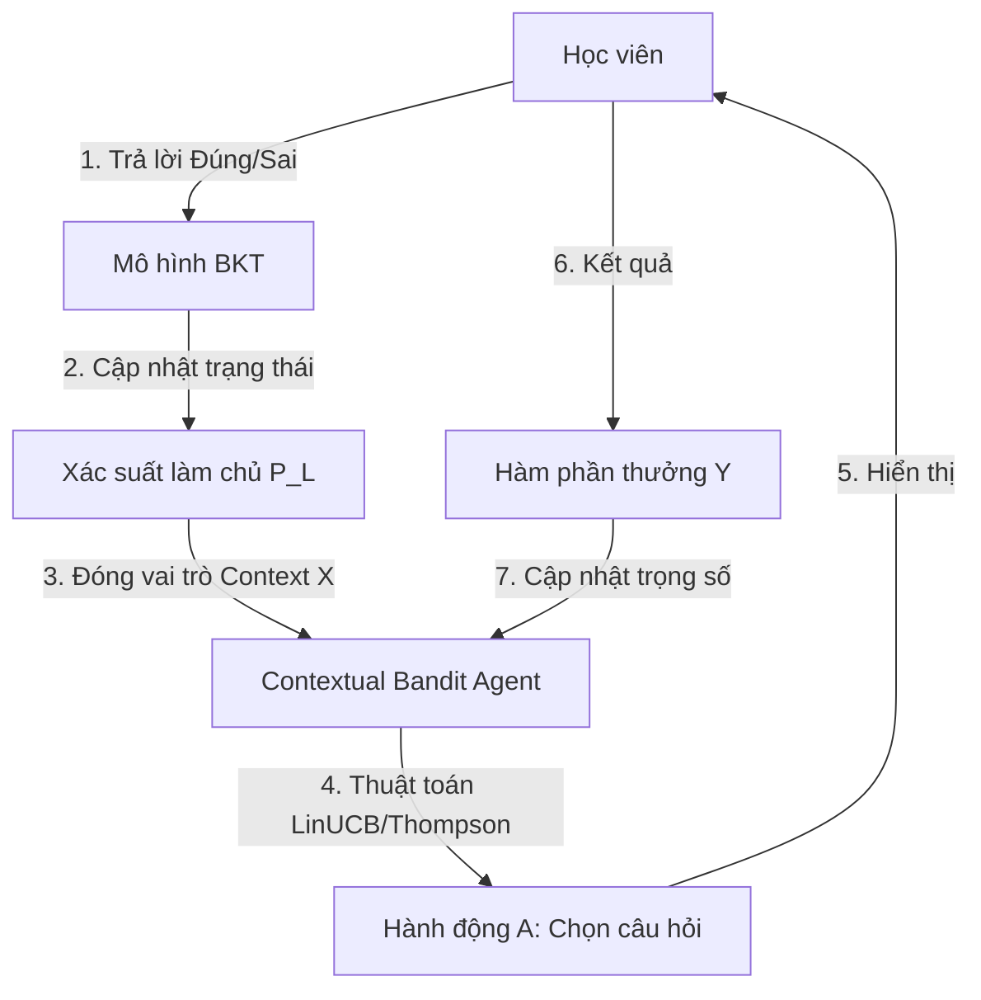

# Nghiên cứu và Ứng dụng MOOClet Framework trong Học tập Thích ứng

Tài liệu này trình bày chi tiết về mô hình MOOClet (Modular Experimentation and Personalization), cách tích hợp nó cùng với Bayesian Knowledge Tracing (BKT) và thiết kế hệ thống tối ưu cho C2-App-125.

---

## 1. MOOClet là gì?

**MOOClet** là một mô hình kiến trúc dạng module (tuple $M = (V, U, P)$) nhằm thống nhất hai tác vụ: **thử nghiệm A/B** và **cá nhân hóa thích ứng (Contextual Bandit)** thành một giao thức duy nhất. 

### Ba thành phần cốt lõi:
1. **$V = \{v_1, v_2, \ldots, v_K\}$ (Alternate Versions / Arms)**: Các biến thể nội dung thay thế cho nhau (ví dụ: các phiên bản câu hỏi khác nhau của cùng một kỹ năng).
2. **$U$ (User Variable Store - UVS)**: Nơi lưu trữ ngữ cảnh học viên (Context $X$) như xác suất làm chủ kiến thức từ BKT, điểm Elo, lịch sử làm bài.
3. **$P$ (Selection Policy)**: Chính sách gán phiên bản cho học viên dựa trên Context $X$: $P(V = v \mid X = x) = p_v(x)$.

---

## 2. Kiến trúc Tích hợp: BKT + Contextual Bandit

Sự kết hợp này tạo ra một vòng lặp học tập thích ứng thông minh:



* **BKT đóng vai trò Bộ ước lượng trạng thái (State Estimator)**: Đầu ra của BKT ($P(L_t)$) đóng vai trò là Context $X$ đưa vào Bandit.
* **Contextual Bandit đóng vai trò Bộ chọn hành động (Action Selector)**: Quyết định độ khó hoặc ID câu hỏi tối ưu nhất với năng lực hiện tại của học viên để giữ học viên trong Vùng phát triển gần nhất (ZPD).

---

## 3. Thiết kế Thực tế cho C2-App-125

### Database Schema (Prisma)

```prisma
// 1. Quản lý cấu phần thích ứng và các phiên bản nội dung (V)
model Mooclet {
  id          String        @id @default(uuid())
  conceptId   String        // Ví dụ: "concept-derivatives" (Đạo hàm)
  policyType  String        // Thuật toán: "LinUCB", "Thompson_Sampling", "AB_Test"
  versions    Version[]
  interactions Interaction[]
}

model Version {
  id          String        @id @default(uuid())
  moocletId   String
  mooclet     Mooclet       @relation(fields: [moocletId], references: [id])
  content     Json          // Đề bài, đáp án
  difficulty  Float         // Độ khó câu hỏi
  interactions Interaction[]
}

// 2. Lưu trữ Context của người học (U)
model LearnerState {
  id          String        @id @default(uuid())
  studentId   String
  conceptId   String
  pMastery    Float         @default(0.15) // Xác suất BKT P(L)
  lastUpdated DateTime      @updatedAt

  @@unique([studentId, conceptId])
}

// 3. Nhật ký gán phiên bản và Reward (Y) để huấn luyện máy học
model Interaction {
  id             String     @id @default(uuid())
  studentId      String
  moocletId      String
  mooclet        Mooclet    @relation(fields: [moocletId], references: [id])
  versionId      String
  version        Version    @relation(fields: [versionId], references: [id])
  contextMastery Float      // Context X tại thời điểm gán
  reward         Float?     // Reward Y: 1.0 (Đúng), 0.0 (Sai)
  timestamp      DateTime   @default(now())
}
```

### Thiết kế API Flow (FastAPI)

```python
# API Gợi ý Câu hỏi: /api/v1/recommend
@router.post("/recommend")
def get_next_question(req: RecommendRequest, db: Session = Depends(get_db)):
    # 1. Lấy Mooclet và thuật toán được cấu hình
    mooclet = crud.get_mooclet_by_concept(db, req.concept_id)
    
    # 2. Lấy xác suất BKT làm Context X
    learner_state = crud.get_or_create_learner_state(db, req.student_id, req.concept_id)
    context_x = learner_state.p_mastery 

    # 3. Policy Engine chọn câu hỏi tối ưu (ví dụ: LinUCB)
    selected_version = bandit_engine.select_version(
        policy_type=mooclet.policy_type,
        versions=mooclet.versions,
        context_x=context_x,
        db=db
    )

    # 4. Ghi log tương tác
    interaction = crud.create_interaction(
        db, student_id=req.student_id, mooclet_id=mooclet.id,
        version_id=selected_version.id, context_mastery=context_x
    )

    return {"interaction_id": interaction.id, "question_content": selected_version.content}

# API Nhận Kết quả: /api/v1/submit
@router.post("/submit")
def submit_answer(req: SubmitRequest, db: Session = Depends(get_db)):
    reward = 1.0 if req.is_correct else 0.0
    # 1. Cập nhật Reward Y vào Interaction log
    interaction = crud.update_interaction_reward(db, req.interaction_id, reward)

    # 2. Chạy công thức cập nhật BKT cho học viên
    p_mastery_old = crud.get_learner_mastery(db, interaction.student_id, req.concept_id)
    p_mastery_new = update_bkt_state(p_mastery_old, req.is_correct)
    crud.update_learner_mastery(db, interaction.student_id, req.concept_id, p_mastery_new)

    # 3. Cập nhật trọng số của thuật toán Bandit
    bandit_engine.update_weights(interaction.version_id, interaction.context_mastery, reward)

    return {"status": "success", "new_mastery": p_mastery_new}
```

---

## 4. Tại sao MOOClet tối ưu lượng code và vận hành?

* **Không viết code cứng (No Hardcoding)**: Bạn không cần viết hàng chục câu lệnh `if-else` phức tạp để định tuyến câu hỏi cho từng level học viên.
* **Thay đổi thuật toán linh hoạt**: Chỉ cần thay đổi giá trị cấu hình `policyType` trong cơ sở dữ liệu để chuyển đổi giữa các chiến lược gợi ý (A/B Test, Elo, BKT, LinUCB) mà không cần chỉnh sửa hoặc deploy lại mã nguồn backend.
* **Tích lũy dữ liệu chuẩn hóa**: Thiết kế theo bộ dữ liệu `Context - Action - Reward` giúp việc tích hợp các mô hình AI/RAG nâng cao sau này trở nên cực kỳ đơn giản và nhất quán.

---

## 5. Tài liệu & Nguồn tham khảo mở rộng

* **Paper gốc**: [Supporting Instructors in Collaborating with Researchers using MOOClets](https://arxiv.org/abs/1502.04247) (Williams et al., 2015).
* **Thư viện huấn luyện BKT**: [pyBKT (GitHub)](https://github.com/CAHLR/pyBKT) - Thư viện mã nguồn mở phổ biến nhất của Stanford/Berkeley để chạy mô hình Bayesian Knowledge Tracing.
* **MOOClet Framework Codebase**: [cognitive-technologies/mooclet (GitHub)](https://github.com/cognitive-technologies/mooclet) - Dự án mã nguồn mở của Harvard triển khai các API và Policy Engine phục vụ giáo dục.
