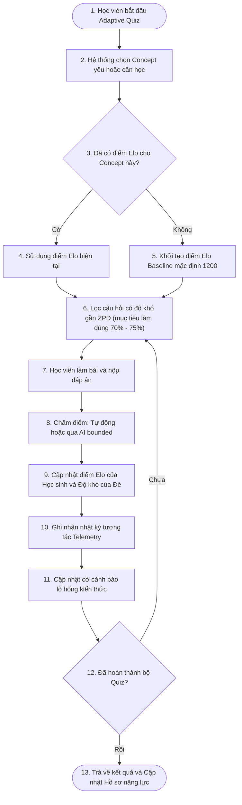
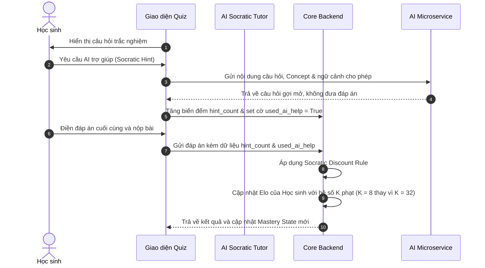
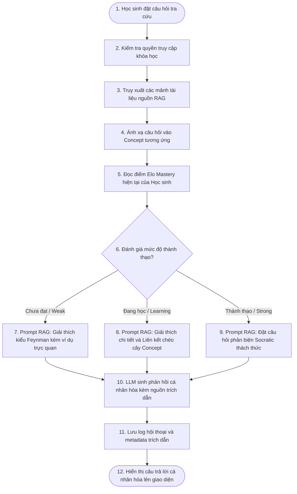
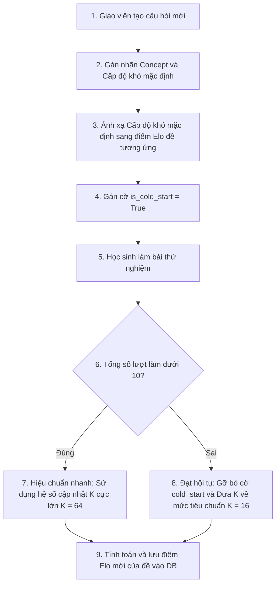
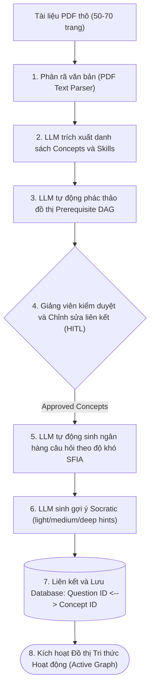
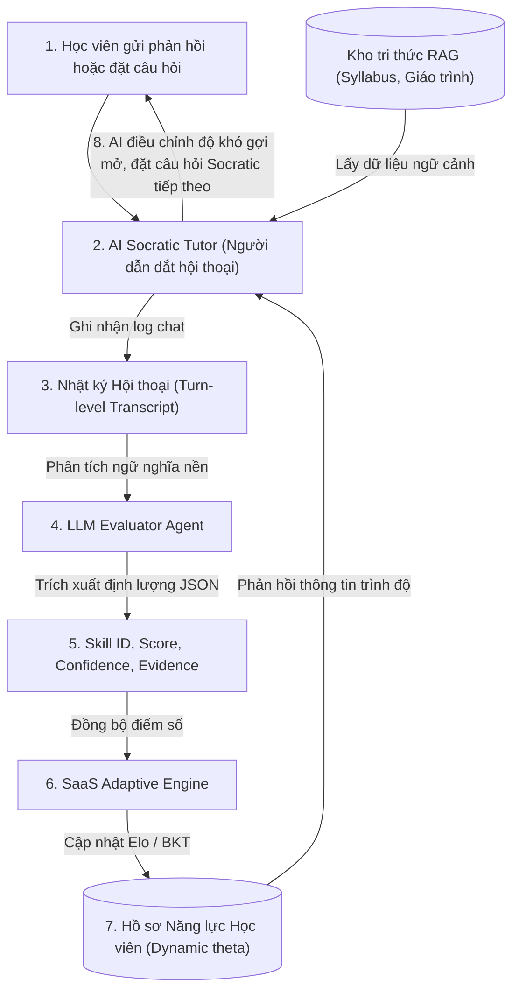
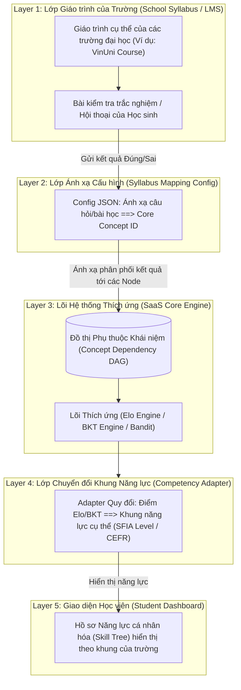

# Khung Kỹ Thuật Adaptive Learning Unified & Các Luồng Nghiệp Vụ Người Dùng (User Stories)

Tài liệu này hợp nhất các nghiên cứu học thuật, kiến trúc phân tầng hệ thống và các luồng tương tác người dùng (User Stories) chi tiết cho hệ thống **Adaptive Learning** (Học tập Thích ứng). Mục tiêu là thiết lập một nền tảng kỹ thuật vững chắc hỗ trợ đầy đủ các giai đoạn phát triển từ MVP (tối giản, chạy ngay), Post-MVP (cải tiến nâng cao) đến Research (nghiên cứu mở rộng).

---

## I. CÁC LUỒNG NGHIỆP VỤ NGƯỜI DÙNG CHỦ ĐẠO (USER STORIES)

### 1. Luồng Làm Bài Quiz Thích Ứng & Cập Nhật Mastery (ZPD Quiz)

> **User Story:** 
> *Là một học sinh,* tôi muốn khi thực hiện các bài trắc nghiệm ôn tập, các câu hỏi được đưa ra sẽ tự động nâng hoặc hạ độ khó thích ứng trực tiếp với trình độ của tôi, đồng thời khi tôi chuyển qua một mảng kiến thức hoàn toàn mới thì hệ thống sẽ đưa độ khó về mức cơ bản ban đầu để tránh việc tôi bị nản lòng bởi các câu hỏi quá khó ngay từ đầu.

#### Phạm vi Triển khai chi tiết:
* **MVP:**
  * Dùng thuật toán Elo tĩnh cập nhật sau mỗi lượt trả lời (student Elo $\theta$ và item difficulty $d$).
  * Lựa chọn câu hỏi theo nguyên lý ZPD (Zone of Proximal Development) hướng tới xác suất làm đúng cố định trong khoảng $P(\text{correct}) \in [0.70, 0.75]$.
  * Khi chuyển sang Concept mới chưa có dữ liệu, khởi tạo Elo Baseline mặc định ($1200$ Elo) thay vì tính thừa kế phức tạp để tránh Data Sparsity.
* **Post-MVP:**
  * Áp dụng mô hình mạng Bayesian BKT (Bayesian Knowledge Tracing) làm lớp phủ (overlay) để phân cấp trạng thái: yếu, đang học, hoặc đã làm chủ.
  * Kế thừa Elo xuất phát dựa trên khoảng cách giữa các node trên cây quan hệ Prerequisites (tiền đề).
* **Research:**
  * Ứng dụng lý thuyết IRT (Item Response Theory) / mô hình Rasch hiệu chuẩn tham số câu hỏi ngoại tuyến (offline batch calibration).
  * Thuật toán Thompson Sampling hoặc Contextual Bandit (LinUCB) để tối ưu hóa việc chọn câu hỏi thay vì dùng ZPD tĩnh.

---

### 2. Trợ Lý Socratic Trong Quiz & Cập Nhật Hệ Số Phạt Elo (Socratic Discount)

> **User Story:** 
> *Là một học sinh,* tôi muốn khi gặp câu hỏi quá khó trong bài Quiz ôn tập, tôi có thể bấm hỏi AI để được giải thích khái niệm hoặc gợi ý lý thuyết liên quan. Tuy nhiên, AI không được đưa ra đáp án trực tiếp mà phải đặt câu hỏi dẫn dắt từng bước (Socratic) để tôi tự suy nghĩ ra đáp án. Khi tôi làm đúng nhờ sự trợ giúp này, hệ thống phải tự động tính toán hệ số phạt điểm cập nhật để phân biệt giữa việc tôi tự làm đúng hoàn toàn với việc làm đúng nhờ AI gợi mở.

#### Quy tắc Phạt hệ số K (Socratic Discount Rule) trong MVP:
| Kiểu làm bài (Attempt type) | Cách thức cập nhật Mastery / Elo |
| --- | --- |
| **Đúng hoàn toàn (Không hỏi AI)** | Nhận trọn vẹn điểm Elo cải thiện ($K = 32$). |
| **Đúng nhờ AI gợi mở (Hỏi Socratic)** | Nhận điểm Elo cải thiện bị giảm dựa theo số lượng gợi ý ($K = 8$). |
| **Sai hoàn toàn (Không hỏi AI)** | Cập nhật giảm điểm Elo tiêu chuẩn ($K = 32$). |
| **Sai mặc dù đã hỏi AI** | Giảm điểm Elo tiêu chuẩn hoặc áp dụng giảm nhẹ tùy thuộc vào chính sách sư phạm. |

---

### 3. Tra Cứu Tài Liệu RAG Thích Ứng Theo Năng Lực (Adaptive RAG)

> **User Story:** 
> *Là một học sinh,* tôi muốn khi tôi tra cứu tài liệu học tập hoặc đặt câu hỏi tự do cho AI Tutor, kết quả trả về phải thích ứng chính xác với trình độ hiện tại của tôi trên hệ thống. Ví dụ: Nếu tôi mới học hoặc đang yếu Concept đó, AI sẽ giải thích siêu đơn giản (dùng phương pháp Feynman); nếu tôi đang ở mức trung bình, AI giải thích chi tiết hơn và liên kết các khái niệm; còn nếu tôi đã giỏi, AI sẽ không giải thích trực tiếp mà đưa ra các câu hỏi phản biện nâng cao.

#### Các mức độ phản hồi thích ứng (Feynman - Deep - Challenge):
1. **Weak (Chưa đạt - Elo thấp):** Trọng tâm là giải thích trực quan, lược bỏ thuật ngữ chuyên ngành phức tạp, sử dụng các phép ẩn dụ thực tế.
2. **Learning (Đang phát triển - Elo trung bình):** Cung cấp tài liệu sâu rộng hơn, chỉ ra các lỗi sai phổ biến và liên kết trực tiếp với các Concepts đã làm chủ trước đó trên cây đồ thị.
3. **Strong (Thành thạo - Elo cao):** Kích hoạt chế độ "Peer review/Challenge". AI không trả lời ngay mà đưa ra các bài toán biên (edge cases) yêu cầu học sinh chứng minh năng lực ứng dụng thực tế.

---

### 4. Khởi Đầu Lạnh Câu Hỏi Mới (Item Cold Start Calibration)

> **User Story:** 
> *Là một giáo viên,* tôi muốn khi tôi tạo mới một câu hỏi trắc nghiệm trong ngân hàng đề, hệ thống sẽ tự động phân loại độ khó ban đầu dựa trên tag gán nhãn của tôi và nhanh chóng hiệu chuẩn chính xác độ khó thực tế của câu hỏi đó chỉ sau một số lượng ít học sinh làm thử ban đầu mà không làm sai lệch lớn điểm số của học sinh.

#### Quy tắc hiệu chuẩn nhanh trong MVP:
* **Khởi tạo:** Giáo viên tag cấp độ năng lực (Ví dụ: Dễ $\to$ 1000 Elo, Trung bình $\to$ 1200 Elo, Khó $\to$ 1400 Elo).
* **Giai đoạn lạnh (`is_cold_start = True`):** Trong 10 lượt làm bài đầu tiên của học sinh, áp dụng $K_{item} = 64$ để điểm Elo của câu hỏi nhảy cực nhanh về vùng giá trị thực tế dựa trên tỷ lệ làm đúng/sai của học sinh.
* **Giai đoạn ổn định:** Sau 10 lượt làm bài, gỡ bỏ cờ, đưa về hệ số ổn định $K_{item} = 16$.

---

### 5. Ingestion Pipeline Khai Thác Nội Dung & Tự Động Sinh Đề (PDF to Active Graph)

> **User Story:** 
> *Là một giảng viên,* tôi muốn khi tôi tải lên một file tài liệu slide bài giảng hoặc sách PDF nặng từ 50-70 trang, hệ thống sẽ tự động phân rã văn bản, nhận diện các Concept cốt lõi, phác thảo đồ thị DAG (tiền đề) và tự sinh ngân hàng câu hỏi thích ứng kèm gợi ý Socratic để tôi kiểm duyệt nhanh trước khi xuất bản cho học sinh làm bài.

#### Các bước xử lý trong Pipeline:
1. **Document Parsing:** Sử dụng các thư viện chuẩn (như `pypdf`) để đọc nội dung text và phân nhóm theo page ranges.
2. **DAG Extraction:** LLM xử lý ngữ nghĩa để nhận diện mối quan hệ tiên quyết giữa các Concept (Ví dụ: Concept A là Prerequisites của Concept B).
3. **HITL (Human-in-the-loop) Gate:** Giảng viên kiểm duyệt trực tiếp trên giao diện Dashboard kéo thả để sửa đổi các liên kết DAG bị sai lệch trước khi cho phép sinh đề.
4. **Item Generation & Scaffolding:** LLM sinh câu hỏi trắc nghiệm kèm giải thích chi tiết lý do sai của từng distractor và biên soạn trước 3 cấp độ gợi ý Socratic (nhẹ, vừa, sâu) để lưu trữ sẵn trong DB, tiết kiệm chi phí chạy LLM thời gian thực.

---

### 6. Vòng Lặp Thích Ứng Socratic Hợp Nhất & Đánh Giá Hội Thoại (Unified Loop)

> **User Story:** 
> *Là một học sinh,* tôi muốn khi tôi thảo luận chuyên sâu hoặc thực hành luyện tập hội thoại tự do với AI Tutor, hệ thống sẽ phân tích các câu hỏi và câu trả lời của tôi để liên tục đánh giá ngầm năng lực của tôi, đồng thời điều chỉnh độ khó của câu hỏi dẫn dắt tiếp theo của AI mà không bắt tôi phải làm các bài trắc nghiệm thông thường.

#### Sơ đồ Vòng lặp Hợp nhất Socratic & Thích ứng thời gian thực (Unified Loop):

#### Cơ chế hoạt động của Đánh giá Hội thoại:
1. **Semantic Signal Extraction:** LLM Evaluator chạy ngầm để phát hiện lỗ hổng kiến thức dựa trên cách sinh viên tương tác (Ví dụ: sinh viên không biết cách sử dụng biến môi trường khi được hỏi về Docker $\to$ Node `env_variables` bị hụt điểm).
2. **Dynamic Scaffolding Adjustments:**
   * **Năng lực tăng:** Giảm bớt gợi ý (Fading Scaffolding), đưa ra câu hỏi mang tính ứng dụng thực tiễn cao hơn.
   * **Năng lực giảm:** Tăng cường gợi ý chi tiết (Hints), lùi bước sư phạm về các khái niệm nền tảng (Backtracking).

---

## II. KIẾN TRÚC PHÂN TẦNG HỆ THỐNG (3 LAYERS SAAS ARCHITECTURE)

Để đảm bảo hệ thống có thể mở rộng quy mô thành một giải pháp **SaaS đa trường học** (decoupled từ syllabus riêng biệt của từng trường đại học như VinUni), kiến trúc lõi được chia thành **3 lớp độc lập**:

### Chi tiết 3 Lớp Lõi (MVP Decoupled):
1. **Syllabus Mapping Layer (Lớp Ánh xạ Giáo trình):** Lưu trữ file cấu hình JSON ánh xạ các câu hỏi thực tế từ LMS của trường vào các Concept ID chung trên hệ thống của chúng ta. Lớp này giúp hệ thống hoạt động như một SaaS cắm-rút (plug-and-play).
2. **Core Dependency Graph DAG (Lớp Đồ thị Tri thức Lõi):** Quản lý quan hệ phụ thuộc giữa các node kiến thức trừu tượng, hoàn toàn không phụ thuộc vào cấu trúc bài giảng của trường. Điểm số Elo và độ thành thạo BKT được tính toán và lưu trữ tại các node này.
3. **Competency Translation Layer (Lớp Dịch Khung Năng lực):** Lớp adapter quy đổi điểm Elo/BKT nội bộ thành các cấp bậc năng lực theo yêu cầu của từng trường (Ví dụ: Quy đổi sang 5 Cấp độ SFIA của VinUni hoặc cấp độ A1-C2 của CEFR).

---

## III. PHÂN TÍCH RỦI RO & PHƯƠNG ÁN TỐI ƯU CHI PHÍ VẬN HÀNH (OPERATIONAL COSTS)

### 1. Quản lý Rủi ro Hệ thống (Failure Modes & Mitigations)

| Rủi ro | Mức độ nguy hiểm | Giải pháp khắc phục (Mitigation) |
| --- | --- | --- |
| **AI chấm điểm sai lệch** (AI grading variance) | Cao | Giới hạn điểm số trong khoảng xác định, sử dụng chấm điểm deterministic cho trắc nghiệm và chỉ dùng LLM chấm cho tự luận ngắn có giám sát. |
| **Data Sparsity gây nhiễu khuyến nghị** | Trung bình | Sử dụng thuật toán ZPD tĩnh trong giai đoạn MVP. Chỉ kích hoạt Thompson Bandit khi hệ thống thu thập đủ số lượng tương tác ổn định. |
| **Lạm dụng AI gợi ý làm lệch điểm Elo** | Cao | Áp dụng quy tắc phạt **Socratic Discount Rule** để giảm tối đa hệ số cập nhật Elo ($K = 8$) đối với các câu trả lời đúng có sự trợ giúp của AI. |
| **Nhiễu đồ thị DAG tự động** | Trung bình | Bắt buộc phải có bước phê duyệt thủ công của giảng viên thông qua cơ chế **HITL (Human-in-the-loop)** trên Dashboard. |

### 2. Tối ưu hóa Chi phí vận hành LLM (Token Cost Optimization)

Việc chạy LLM thời gian thực cho hàng ngàn học sinh có nguy cơ làm tăng chi phí và độ trễ (latency). Hệ thống giải quyết bằng 3 phương án tối ưu:

* **Tách biệt tác vụ Ngoại tuyến (Offline Ingestion):**
  Tác vụ trích xuất PDF môn học và sinh ngân hàng câu hỏi, đáp án kèm gợi ý Socratic được chạy **1 lần duy nhất** khi giáo viên tải tài liệu lên hệ thống. Học sinh khi làm bài chỉ truy xuất dữ liệu tĩnh có sẵn trong cơ sở dữ liệu, không tốn chi phí gọi LLM thời gian thực.
* **Đánh giá theo Phiên bất đồng bộ (Batch Session Evaluation):**
  Thay vì gọi LLM Evaluator phân tích năng lực sau mỗi lượt chat (Turn-level), hệ thống cho phép học sinh hội thoại bình thường thông qua prompt nhẹ. Khi học sinh kết thúc phiên học (Session), toàn bộ transcript hội thoại sẽ được nén và gửi qua **1 cuộc gọi LLM duy nhất** để phân tích tổng hợp, giảm 80% chi phí token.
* **Prompt Caching & LLM nhỏ:**
  Sử dụng GPT-4o-mini hoặc Gemini Flash kết hợp tính năng prompt caching để lưu trữ các tài liệu RAG lặp đi lặp lại trong context, giúp tiết kiệm đến 90% chi phí input token cho các lượt hội thoại sau.
