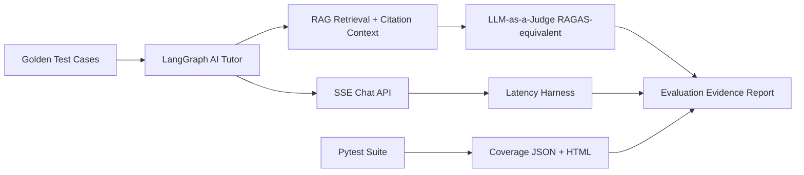
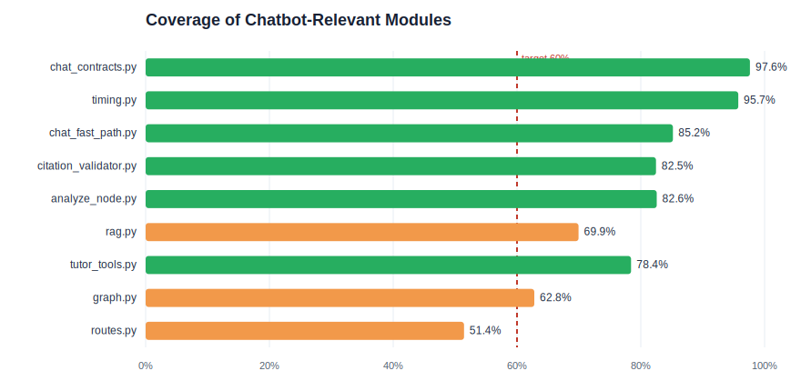
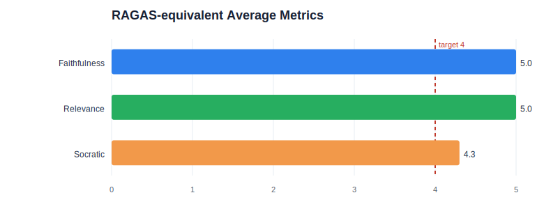
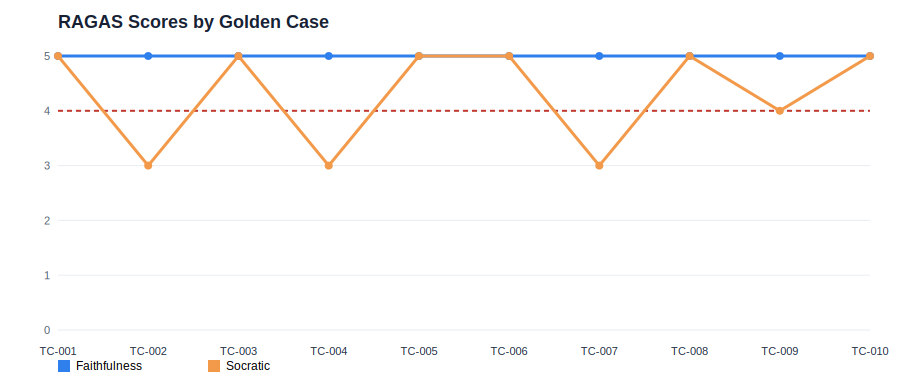
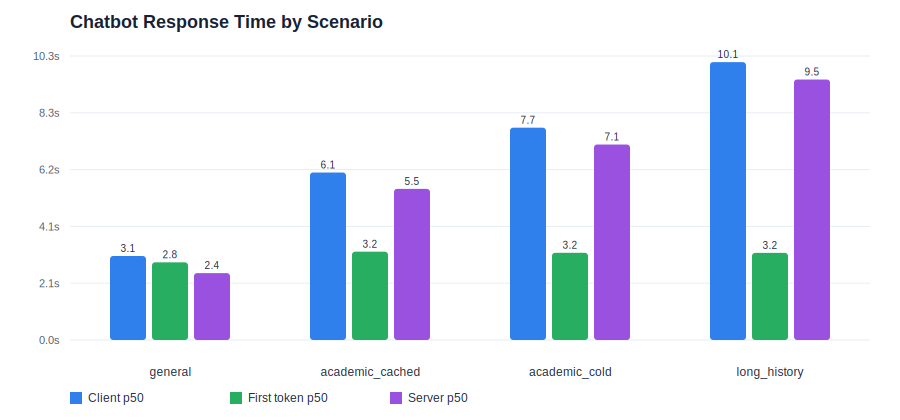

# AI Chatbot Evaluation Evidence

Generated: 2026-07-06 10:52:54 local time  
Scope: chatbot API, LangGraph intent/routing, RAG retrieval, SSE chat streaming, RAGAS-equivalent quality, and latency evidence.

## Executive Summary

| Evidence Area | Result | Status | Source |
|---|---:|---|---|
| Pytest chatbot-focused suite | 79 passed, 2 warnings, 15.64s | PASS | `eval/results/chatbot_evidence/pytest-chatbot-coverage-utf8.txt` |
| Coverage, full `src` under chatbot suite | 42.6% (2531/5938 lines) | WATCH | `eval/results/chatbot_evidence/coverage-chatbot.json` |
| RAGAS-equivalent faithfulness | 5.00/5 | PASS | `outputs/ragas_eval_report.md` |
| RAGAS-equivalent answer relevance | 5.00/5 | PASS | `outputs/ragas_eval_report.md` |
| RAGAS-equivalent Socratic scaffolding | 4.30/5 | PASS | `outputs/ragas_eval_report.md` |
| RAGAS cases passing all three >= 4/5 | 7/10 | WATCH | `outputs/ragas_eval_report.md` |
| Latest latency eval scenarios | 8 measured non-warmup runs | PASS | `plans/20260628-1600-ai-rag-routing-streaming-latency-improvement/reports/ai-latency-20260628-090618.json` |

## Evaluation Flow



## 1. Pytest Results and Coverage

Command used:

```powershell
uv run --with pytest-cov python -m pytest tests\test_chat_contracts.py tests\test_rag.py tests\test_agents\test_intent_router.py tests\test_agents\test_tools.py tests\test_api\test_chat_stream.py tests\test_api\test_routes.py -q --cov=src --cov-report=term-missing --cov-report=json:eval\results\chatbot_evidence\coverage-chatbot.json --cov-report=html:eval\results\chatbot_evidence\htmlcov
```

Note: PowerShell reported a non-zero shell wrapper status because `uv` emitted SSL warning lines to stderr, but pytest itself completed successfully with `79 passed`.

| Test Slice | Files | Result |
|---|---|---|
| Chat API streaming | `tests/test_api/test_chat_stream.py` | Covered in passing suite |
| Chat response contracts | `tests/test_chat_contracts.py` | Covered in passing suite |
| RAG service behavior | `tests/test_rag.py` | Covered in passing suite |
| Intent routing/tools | `tests/test_agents/test_intent_router.py`, `tests/test_agents/test_tools.py` | Covered in passing suite |
| API smoke/health/chat routes | `tests/test_api/test_routes.py` | Covered in passing suite |



| Module | Statements | Covered | Coverage |
|---|---:|---:|---:|
| `src/models/chat_contracts.py` | 127 | 124 | 97.6% |
| `src/services/timing.py` | 47 | 45 | 95.7% |
| `src/services/chat_fast_path.py` | 54 | 46 | 85.2% |
| `src/services/citation_validator.py` | 57 | 47 | 82.5% |
| `src/agents/nodes/analyze_node.py` | 109 | 90 | 82.6% |
| `src/services/rag.py` | 306 | 214 | 69.9% |
| `src/agents/tools/tutor_tools.py` | 51 | 40 | 78.4% |
| `src/agents/graph.py` | 43 | 27 | 62.8% |
| `src/api/routes.py` | 902 | 464 | 51.4% |

## 2. RAGAS-equivalent Metrics

The project uses an LLM-as-a-judge script (`scripts/run_ragas_eval.py`) over golden cases from `docs/domain-knowledge/golden-test-cases.json`. Metrics are equivalent to RAGAS dimensions for faithfulness and answer relevance, plus a project-specific Socratic scaffolding metric.



| Metric | Score | Target | Status |
|---|---:|---:|---|
| Faithfulness | 5.00/5 | >= 4/5 | PASS |
| Answer relevance | 5.00/5 | >= 4/5 | PASS |
| Socratic scaffolding | 4.30/5 | >= 4/5 | PASS |



| Case | Category | RAG Count | Faithfulness | Relevance | Socratic | Status |
|---|---|---:|---:|---:|---:|---|
| TC-001 | knowledge_question | 4 | 5/5 | 5/5 | 5/5 | PASS |
| TC-002 | knowledge_question | 0 | 5/5 | 5/5 | 3/5 | WATCH |
| TC-003 | direct_cheating | 4 | 5/5 | 5/5 | 5/5 | PASS |
| TC-004 | zpd_low_elo | 0 | 5/5 | 5/5 | 3/5 | WATCH |
| TC-005 | zpd_high_elo | 4 | 5/5 | 5/5 | 5/5 | PASS |
| TC-006 | active_quiz_help | 4 | 5/5 | 5/5 | 5/5 | PASS |
| TC-007 | knowledge_question | 4 | 5/5 | 5/5 | 3/5 | WATCH |
| TC-008 | direct_cheating | 0 | 5/5 | 5/5 | 5/5 | PASS |
| TC-009 | zpd_low_elo | 0 | 5/5 | 5/5 | 4/5 | PASS |
| TC-010 | active_quiz_help | 4 | 5/5 | 5/5 | 5/5 | PASS |

Golden eval companion report: `outputs/golden_eval_report.md`  
Observed retrieval/citation notes: RAG context found in 6/10 golden rows; missing context in 4/10 rows; citation valid in 7/10 rows; citation warning in 3/10 rows.

## 3. Performance Metrics

Latency source: latest after-optimization report from `plans/20260628-1600-ai-rag-routing-streaming-latency-improvement/reports/ai-latency-20260628-090618.json`. Values below exclude warmup rows, matching the script summary logic.



| Scenario | Runs | Client p50 | Client p95 | First token p50 | Server p50 |
|---|---:|---:|---:|---:|---:|
| general | 2 | 3.06s | 3.09s | 2.83s | 2.43s |
| academic_cached | 2 | 6.09s | 6.13s | 3.21s | 5.50s |
| academic_cold | 2 | 7.72s | 7.98s | 3.17s | 7.11s |
| long_history | 2 | 10.11s | 10.33s | 3.17s | 9.48s |

## 4. Evidence Artifacts

| Artifact | Purpose |
|---|---|
| `pytest-chatbot-coverage-utf8.txt` | Raw pytest output and terminal coverage table, UTF-8 normalized |
| `pytest-chatbot-coverage.txt` | Original PowerShell Tee-Object output |
| `coverage-chatbot.json` | Machine-readable coverage data |
| `htmlcov/index.html` | HTML coverage report |
| `ragas_metrics_summary.csv` | RAGAS aggregate metrics for spreadsheet/slides |
| `latency_summary.csv` | Response time metrics for spreadsheet/slides |
| `ragas_average_metrics.svg` | Visual RAGAS metric chart |
| `ragas_case_scores.svg` | Per-case quality risk chart |
| `latency_by_scenario.svg` | Response-time chart |
| `coverage_key_modules.svg` | Coverage chart for chatbot-relevant modules |

## 5. Interpretation

- The chatbot regression suite is green for chat stream, contracts, RAG, routing, and route smoke tests.
- RAGAS faithfulness and relevance are strong at 5.00/5, which supports answer grounding and query alignment.
- Socratic scaffolding now meets target at 4.30/5 after the direct-cheating guardrail fix. Remaining WATCH cases are TC-002, TC-004, and TC-007, which need stronger guiding questions.
- Response time is acceptable for general chat at about 3.06s p50, but long-history and cold academic cases remain the slowest paths.
- Overall full-`src` coverage under this focused suite is 42.6%; this is expected because adaptive/admin/pipeline modules are included in denominator. For chatbot-specific evidence, use the module-level table above.
