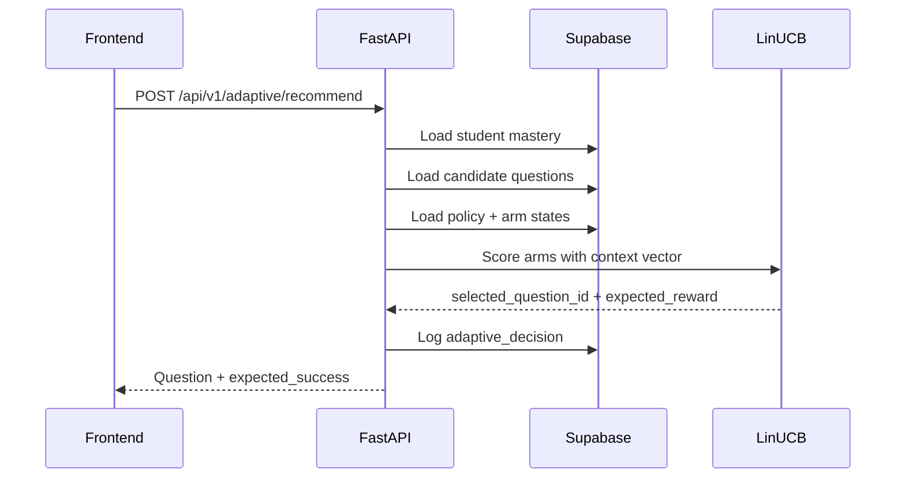

Adaptive engine quyết định **học viên nên làm câu nào tiếp theo** và **tiến độ mastery thay đổi ra sao sau mỗi lượt làm bài**. Runtime chính nằm ở `src/api/adaptive_routes.py` và `src/services/adaptive/*`.

## Core models

| Model | Purpose | Source |
| :--- | :--- | :--- |
| Educational Elo | Đo năng lực tương đối giữa học viên và độ khó câu hỏi | `src/services/adaptive/elo.py` |
| BKT | Ước lượng xác suất làm chủ concept | `src/services/adaptive/bkt.py` |
| LinUCB | Chọn câu hỏi tốt nhất trong candidate set | `src/services/adaptive/bandit.py` |
| Forgetting/stability | Làm suy giảm hoặc ổn định mastery theo thời gian | `src/services/adaptive/forgetting.py` |
| Graph propagation | Lan truyền mastery tới concept liên quan | `src/services/adaptive/graph_propagation.py` |

## Recommendation flow



Context vector:

```text
[1.0, bkt_mastery_probability, sigmoid_normalized_elo]
```

LinUCB stores `A_inv` and `b` per arm so recommend can score candidates without recomputing matrix inverse. The update uses Sherman-Morrison after reward is known.

## Submit flow

1. Validate the authenticated user owns the submitted `student_id`.
2. Load `adaptive_decisions` by `decision_id`.
3. Reject submission when the decision does not belong to the student, question mismatches, or `consumed_at` is already set.
4. Load current mastery and question answer key.
5. Grade server-side:
   - `mcq`: selected option equals correct key.
   - `numeric`: value within tolerance.
   - `short_answer`: normalized text in accepted answers.
6. Count hint usage and AI help from server-side logs when not in stub mode.
7. Call `submit_attempt_v3` with score, context vector and reward.
8. Commit, write-through mastery cache and start background graph propagation.

## Reward model

The current bandit reward favors questions near the ZPD target of 75 percent expected success:

```text
reward = actual_score * (1.0 - 2.0 * abs(expected_success - 0.75))
```

This means a correct answer on an appropriately challenging question is more useful than a correct answer on a trivially easy or impossible one.

## Transaction boundary

The critical mutation is inside `submit_attempt_v3`:

- Consume the adaptive decision to prevent replay.
- Lock or update the mastery row safely.
- Update student Elo and question difficulty.
- Update BKT probability and mastery state.
- Write `quiz_attempts`.
- Update bandit arm state.
- Return the new mastery snapshot to the API.

Graph propagation runs after the main transaction so the UI does not wait on secondary concept updates.

## Cache behavior

After submit, the backend writes the new mastery profile into `mastery_cache_key(student, course, concept)` for short-lived reuse. RAG and chat also use cache keys for retrieval and profile loading. Cache is an optimization only; Supabase remains the source of truth.

## Failure modes

| Failure | API behavior |
| :--- | :--- |
| No candidate questions left | `404` with no remaining adaptive question message |
| Decision not found | `404` |
| Question mismatch | `400` |
| Decision already consumed | `409` |
| RPC permission misconfigured | `503` |
| Unexpected submit error | `500` |

## Related pages

- [Elo Rating System](/docs/algorithms/elo)
- [Bayesian Knowledge Tracing](/docs/algorithms/bkt)
- [Contextual Bandit](/docs/algorithms/bandit)
- [Multi-Skill Graph Propagation](/docs/algorithms/graph)
