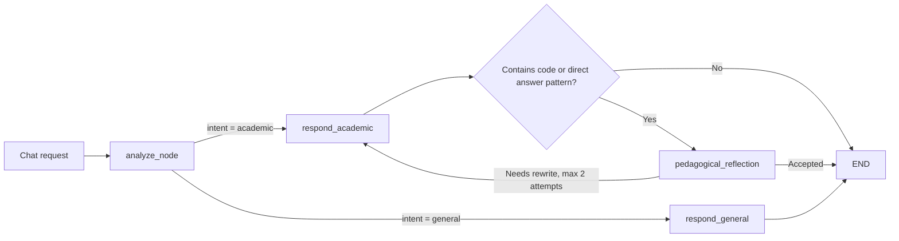

AI tutor của Mentora là một **Socratic RAG agent**: câu trả lời phải bám vào tài liệu khóa học, thích ứng theo trạng thái học viên và không đưa lời giải trực tiếp cho bài kiểm tra hoặc lab.

## Source map

| Thành phần | File chính |
| :--- | :--- |
| Chat endpoint | `src/api/routes.py` |
| Agent graph | `src/agents/graph.py` |
| Analyze node | `src/agents/nodes/analyze_node.py` |
| Academic response node | `src/agents/nodes/respond_node.py` |
| General response node | `src/agents/nodes/respond_general_node.py` |
| Pedagogical reflection | `src/agents/nodes/pedagogical_reflection_node.py` |
| RAG retrieval | `src/services/rag.py` |
| Citation validator | `src/services/citation_validator.py` |

## Graph lifecycle

The graph optimizes latency by skipping the reflection step when the answer has no code block and no direct MCQ answer pattern.

## Request lifecycle

1. `/api/v1/chat` validates that a student can only chat as themselves.
2. Backend loads mastery/profile from cache or database.
3. If `session_id` exists, backend validates the session; otherwise it creates a `chat_sessions` row.
4. Backend loads recent chat history and long-term memory.
5. LangGraph receives query, mode, course/concept context, profile and history.
6. Response is saved to `chat_messages`.
7. A background task extracts long-term facts from the conversation.
8. Timing and trace metadata are logged to Braintrust.

## RAG retrieval strategy

`RAGService` retrieves official course material from Supabase:

1. Normalize query and check retrieval cache.
2. Resolve concept code when `concept_id` is present.
3. Apply day-aware document regex filters for course-day-specific context.
4. Generate embedding with `text-embedding-3-small` or OpenRouter-compatible embedding config.
5. Call Supabase RPC `match_slides` over pgvector.
6. Optionally run keyword fallback when semantic similarity is weak.
7. Optionally retry global search if the day filter is too narrow.
8. Add neighboring slides for stronger local context.
9. Deduplicate logical document versions and cache final results.

## Citation validation

Academic answers should cite retrieved sources. The validator checks citation tags against the actual retrieved slide list:

| Case | Behavior |
| :--- | :--- |
| Citation source and slide match retrieved context | Mark as valid |
| Citation references a source not retrieved | Mark as invalid/hallucinated |
| Important claim has no valid citation | Metadata flags low citation confidence |

Frontend receives citation metadata through the chat response contract and can show citations, warnings or confidence state without trusting raw LLM text alone.

## Guardrails

Mentora protects academic integrity in three places:

1. **Prompt policy**: The tutor is instructed to guide with Socratic questions and hints, not full answers.
2. **Active quiz context**: When a learner is in an active quiz, the tutor must stay at conceptual/analogy hint levels.
3. **Reflection node**: Responses containing code blocks or direct answer phrasing can be routed through a pedagogical review step and rewritten.

## Streaming behavior

The BFF route forwards `text/event-stream` unchanged and sets headers for no buffering. This allows chat UI to show progressive states while preserving the same backend auth and tracing path as non-streaming chat.
