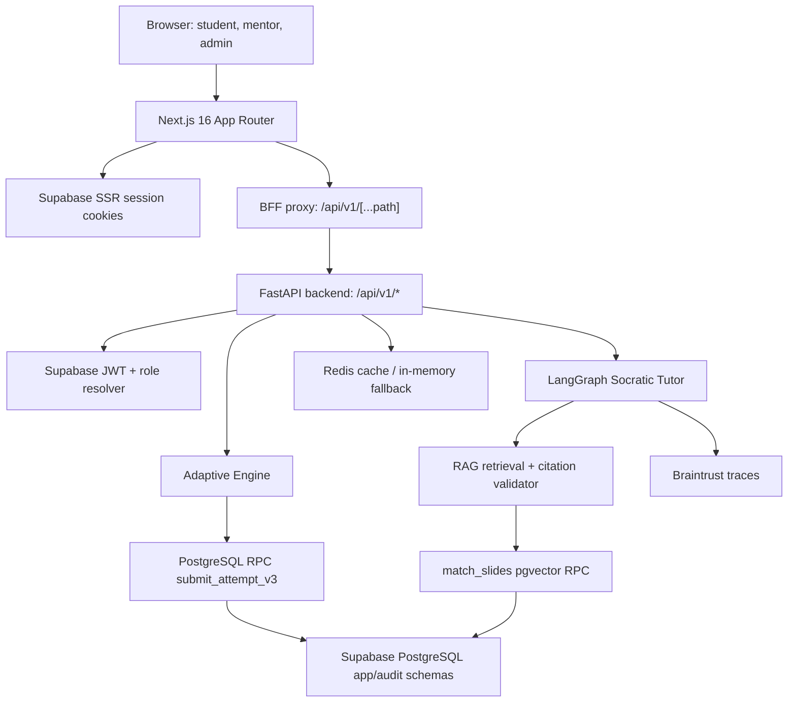

Mentora dùng kiến trúc tách lớp: **Next.js** chịu trách nhiệm trải nghiệm học tập, session SSR và BFF proxy; **FastAPI** giữ business logic, xác thực, adaptive engine và AI orchestration; **Supabase PostgreSQL** là data plane cho auth, relational data, pgvector, RLS và RPC.

## Runtime topology

## Layer responsibilities

| Layer | Owns | Must not own |
| :--- | :--- | :--- |
| Browser UI | App navigation, quiz interaction, chat panel, progress display, optimistic local UX | Authoritative grading, role decisions, final mastery mutation |
| Next.js SSR/BFF | Supabase cookie session, `/api/v1` proxy, SSE forwarding, fallback when backend offline | Server-only Supabase secret key, adaptive transaction logic |
| FastAPI | Auth verification, role checks, adaptive recommendation/submit, RAG chat, onboarding sync, Braintrust proxy | Browser rendering concerns |
| Supabase PostgreSQL | Auth identities, app/audit schemas, RLS, pgvector, RPC transactions, bitemporal mastery | LLM reasoning or UI orchestration |
| Redis/cache | Short-lived mastery/profile/retrieval cache | Durable source of truth |

## Main request paths

### App API path

1. Browser calls `frontend/app/api/v1/[...path]/route.ts`.
2. BFF reconstructs `BACKEND_API_URL/api/v1/{path}`.
3. BFF reads Supabase SSR session cookie and injects `Authorization: Bearer <access_token>`.
4. FastAPI verifies token in `src/api/adaptive_routes.py`.
5. Route handler performs business logic and returns JSON or SSE.

This keeps browser code from manually managing backend tokens while preserving server-side authorization.

### Adaptive practice path

1. Frontend requests `/api/v1/adaptive/recommend`.
2. Backend loads `student_concept_mastery`, candidate questions and `adaptive_policies`.
3. LinUCB scores candidate question arms using `[1.0, BKT mastery, normalized Elo]`.
4. Backend logs `adaptive_decisions` and returns a single question.
5. Submit goes through `/api/v1/adaptive/submit`, server-side grading and `submit_attempt_v3`.

### AI tutor path

1. Frontend calls `/api/v1/chat`, optionally as SSE.
2. Backend loads profile, session history and long-term memory.
3. LangGraph runs `analyze -> respond_general/respond_academic -> pedagogical_reflection`.
4. Academic responses retrieve course context through `RAGService`.
5. Citation validation strips or flags unsupported citations before response metadata is returned.

## Security boundaries

- Live backend accepts **Supabase JWTs**, not raw UUIDs or fake tokens.
- Frontend may use `NEXT_PUBLIC_SUPABASE_PUBLISHABLE_KEY`; backend app/audit access must use `SUPABASE_SECRET_KEY`.
- Student routes reject cross-student `student_id` access.
- Mentor/admin/dev routes use role checks in FastAPI, not UI-only conditions.
- `submit_attempt_v3` is granted to `service_role` after the security migration; browser clients do not execute the RPC directly.
- Academic integrity is enforced in the tutor prompt, graph reflection node and server-side hint/AI signal counting.

## Deployment shape

| Service | Runtime |
| :--- | :--- |
| Frontend | Next.js deployment with `BACKEND_API_URL`, Supabase public env vars and Fumadocs build step |
| Backend | FastAPI/Uvicorn, Docker/Render-compatible, `/health` and `/ready` probes |
| Database | Supabase hosted PostgreSQL 17 with `app` and `audit` schemas |
| Cache | Redis in production, in-memory fallback for local/stub |
| AI providers | OpenAI/Gemini/OpenRouter depending on configured keys |
