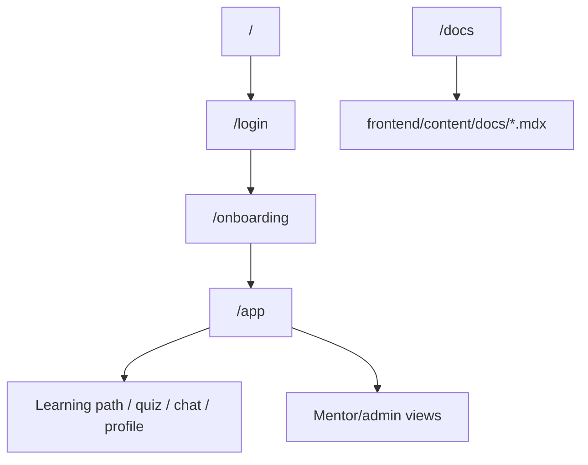

EduGap frontend is a Next.js App Router application. It owns the public landing page, authentication pages, onboarding, student learning workspace, quiz experience, profile, mentor/admin surfaces and the MDX documentation site.

## Source map

| Area | Source |
| :--- | :--- |
| Global app metadata/layout | `frontend/app/layout.tsx` |
| Docs page | `frontend/app/docs/[[...slug]]/page.tsx` |
| Docs layout | `frontend/app/docs/layout.tsx` |
| Fumadocs source loader | `frontend/lib/source.ts`, `frontend/source.config.ts` |
| BFF proxy | `frontend/app/api/v1/[...path]/route.ts` |
| Supabase browser/server clients | `frontend/utils/supabase/*` |
| Auth bridge | `frontend/lib/auth/supabase-session.ts` |
| Global app state | `frontend/stores/*` |
| Adaptive API client | `frontend/lib/adaptive/*` |
| Chat stream contract | `frontend/lib/chat/*` |

## App routing model



## BFF proxy contract

The frontend does not call FastAPI directly from every component. Instead it calls `/api/v1/*` on the same Next.js origin:

1. Next.js route receives the browser request.
2. It reconstructs the target URL using `BACKEND_API_URL`.
3. It reads the Supabase SSR session and injects the access token into `Authorization`.
4. It forwards the request body and headers.
5. It streams `text/event-stream` responses without buffering.
6. It returns a friendly `503` JSON payload when backend is offline.

This keeps auth token handling centralized.

## State ownership

| State | Frontend responsibility | Backend responsibility |
| :--- | :--- | :--- |
| Logged-in user | Store current UI user and clear state on sign out | Verify JWT and resolve role |
| Onboarding draft | Persist local draft and completion hints | Store canonical onboarding/profile state |
| Practice session | Render selected question, local answer state, UI transitions | Recommend question, grade answer, update mastery |
| Concept mastery display | Fetch, cache in store and render progress | Compute authoritative Elo/BKT/mastery |
| Chat stream | Render streaming states, citations, tutor panel | Generate grounded Socratic response |

## Docs runtime

Docs are powered by:

- `fumadocs-mdx` prebuild step;
- source directory `frontend/content/docs`;
- `remark-math` and `rehype-katex` for math-heavy algorithm docs;
- `DocsPage`, `DocsBody`, `DocsTitle` and `DocsDescription` from `fumadocs-ui/page`.

Adding a new docs page normally means adding a `.mdx` file under `frontend/content/docs`. The route is derived from the file path:

| File | Route |
| :--- | :--- |
| `frontend/content/docs/index.mdx` | `/docs` |
| `frontend/content/docs/architecture.mdx` | `/docs/architecture` |
| `frontend/content/docs/algorithms/bkt.mdx` | `/docs/algorithms/bkt` |

## Performance considerations

- Docs compile during `prebuild`; runtime reads generated Fumadocs source.
- BFF logs trace timings for auth lookup, body read, backend fetch and response read.
- Chat SSE avoids waiting for a full response before rendering.
- Adaptive store fetches mastery and maps backend concept codes into UI aliases for dense learning screens.
- Heavy visual surfaces should keep mascot/background assets in `public` and avoid bundling large images into JS.

## Validation commands

From `frontend`:

```bash
pnpm lint
pnpm exec tsc --noEmit
pnpm build
```

`pnpm build` runs `fumadocs-mdx` first through the `prebuild` script, so it validates the docs content source as part of the production build.
