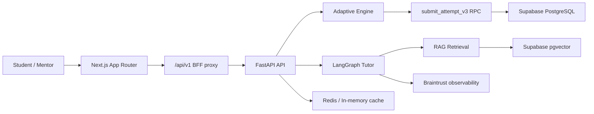

Mentora là hệ thống học AI thực chiến có **Socratic RAG Tutor**, **quiz thích ứng theo ZPD**, **Elo/BKT mastery model**, **LinUCB question selection** và **Supabase PostgreSQL RPC** để cập nhật tiến độ học tập theo giao dịch nguyên tử.

Trang này là cửa vào cho tài liệu kỹ thuật được host bằng MDX trong `frontend/content/docs`.

## Đọc theo vai trò

| Bạn cần hiểu | Bắt đầu từ |
| :--- | :--- |
| Kiến trúc tổng thể và boundary giữa frontend, backend, database, AI | [System Architecture](/docs/architecture) |
| Luồng AI tutor, RAG, citation, guardrails và streaming chat | [AI Tutor & RAG Runtime](/docs/ai-tutor-rag) |
| Cách hệ thống chọn câu hỏi, chấm bài, cập nhật mastery | [Adaptive Engine Runtime](/docs/adaptive-engine) |
| Supabase schema, RPC `submit_attempt_v3`, RLS và bitemporal mastery | [Data Model & RPC Contracts](/docs/data-rpc-contracts) |
| Next.js App Router, Supabase SSR, BFF proxy và app state | [Frontend Runtime](/docs/frontend-runtime) |
| Chi tiết toán học từng thuật toán | [Adaptive Algorithms](/docs/algorithms) |
| Pipeline sinh câu hỏi từ tài liệu học tập | [Quiz Generation](/docs/quiz-generation) |
| Paper, công trình và nguồn học thuật | [Academic Citations](/docs/academic-citations) |

## System map

## Core runtime flows

1. **App entry**: Next.js SSR đọc Supabase session cookie, điều hướng người dùng qua login, onboarding hoặc `/app`.
2. **Practice recommendation**: Frontend gọi `/api/v1/adaptive/recommend`; FastAPI đọc mastery, candidate questions, policy state và chọn câu hỏi bằng LinUCB.
3. **Attempt submit**: Frontend gửi câu trả lời qua `/api/v1/adaptive/submit`; backend tự chấm điểm, kiểm tra replay, gọi `submit_attempt_v3`, cập nhật cache và chạy graph propagation nền.
4. **Socratic chat**: Frontend gọi `/api/v1/chat`; LangGraph phân loại intent, retrieve slide context khi cần, sinh trả lời có citation và kiểm định guardrail.
5. **Docs**: `/docs` dùng Fumadocs MDX; nội dung chính nằm trong `frontend/content/docs`.

## Engineering source links

| Chủ đề | Source chính |
| :--- | :--- |
| Docs route | `frontend/app/docs/[[...slug]]/page.tsx`, `frontend/lib/source.ts`, `frontend/source.config.ts` |
| BFF proxy | `frontend/app/api/v1/[...path]/route.ts` |
| Adaptive API | `src/api/adaptive_routes.py` |
| AI chat API | `src/api/routes.py` |
| LangGraph tutor | `src/agents/graph.py`, `src/agents/nodes/*` |
| RAG retrieval | `src/services/rag.py`, `src/services/citation_validator.py` |
| Adaptive algorithms | `src/services/adaptive/*` |
| Supabase RPC | `db/supabase/migrations/*submit_attempt_v3*.sql` |
