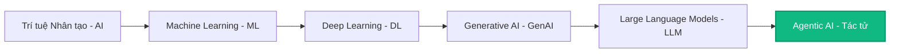
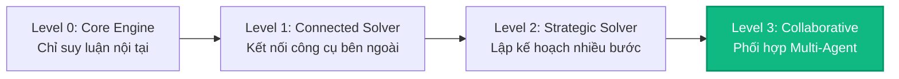
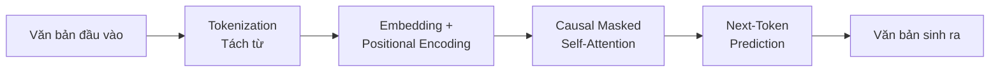
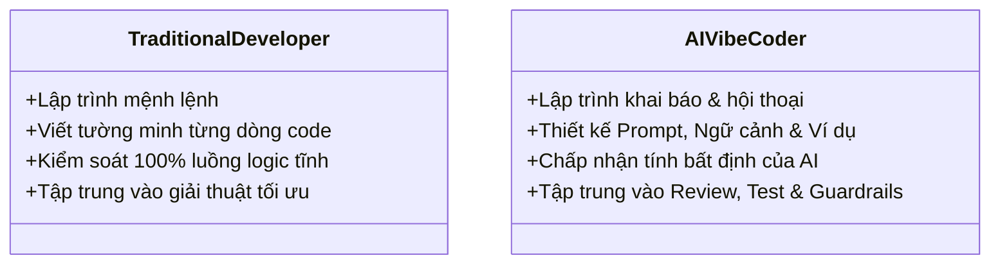

# Day 01 - Nền tảng AI & LLM (AI & LLM Foundation)

> **Câu hỏi cốt lõi:** *"Bạn đang dùng AI mỗi ngày — nhưng thực sự cấu trúc bên trong của nó hoạt động như thế nào?"*

---

### 🗺️ 1. Bản đồ Kiến thức Hệ thống (Structured Knowledge Map)

Để tối ưu hóa việc tiếp cận kiến thức, bản đồ hệ thống được chia làm 3 sơ đồ độc lập biểu diễn 3 khía cạnh: sự phân tầng công nghệ, các mức tiến hóa của tác tử (Agentic AI), và luồng xử lý kỹ thuật của một mô hình ngôn ngữ lớn (LLM):

#### 1.1. Tầng phân tách Công nghệ AI (AI Technology Layers)
Mô phỏng sự phân tầng tiến hóa từ các kỹ thuật máy học cổ điển cho tới các tác tử tự chủ hiện đại:



#### 1.2. Luồng Tiến hóa của Tác tử Thông minh (Agent Evolution Roadmap)
Mô tả các cấp độ thông minh của tác tử từ xử lý đơn bước cục bộ đến sự phối hợp cộng tác đa tác tử:



#### 1.3. Luồng Xử lý Nội bộ của LLM (Transformer Decoder-Only Dataflow)
Trực quan hóa 4 giai đoạn xử lý từ dữ liệu văn bản thô đến khi sinh từ tiếp theo (Autoregressive):



#### 🔍 Chi tiết 4 Giai đoạn xử lý của kiến trúc Transformer:
1. **Tokenization (Tách từ):** Văn bản thô được chuyển thành chuỗi các số nguyên (Token ID) dựa trên từ điển của mô hình.
2. **Embedding & Positional Encoding:** Biến đổi Token ID thành các vector số học có số chiều lớn (ví dụ: 4096 chiều). Do Transformer xử lý tất cả token song song cùng lúc, Positional Encoding được cộng thêm vào vector nhúng để mô hình nhận biết được thứ tự trước/sau của từ.
3. **Causal Masked Self-Attention:** Tính toán sự liên kết giữa các token. Đối với các mô hình sinh chữ (Decoder-only), cơ chế **Masked** (che đi các từ ở tương lai bằng ma trận có giá trị $-\infty$) được áp dụng để đảm bảo token hiện tại chỉ có thể học thông tin từ chính nó và các token đứng trước nó.
4. **Next-Token Prediction:** Vector đầu ra sau các lớp Attention được chiếu qua tầng Linear để tính xác suất cho tất cả các từ trong từ điển. Từ có xác suất phù hợp nhất (dựa trên tham số `temperature`) sẽ được chọn để sinh ra và tiếp tục nạp ngược lại vào đầu vào (Autoregressive).

---

### 📌 2. Khái niệm Cơ bản & Từ khóa Nền tảng (Core Concepts & Glossary)

Để làm chủ việc xây dựng ứng dụng với LLM, bạn cần hiểu sâu sắc các khái niệm nền tảng sau:

| Thuật ngữ | Khái niệm Kỹ thuật & Bản chất | Tại sao cần quan tâm? |
| :--- | :--- | :--- |
| **Decoder-Only Architecture** | Kiến trúc Transformer loại bỏ nhánh Encoder, chỉ tập trung vào việc dự đoán token kế tiếp. Các mô hình hiện đại như GPT-4, Claude, Llama, Qwen đều dùng cấu trúc này. | Tối ưu hóa cực tốt cho việc huấn luyện song song ở quy mô dữ liệu khổng lồ (Pre-training) và sinh chữ tự hồi quy. |
| **Query (Q), Key (K), Value (V)** | Ba vector được tạo ra bằng cách nhân Input Embedding với ba ma trận trọng số huấn luyện được ($W_Q$, $W_K$, $W_V$). | **Q** đại diện cho thông tin tìm kiếm hiện tại; **K** đại diện cho nhãn định danh ngữ cảnh của các từ khác; **V** chứa thông tin ngữ nghĩa thực tế sẽ được gom lại. |
| **Pre-training (Base Model)** | Giai đoạn huấn luyện không giám sát trên hàng nghìn tỷ token văn bản thô để học cấu trúc ngôn ngữ và kiến thức thế giới. | Tạo ra mô hình nền tảng có khả năng "điền vào chỗ trống" nhưng chưa biết cách hội thoại hay tuân thủ chỉ dẫn. |
| **Supervised Fine-Tuning (SFT)** | Quá trình huấn luyện có giám sát bằng các cặp dữ liệu Prompt-Response chất lượng cao do con người biên soạn. | Biến Base Model thành Instruct/Chat Model biết lắng nghe, trả lời đúng định dạng và có tính tương tác. |
| **RLHF / DPO (Alignment)** | Tinh chỉnh mô hình bằng Học máy Tăng cường từ Phản hồi Con người hoặc Tối ưu hóa Sở thích Trực tiếp. | Đảm bảo mô hình hành xử an toàn, trung thực, giảm thiểu phát ngôn độc hại và ảo tưởng thông tin. |
| **Context Window & Lost in the Middle** | Giới hạn dung lượng bộ nhớ làm việc (RAM) của mô hình trong một phiên xử lý. Hiện tượng mô hình bỏ sót hoặc suy giảm khả năng truy xuất thông tin nằm ở đoạn giữa của ngữ cảnh dài. | Buộc kỹ sư phải thiết kế RAG hoặc cắt tỉa lịch sử hội thoại thay vì nhồi nhét vô hạn dữ liệu vào Prompt. |
| **Hallucination (Ảo tưởng)** | Hiện tượng LLM tạo ra các thông tin sai lệch nhưng diễn đạt vô cùng tự tin và mạch lạc. | Bản chất của LLM là mô hình xác suất thống kê (dự đoán từ tiếp theo có khả năng xảy ra cao nhất), không phải cơ sở dữ liệu logic. |

---

### 📐 3. Quy tắc, Công thức & Tham số Kỹ thuật (Hard Rules & Formulas)

#### 3.1. Công thức Toán học cốt lõi của Self-Attention
Cơ chế tự chú ý chấm điểm liên kết ngữ cảnh giữa các token được tính bằng công thức:

$$\text{Attention}(Q, K, V) = \text{softmax}\left(\frac{Q K^T}{\sqrt{d_k}}\right) V$$

Trong đó:
* $Q$: Ma trận Query (Câu hỏi của các token).
* $K$: Ma trận Key (Từ khóa đối chiếu ngữ cảnh).
* $V$: Ma trận Value (Thông tin ngữ nghĩa thực tế).
* $d_k$: Số chiều của vector Key (độ dài vector). Việc chia cho $\sqrt{d_k}$ (Scaling) cực kỳ quan trọng nhằm giữ cho tích vô hướng không quá lớn, tránh đẩy hàm Softmax vào vùng bão hòa có gradient tiến về $0$ (gây chết mô hình khi huấn luyện).

#### 3.2. Ví dụ tính toán Self-Attention từng bước bằng ma trận
Xét câu gồm 3 token: `[Tôi] [yêu] [AI]`.
Giả sử vector biểu diễn nhúng đầu vào của 3 từ này sau khi nhân với ma trận trọng số cho ra các ma trận $Q, K, V$ bằng nhau (đơn giản hóa):
$$Q = K = V = \begin{bmatrix} 1 & 0 \\ 1 & 1 \\ 0 & 1 \end{bmatrix}, \quad d_k = 2 \implies \sqrt{d_k} = \sqrt{2} \approx 1.4142$$

* **Bước 1: Chấm điểm thô (Attention Scoring - Tích vô hướng $Q K^T$):**
  $$Q K^T = \begin{bmatrix} 1 & 0 \\ 1 & 1 \\ 0 & 1 \end{bmatrix} \begin{bmatrix} 1 & 1 & 0 \\ 0 & 1 & 1 \end{bmatrix} = \begin{bmatrix} 1 & 1 & 0 \\ 1 & 2 & 1 \\ 0 & 1 & 1 \end{bmatrix}$$

* **Bước 2: Ổn định tỷ lệ (Scaling - Chia cho $\sqrt{d_k}$):**
  $$\frac{Q K^T}{\sqrt{2}} \approx \begin{bmatrix} 0.7071 & 0.7071 & 0 \\ 0.7071 & 1.4142 & 0.7071 \\ 0 & 0.7071 & 0.7071 \end{bmatrix}$$

* **Bước 3: Chuẩn hóa phân phối trọng số (Softmax theo từng hàng để ra Attention Map $A$):**
  $$A = \text{softmax}\left(\frac{Q K^T}{\sqrt{2}}\right) \approx \begin{bmatrix} 0.4011 & 0.4011 & 0.1978 \\ 0.2483 & 0.5035 & 0.2483 \\ 0.1978 & 0.4011 & 0.4011 \end{bmatrix}$$
  *Nhận xét hàng 1 (Token `[Tôi]`):* Nó chú ý đến chính nó $40.11\%$, chú ý từ `[yêu]` $40.11\%$, và chỉ chú ý đến từ `[AI]` $19.78\%$.

* **Bước 4: Gom góp thông tin ngữ nghĩa (Weighted Sum - Nhân với ma trận $V$):**
  $$O = A V = \begin{bmatrix} 0.4011 & 0.4011 & 0.1978 \\ 0.2483 & 0.5035 & 0.2483 \\ 0.1978 & 0.4011 & 0.4011 \end{bmatrix} \begin{bmatrix} 1 & 0 \\ 1 & 1 \\ 0 & 1 \end{bmatrix} \approx \begin{bmatrix} 0.8022 & 0.5989 \\ 0.7517 & 0.7517 \\ 0.5989 & 0.8022 \end{bmatrix}$$
  Vector đầu ra $O$ phản ánh đầy đủ thông tin ngữ cảnh đa chiều của toàn bộ câu hội thoại.

#### 3.3. Cơ chế Causal Masking (Che giấu tương lai)
Trong mô hình sinh chữ tự hồi quy, token hiện tại không được phép nhìn thấy từ đứng sau nó. Để thực hiện điều này, ma trận điểm số $S$ trước khi đi vào Softmax sẽ được cộng với một ma trận Mask $M$ chứa các giá trị $-\infty$:

$$M = \begin{bmatrix} 0 & -\infty & -\infty \\ 0 & 0 & -\infty \\ 0 & 0 & 0 \end{bmatrix}$$

$$S' = S + M = \begin{bmatrix} 1 & 1 & 0 \\ 1 & 2 & 1 \\ 0 & 1 & 1 \end{bmatrix} + \begin{bmatrix} 0 & -\infty & -\infty \\ 0 & 0 & -\infty \\ 0 & 0 & 0 \end{bmatrix} = \begin{bmatrix} 1 & -\infty & -\infty \\ 1 & 2 & -\infty \\ 0 & 1 & 1 \end{bmatrix}$$

Khi thực hiện tính Softmax:
$$A = \text{softmax}(S') \approx \begin{bmatrix} 1.0000 & 0 & 0 \\ 0.2689 & 0.7311 & 0 \\ 0.0900 & 0.2447 & 0.6652 \end{bmatrix}$$
*Kết quả:* Token 1 (`[Tôi]`) chỉ chú ý được $100\%$ vào chính nó, không thể "nhìn trộm" từ `[yêu]` hay `[AI]` ở tương lai.

#### 3.4. Kinh tế học Token (Token Economy) & Rào cản tiếng Việt
* **Quy luật ngón tay cái (Rule of Thumb):**
  * 1 Token tiếng Anh $\approx$ 0.75 từ.
  * 1 Token tiếng Việt $\approx$ 0.3 - 0.5 từ.
* **Bản chất kỹ thuật:** Tiếng Việt có dấu Unicode phức tạp. Bộ mã hóa tokenizer của các hãng lớn (như OpenAI, Anthropic) được tối ưu chủ yếu dựa trên kho văn bản tiếng Anh. Khi gặp các từ tiếng Việt mang dấu (như `yêu`, `đường`, `học`), tokenizer phải bóc tách từ thành nhiều token nhỏ hoặc mã hóa theo dạng byte đơn lẻ.
* **Hậu quả:** Chi phí API cho tiếng Việt đắt gấp **2 - 3 lần** so với cùng nội dung bằng tiếng Anh, đồng thời làm giảm hiệu dụng cửa sổ ngữ cảnh thực tế của mô hình.

> [!IMPORTANT]  
> **Quy tắc vàng thiết kế Hệ thống:**  
> Chi phí sử dụng API được tính dựa trên tổng tokens:  
> $$\text{Cost} = (\text{Input Tokens} \times \text{Input Price}) + (\text{Output Tokens} \times \text{Output Price})$$  
> Hãy luôn thiết kế cơ chế cắt tỉa prompt, caching system prompt hoặc lọc RAG hiệu quả để bảo vệ tài chính dự án.

---

### 💻 4. Hành trang Kỹ thuật & Mã nguồn (Technical Hands-on)

#### 4.1. Mã gọi API chuẩn (OpenAI & Anthropic)
Dưới đây là cách triển khai mã nguồn gọi API cơ bản trong Python:

```python
# === CÚ PHÁP OPENAI COMPATIBLE ===
from openai import OpenAI
import os

client = OpenAI(api_key=os.getenv("OPENAI_API_KEY"))

response = client.chat.completions.create(
    model="gpt-4o-mini",
    messages=[
        {"role": "system", "content": "Bạn là chuyên gia AI giàu kinh nghiệm."},
        {"role": "user", "content": "Tại sao tiếng Việt tốn nhiều token hơn tiếng Anh?"}
    ],
    temperature=0.2, # Giảm sáng tạo, ưu tiên chính xác kỹ thuật
    max_tokens=500
)
print("Kết quả:", response.choices[0].message.content)
print("Chi phí thực tế:", response.usage.prompt_tokens, "input tokens,", response.usage.completion_tokens, "output tokens.")


# === CÚ PHÁP ANTHROPIC COMPATIBLE ===
import anthropic

client_anth = anthropic.Anthropic(api_key=os.getenv("ANTHROPIC_API_KEY"))

message = client_anth.messages.create(
    model="claude-3-5-haiku-20241022",
    max_tokens=500,
    temperature=0.2,
    system="Bạn là trợ lý giảng dạy AI.",
    messages=[
        {"role": "user", "content": "Tóm tắt cơ chế Causal Masking trong 2 câu."}
    ]
)
print("Claude trả lời:", message.content[0].text)
```

#### 4.2. Triển khai API Streaming (Truyền tải Token thời gian thực)
Đối với ứng dụng thực tế, việc chờ mô hình sinh toàn bộ câu trả lời sẽ tạo ra độ trễ (Latency) lớn khiến trải nghiệm người dùng kém đi. Streaming giúp hiển thị văn bản ngay khi mô hình vừa sinh ra token:

```python
from openai import OpenAI
import sys

client = OpenAI()

response = client.chat.com completions.create(
    model="gpt-4o-mini",
    messages=[
        {"role": "user", "content": "Giải thích ma trận Self-Attention bằng phép ẩn dụ cuộc sống."}
    ],
    stream=True # Kích hoạt chế độ stream
)

print("Sofi: ", end="")
for chunk in response:
    content = chunk.choices[0].delta.content
    if content:
        sys.stdout.write(content)
        sys.stdout.flush()
print()
```

#### 4.3. Tự Host mô hình Qwen cục bộ (Local Host với Hugging Face Transformers)
Nếu bạn cần bảo mật dữ liệu tuyệt đối hoặc không muốn trả tiền cho API đám mây, bạn có thể tự host mô hình mã nguồn mở trên GPU cá nhân:

```python
import torch
from transformers import AutoModelForCausalLM, AutoTokenizer

model_name = "Qwen/Qwen2.5-1.5B-Instruct"

# 1. Tải bộ Tokenizer và Mô hình nén lượng tử về bộ nhớ GPU/CPU
tokenizer = AutoTokenizer.from_pretrained(model_name)
model = AutoModelForCausalLM.from_pretrained(
    model_name,
    torch_dtype="auto",
    device_map="auto" # Tự động tối ưu trên GPU nếu có
)

# 2. Chuẩn bị Prompt hội thoại theo đúng Template của Qwen
messages = [
    {"role": "system", "content": "You are a helpful assistant."},
    {"role": "user", "content": "Explain what is Embedding."}
]
text = tokenizer.apply_chat_template(
    messages,
    tokenize=False,
    add_generation_prompt=True
)

# 3. Mã hóa text thành Token ID và đưa vào thiết bị phần cứng
model_inputs = tokenizer([text], return_tensors="pt").to(model.device)

# 4. Mô hình sinh từ tiếp theo tự hồi quy
generated_ids = model.generate(
    **model_inputs,
    max_new_tokens=512,
    temperature=0.7
)

# 5. Giải mã chuỗi Token ID đầu ra thành văn bản tiếng Việt
generated_ids = [
    output_ids[len(input_ids):] for input_ids, output_ids in zip(model_inputs.input_ids, generated_ids)
]
response = tokenizer.batch_decode(generated_ids, skip_special_tokens=True)[0]
print("Mô hình Local phản hồi:", response)
```

---

### 🧠 5. Tư duy Chuyển dịch: Traditional Dev sang AI Vibe Coder

Sự xuất hiện của LLM đã thay đổi căn bản cách thức lập trình phần mềm:



* **Lập trình truyền thống (Imperative):** Bạn viết mã để hướng dẫn máy tính *làm thế nào* (how) thông qua các câu lệnh điều kiện `if/else`, vòng lặp `for`, và các hàm toán học xác định.
* **Vibe Coding (Declarative):** Bạn mô tả cho mô hình *kết quả mong muốn là gì* (what) thông qua các câu lệnh tự nhiên, định nghĩa các ràng buộc và cung cấp các ví dụ mẫu (Few-shot prompting). Bạn chuyển đổi vai trò từ **người viết code** thành **người tổng duyệt thiết kế** (Editor & Reviewer).

> [!WARNING]  
> **Cảnh báo quan trọng cho kỹ sư tương lai:** Vibe Coding giúp bạn tạo ra nguyên mẫu (Prototype) cực nhanh trong vai trò tạo mẫu, nhưng nếu không nắm chắc kiến thức nền tảng về giải thuật, cấu trúc dữ liệu và kiểm thử, bạn sẽ tạo ra các sản phẩm mỏng manh dễ vỡ trong môi trường Production thực tế. Hãy học cách làm chủ cả hai kỹ năng!
