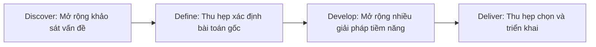
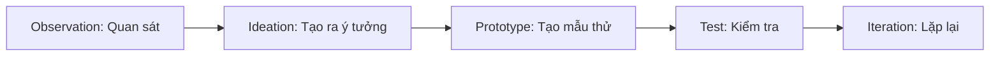

# Day 02 - Xác Định Bài Toán Kinh Doanh Cho AI

> **Câu hỏi cốt lõi:** *"Có thật sự nên dùng AI không? Nếu có, nên dùng mức nào: rule, feature, hay agent?"*

---

### 🗺️ 1. Bản đồ Kiến thức Hệ thống (Structured Knowledge Map)

#### 1.1. Mô hình Kim Cương Đôi (Double Diamond Model)
Mô hình này giúp xác định đúng vấn đề trước khi tìm giải pháp:

#### 1.2. Quy trình Thiết Kế Lấy Con Người Làm Trung Tâm (Human-Centered Design)
Quy trình này bao gồm 4 bước lặp lại:

---

### 📌 2. Khái niệm Cơ bản & Từ khóa Nền tảng (Core Concepts & Glossary)

| Thuật ngữ | Khái niệm Kỹ thuật & Bản chất | Tại sao cần quan tâm? |
| :--- | :--- | :--- |
| **Problem Statement** | Mô tả rõ ràng về vấn đề cần giải quyết, bao gồm actor, workflow, bottleneck, impact, success metric. | Giúp định hướng cho việc phát triển giải pháp AI và đánh giá hiệu quả. |
| **AI Readiness Checklist** | Danh sách kiểm tra 5 câu hỏi nhanh để xác định khả năng áp dụng AI. | Đảm bảo rằng dự án AI có cơ sở vững chắc trước khi triển khai. |
| **Go / No-Go / Not Yet** | Quyết định về việc tiếp tục hay dừng lại dự án AI dựa trên độ rõ ràng của vấn đề và khả năng triển khai. | Giúp tiết kiệm thời gian và nguồn lực cho các dự án không khả thi. |

---

### 📐 3. Quy tắc, Công thức & Tham số Kỹ thuật (Hard Rules & Formulas)

#### 3.1. 4 Anti-Patterns Làm Team Đốt Tiền Vào AI Sai Chỗ
1. **Trend-first:** Thay đổi theo trend mà không rõ actor, workflow, metric.
2. **No baseline:** Không có baseline để so sánh nhưng vẫn build AI.
3. **No eval path:** Có demo nhưng không có bộ test.
4. **No owner of failure:** Không rõ ai chịu trách nhiệm khi có lỗi.

> **Nguyên tắc:** Dùng AI khi nó tạo giá trị hơn cách đơn giản hơn, không phải vì nó nghe hiện đại hơn.

#### 3.2. 5 Câu Hỏi Nên Hỏi Stakeholder
1. Pain point là gì? 
2. Workflow hiện tại ra sao?
3. Cost của vấn đề là gì?
4. Nếu AI sai thì sao?
5. Ai sẽ nói YES?

---

### 💻 4. Hành trang Kỹ thuật & Mã nguồn (Technical Hands-on)

#### 4.1. Tìm bài toán AI ở đâu?
Sử dụng 4 Lenses để quét xung quanh:
- **Việc gì tôi/team làm đi làm lại mỗi ngày?**
- **Việc gì mất nhiều thời gian hơn lẽ ra nên mất?**
- **Sản phẩm nào tôi dùng mà AI có thể cải thiện?**
- **Đồng nghiệp/bạn bè hay phàn nàn gì?**

---

### 🧠 5. Tư duy Chuyển dịch: Problem-First, Not AI-First

> **Bài học:** Đừng xây AI rồi mong mọi người tự tìm cách dùng. Hãy bắt đầu từ trải nghiệm end-to-end và xác định đúng điểm AI giải quyết vấn đề người dùng thực sự quan tâm.

---

### 📊 6. Quy trình và Kỳ vọng (Process and Expectations)

#### 6.1. Thiết lập kỳ vọng
- **Tác động kinh doanh:** AI tạo giá trị gì cho doanh nghiệp?
- **Sự hài lòng khách hàng:** Người dùng có thật sự thấy tốt hơn không?
- **Ngưỡng hữu dụng:** Tới mức nào thì sản phẩm đủ tốt để ship?

---

### 📅 7. Tổng Kết Ngày 2

1. Đừng giải quyết vấn đề bạn được yêu cầu giải quyết — hãy tìm vấn đề thật trước.
2. Bắt đầu từ rule/workflow trước khi nhảy lên agent. Đúng architecture quan trọng hơn đúng model.
3. Problem Statement tốt phải suy ra được eval plan, system boundary, và success metric có ngưỡng cụ thể.
4. "Not Yet" không phải thất bại — đó là quyết định trưởng thành nhất khi chưa đủ data hoặc baseline.

---

### 📝 8. Thực Hành

**Lab 2:** Chọn use case, viết Problem Statement, và ra quyết định go/no-go.