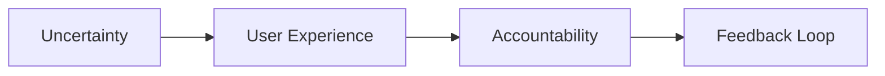
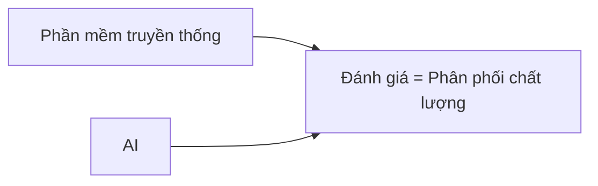
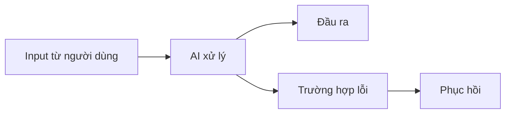
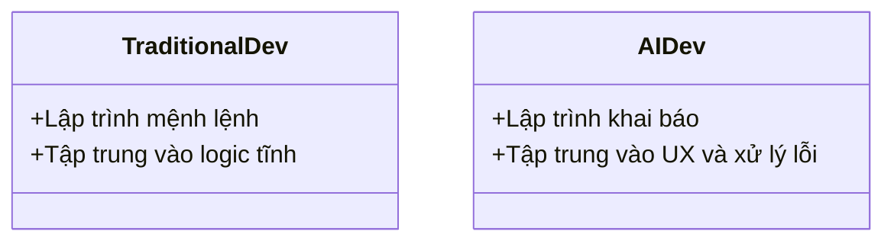

# Day 05 - Khởi động Dự án AI (AI Product Kickoff Sprint)

> **Câu hỏi cốt lõi:** *"Làm thế nào để thiết kế một sản phẩm AI đáng tin cậy trong bối cảnh không chắc chắn?"*

---

### 🗺️ 1. Bản đồ Kiến thức Dự án AI (AI Project Knowledge Map)

Để khởi động một dự án AI thành công, cần hiểu rõ các bước và yếu tố quan trọng:

#### 1.1. Quy trình Khởi động Dự án AI
Mô tả quy trình từ việc tìm kiếm vấn đề đến việc xây dựng prototype:


#### 1.2. Các Yếu tố Cốt lõi trong Sản phẩm AI
Các yếu tố cần thiết để phát triển sản phẩm AI:



---

### 📌 2. Khái niệm Cơ bản & Từ khóa Nền tảng (Core Concepts & Glossary)

Để làm chủ việc xây dựng sản phẩm AI, bạn cần hiểu các khái niệm sau:

| Thuật ngữ | Khái niệm Kỹ thuật & Bản chất | Tại sao cần quan tâm? |
| :--- | :--- | :--- |
| **Uncertainty** | Tình trạng không chắc chắn trong đầu vào, đầu ra và quy trình của AI. | Cần thiết để thiết kế các cơ chế xử lý lỗi và phục hồi. |
| **Augmentation** | AI hỗ trợ người dùng trong quyết định, không tự động hóa hoàn toàn. | Giảm rủi ro và tăng cường khả năng của người dùng. |
| **Automation** | AI tự động thực hiện nhiệm vụ mà không cần sự can thiệp của con người. | Tăng hiệu suất nhưng cần kiểm soát rủi ro. |
| **Failure Path** | Đường đi mà sản phẩm AI sẽ xử lý khi gặp lỗi. | Cần thiết để đảm bảo người dùng có thể phục hồi từ lỗi. |
| **Thin SPEC** | Tài liệu mô tả ngắn gọn các yêu cầu và quyết định sản phẩm. | Giúp nhóm tập trung vào những gì cần thiết để xây dựng. |

---

### 📐 3. Quy tắc, Công thức & Tham số Kỹ thuật (Hard Rules & Formulas)

#### 3.1. Quy tắc Thiết kế Sản phẩm AI
Các nguyên tắc thiết kế cốt lõi cho sản phẩm AI:

> **Nguyên tắc 1:** AI không phải lúc nào cũng đúng.  
> **Nguyên tắc 2:** Augmentation không phải là kém hơn automation.  
> **Nguyên tắc 3:** Phải xác định lỗi nào đắt hơn để quyết định thiết kế.  
> **Nguyên tắc 4:** UX cần phải là một mạng lưới an toàn cho người dùng.  
> **Nguyên tắc 5:** Cần có Thin SPEC trước khi bắt đầu xây dựng.

#### 3.2. Mô hình Đánh giá Sản phẩm
Đánh giá sản phẩm không chỉ dựa trên việc đạt hay không đạt mà còn dựa trên phân phối chất lượng:



---

### 💻 4. Hành trang Kỹ thuật & Mã nguồn (Technical Hands-on)

#### 4.1. Mã gọi API cho Sản phẩm AI
Dưới đây là cách triển khai mã nguồn gọi API cơ bản trong Python:

```python
import requests

def call_ai_api(input_text):
    response = requests.post("https://api.example.com/ai", json={"input": input_text})
    return response.json()

result = call_ai_api("Giải thích cách AI xử lý lỗi.")
print("Kết quả:", result)
```

#### 4.2. Thiết kế Prototype
Khi thiết kế prototype, cần đảm bảo rằng nó có thể xử lý các trường hợp lỗi:



---

### 🧠 5. Tư duy Chuyển dịch: Từ Phát triển Phần mềm đến Sản phẩm AI

Sự chuyển dịch từ phát triển phần mềm truyền thống sang sản phẩm AI yêu cầu một tư duy mới:



> [!WARNING]  
> **Cảnh báo quan trọng cho kỹ sư tương lai:** Hãy luôn thiết kế cho các trường hợp không chắc chắn và lỗi, vì sản phẩm AI sẽ không hoàn hảo.