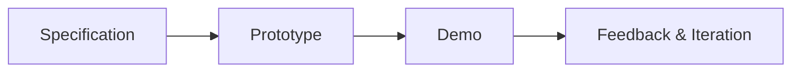
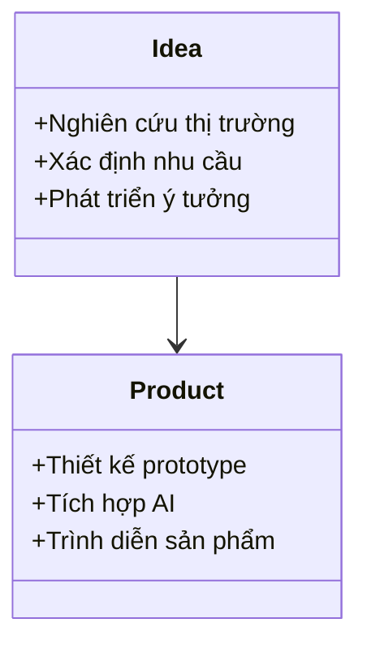

# Day 06 - AI Product Hackathon

> **Câu hỏi cốt lõi:** *"Làm thế nào để biến ý tưởng AI thành sản phẩm thực tế trong thời gian ngắn?"*

---

### 🗺️ 1. Bản đồ Kiến thức Hackathon (Hackathon Knowledge Map)

Quá trình phát triển sản phẩm AI trong một hackathon thường được chia thành các giai đoạn chính: từ việc xác định yêu cầu (SPEC), xây dựng nguyên mẫu (Prototype) đến việc trình diễn sản phẩm (Demo).



---

### 📌 2. Khái niệm Cơ bản & Từ khóa Nền tảng (Core Concepts & Glossary)

Để thành công trong hackathon sản phẩm AI, bạn cần nắm vững các khái niệm sau:

| Thuật ngữ | Khái niệm Kỹ thuật & Bản chất | Tại sao cần quan tâm? |
| :--- | :--- | :--- |
| **SPEC** | Tài liệu mô tả yêu cầu và tính năng của sản phẩm. | Đảm bảo mọi người trong nhóm đều hiểu rõ mục tiêu và hướng đi. |
| **Prototype** | Mô hình thử nghiệm của sản phẩm, có thể là mockup hoặc phiên bản chạy thử. | Giúp kiểm tra ý tưởng và nhận phản hồi sớm từ người dùng. |
| **Demo** | Trình diễn sản phẩm cho người khác, thường là để thu hút đầu tư hoặc nhận phản hồi. | Cơ hội để thể hiện giá trị sản phẩm và nhận ý kiến từ người dùng. |
| **Flow** | Luồng xử lý của sản phẩm, từ đầu vào đến đầu ra. | Giúp xác định các bước cần thiết để sản phẩm hoạt động hiệu quả. |
| **UI/UX** | Giao diện người dùng (UI) và trải nghiệm người dùng (UX). | Quan trọng để tạo ra sản phẩm dễ sử dụng và hấp dẫn. |

---

### 📐 3. Quy tắc, Công thức & Tham số Kỹ thuật (Hard Rules & Formulas)

#### 3.1. Quy trình phát triển sản phẩm AI trong Hackathon
1. **Xác định SPEC:** Lên kế hoạch và xác định yêu cầu sản phẩm.
2. **Xây dựng Prototype:** Tạo mockup và phát triển sản phẩm.
3. **Lắp AI vào Flow:** Tích hợp AI vào ít nhất một luồng chính của sản phẩm.
4. **Chuẩn bị Demo:** Hoàn thiện sản phẩm và chuẩn bị tài liệu trình bày.
5. **Trình diễn:** Thực hiện demo và thu thập phản hồi.

#### 3.2. Tiêu chí đánh giá sản phẩm
- **Trình bày rõ ràng:** Sự mạch lạc trong cách trình bày ý tưởng và giải pháp.
- **Problem-Solution Fit:** Độ thuyết phục của giả thuyết và dẫn chứng.
- **Chạy mượt mà:** Sản phẩm không có lỗi và hoạt động hiệu quả.
- **Sử dụng AI đúng cách:** AI được tích hợp một cách hợp lý và hiệu quả.
- **UI & UX tốt:** Giao diện và trải nghiệm người dùng được tối ưu hóa.

---

### 💻 4. Hành trang Kỹ thuật & Mã nguồn (Technical Hands-on)

#### 4.1. Mẫu mã cho việc tích hợp AI vào sản phẩm
Dưới đây là một ví dụ đơn giản về cách tích hợp AI vào một sản phẩm sử dụng Python:

```python
import openai

# Khởi tạo API
openai.api_key = "YOUR_API_KEY"

# Gọi API để lấy phản hồi từ mô hình AI
response = openai.ChatCompletion.create(
    model="gpt-4",
    messages=[
        {"role": "user", "content": "Giải thích cách tích hợp AI vào sản phẩm."}
    ]
)

print("AI trả lời:", response.choices[0].message['content'])
```

#### 4.2. Tối ưu hóa UI/UX
- **Thiết kế giao diện đơn giản và trực quan.**
- **Sử dụng màu sắc và hình ảnh để thu hút người dùng.**
- **Đảm bảo rằng các nút và liên kết dễ dàng truy cập và sử dụng.**

---

### 🧠 5. Tư duy Chuyển dịch: Từ Ý tưởng đến Sản phẩm Thực tế

Quá trình từ ý tưởng đến sản phẩm thực tế đòi hỏi sự linh hoạt và khả năng thích ứng nhanh chóng. Hãy luôn sẵn sàng điều chỉnh ý tưởng dựa trên phản hồi từ người dùng và kết quả thử nghiệm.



> [!WARNING]  
> **Cảnh báo quan trọng:** Trong quá trình phát triển sản phẩm, hãy luôn chú ý đến phản hồi từ người dùng và sẵn sàng điều chỉnh sản phẩm để đáp ứng nhu cầu thực tế.