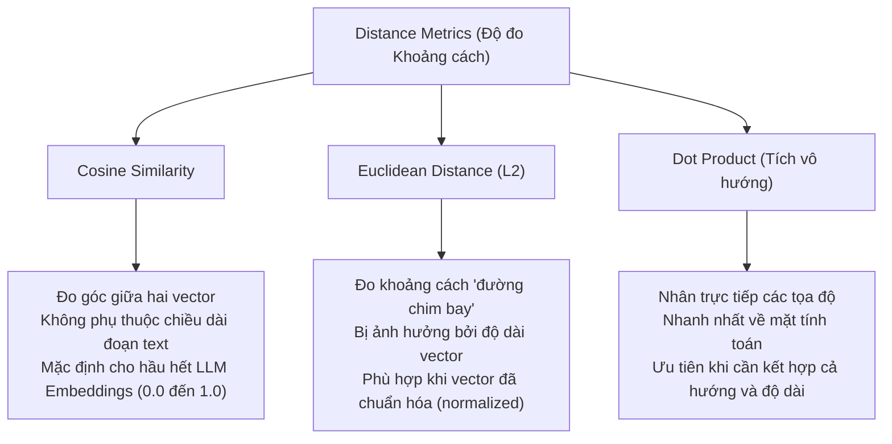

# Day 07 - Embeddings & Vector Store Deep-Dive

## 1. Bản chất của Embeddings (Nhúng Ngữ nghĩa)

**Embedding** biến ngôn ngữ/văn bản tự nhiên thành các chuỗi số (vector nhiều chiều) trong một không gian toán học biểu diễn ngữ nghĩa. 
- Giúp máy tính đo lường được **mức độ tương đồng về ý nghĩa** giữa các câu chữ thay vì chỉ so khớp ký tự (keyword matching) truyền thống.
- Các câu có nghĩa gần nhau (ví dụ: "chính sách hoàn tiền" và "quy định đổi trả") sẽ nằm gần nhau trong không gian vector.

### Cơ chế hoạt động bên trong (Under the Hood)
Khi chúng ta gọi một API Embedding (hoặc chạy local), văn bản trải qua các bước sau:
1. **Tokenizer:** Chia văn bản đầu vào thành các subword units (ví dụ: sử dụng thuật toán BPE hoặc SentencePiece).
2. **Transformer Layers (Self-Attention):** Đi qua các lớp Transformer để tính toán sự tương tác giữa các từ. Cơ chế tự chú ý (Self-Attention) giúp mỗi token "nhìn thấy" toàn bộ ngữ cảnh xung quanh nó để ghi nhận ý nghĩa chính xác của từ trong câu.
3. **Pooling:** Gom tất cả các biểu diễn token thành một vector duy nhất đại diện cho toàn bộ đoạn văn bản (thường dùng phương pháp lấy trung bình cộng - `Mean Pooling` hoặc lấy đại diện từ token đặc biệt `[CLS]`).
4. **Contrastive Learning (Huấn luyện tương phản):** Mô hình nhúng được huấn luyện bằng cách kéo các câu có cùng ý nghĩa lại gần nhau và đẩy các câu khác ý nghĩa ra xa.

---

## 2. Đo lường Độ Tương đồng (Distance Metrics)

Máy tính so sánh khoảng cách giữa các vector để xác định mức độ gần gũi về ngữ nghĩa của chúng. Ba độ đo phổ biến nhất là:



- **Cosine Similarity:** 
  - Điểm `1.0` tức là cùng hướng hoàn toàn (cùng nghĩa), `0.0` là vuông góc (không liên quan) và `-1.0` là ngược hướng (nghĩa trái ngược).
  - Đây là độ đo phổ biến nhất và là mặc định của hầu hết Vector DB khi dùng OpenAI embeddings.
- **Euclidean (L2):** Phù hợp khi các vector đã được chuẩn hóa về độ dài bằng 1 (L2 normalized). Khi đó, khoảng cách Euclidean nhỏ nhất tương đương với Cosine Similarity lớn nhất.
- **Dot Product:** Phổ biến khi các vector đã chuẩn hóa vì lúc này Dot Product bằng đúng Cosine Similarity nhưng tính toán nhanh hơn rất nhiều do không cần chia cho độ dài vector.

---

## 3. Các Mô hình Embedding Phổ biến (2025-2026)

| Tên Model | Kích thước (Dimensions) | Max Tokens | Nhà cung cấp (Provider) | Điểm nổi bật & Use Case |
| :--- | :--- | :--- | :--- | :--- |
| **`text-embedding-3-small`** | 1536 (có thể giảm) | 8,191 | OpenAI | Rẻ, nhanh, hiệu quả, là baseline tiêu chuẩn cho hầu hết dự án. |
| **`text-embedding-3-large`** | 3072 (có thể giảm) | 8,191 | OpenAI | Độ chính xác cao hơn, phù hợp cho bài toán phức tạp đòi hỏi độ nhạy nghĩa cao. |
| **`voyage-3`** | 1024 | 32,000 | Voyage AI | Cực mạnh về khả năng xử lý code và đa ngôn ngữ (Multilingual), context window lớn. |
| **`cohere-embed-v4`** | 1024 | 512 | Cohere | Được tinh chỉnh tối ưu đặc biệt cho tác vụ tìm kiếm (search-tuned) và đa ngôn ngữ. |
| **`bge-m3`** | 1024 | 8,192 | BAAI | Mã nguồn mở (Open-source), hỗ trợ đa ngôn ngữ cực tốt, đứng top tier trên bảng xếp hạng MTEB. |

*Lưu ý:* Chọn mô hình dựa trên độ trễ (latency), chi phí (API cost), ngôn ngữ tài liệu và kích thước bộ nhớ, chứ không chỉ chọn theo điểm số MTEB cao nhất.

### Ví dụ gọi Embedding bằng Python (OpenAI)

```python
from openai import OpenAI
client = OpenAI()

response = client.embeddings.create(
    model="text-embedding-3-small",
    input=["Chính sách hoàn tiền", "Quy định đổi trả"]
)

# Kích thước vector trả về (1536 chiều)
print(len(response.data[0].embedding)) 
```

---

## 4. Cơ sở dữ liệu Vector (Vector Store / Vector DB)

Vector Store không chỉ lưu trữ các chuỗi số (vector embeddings), mà còn lưu giữ:
1. **Original Chunk Text:** Đoạn văn bản gốc để tiêm lại vào prompt của LLM khi tìm thấy.
2. **Embedding Vector:** Chuỗi số đại diện để thực hiện tìm kiếm tương đồng.
3. **Metadata:** Các siêu dữ liệu đi kèm phục vụ bộ lọc.

### Tầm quan trọng của Metadata
Nếu chỉ tìm kiếm bằng ngữ nghĩa, hệ thống dễ lấy nhầm thông tin thuộc về domain khác hoặc phiên bản cũ. Metadata giúp **lọc dữ liệu trước khi search ngữ nghĩa** (Metadata Filtering).

Các trường Metadata tối thiểu cần có:
- **`source`:** Tên file nguồn (để truy vết và hiển thị nguồn cho user).
- **`category` / `domain`:** Danh mục tài liệu (tài chính, kỹ thuật, nhân sự) để giới hạn vùng tìm kiếm.
- **`date` / `timestamp`:** Ngày cập nhật (để tránh lấy tài liệu cũ đã hết hạn).
- **`access_level`:** Quyền hạn truy cập (public, internal, VIP) giúp bảo mật thông tin.
- **`chunk_id`:** Định danh đoạn để hỗ trợ debug và trích dẫn chính xác.

---

## 5. So sánh các Vector Database phổ biến

| Tên DB | Cách vận hành (Hosting) | Ngôn ngữ hỗ trợ | Khả năng Filtering | Quy mô (Scale) | Phù hợp nhất cho |
| :--- | :--- | :--- | :--- | :--- | :--- |
| **Chroma** | Local (nhúng trong app) | Python, JS | Cơ bản (Basic) | Nhỏ (Small) | Làm prototype, học tập, ứng dụng chạy offline cá nhân. |
| **Pinecone** | Cloud SaaS (Managed) | Mọi ngôn ngữ qua API | Tốt (Rich) | Rất lớn (Large) | Dự án Production chạy cloud, không muốn quản lý hạ tầng. |
| **Qdrant** | Hybrid (Self-host / Cloud) | Rust, Python, Go, v.v. | Rất tốt (Fast) | Rất lớn (Large) | Hệ thống cần tốc độ cao, filter phức tạp, tối ưu RAM. |
| **Weaviate** | Hybrid (Self-host / Cloud) | Go, Python, v.v. | Tốt | Rất lớn (Large) | Tích hợp sẵn hybrid search (keyword + vector). |
| **pgvector** | Add-on cho Postgres | SQL | Tận dụng lệnh WHERE | Trung bình (Medium) | Đội nhóm đã vận hành sẵn hệ thống PostgreSQL truyền thống. |
| **FAISS** | Local Library | C++, Python | Không hỗ trợ | Mọi quy mô | Nghiên cứu học thuật, benchmark, tìm kiếm vector thô tốc độ cao. |

---

## 6. Thuật toán Lập chỉ mục (Indexing Algorithms)

Khi cơ sở dữ liệu lên tới hàng triệu vector, việc so sánh brute-force (quét tuyến tính $O(n)$) sẽ cực kỳ chậm. Để giải quyết, người ta dùng các thuật toán **Approximate Nearest Neighbor (ANN - Lân cận gần đúng)** để đánh đổi một chút độ chính xác lấy tốc độ tìm kiếm nhanh gấp 100 - 1000 lần.

Các thuật toán ANN phổ biến bao gồm:
- **HNSW (Hierarchical Navigable Small World):** Xây dựng cấu trúc đồ thị đa tầng. Đây là thuật toán mặc định và hiệu quả nhất trong hầu hết các Vector DB hiện nay.
- **IVF (Inverted File Index):** Phân cụm không gian vector thành các cluster và chỉ tìm kiếm trong cluster gần truy vấn nhất.
- **PQ (Product Quantization):** Nén kích thước vector để tiết kiệm bộ nhớ RAM đáng kể.

*Lưu ý:* Ở quy mô nhỏ của các bài Lab hoặc prototype (dưới 10,000 vectors), brute-force vẫn chạy rất nhanh. Chưa cần cấu hình ANN phức tạp ở giai đoạn này.

---

## 7. Mở rộng: Multi-modal Embeddings

Không chỉ dừng lại ở văn bản (text), embedding hiện tại đã hỗ trợ đa phương tiện:
- **Image Embeddings (CLIP, SigLIP):** Biểu diễn cả ảnh và chữ trong cùng một không gian vector, cho phép tìm kiếm ảnh bằng câu chữ (text-to-image) hoặc ngược lại.
- **Audio Embeddings (CLAP, Whisper):** Biểu diễn âm thanh để tìm kiếm nhạc hoặc giọng nói.
- **Code Embeddings (Voyage Code, CodeBERT):** Tối ưu hóa cho việc tìm kiếm ngữ nghĩa trong mã nguồn.
