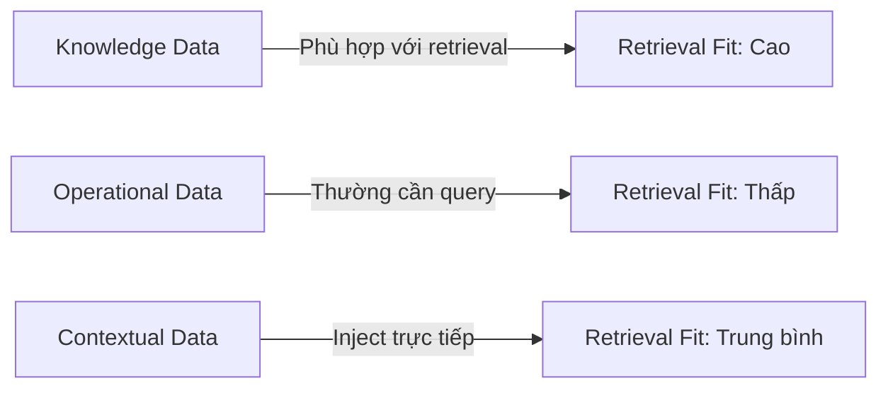
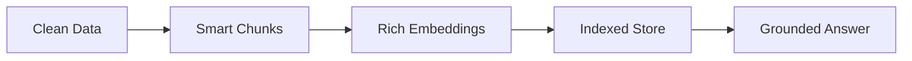

# Day 07 - Embedding & Vector Store

> **Câu hỏi cốt lõi:** *"Agent trả lời sai vì model yếu, hay vì nó không có đúng dữ liệu để suy luận?"*

---

### 🗺️ 1. Bản đồ Kiến thức Hệ thống (Structured Knowledge Map)

#### 1.1. Các loại dữ liệu cần thiết cho Agent
Mô hình dữ liệu cho agent được phân loại thành ba loại chính:



#### 1.2. Pipeline xử lý dữ liệu
Quy trình xử lý dữ liệu cho agent bao gồm các bước sau:


---

### 📌 2. Khái niệm Cơ bản & Từ khóa Nền tảng (Core Concepts & Glossary)

| Thuật ngữ | Khái niệm Kỹ thuật & Bản chất | Tại sao cần quan tâm? |
| :--- | :--- | :--- |
| **Knowledge Data** | Tài liệu, policy, SOP, FAQ, manual, hợp đồng, bài viết nội bộ. | Phù hợp với retrieval, cung cấp thông tin chính xác cho agent. |
| **Operational Data** | Database, trạng thái đơn hàng, ticket, CRM records, logs, transactions. | Thường cần truy vấn có kiểm soát, không phù hợp với semantic search. |
| **Contextual Data** | Session history, user profile, preferences, recent actions, channel context. | Giúp cá nhân hóa câu trả lời của agent. |
| **Embedding** | Biến ngôn ngữ thành không gian toán học để máy có thể so sánh nghĩa. | Là nền tảng cho semantic search, clustering, dedup, recommendation. |
| **Vector Store** | Lưu trữ vector cùng với metadata để hỗ trợ retrieval. | Cung cấp ngữ cảnh cho việc truy vấn và trả lời. |

---

### 📐 3. Quy tắc, Công thức & Tham số Kỹ thuật (Hard Rules & Formulas)

#### 3.1. Cosine Similarity
Đo độ gần về nghĩa giữa các vector:

$$\text{Cosine Similarity} = \frac{A \cdot B}{\|A\| \|B\|}$$

Trong đó:
- $A$ và $B$ là các vector cần so sánh.

#### 3.2. Chunking
Phân chia tài liệu thành các phần nhỏ hơn để dễ dàng xử lý:

| Kích thước Chunk | Kết quả |
| :--- | :--- |
| Quá lớn | Dính nhiều chủ đề, gây nhiễu. |
| Hợp lý | Một ý / một section, dễ dàng truy xuất. |
| Quá nhỏ | Mất ngữ cảnh, khó tổng hợp. |

---

### 💻 4. Hành trang Kỹ thuật & Mã nguồn (Technical Hands-on)

#### 4.1. Ví dụ về Chunking
```python
from langchain.text_splitter import RecursiveCharacterTextSplitter

splitter = RecursiveCharacterTextSplitter(
    chunk_size=512,
    chunk_overlap=64,
    separators=["\n\n", "\n", ". ", " "]
)

docs = load_documents("./data/") # your loader
chunks = []
for doc in docs:
    parts = splitter.split_text(doc["text"])
    for i, part in enumerate(parts):
        chunks.append({
            "id": f"{doc['source']}_chunk_{i}",
            "text": part,
            "metadata": {
                "source": doc["source"],
                "category": doc["category"]
            }
        })
```

#### 4.2. Ví dụ về Embedding
```python
from openai import OpenAI

client = OpenAI()

resp = client.embeddings.create(
    model="text-embedding-3-small",
    input=[
        "Chinh sach hoan tien",      # Chính sách hoàn tiền
        "Quy dinh doi tra"           # Quy định đổi trả
    ]
)

print(len(resp.data[0].embedding))
```

#### 4.3. Ví dụ về Semantic Search
```python
query = "thoi han doi tra san pham"
results = collection.query(
    query_texts=[query],
    n_results=3,
    where={"category": "support"} # metadata filter
)

for i, doc in enumerate(results["documents"][0]):
    score = results["distances"][0][i]
    print(f"[{i+1}] score={score:.3f}")
    print(f" {doc[:120]}...")
```

---

### 🧠 5. Tư duy Chuyển dịch: Từ Data Đến Grounded Answer

Quy trình chuyển đổi dữ liệu thành câu trả lời grounded bao gồm:



> [!IMPORTANT]  
> **Lưu ý:** Mỗi bước yếu sẽ kéo toàn bộ pipeline xuống. Hãy đầu tư đều vào từng bước thay vì chỉ tối ưu phần cuối.

---

### 📊 6. Đo Lường Retrieval Quality

**Metrics quan trọng:**
- **Precision@k:** Trong k kết quả, bao nhiêu thực sự relevant?
- **Recall@k:** Trong tất cả docs relevant, bao nhiêu nằm trong top-k?
- **MRR (Mean Reciprocal Rank):** Kết quả relevant đầu tiên ở vị trí nào?

---

### 🔑 7. Key Takeaways

1. Data quality thường quan trọng hơn đổi sang model đắt hơn.
2. Embedding là lớp dịch ngôn ngữ sang không gian có thể so sánh nghĩa.
3. Vector store là bộ nhớ dài hạn có thể tìm kiếm bằng ngữ nghĩa và metadata.
4. Retrieval pipeline là cầu nối từ dữ liệu riêng tới câu trả lời grounded của agent.

---

### 📚 8. Tài Liệu Tham Khảo

1. Stanford HAI. The 2025 AI Index Report. [Link](https://hai.stanford.edu/ai-index/2025-ai-index-report)
2. OpenAI Docs. Embeddings Guide. [Link](https://platform.openai.com/docs/guides/embeddings)
3. OpenAI Docs. Retrieval Guide. [Link](https://platform.openai.com/docs/guides/retrieval)
4. Hugging Face. MTEB: Massive Text Embedding Benchmark. [Link](https://huggingface.co/blog/mteb)

---

### 📝 9. Bài Tập Sau Buổi

- Rà lại knowledge base của nhóm và bỏ 20% nội dung nhiễu nhất.
- Viết 5 test query để đo retrieval quality.
- Chỉ ra 2 failure cases do chunking hoặc metadata.
- Thử thay đổi chunk_size và overlap, ghi nhận sự khác biệt.

---

Hãy giữ câu hỏi cốt lõi trong đầu khi học bài hôm nay!