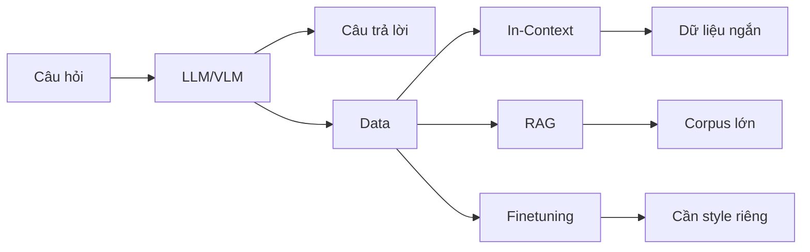
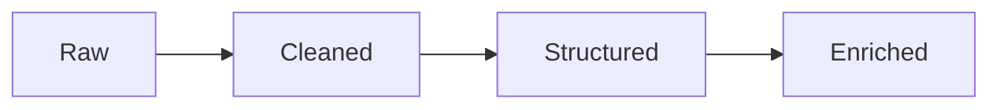

# Day 07 - Embedding & Vector Store

> **Câu hỏi cốt lõi:** *"Agent trả lời sai vì model yếu, hay vì nó không có đúng dữ liệu để suy luận?"*

---

### 🗺️ 1. Bản đồ Kiến thức Hệ thống (Structured Knowledge Map)

#### 1.1. Data Strategy cho AI Product
Mô tả tầm quan trọng của dữ liệu trong sản phẩm AI và cách thức dữ liệu ảnh hưởng đến hiệu suất của agent:



#### 1.2. Các Loại Dữ liệu Cần Thiết cho Agent
| Loại Dữ liệu | Mô tả |
|--------------|-------|
| **Knowledge Data** | Tài liệu, policy, SOP, FAQ, manual, hợp đồng. |
| **Operational Data** | Database, trạng thái đơn hàng, ticket, CRM records. |
| **Contextual Data** | Session history, user profile, preferences. |

#### 1.3. Data Quality Pyramid
Mô tả các cấp độ chất lượng dữ liệu:



---

### 📌 2. Khái niệm Cơ bản & Từ khóa Nền tảng (Core Concepts & Glossary)

| Thuật ngữ | Khái niệm Kỹ thuật & Bản chất | Tại sao cần quan tâm? |
|------------|-------------------------------|-----------------------|
| **Embedding** | Biến ngôn ngữ thành không gian toán học để so sánh nghĩa. | Cơ sở cho semantic search, clustering, deduplication. |
| **Vector Store** | Lưu trữ vector cùng với metadata để hỗ trợ retrieval. | Giúp tìm kiếm ngữ nghĩa và lọc dữ liệu hiệu quả. |
| **Retrieval Pipeline** | Quy trình kết nối dữ liệu với hành vi của agent. | Đảm bảo agent có thể truy xuất thông tin chính xác từ dữ liệu. |

---

### 📐 3. Quy tắc, Công thức & Tham số Kỹ thuật (Hard Rules & Formulas)

#### 3.1. Công thức Cosine Similarity
Đo độ gần giữa hai vector:

$$
cos(A, B) = \frac{A \cdot B}{||A|| \times ||B||}
$$

#### 3.2. Công thức Euclidean Distance
Đo khoảng cách giữa hai điểm:

$$
d(A, B) = \sqrt{\sum_{i=1}^{n} (A_i - B_i)^2}
$$

---

### 💻 4. Hành trang Kỹ thuật & Mã nguồn (Technical Hands-on)

#### 4.1. Ví dụ về Embedding trong Python
```python
from openai import OpenAI
import numpy as np

client = OpenAI()
texts = ["Chính sách hoàn tiền", "Quy định đổi trả", "Thời tiết hôm nay"]

resp = client.embeddings.create(
    model="text-embedding-3-small", 
    input=texts
)

vecs = [np.array(d.embedding) for d in resp.data]

# Cosine similarity
cos = lambda a, b: a @ b / (np.linalg.norm(a) * np.linalg.norm(b))

print(cos(vecs[0], vecs[1])) # ~0.87 hoàn tiền <-> đổi trả
```

#### 4.2. Chroma - Add + Query + Inject
```python
import chromadb

client = chromadb.Client()
col = client.create_collection("policies")

# 1. Add: chunk + metadata -> vector store
col.add(
    ids=["p1", "p2"],
    documents=["Khách hàng có 30 ngày đổi trả.", "Hoàn tiền trong 7 ngày làm việc."],
    metadatas=[{"cat": "returns"}, {"cat": "refund"}],
)

# 2. Query: semantic search
results = col.query(query_texts=["đổi size"], n_results=2)

# 3. Inject: dùng kết quả làm context cho LLM
context = "\n".join(results["documents"][0])
```

---

### 🧠 5. Tư duy Chuyển dịch: Data Quality & Retrieval

#### 5.1. Retrieval vs Memory
- **Retrieval:** Tìm context liên quan cho câu hỏi hiện tại.
- **Memory:** Lưu trạng thái, sở thích, lịch sử chọn lọc của người dùng.

#### 5.2. Chunking
- **Chunking:** Chia tài liệu dài thành các đoạn nhỏ hơn để embed và index riêng.
- **Chiến lược chunk phổ biến:** Theo heading, theo số token cố định, theo câu.

---

### 🔑 6. Key Takeaways

1. **Data quality** thường quan trọng hơn việc đổi sang model đắt hơn.
2. **Embedding** là lớp dịch ngôn ngữ sang không gian có thể so sánh nghĩa.
3. **Vector store** là bộ nhớ dài hạn có thể tìm kiếm bằng ngữ nghĩa và metadata.
4. **Retrieval pipeline** là cầu nối từ dữ liệu riêng tới câu trả lời grounded của agent.

---

### 📚 7. Tài liệu Tham Khảo

- Stanford HAI. AI Index 2025. [Link](https://hai.stanford.edu/ai-index/2025-ai-index-report)
- OpenAI. Embeddings Guide. [Link](https://platform.openai.com/docs/guides/embeddings)
- Chroma Docs. [Link](https://docs.trychroma.com/)
- HuggingFace. MTEB Benchmark. [Link](https://huggingface.co/blog/mteb)

---

### 🔮 8. Tiếp Theo & Bài Tập

- Hoàn thiện `solution.py` nếu chưa pass hết tests.
- Rà lại knowledge base: bỏ nội dung nhiễu, thêm metadata.
- Thử thêm 3 queries khó hơn, tìm failure cases mới.

> [!IMPORTANT]  
> **Preview Day 08:** Ngày 8 đi tiếp sang **RAG pipeline**: indexing, retrieval, generation, evaluation.