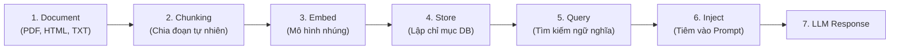

# Day 07 - Retrieval Pipeline & Lab Integration

## 1. Quy trình Truy xuất Dữ liệu Chuẩn (Retrieval Pipeline)

Một đường ống RAG (Retrieval-Augmented Generation) tiêu chuẩn đi qua các bước sau:



---

## 2. Nghệ thuật Chia nhỏ Văn bản (Chunking)

Kích thước của đoạn văn (chunk) quyết định chất lượng ngữ cảnh mà mô hình nhận được.
- **Chunk quá to:** Chứa nhiều chủ đề khác nhau, làm giảm độ tập trung của vector nhúng, khi truy xuất sẽ chứa nhiều nội dung gây nhiễu và tốn token ngữ cảnh.
- **Chunk quá nhỏ:** Làm đứt gãy ngữ cảnh, mô hình không hiểu được bức tranh toàn cảnh hoặc mất đi các liên kết thông tin quan trọng.

### Các Phương pháp Chunking Phổ biến

| Phương pháp | Cách hoạt động | Ưu điểm | Nhược điểm |
| :--- | :--- | :--- | :--- |
| **Fixed-size token/char** | Cắt văn bản theo một số lượng ký tự hoặc token cố định. | Rất đơn giản, dễ lập trình và triển khai. | Dễ bị cắt đôi câu hoặc cắt ngang ý nghĩa ở ranh giới. |
| **Sentence-based** | Tách văn bản dựa theo các dấu chấm câu để giữ nguyên vẹn câu. | Giữ nguyên ý nghĩa đầy đủ của từng câu đơn lẻ. | Các câu dài ngắn không đều, khó gom các câu liên quan. |
| **Section / Heading** | Tách văn bản dựa trên cấu trúc tự nhiên (các tiêu đề H1, H2, H3). | Đảm bảo các đoạn văn bản trọn vẹn về mặt chủ đề. | Yêu cầu tài liệu nguồn phải được cấu trúc chuẩn hóa. |
| **Recursive Character** | Thử tách bằng các ký tự phân tách lớn trước (`\n\n`), rồi đến (`\n`), sau cùng là khoảng trắng (` `). | Rất linh hoạt, giữ được các đoạn văn cùng chủ đề gần nhau. | Khó tối ưu chính xác cho mọi loại tài liệu cùng lúc. |
| **Semantic Chunking** | Tính khoảng cách embedding giữa các câu liên tiếp, tách chunk khi có sự thay đổi lớn về ngữ nghĩa. | Chất lượng ngữ cảnh cao nhất, bảo toàn ý nghĩa chủ đề tốt. | Tốn tài nguyên, chạy chậm vì cần gọi mô hình nhúng liên tục. |

### Chunk Overlap (Độ gối đầu giữa các đoạn)
- **Tại sao cần?** Để tránh mất ngữ nghĩa ở ranh giới giao nhau giữa hai chunk kề nhau.
- **Tỷ lệ khuyến nghị:** Thường từ **10% - 20%** kích thước của chunk (ví dụ: gối đầu 50 - 100 tokens cho chunk kích thước 512 tokens).
- *Lưu ý:* Overlap quá nhiều sẽ gây trùng lặp thông tin, lãng phí bộ nhớ lưu trữ; overlap quá ít sẽ làm mất liên kết ý nghĩa ở biên.

---

## 3. Quản lý và Đánh giá Chất lượng Truy xuất

### Hosted Retrieval (Managed) vs Self-managed Retrieval
- **Hosted / Managed (Ví dụ: OpenAI File Search, Pinecone Serverless):** Đi nhanh, ít phải code hạ tầng, rất phù hợp cho giai đoạn làm demo và kiểm chứng ý tưởng (PoC).
- **Self-managed (Ví dụ: Chroma chạy local, Qdrant tự host):** Có quyền kiểm soát hoàn toàn cách chia chunk, metadata, thuật toán search và tối ưu hóa chi phí vận hành lâu dài.

### Các Lỗi Thường Gặp (Failure Patterns) trong Retrieval

| Lỗi | Biểu hiện | Cách khắc phục |
| :--- | :--- | :--- |
| **Chunk quá to** | Lấy được đoạn đúng chủ đề nhưng chứa quá nhiều thông tin thừa, lãng phí token. | Chia nhỏ chunk hơn, chia theo section tự nhiên. |
| **Thiếu Metadata** | Không thể lọc theo danh mục, lấy nhầm tài liệu cũ hoặc tài liệu ở domain khác. | Bổ sung các trường siêu dữ liệu như category, source, date. |
| **Top-k quá cao** | Inject quá nhiều chunk vào prompt làm nhiễu mô hình và vượt quá token budget. | Giảm số lượng `k`, thiết lập ngưỡng điểm tin cậy (score threshold). |
| **Dữ liệu cũ (Stale)** | Agent trả lời đúng logic nhưng dựa trên chính sách cũ đã hết hạn. | Re-index định kỳ, gắn nhãn versioning hoặc date cho tài liệu. |
| **Query mơ hồ** | Người dùng hỏi quá ngắn hoặc dùng từ lóng, dẫn đến truy xuất sai tài liệu. | Sử dụng kỹ thuật Query Rewriting hoặc Query Expansion trước khi search. |

### Chỉ số Đo lường Chất lượng Retrieval (Retrieval Metrics)
Đánh giá chất lượng truy xuất độc lập trước khi đánh giá chất lượng sinh văn bản (Generation):
- **Precision@k:** Trong $k$ kết quả trả về, có bao nhiêu phần trăm thực sự liên quan đến câu hỏi?
- **Recall@k:** Trong tất cả các tài liệu liên quan có trong DB, hệ thống lấy ra được bao nhiêu phần trăm nằm trong top $k$?
- **MRR (Mean Reciprocal Rank):** Kết quả liên quan đầu tiên xuất hiện ở vị trí thứ mấy trong danh sách trả về? (Vị trí càng cao càng tốt).
- **NDCG:** Đánh giá thứ tự xếp hạng (ranking) của các tài liệu trả về có hợp lý không.

---

## 4. Hướng dẫn Thực hành: Lab 07 (Vector Store Integration)

Mục tiêu của bài thực hành là tự tay xây dựng một pipeline kết nối dữ liệu riêng (FAQ, SOP hoặc chính sách) vào Agent sử dụng **ChromaDB** chạy local và **OpenAI API**.

### Bước 1: Thiết lập Data Inventory (Bảng kiểm kê dữ liệu)

Trước khi code, hãy liệt kê danh sách tài liệu dưới dạng bảng:

| Tên File | Loại dữ liệu | Đội quản lý (Owner) | Tần suất cập nhật | PII? | Retrieval Fit |
| :--- | :--- | :--- | :--- | :--- | :--- |
| `chinh_sach_doi_tra_v3.txt` | Knowledge | Support Team | Hàng quý (Quarterly) | Không | Cao (Vector Store) |
| `faq_bao_hanh.txt` | Knowledge | Product Team | Hàng tháng (Monthly) | Không | Cao (Vector Store) |

### Bước 2: Viết Code Chia Chunk (LangChain Splitter)

Sử dụng thư viện `langchain-text-splitters` để chia nhỏ văn bản tự động và bảo toàn cấu trúc:

```python
from langchain_text_splitters import RecursiveCharacterTextSplitter

# Cấu hình splitter với kích thước chunk và overlap
splitter = RecursiveCharacterTextSplitter(
    chunk_size=500,
    chunk_overlap=50,
    separators=["\n\n", "\n", " ", ""]
)

# Giả lập nạp tài liệu thô
raw_documents = [
    {
        "text": "Khách hàng có 30 ngày kể từ ngày nhận hàng để yêu cầu đổi trả. Sản phẩm phải còn nguyên seal và hóa đơn mua hàng đi kèm.",
        "source": "chinh_sach_doi_tra_v3.txt",
        "category": "support"
    }
]

chunks = []
for doc in raw_documents:
    parts = splitter.split_text(doc["text"])
    for i, part in enumerate(parts):
        chunks.append({
            "id": f"{doc['source']}_chunk_{i}",
            "text": part,
            "metadata": {
                "source": doc["source"],
                "category": doc["category"]
            }
        })
```

### Bước 3: Nhúng (Embed) và Lưu trữ vào ChromaDB

Tạo collection trong ChromaDB local và lưu dữ liệu kèm vector nhúng từ OpenAI:

```python
import chromadb
from openai import OpenAI

client_ai = OpenAI()
# Khởi tạo Chroma client chạy local
client_db = chromadb.Client()
collection = client_db.get_or_create_collection("edu_gap_kb")

for chunk in chunks:
    # 1. Gọi API nhúng văn bản
    resp = client_ai.embeddings.create(
        model="text-embedding-3-small",
        input=[chunk["text"]]
    )
    embedding = resp.data[0].embedding
    
    # 2. Lưu vào Vector DB
    collection.add(
        ids=[chunk["id"]],
        embeddings=[embedding],
        documents=[chunk["text"]],
        metadatas=[chunk["metadata"]]
    )
```

### Bước 4: Thực hiện Truy vấn ngữ nghĩa (Semantic Search) kết hợp Bộ lọc

Tìm kiếm các đoạn văn bản có ý nghĩa gần gũi nhất với câu hỏi của người dùng và lọc theo metadata:

```python
query = "thời hạn đổi trả sản phẩm là bao lâu"

# Tìm kiếm top-3 kết quả liên quan nhất trong danh mục "support"
results = collection.query(
    query_embeddings=[client_ai.embeddings.create(model="text-embedding-3-small", input=[query]).data[0].embedding],
    n_results=3,
    where={"category": "support"}  # Metadata filter
)

# Hiển thị kết quả tìm được kèm khoảng cách tương đồng (distance)
for i, doc in enumerate(results["documents"][0]):
    distance = results["distances"][0][i]
    metadata = results["metadatas"][0][i]
    print(f"[{i+1}] Score (Distance): {distance:.4f} | Source: {metadata['source']}")
    print(f"Content: {doc}\n")
```

### Bước 5: Hàm Trả lời Grounded với Ngữ cảnh Truy xuất

Tải ngữ cảnh đã tìm được và chèn vào prompt để LLM trả lời chuẩn xác, hạn chế ảo giác:

```python
def answer_with_context(query, collection, client_ai, model="gpt-4o-mini"):
    # 1. Nhúng câu hỏi và truy xuất top-3 chunks
    query_vector = client_ai.embeddings.create(model="text-embedding-3-small", input=[query]).data[0].embedding
    results = collection.query(query_embeddings=[query_vector], n_results=3)
    
    # 2. Hợp nhất ngữ cảnh từ các chunk tìm thấy
    context = "\n---\n".join(results["documents"][0])
    
    # 3. Tạo prompt tiêm ngữ cảnh
    system_instruction = (
        "Dựa vào các nguồn ngữ cảnh được cung cấp dưới đây, hãy trả lời câu hỏi của người dùng một cách ngắn gọn và chính xác.\n"
        "Nếu ngữ cảnh không chứa thông tin để trả lời, hãy nói rõ 'Không tìm thấy thông tin phù hợp trong tài liệu'.\n"
        "Không được tự bịa ra câu trả lời nằm ngoài ngữ cảnh."
    )
    
    prompt = f"Ngữ cảnh:\n{context}\n\nCâu hỏi: {query}"
    
    # 4. Gọi chat model sinh câu trả lời
    response = client_ai.chat.completions.create(
        model=model,
        messages=[
            {"role": "system", "content": system_instruction},
            {"role": "user", "content": prompt}
        ]
    )
    return response.choices[0].message.content

# Chạy thử hàm trả lời
answer = answer_with_context("Tôi có thể đổi trả hàng trong 2 tháng không?", collection, client_ai)
print("Agent:", answer)
```
