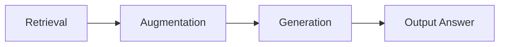

# Day 08 - RAG Pipeline

> **Câu hỏi cốt lõi:** *"Bạn đã build agent với vector store. Nhưng agent vẫn hallucinate và trả lời sai. Lỗi nằm ở đâu trong pipeline?"*

---

### 🗺️ 1. Bản đồ Kiến thức Hệ thống (Structured Knowledge Map)

RAG Pipeline bao gồm ba thành phần chính: Retrieval (R), Augmentation (A), và Generation (G). Mỗi thành phần có vai trò quan trọng trong việc cải thiện chất lượng câu trả lời của mô hình.



---

### 📌 2. Khái niệm Cơ bản & Từ khóa Nền tảng (Core Concepts & Glossary)

| Thuật ngữ | Khái niệm Kỹ thuật & Bản chất | Tại sao cần quan tâm? |
| :--- | :--- | :--- |
| **Retrieval** | Truy xuất thông tin từ kho dữ liệu ngoài (vector store, DB, search engine). | Tìm đúng chứng cứ và lọc nhiễu để đảm bảo độ chính xác. |
| **Augmentation** | Tăng cường prompt bằng cách đóng gói context có cấu trúc và gắn metadata. | Giảm noise và chống “lost in the middle”. |
| **Generation** | Sinh câu trả lời bám sát chứng cứ đã augment, kèm trích dẫn nguồn. | Đảm bảo câu trả lời grounded và có thể kiểm chứng. |
| **Hybrid Search** | Kết hợp giữa dense search và sparse search để tận dụng ưu điểm của cả hai. | Tăng cường khả năng tìm kiếm và độ chính xác. |
| **Reranking** | Đánh giá lại thứ hạng của các tài liệu sau khi truy xuất. | Cải thiện độ chính xác của câu trả lời bằng cách chọn tài liệu phù hợp nhất. |

---

### 📐 3. Quy tắc, Công thức & Tham số Kỹ thuật (Hard Rules & Formulas)

#### 3.1. Các Kỹ Thuật Chính Trong RAG
- **Retrieval:**
  - Dense Search (Semantic)
  - Sparse Search (BM25)
  - Hybrid Search
  - Reranking (Cross-encoder)
  
- **Augmentation:**
  - Context Injection
  - Document Reordering
  - Metadata Integration

- **Generation:**
  - Grounded Generation
  - Self-correction
  - Output Formatting

#### 3.2. RAG Triad: Đọc Vị Lỗi Qua Bảng Điểm
| Context Recall | Faithfulness | Answer Relevance | Chẩn đoán                                      |
| :------------- | :----------- | :--------------- | :--------------------------------------------- |
| Cao            | Cao          | Cao              | Hệ thống hoạt động tốt                           |
| Thấp           | Cao          | Thấp             | Sửa Retrieval (search sai)                      |
| Cao            | Thấp         | Cao              | Sửa Generation (model bịa thêm)                 |
| Thấp           | Thấp         | Thấp             | Sửa Indexing (dữ liệu gốc có vấn đề)                 |

---

### 💻 4. Hành trang Kỹ thuật & Mã nguồn (Technical Hands-on)

#### 4.1. Mã gọi API cho Retrieval
Dưới đây là cách triển khai mã nguồn gọi API cơ bản trong Python cho Retrieval:

```python
from your_retrieval_library import RetrievalSystem

retrieval_system = RetrievalSystem()

# Truy vấn
query = "Chính sách hoàn tiền?"
results = retrieval_system.search(query)

# Hiển thị kết quả
for result in results:
    print(result)
```

#### 4.2. Reranking
Mã nguồn cho Reranking:

```python
from your_reranking_library import Reranker

reranker = Reranker()
top_results = reranker.rank(results)

# Hiển thị kết quả đã được rerank
for result in top_results:
    print(result)
```

---

### 🧠 5. Tư duy Chuyển dịch: Từ Retrieval Đến RAG

RAG không chỉ đơn thuần là việc gắn thêm context; nó là sự phối hợp giữa retrieval system, augmentation layer, và generation system. Việc áp dụng RAG giúp giảm thiểu hallucination và tăng cường độ chính xác của câu trả lời.

> [!IMPORTANT]  
> **Lưu ý quan trọng:** RAG là yêu cầu bắt buộc khi doanh nghiệp cần AI trả lời dựa trên dữ liệu nội bộ, có trách nhiệm và luôn cập nhật.

---

### 🔍 6. Grounding & Verification Techniques

- **Strict Constraints:** Ép LLM chỉ được dùng context cung cấp.
- **Metadata Integration:** Đưa thêm thời gian, tác giả vào context.
- **Citation Formatting:** Yêu cầu LLM trả về số thứ tự tài liệu để người dùng có thể kiểm chứng.

---

### 📊 7. Đánh giá RAG

Để đánh giá hiệu quả của RAG, cần có các chỉ số như Context Recall, Faithfulness, và Answer Relevance. Việc này giúp xác định các vấn đề trong pipeline và cải thiện chất lượng câu trả lời.

---

### 📅 8. Tiếp theo & Bài tập

Chuẩn bị một use case mà single-agent đang bắt đầu quá tải và nghĩ trước về cách tách 2–3 worker theo tool, domain, hay bước xử lý.

---

### 📚 9. Tài Liệu Tham Khảo

1. Lewis et al. (2020), Retrieval-Augmented Generation for Knowledge-Intensive NLP Tasks.
2. OpenAI Docs, Retrieval Guide và File Search Guide.
3. LangChain, RAG from Scratch notebooks.
4. RAGAS Docs, Evaluation metrics for RAG systems.

---

### ❓ 10. Hỏi & Đáp

Bạn đang thiếu model mạnh hơn, hay đang thiếu một pipeline retrieval, augmentation, và evaluation đủ kỷ luật?