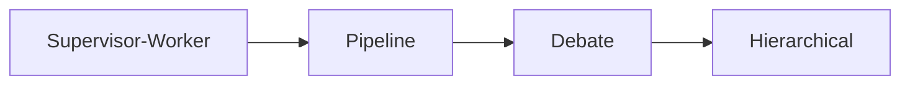
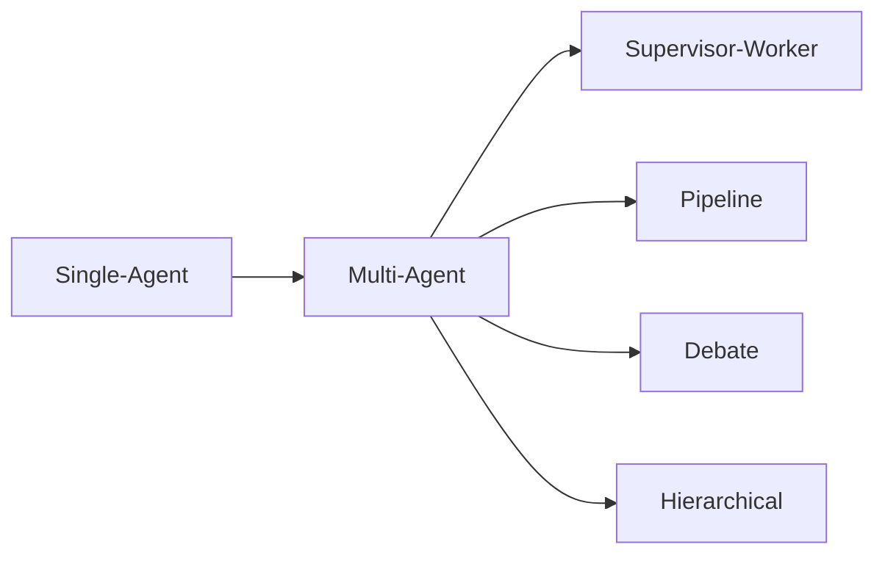

# Day 09 - Multi-Agent & Kết Nối Hệ Thống (Multi-Agent & System Connectivity)

> **Câu hỏi cốt lõi:** *"Bạn có 1 agent rất giỏi. Nhưng bài toán đã quá lớn cho 1 agent. Làm thế nào để hệ thống vẫn rõ vai trò, dễ kiểm soát, và dễ mở rộng?"*

---

### 🗺️ 1. Bản đồ Kiến thức Hệ thống (Structured Knowledge Map)

Để hiểu rõ về hệ thống multi-agent, chúng ta cần nắm vững các khái niệm và mô hình sau:

#### 1.1. Giới hạn của Single-Agent
- **Context Bottleneck:** Một agent phải giữ quá nhiều mục tiêu và trạng thái, dẫn đến giới hạn trong khả năng xử lý thông tin.
- **Specialization Trade-off:** Agent ôm đồm nhiều vai trò có thể không thật sự giỏi ở bất kỳ vai trò nào.
- **Parallelism Hạn Chế:** Thường chạy tuần tự, làm tăng độ trễ không cần thiết.
- **Reliability Yếu:** Nếu agent chọn sai công cụ hoặc hiểu sai nhiệm vụ, toàn bộ hệ thống dễ đi lệch.

#### 1.2. Multi-Agent Patterns
- **Supervisor-Worker:** Một supervisor điều phối nhiều worker chuyên biệt.
- **Pipeline:** Các bước thực hiện tuần tự, mỗi bước cần đầu ra của bước trước.
- **Debate:** Nhiều agent cùng giải quyết một bài toán và tổng hợp kết quả.
- **Hierarchical:** Nhiều tầng supervisor cho nhiều nhóm task.



---

### 📌 2. Khái niệm Cơ bản & Từ khóa Nền tảng (Core Concepts & Glossary)

| Thuật ngữ | Khái niệm Kỹ thuật & Bản chất | Tại sao cần quan tâm? |
| :--- | :--- | :--- |
| **MCP (Model Context Protocol)** | Chuẩn giao tiếp giữa agent và tool, giúp kết nối mà không cần tùy chỉnh từng tích hợp. | Giúp mở rộng hệ thống dễ dàng và hiệu quả. |
| **A2A (Agent to Agent Communication)** | Giao tiếp giữa các agent với nhau thông qua message contract rõ ràng. | Tạo điều kiện cho việc chia việc và đồng bộ hóa. |
| **LangGraph** | Framework để biểu diễn luồng chạy của hệ thống multi-agent dưới dạng đồ thị. | Giúp dễ dàng visualize và debug hệ thống. |
| **Shared State** | Trạng thái chung giữa các agent, bao gồm task, plan, worker_results, status, final_answer, và trace. | Cần thiết để theo dõi và cải thiện hệ thống. |

---

### 📐 3. Quy tắc, Công thức & Tham số Kỹ thuật (Hard Rules & Formulas)

#### 3.1. Message Contract Tối Thiểu cho A2A
- **Task:** Nhiệm vụ cần thực hiện.
- **Context:** Thông tin cần thiết để thực hiện nhiệm vụ.
- **Expected Output:** Định dạng đầu ra mong đợi.

```json
{
    "task": "retrieve evidence",
    "context": "user hỏi về refund policy, ưu tiên tài liệu sau 2025",
    "expected_output": "top 3 chunks + source + confidence"
}
```

#### 3.2. State Schema Tối Thiểu cho Day 09
- **task:** Nhiệm vụ gốc từ user.
- **plan:** Danh sách worker cần gọi.
- **worker_results:** Kết quả từ từng worker.
- **status:** Trạng thái của nhiệm vụ (pending, running, done, error).
- **final_answer:** Kết quả tổng hợp cuối cùng.
- **trace:** Log dạng list có timestamp.

---

### 💻 4. Hành trang Kỹ thuật & Mã nguồn (Technical Hands-on)

#### 4.1. Ví dụ Routing Logic trong LangGraph
```python
class AgentState(TypedDict):
    task: str
    need_retrieval: bool
    need_tool: bool
    worker_results: dict
    final_answer: str

def route_to_worker(state: AgentState) -> str:
    if state["need_tool"]:
        return "tool_worker"
    if state["need_retrieval"]:
        return "retrieval_worker"
    return "synthesis_worker"
```

#### 4.2. Thiết kế Trace Log Tốt
Mỗi entry trong trace nên có:
- **timestamp:** Khi nào.
- **agent_id:** Ai làm.
- **action:** Làm gì (route, call, synthesize, error).
- **input_summary:** Nhận gì (tóm tắt).
- **output_summary:** Trả về gì.
- **status:** ok, warn, error.
- **latency_ms:** Mất bao lâu.

```json
{
    "t": "14:03:21",
    "agent": "supervisor",
    "action": "route",
    "decision": "retrieval_worker",
    "reason": "need_retrieval=true",
    "status": "ok",
    "latency_ms": 312
}
```

---

### 🧠 5. Tư duy Chuyển dịch: Từ Single-Agent Sang Multi-Agent

Sự chuyển đổi từ single-agent sang multi-agent không chỉ là tăng số lượng agent mà còn là cách chia vai trò để hệ thống dễ kiểm soát và mở rộng hơn.



> [!WARNING]  
> **Cảnh báo quan trọng:** Chỉ sử dụng multi-agent khi bài toán thực sự cần. Nếu workflow đơn giản đã đủ, giữ đơn giản sẽ rẻ và ổn định hơn.

---

### 📊 6. Tổng Kết – Key Takeaways

1. **Multi-agent** là cách chia vai trò để hệ thống đỡ quá tải và dễ kiểm soát hơn.
2. **Supervisor-worker** là pattern practical nhất để bắt đầu, giúp dễ dàng quản lý và mở rộng.
3. **MCP** cho phép agent kết nối với tool qua chuẩn chung, trong khi **A2A** cho phép giao tiếp giữa các agent.
4. **LangGraph** giúp visualize luồng quyết định và dễ dàng debug.
5. **Observability** là điều kiện tiên quyết để cải thiện hệ thống theo thời gian.

---

### 📚 Tài Liệu Tham Khảo
1. Model Context Protocol, Official Documentation — modelcontextprotocol.io.
2. LangGraph Docs, Multi-Agent Tutorials — supervisor-worker orchestration, graph routing.
3. Somers et al. (2023), Cognitive Architectures for Language Agents (CoALA).
4. Anthropic (2024), Building Effective Agents — blog post về practical patterns cho agentic systems.
5. LangSmith Documentation, Tracing & Observability — công cụ trace cho LangChain/LangGraph pipelines.