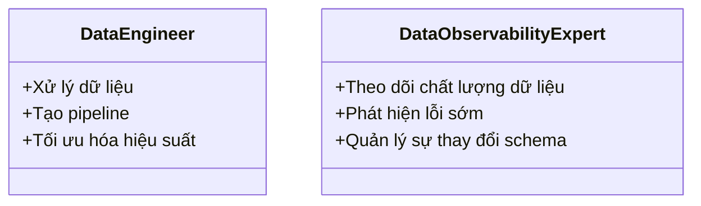

# Day 10 - Data Pipeline & Data Observability

> **Câu hỏi cốt lõi:** *"Garbage in → garbage out – bạn sẽ khắc phục vấn đề này như thế nào?"*

---

### 🗺️ 1. Bản đồ Kiến thức Hệ thống (Structured Knowledge Map)

Để hiểu rõ về Data Pipeline và Data Observability, chúng ta sẽ phân tích các thành phần chính của quy trình này:

#### 1.1. Quy trình Data Pipeline
Mô hình hóa quy trình từ nguồn dữ liệu đến khi dữ liệu được phục vụ cho agent:


#### 1.2. Các thành phần chính trong Data Pipeline
- **Sources:** DB, API, Files, Streams
- **Pipeline:** Ingest, Transform (ETL/ELT)
- **Storage/Serving:** Raw + cleaned, Vector store, Cache/API
- **Agent Surface:** RAG, Tools/Workers, Agent Quality

---

### 📌 2. Khái niệm Cơ bản & Từ khóa Nền tảng (Core Concepts & Glossary)

Để làm chủ Data Pipeline và Data Observability, bạn cần hiểu các khái niệm sau:

| Thuật ngữ | Khái niệm Kỹ thuật & Bản chất | Tại sao cần quan tâm? |
| :--- | :--- | :--- |
| **ETL (Extract, Transform, Load)** | Quy trình lấy dữ liệu từ nguồn, biến đổi và nạp vào kho dữ liệu. | Đảm bảo dữ liệu sạch và có cấu trúc trước khi sử dụng. |
| **ELT (Extract, Load, Transform)** | Quy trình lấy dữ liệu, nạp vào kho dữ liệu trước, sau đó biến đổi. | Tối ưu hóa hiệu suất cho các kho dữ liệu lớn. |
| **Data Quality** | Đánh giá độ chính xác, đầy đủ, và nhất quán của dữ liệu. | Dữ liệu chất lượng cao là điều kiện tiên quyết cho quyết định chính xác. |
| **Observability** | Khả năng theo dõi và phát hiện vấn đề trong quy trình dữ liệu. | Giúp phát hiện lỗi trước khi người dùng gặp phải vấn đề. |
| **Freshness** | Độ mới của dữ liệu, phản ánh thời gian cập nhật gần nhất. | Dữ liệu cũ có thể dẫn đến thông tin sai lệch. |
| **Schema Evolution** | Quá trình thay đổi cấu trúc dữ liệu theo thời gian. | Cần quản lý để tránh lỗi trong quá trình xử lý dữ liệu. |

---

### 📐 3. Quy tắc, Công thức & Tham số Kỹ thuật (Hard Rules & Formulas)

#### 3.1. Quy trình ETL/ELT
- **ETL:** Dữ liệu được biến đổi trước khi nạp vào kho.
- **ELT:** Dữ liệu được nạp vào kho trước khi biến đổi.

#### 3.2. Các chỉ số quan trọng trong Observability
- **Freshness:** Thời gian từ lần cập nhật cuối cùng.
- **Volume:** Số lượng bản ghi trong kho dữ liệu.
- **Schema Drift:** Sự thay đổi trong cấu trúc dữ liệu.

#### 3.3. Công thức kiểm tra chất lượng dữ liệu
```python
batch.expect_column_values_to_not_be_null("content")
batch.expect_column_values_to_be_unique("doc_id")
```
Nếu các điều kiện này không thỏa mãn, dừng pipeline để tránh dữ liệu xấu.

---

### 💻 4. Hành trang Kỹ thuật & Mã nguồn (Technical Hands-on)

#### 4.1. Mã gọi API cho Data Pipeline
Dưới đây là ví dụ mã nguồn Python cho quy trình ETL:

```python
import pandas as pd

def extract_data(source):
    # Lấy dữ liệu từ nguồn
    return pd.read_csv(source)

def transform_data(data):
    # Làm sạch và chuẩn hóa dữ liệu
    data.drop_duplicates(inplace=True)
    data['date'] = pd.to_datetime(data['date'])
    return data

def load_data(data, destination):
    # Nạp dữ liệu vào kho
    data.to_csv(destination, index=False)

# Quy trình ETL
source = 'data/raw_data.csv'
destination = 'data/cleaned_data.csv'
data = extract_data(source)
cleaned_data = transform_data(data)
load_data(cleaned_data, destination)
```

#### 4.2. Kiểm tra chất lượng dữ liệu
Sử dụng Expectation Suite để kiểm tra chất lượng dữ liệu:

```python
from great_expectations.data_context import DataContext

context = DataContext("path/to/great_expectations/directory")
batch = context.get_batch("my_batch")

# Kiểm tra chất lượng dữ liệu
batch.expect_column_values_to_not_be_null("content")
batch.expect_column_values_to_be_unique("doc_id")
```

---

### 🧠 5. Tư duy Chuyển dịch: Từ Data Engineer sang Data Observability Expert

Sự chuyển mình từ việc chỉ đơn thuần xử lý dữ liệu sang việc đảm bảo chất lượng và khả năng quan sát dữ liệu:



* **Data Engineer:** Tập trung vào việc xây dựng và tối ưu hóa quy trình dữ liệu.
* **Data Observability Expert:** Đảm bảo rằng dữ liệu luôn ở trạng thái tốt nhất và có thể phát hiện lỗi trước khi ảnh hưởng đến người dùng.

> [!WARNING]  
> **Cảnh báo quan trọng cho kỹ sư dữ liệu:** Hãy luôn chú ý đến chất lượng dữ liệu và khả năng quan sát để tránh những vấn đề nghiêm trọng trong quy trình làm việc của bạn.