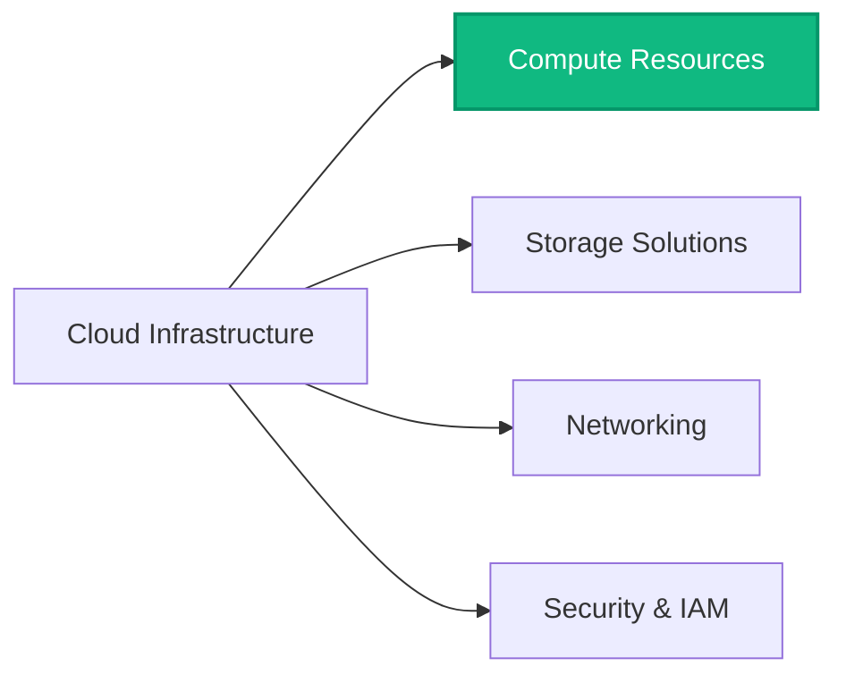
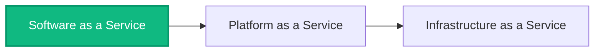
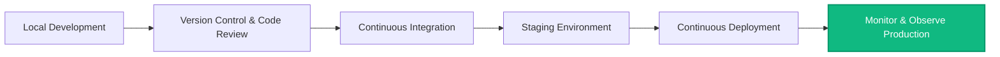
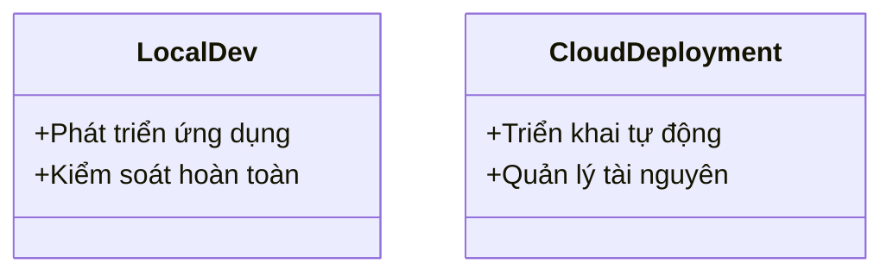

# Day 12 - Cloud Infrastructure & Deployment

> **Câu hỏi cốt lõi:** *"Khi nào 100 người dùng được?"*

---

### 🗺️ 1. Bản đồ Kiến thức Hệ thống (Structured Knowledge Map)

Để hiểu rõ về hạ tầng cloud và cách triển khai ứng dụng AI, chúng ta sẽ khám phá các khía cạnh chính của Cloud Infrastructure:

#### 1.1. Hạ Tầng Cloud
Cloud Infrastructure bao gồm các tài nguyên điện toán như máy chủ, mạng, lưu trữ, và ảo hóa, cung cấp qua internet theo mô hình pay-as-you-go.



#### 1.2. Các Tầng Dịch Vụ Cloud
Cloud Services được chia thành 3 tầng chính:



---

### 📌 2. Khái niệm Cơ bản & Từ khóa Nền tảng (Core Concepts & Glossary)

| Thuật ngữ | Khái niệm Kỹ thuật & Bản chất | Tại sao cần quan tâm? |
| :--- | :--- | :--- |
| **Cloud Infrastructure** | Tập hợp tài nguyên điện toán cung cấp qua internet. | Linh hoạt, không cần đầu tư phần cứng, dễ mở rộng. |
| **Docker** | Nền tảng container hóa cho phép đóng gói ứng dụng cùng môi trường. | Giúp triển khai ứng dụng nhất quán trên mọi môi trường. |
| **API Gateway** | Cổng vào duy nhất cho tất cả backend services. | Quản lý auth, logging, rate limiting, và routing. |
| **Scaling** | Tăng cường khả năng xử lý bằng cách thêm tài nguyên. | Đảm bảo ứng dụng hoạt động mượt mà khi có nhiều người dùng. |
| **Health Check** | Endpoint kiểm tra tình trạng hoạt động của ứng dụng. | Giúp phát hiện lỗi và đảm bảo ứng dụng luôn sẵn sàng. |

---

### 📐 3. Quy tắc, Công thức & Tham số Kỹ thuật (Hard Rules & Formulas)

#### 3.1. Quy trình từ Localhost đến Production
Quá trình triển khai ứng dụng từ môi trường phát triển đến môi trường sản xuất bao gồm 6 bước:



#### 3.2. Dockerfile Cơ Bản
Cấu trúc Dockerfile cho ứng dụng AI:

```dockerfile
# --- Stage 1: Build ---
FROM node:20-alpine AS builder
WORKDIR /app
COPY package*.json ./
RUN npm ci --only=production
COPY . .
RUN npm run build

# --- Stage 2: Production ---
FROM node:20-alpine
WORKDIR /app
COPY --from=builder /app/dist ./dist
USER appuser
EXPOSE 3000
HEALTHCHECK --interval=30s --timeout=5s CMD wget -qO- http://localhost:3000/health || exit 1
CMD ["node", "dist/index.js"]
```

---

### 💻 4. Hành trang Kỹ thuật & Mã nguồn (Technical Hands-on)

#### 4.1. Triển khai Docker
Các lệnh cơ bản để làm việc với Docker:

| Command                        | Description                                   |
| :----------------------------- | :------------------------------------------- |
| `docker build -t myapp:v1 .`  | Build image từ Dockerfile.                  |
| `docker run -p 3000:3000 myapp:v1` | Chạy container, map port 3000.              |
| `docker-compose up -d`        | Khởi động toàn bộ stack.                    |

#### 4.2. Triển khai lên Cloud
Các bước triển khai ứng dụng lên Railway hoặc Render:

1. Kết nối GitHub repo.
2. Thiết lập biến môi trường.
3. Nhấn Deploy để nhận public URL.

---

### 🧠 5. Tư duy Chuyển dịch: Local Development sang Cloud Deployment

Sự chuyển dịch từ phát triển cục bộ sang triển khai cloud yêu cầu thay đổi tư duy:



* **Local Development:** Tập trung vào việc phát triển và kiểm tra ứng dụng trên máy cá nhân.
* **Cloud Deployment:** Tập trung vào việc quản lý tài nguyên và triển khai tự động để phục vụ người dùng thực tế.

> [!WARNING]  
> **Cảnh báo quan trọng:** Hãy luôn đảm bảo rằng ứng dụng của bạn đã được kiểm tra kỹ lưỡng trước khi triển khai lên môi trường sản xuất để tránh các lỗi không mong muốn.

---

### 🔍 6. Kiểm tra Trước khi Triển khai (Pre-Deployment Checklist)

Trước khi bấm nút deploy, hãy kiểm tra các yếu tố sau:

| Security                                                                  | Performance                                                               |
| :------------------------------------------------------------------------ | :------------------------------------------------------------------------ |
| ✅ Secrets không có trong codebase                                         | ✅ Load test đã chạy với traffic gấp 2x dự kiến                         |
| ✅ HTTPS/TLS được bật, HTTP tự redirect sang HTTPS                        | ✅ DB indexes đã thêm cho các query phổ biến, EXPLAIN ANALYZE           |
| ✅ Rate limiting được bật ở API Gateway, tránh abuse                     | ✅ Assets được compress, CDN phân phối static files                     |

---

### 📅 7. Preview — Ngày 13: Monitoring & Observability

"Agent deploy xong, 3 ngày sau: latency tăng gấp đôi, cost tăng 300%. Bạn không biết cho đến khi user phàn nàn."

- **Metrics:** Latency, throughput, error rate.
- **Logging:** Structured logs → Loki / Datadog / CloudWatch.

`Chuẩn bị: Đọc LangSmith hoặc Langfuse quickstart (20 phút) trước buổi sau.`

---

Từ hôm nay, agent không còn chỉ chạy trên máy bạn. Nó đã là một service thật sự.