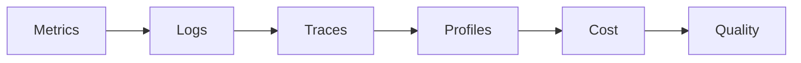
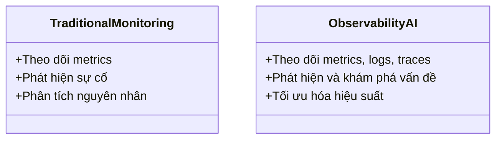

# Day 13 - Monitoring, Logging & Observability

> **Câu hỏi cốt lõi:** *"Làm thế nào để biết agent đang hoạt động hiệu quả và phát hiện sự cố trước khi người dùng phàn nàn?"*

---

### 🗺️ 1. Bản đồ Kiến thức Hệ thống (Structured Knowledge Map)

#### 1.1. Các Trụ Cột của Observability
Observability được xây dựng trên ba trụ cột chính và hai yếu tố bổ sung cho AI:



#### 1.2. So sánh Monitoring và Observability
| Monitoring (biết trước)                      | Observability (khám phá)                               |
| :------------------------------------------- | :----------------------------------------------------- |
| Đo các metrics biết trước sẽ cần             | Hệ thống phát ra đủ data để hỏi câu hỏi mới              |
| Trả lời câu hỏi đã định sẵn                  | Phù hợp với unknown-unknowns                           |

---

### 📌 2. Khái niệm Cơ bản & Từ khóa Nền tảng (Core Concepts & Glossary)

| Thuật ngữ    | Định nghĩa                                    | Ví dụ cho agent                              |
| :------------ | :------------------------------------------- | :------------------------------------------ |
| **SLI**       | Service Level Indicator — 1 metric đo lường được | P95 latency — 2.3s                           |
| **SLO**       | Objective: mục tiêu nội bộ cho SLI          | P95 <= 3s trong 99.5% thời gian (28 ngày)    |
| **SLA**       | Agreement: cam kết với khách hàng, có phạt    | 99% uptime, nếu không sẽ refund 10%         |
| **Error Budget** | Dung sai cho phép SLO sai lệch              | 100% - 99.5% = 0.5% = 3.6 giờ/tháng        |

---

### 📐 3. Quy tắc, Công thức & Tham số Kỹ thuật (Hard Rules & Formulas)

#### 3.1. Công thức Tính Toán Chi Phí
Chi phí cho mỗi request được tính bằng công thức:

$$Cost_{req} = \frac{T_{in}}{10^6} \cdot P_{in} + \frac{T_{out}}{10^6} \cdot P_{out} + \frac{T_{cache}}{10^6} \cdot P_{cache}$$

#### 3.2. Công thức Population Stability Index (PSI)
$$PSI = \sum_{i} (p_i - q_i) \cdot \ln \left(\frac{p_i}{q_i}\right)$$

---

### 💻 4. Hành trang Kỹ thuật & Mã nguồn (Technical Hands-on)

#### 4.1. Thiết lập Structured Logging với Python
```python
import structlog, logging

structlog.configure(
    processors=[
        structlog.processors.TimeStamper(fmt="iso", utc=True),
        structlog.processors.JSONRenderer(),
    ],
)

log = structlog.get_logger()
log.info("agent_started", service="rag-agent", version="1.2.0")
```

#### 4.2. Cấu hình OpenTelemetry cho Distributed Tracing
```python
from opentelemetry import trace
from opentelemetry.sdk.trace import TracerProvider
from opentelemetry.exporter.otlp.proto.http.trace_exporter import OTLPSpanExporter

provider = TracerProvider()
trace.set_tracer_provider(provider)
tracer = trace.get_tracer("agent-service")
```

---

### 🧠 5. Tư duy Chuyển dịch: Monitoring truyền thống sang Observability AI



---

### 🔍 6. Các Mẫu Tối ưu Chi phí (Cost Optimization Patterns)

1. **Prompt Caching:** Giảm chi phí bằng cách lưu trữ các prompt đã sử dụng.
2. **Model Routing:** Chọn mô hình phù hợp với độ phức tạp của yêu cầu.
3. **Semantic Cache:** Sử dụng các câu hỏi tương tự để trả lời từ bộ nhớ cache.
4. **Batch API:** Gọi API theo nhóm để tiết kiệm chi phí.

---

### 📊 7. Thiết kế Dashboard và Alerting

#### 7.1. Các yếu tố cần có trong Alert
- **Title rõ ràng**
- **Severity**
- **Impact statement**
- **Current value**
- **Dashboard link**
- **Trace link**
- **Runbook link**

#### 7.2. Thiết kế Dashboard 3 lớp
| Layer 1: Overview | Layer 2: Detail | Layer 3: Drill-down |
| :---------------- | :-------------- | :------------------ |
| Health status     | 4 golden signals | Individual traces    |

---

### 📚 8. Tài liệu Tham Khảo
1. Google SRE Workbook, Alerting on SLOs
2. Langfuse, Open Source LLM Observability
3. OpenTelemetry, GenAI Semantic Conventions

---

### 🔑 9. Key Takeaways
1. Hiểu rõ 3 trụ cột của observability và các yếu tố bổ sung cho AI.
2. Thiết kế alert symptom-based và SLO-driven.
3. Sử dụng OpenTelemetry để tối ưu hóa việc theo dõi và ghi log.

---

### 📝 10. Hỏi & Đáp
Monitoring tốt nghĩa là bạn biết agent có vấn đề trước khi user phàn nàn — và có đủ data để fix trong phút, không phải giờ.