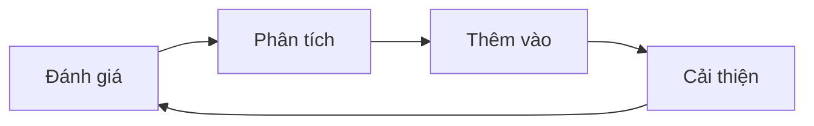

# Day 14 - Đánh giá AI & Benchmarking (AI Evaluation & Benchmarking)

> **Câu hỏi cốt lõi:** *"Sếp hỏi: AI agent của mình tốt hơn ChatGPT bao nhiêu? Bạn nói sao nếu không có benchmark?"*

---

### 🗺️ 1. Bản đồ Kiến thức Đánh giá AI (AI Evaluation Knowledge Map)

Để hiểu rõ về đánh giá AI, chúng ta cần nắm vững các khía cạnh chính như sau:

#### 1.1. Các Khái niệm Cơ bản về Đánh giá (Evaluation Fundamentals)
- **Đánh giá là một phương pháp khoa học:** Không chỉ dựa vào cảm nhận, mà cần có số liệu có thể so sánh và lặp lại.
- **4 Chiều Chất Lượng Output:**
  - **Correctness:** Đúng sự thật không? Có hallucinate không?
  - **Completeness:** Đủ chi tiết cần thiết chưa? Có bỏ sót thông tin quan trọng?
  - **Relevance:** Trả lời đúng câu hỏi user không? Hay lạc đề?
  - **Coherence:** Dễ đọc, có cấu trúc không?

#### 1.2. Thiết kế Benchmark (Benchmark Design)
- **Golden Dataset:** Tập dữ liệu chuẩn gồm 50-100 cặp câu hỏi-đáp án với các câu trả lời mong đợi từ chuyên gia.
- **Edge Cases:** Các trường hợp đặc biệt cần được xem xét để đảm bảo độ tin cậy của mô hình.

#### 1.3. RAGAS Framework
- **RAGAS Metrics:** Đánh giá chất lượng của mô hình dựa trên các chỉ số:
  - **Faithfulness:** Đáp án có dựa trên ngữ cảnh đã lấy không?
  - **Answer Relevancy:** Đáp án có trả lời đúng câu hỏi không?
  - **Context Recall:** Có lấy đủ chứng cứ không?
  - **Context Precision:** Chứng cứ có liên quan không?

---

### 📌 2. Khái niệm Cơ bản & Từ khóa Nền tảng (Core Concepts & Glossary)

| Thuật ngữ | Khái niệm Kỹ thuật & Bản chất | Tại sao cần quan tâm? |
| :--- | :--- | :--- |
| **Benchmark** | Tập hợp các bài kiểm tra để đánh giá hiệu suất của AI. | Cung cấp cơ sở để so sánh và cải thiện mô hình. |
| **Golden Dataset** | Tập dữ liệu chuẩn với câu hỏi và câu trả lời đã được xác nhận. | Đảm bảo tính chính xác và độ tin cậy trong đánh giá. |
| **RAGAS Metrics** | Bộ chỉ số đánh giá chất lượng của mô hình AI. | Giúp xác định các vấn đề và cải thiện hiệu suất. |
| **LLM-as-Judge** | Sử dụng mô hình ngôn ngữ lớn để đánh giá các câu trả lời. | Tăng cường khả năng đánh giá tự động và quy mô. |

---

### 📐 3. Quy tắc, Công thức & Tham số Kỹ thuật (Hard Rules & Formulas)

#### 3.1. Công thức Tính Faithfulness
$$\text{Faithfulness} = \frac{\text{số claims trong answer được context support}}{\text{tổng số claims trong answer}}$$

#### 3.2. Công thức Tính RAGAS Metrics
- **Answer Relevancy:**
$$AR = \frac{1}{n} \sum_{i=1}^{n} \cos (\text{emb}(q_{orig}), \text{emb}(q_{i}^{reverse}))$$
- **Context Recall:**
$$CR = \frac{\text{số claims trong ground truth có trong context}}{\text{tổng claims trong ground truth}}$$
- **Context Precision:**
$$CP = \frac{1}{K} \sum_{k=1}^{K} \frac{\text{số chunks relevant ở top-k}}{|\text{chunk k relevant}|}$$

---

### 💻 4. Hành trang Kỹ thuật & Mã nguồn (Technical Hands-on)

#### 4.1. Mã Tạo Golden Dataset
```python
def generate_qa_from_chunk(chunk_text, llm):
    prompt = f"""Read the document below. Generate 3
    (question, answer) pairs that a real user may ask.
    The answer MUST be 100% grounded in the document.

    Document: {chunk_text}

    Return JSON: [{{"q": ..., "a": ..., "source_span": ...}}]
    """
    response = llm.generate(prompt, temperature=0.3)
    return json.loads(response)
```

#### 4.2. Mã Đánh giá RAGAS
```python
from ragas import evaluate
from ragas.metrics import (faithfulness, answer_relevancy,
                          context_recall, context_precision)

result = evaluate(
    dataset=ds,
    metrics=[faithfulness, answer_relevancy,
             context_recall, context_precision],
    llm=judge_llm
)

df = result.to_pandas()
print(df.describe()) # aggregate stats
```

---

### 🧠 5. Tư duy Chuyển dịch: Từ Đánh giá đến Cải tiến Liên tục

Sự chuyển đổi từ đánh giá đến cải tiến liên tục là rất quan trọng trong quy trình phát triển AI:



* **Đánh giá:** Chạy benchmark để thu thập dữ liệu.
* **Phân tích:** Tìm kiếm các lỗi và nguyên nhân gốc rễ.
* **Cải thiện:** Sửa chữa các vấn đề và cập nhật benchmark.

---

### 🔑 6. Key Takeaways

1. **Đánh giá là một ngành kỹ thuật:** Không chỉ dựa vào cảm tính, mà cần có số liệu cụ thể.
2. **Sử dụng RAGAS và LLM-as-Judge:** Tạo ra cổng chất lượng tự động để kiểm tra hiệu suất.
3. **Phân tích lỗi:** Là con đường nhanh nhất để cải thiện hiệu suất của mô hình.
4. **Đảm bảo độ chính xác thống kê:** Cần có ít nhất 50 trường hợp để có độ tin cậy cao trong kết luận.

---

### 📅 7. Tiếp theo & Bài tập

- **Triển khai thực tế:** Tạo benchmark cho agent, chạy evaluation, phân tích failures, và đề xuất improvements dựa trên data.
- **Chuẩn bị cho AMA session:** Suy nghĩ về hướng đi tiếp theo trong lĩnh vực AI.

---

### 📚 8. Tài liệu Tham Khảo

1. RAGAS Documentation - docs.ragas.io
2. OpenAI Evals - github.com/openai/evals
3. Zheng et al. (2023), Judging LLM-as-a-Judge — arXiv:2306.05685

> **Lưu ý:** Đánh giá tốt nghĩa là bạn biết agent tốt đến đâu, yếu ở đâu, và phải fix gì tiếp theo.