# Day 15 - Triển Khai Thực Tế, Chi Phí Vận Hành & Định Hướng Chuyên Sâu

> **Câu hỏi cốt lõi:** *"15 ngày trước bạn chưa biết LLM hoạt động thế nào. Hôm nay bạn đã có agent deployed, monitored, và evaluated. Câu hỏi bây giờ: đi sâu hướng nào?"*

---

### 🗺️ 1. Bản đồ Kiến thức Hệ thống (Structured Knowledge Map)

Hành trình 15 ngày đã đưa bạn từ việc tìm hiểu về AI đến việc triển khai một sản phẩm AI thực tế. Dưới đây là các giai đoạn chính trong quá trình học:

```mermaid
graph LR
    N1[AI là gì?] --> N2[Bài toán]
    N2 --> N3[Agent]
    N3 --> N4[Tool Call]
    N4 --> N5[Product]
    N5 --> N6[PM]
    N6 --> N7[Data]
    N7 --> N8[RAG]
    N8 --> N9[Multi]
    N9 --> N10[UX]
    N10 --> N11[Safety]
    N11 --> N12[Deploy]
    N12 --> N13[Monitor]
    N13 --> N14[Eval]
    N14 --> N15[Wrap-up]
```

---

### 📌 2. Khái niệm Cơ bản & Từ khóa Nền tảng (Core Concepts & Glossary)

#### 2.1. Thách thức Triển khai Enterprise
- **Security & Compliance:** Đảm bảo dữ liệu không rời khỏi VN, mã hóa PII, và có audit trail cho mọi quyết định AI.
- **Technical Constraints:** Hệ thống kế thừa, hạn chế mạng, và cơ sở hạ tầng on-premise.

#### 2.2. Chi phí Vận hành AI
| Thành phần | Tỷ lệ chi phí |
| :--- | :--- |
| API Tokens Input + Output | 40–60% |
| Compute CPU/GPU | 15–25% |
| Storage Vector DB | 5–10% |
| Human Review | 10–15% |
| Ops Monitor | 5–10% |

---

### 📐 3. Quy tắc, Công thức & Tham số Kỹ thuật (Hard Rules & Formulas)

#### 3.1. Tính toán Chi phí LLM API
$$\text{Monthly cost} = (\text{avg input tokens} + \text{avg output tokens}) \times \text{price per token} \times \text{requests per day} \times 30$$

#### 3.2. Chiến lược Tối ưu Chi phí
- **Model Routing:** Sử dụng mô hình rẻ cho các tác vụ đơn giản và mô hình đắt cho các tác vụ phức tạp.
- **Semantic Caching:** Lưu trữ phản hồi LLM cho các truy vấn tương tự.
- **Prompt Compression:** Tóm tắt ngữ cảnh trước khi gửi đến LLM.

---

### 💻 4. Hành trang Kỹ thuật & Mã nguồn (Technical Hands-on)

#### 4.1. Triển khai Self-Hosted LLM
- **vLLM & Ollama:** Sử dụng cho inference sản xuất với throughput cao.
- **Lưu ý:** Self-hosted tiết kiệm khi volume cao (> 1M tokens/ngày).

---

### 🧠 5. Tư duy Chuyển dịch: Career Paths & Track Selection

#### 5.1. 3 Track Phase 2
- **Track 1 – AI Business & Product:** Tập trung vào chiến lược sản phẩm AI và ROI.
- **Track 2 – AI Infrastructure & Data:** Tập trung vào pipeline dữ liệu và CI/CD cho AI.
- **Track 3 – AI Application:** Tập trung vào các mẫu agent nâng cao và hệ thống đánh giá sản xuất.

---

### 🔑 6. Tổng kết – Key Takeaways

1. **Triển khai Enterprise:** Hiểu rõ các yếu tố như security, compliance và on-premise.
2. **Tối ưu Chi phí:** Tập trung vào API tokens chiếm 40-60% chi phí.
3. **3 Pillars, 3 Tracks:** Chọn track theo mục tiêu nghề nghiệp và sở thích cá nhân.
4. **Bạn không còn là người mới – bạn là builder.** 15 ngày, 15 labs, 1 sản phẩm đã triển khai.

---

### 📚 7. Tài liệu Tham Khảo

1. Anthropic & OpenAI Pricing Docs - [anthropic.com/pricing](https://anthropic.com/pricing), [platform.openai.com/tokenizer](https://platform.openai.com/tokenizer).
2. vLLM Documentation - [docs.vllm.ai](https://docs.vllm.ai).
3. Strubell et al. (2019), Energy and Policy Considerations for Deep Learning in NLP – arXiv:1906.02243.

---

### ❓ 8. Hỏi & Đáp

Mọi câu hỏi về kỹ thuật, career, track selection, hoặc bất kỳ điều gì bạn muốn hỏi.

---

### 🎉 9. Cảm ơn!

Chúc mừng bạn đã hoàn thành Phase 1!