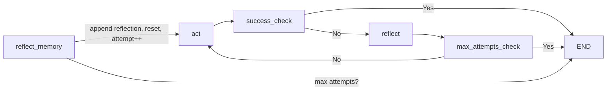
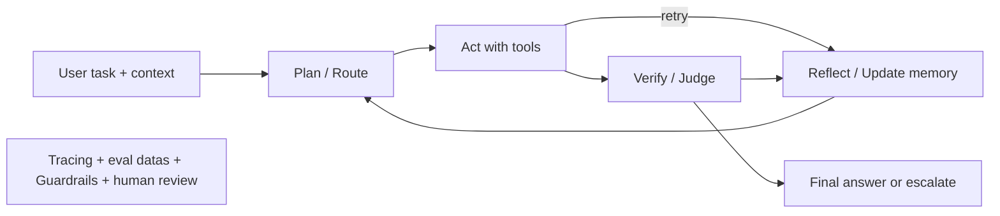

# Day 16 - Agent Builder

> **Câu hỏi cốt lõi:** *"Tại sao Reflexion agent giải quyết được bài toán mà ReAct không làm được?"*

---

### 🗺️ 1. Bản đồ Kiến thức Hệ thống (Structured Knowledge Map)

#### 1.1. Khi nào Single-Agent thất bại?
- **ReAct**: Mạnh nhưng không biết sửa lỗi.
- **Failure Modes**:
  1. **Lỗi lan tỏa**: Sai ở bước đầu dẫn đến sai toàn bộ chuỗi.
  2. **Infinite loop**: Tool trả noise, agent lặp mãi.
  3. **Không backtrack**: Đi sai đường nhưng không quay lại.

#### 1.2. Reflexion: Dạy Agent tự phản tỉnh
- **Cốt lõi**: Thêm self-evaluation vào reasoning loop.
- **Quy trình**:
  1. Generate Actor
  2. Evaluate Evaluator
  3. Reflect Reflector
  4. Retry Actor

```mermaid
graph LR
    A[1. Generate Actor] --> B{score = 1?};
    B -- No --> C[2. Evaluate Evaluator];
    C --> D{score = 0?};
    D -- No --> E[3. Reflect Reflector];
    E --> F[Lặp tới khi đúng hoặc hết attempts Reflection Memory "Sai ở đâu? thử gì tiếp?"];
    F --> A;
    D -- Yes --> A;
    B -- Yes --> G[4. Retry Actor];
    G --> A;
```

---

### 📌 2. Khái niệm Cơ bản & Từ khóa Nền tảng (Core Concepts & Glossary)

| Thuật ngữ | Khái niệm Kỹ thuật & Bản chất | Tại sao cần quan tâm? |
| :--- | :--- | :--- |
| **ReAct** | Reasoning + Acting, agent tự quyết định gọi tool nào và khi nào dừng. | Cơ sở cho mọi agent pattern, nhưng có giới hạn trong việc tự sửa lỗi. |
| **Reflexion** | Thêm Evaluator và Reflector vào ReAct để agent tự đánh giá và học từ sai lầm. | Giúp cải thiện độ chính xác và khả năng tự sửa lỗi của agent. |
| **Episodic Memory** | Ghi nhớ bài học từ các lần thử trước trong cùng episode. | Giúp agent không lặp lại sai lầm và cải thiện hiệu suất. |
| **Evaluator** | Đánh giá kết quả của agent, cung cấp feedback có cấu trúc. | Quyết định chất lượng của Reflexion, cần thiết để có phản hồi hữu ích. |

---

### 📐 3. Quy tắc, Công thức & Tham số Kỹ thuật (Hard Rules & Formulas)

#### 3.1. Reflexion State - Python Schema
```python
class ReflexionState(TypedDict):
    messages: list[BaseMessage]
    trajectory: list[str]
    reflection_memory: list[str]
    attempt_count: int
    success: bool
```

#### 3.2. Evaluator Prompt
```python
class JudgeResult(BaseModel):
    score: int
    reason: str
    missing_evidence: list[str]
    spurious_claims: list[str]
```

#### 3.3. Memory Management
- Nên ghi: failure reason, lesson, next strategy, evidence titles.
- Không nên ghi: toàn bộ trace dài dòng không giúp ích cho lần thử sau.

---

### 💻 4. Hành trang Kỹ thuật & Mã nguồn (Technical Hands-on)

#### 4.1. Reflexion trong LangGraph


#### 4.2. Checklist Triển khai An toàn cho Agent Nâng Cao
1. Có max_attempts.
2. Có structured outputs cho evaluator/tools.
3. Có trace để debug từ sớm.
4. Tool càng deterministic càng tốt.
5. Có human review cho action rủi ro.

---

### 🧠 5. Tư duy Chuyển dịch: Từ Single-Agent đến Multi-Agent

| Pattern   | Memory     | Chi phí | Accuracy | Khi nào dùng?                |
| :-------- | :--------- | :------ | :------- | :--------------------------- |
| ReAct     | Không      | $       | Baseline | Task đơn giản, 1 bước         |
| Reflexion | Episodic   | $$      | +20-30%  | Multi-step, cần self-correct |
| LATS      | Tree       | $$$$$   | +~2%     | High-stakes, cho phép undo     |
| Voyager   | Persistent | $$$     | N/A      | Open-ended, cần tích lũy     |

---

### 🔍 6. Kỹ thuật Nâng cao Trước khi vào Lab

#### 6.1. Template Kiến trúc Agent Production-Ready


---

### 📊 7. Tổng kết

**Takeaway 1**: Reflexion là nâng cấp hợp lý khi ReAct thất bại: cost vừa phải, accuracy tăng rõ.

**Takeaway 2**: LATS và Voyager đổi compute lấy optimality hoặc generality; chỉ dùng khi task thật sự cần.

**Takeaway 3**: Cẩn thận “degeneration-of-thought”: reflection kéo dài có thể làm output tệ hơn.

**Takeaway 4**: Xu hướng production: structured outputs, tracing và eval quan trọng hơn free-form reasoning.

---

### 📅 8. Hướng dẫn Tiếp theo
- Hoàn thành Lab 16: Reflexion agent + benchmark.
- Đọc: Anthropic "Building Effective Agents".